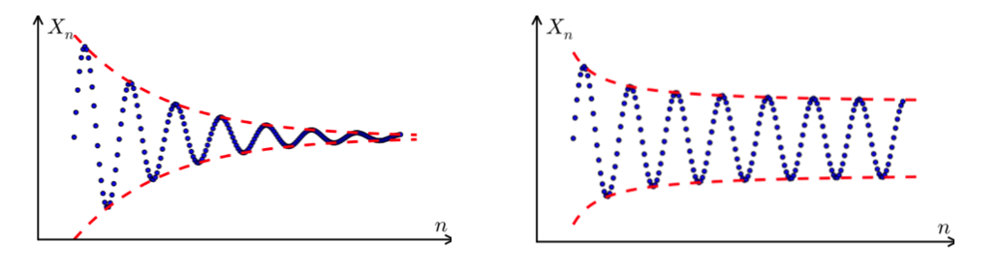

# Fields and Spaces

## Fields

Definition (Fields)
: A field is a set $F$ with *addition* and *multiplication* (mappings $F\times F \rightarrow F$), which satisfies all the following axioms

: - Commutativity: $\forall a, b \in F, a+b=b+a, a \cdot b=b \cdot a$

  - Association: $\forall a, b, c \in F, (a+b)+c=a+(b+c),(a \cdot b) \cdot c=a \cdot(b \cdot c)$

  - Additive and multiplicative identity: $\exists 0,1 \in F \text { s.t. } \forall a \in F, a+0=a \text { and } a \cdot 1=a$


  - Additive inverse: $\forall a \in F, \exists(-a) \in F, \text { s.t. } a+(-a)=0$

  - Multiplicative inverse: $\forall a \in F(a \neq 0), \exists a^{-1} \in F, \text { s.t. } a \cdot a^{-1}=1$

  - Distributivity of multiplication over addition: $\forall a, b, c \in F, a \cdot(b+c)=a \cdot b+a \cdot c$

Examples
: $\mathbb{Q}, \mathbb{R}, \mathbb{C}, \mathbb{F}_{2}, \mathbb{F}_{p}$ ($p$ is a prime).


## Vector Spaces

```{margin}
A vector space is defined per field.
```

Definition (Vector spaces)
: A vector space over field $F$ is a set $V$ associated with operations *addition* and *scalar multiplication* that satisfies all the following axioms

: - Association of addition: $\forall \boldsymbol{u}, \boldsymbol{v}, \boldsymbol{w} \in V,(\boldsymbol{u}+\boldsymbol{v})+\boldsymbol{w}=\boldsymbol{u}+(\boldsymbol{v}+\boldsymbol{w})$

  - Commutativity of addition: $\forall \boldsymbol{u}, \boldsymbol{v} \in V, \boldsymbol{u}+\boldsymbol{v}=\boldsymbol{v}+\boldsymbol{u}$

  - Identity element of addition: $\exists \boldsymbol{0} \in V$ s.t. $\forall \boldsymbol{v} \in V, \boldsymbol{v}+\boldsymbol{0}=\boldsymbol{v}$

  - Compatibility of scalar multiplication with field multiplication: $\forall a, b \in F, \boldsymbol{v} \in V, a(b \boldsymbol{v})=(a b) \boldsymbol{v}$

  - Identity element of scalar multiplication: $1 \boldsymbol{v}=\boldsymbol{v}$ where $1$ is the multiplicative identity in $F$

  - Distributivity of scalar multiplication with respect to vector addition: $\forall a \in F, \boldsymbol{u}, \boldsymbol{v} \in V, a(\boldsymbol{u}+\boldsymbol{v})=a \boldsymbol{u}+a \boldsymbol{v}$

  - Distributivity of scalar multiplication with respect to field addition: $\forall a, b \in F, \boldsymbol{v} \in V,(a+b) \boldsymbol{v}=a \boldsymbol{v}+b \boldsymbol{v}$

Examples
: - $\mathbb{R}^d$ is a vector space over field $\mathbb{R}$
  - $\mathbb{R}$ is a vector space over $\mathbb{Q}$
  - All Fibonacci sequences form a vector space over $\mathbb{R}$

    $$
    \left\{\left(x_{1}, x_{2}, x_{3} \ldots\right) \in \mathbb{R}^{\infty} \mid \forall i \geq 1: x_{i}+x_{i+1}=x_{i+2}\right\}
    $$


## Inner Product Spaces

Definition (Inner product spaces)
: An inner product space is a vector space $V$ over a field $\mathbb{F}$ **together** with a map $\langle\cdot, \cdot\rangle \rightarrow \mathbb{F}$ that satisfies all the following axioms

1. Linearity in the first argument

    $$\begin{aligned}
    \langle a \boldsymbol{x}, \boldsymbol{y}\rangle &=a\langle\boldsymbol{x}, \boldsymbol{y}\rangle \\
    \left\langle\boldsymbol{x}_{1}, \boldsymbol{y}\right\rangle+\left\langle\boldsymbol{x}_{2}, \boldsymbol{y}\right\rangle &=\left\langle\boldsymbol{x}_{1}+\boldsymbol{x}_{2}, \boldsymbol{y}\right\rangle
    \end{aligned}$$

2. Conjugate symmetry (Hermitian symmetry):

    $$\langle\boldsymbol{x}, \boldsymbol{y}\rangle=\overline{\langle\boldsymbol{y}, \boldsymbol{x}\rangle}$$

3. Positive definite

    $$
    \langle\boldsymbol{x}, \boldsymbol{x}\rangle \left\{\begin{array}{ll}
    >0, & \text { if } \boldsymbol{x} \neq \boldsymbol{0} \\
    = 0, & \text { otherwise }
    \end{array}\right.
    $$

Note that $2$ and $3$ imply that $\langle\boldsymbol{x}, \boldsymbol{x}\rangle \in \mathbb{R}_{\geq 0}$.

The basic feature of the dot product that connects it with Euclidean geometry is that it is related to both the length (or norm) of a vector, denoted $\left\| \boldsymbol{x}  \right\|$, and to the angle $\theta$ between two vectors $\boldsymbol{x}$ and $\boldsymbol{y}$ by means of the formula $\boldsymbol{x} \cdot \boldsymbol{y}=\|\boldsymbol{x}\|\|\boldsymbol{y}\| \cos \theta$.

Relations
- Inner product spaces are (Hausdorff) Pre-Hilbert Spaces.


## Metric Spaces

### Definition

Definition (Metric spaces)
: A metric space is an ordered pair $(M, d)$ where $M$ is a set and $d$ is a metric function $d: M \times M \rightarrow \mathbb{R}$ that satisfies all the following axioms

1. identity of indiscernibles: $d(x, y)=0 \Leftrightarrow  x= y$
2. symmetry: $d(x,y) = d(y, x)$
3. triangle inequality: $d(x, z) \le d(x, y) + d(y, z)$

Given the above three axioms, we have $d(x, y) \ge 0$ for any $x, y \in M$.

The function $d$ is also called **distance function** or simply **distance**. Often, $d$ is omitted and one just writes $M$ for a metric space if it is clear from the context what metric is used.

Examples
- $\mathbb{R}$ with absolute difference $d(x,y) = \left\vert x-y \right\vert$
- $\mathbb{R} ^n$ with Euclidean distance
- $\mathbb{R} _{>0}$ with $d(x, y) = \left\vert \log(y/x) \right\vert$
- Any normed vector space is a with $d(x, y) = \left\| x - y \right\|$
  - Manhattan norm and Manhattan distance
  - Maximum norm and Chebyshev distance
- Discrete metric $d(x,y)=1$ if $x\ne y$ and $0$ otherwise.


### Completeness

We first introduce Cauchy sequence.

Definition (Cauchy sequence)
: Cauchy sequence is a sequence whose elements become arbitrarily "close" to each other as the sequence progresses. The elements can be in $\mathbb{R}$ or other spaces. The definition of "close" depends on some metric function.

For instance, in $\mathbb{R}$, $x_1, x_2, \ldots,$ is called a Cauchy sequence if for every positive number $\epsilon$, there is a positive integer $N$ such that for all natural numbers $m, n>N$,

$$
\left\vert x_m - x_n \right\vert < \epsilon
$$

Pictorially,


:::{figure} space-cauchy-seq


Cauchy (left) and non-Cauchy (right) sequence [[Wikipedia](https://en.wikipedia.org/wiki/Cauchy_sequence#In_a_metric_space)]
:::

Examples
- For any real number $r$, the sequence of truncated decimal expansions of $r$ forms a Cauchy sequence. For example, when $r = \pi$, this sequence is $(3, 3.1, 3.14, 3.141, ...)$. The $m$-th and $n$-th terms differ by at most $10^{1-m}$ when $m < n$, and as $m$ grows, this becomes smaller than any fixed positive number $\epsilon$.

Non-examples
- $x_n = \sqrt{n}$, though each term becomes arbitrarily close to the preceding term


Definition (Complete metric space)
: A metric space $M$ is called complete if every Cauchy sequence of points in $M$ has a limit that is also in $M$, or alternatively, if every Cauchy sequence in $M$ converges in $M$ (converges to some point of $M$).

Examples
- $\mathbb{R}$

Non-examples
- open interval $A=(0,1)$ with an ordinary distance in $\mathbb{R}$ is not a complete space: there is a sequence $x_n = \frac{1}{n}$, which is Cauchy, but does not converge in $X$, i.e. its limit $0 \notin A$.


## Hilbert Spaces

### Definition

A Hilbert space extends the methods of vector algebra and calculus from the two-dimensional Euclidean plane and three-dimensional space to spaces with any finite or infinite number of dimensions.

Definition (Hilbert spaces)
: A Hilbert space $H$ is a real or complex inner product space that is also a complete metric space with respect to the distance function induced by the inner product.


Relations:
- Every finite-dimensional inner product space is also a Hilbert space.
- $\mathbb{R} ^d$ is a Hilbert space
- Any pre-Hilbert space that is additionally also a complete space is a Hilbert space.

### Reproducing Kernel Hilbert Space

Reproducing kernel Hilbert space: function evaluation is bounded

$$
f(x) \le c _x \left\| f \right\|  _H \quad \forall f, x
$$

for some constant $c$ depending on $x$.
