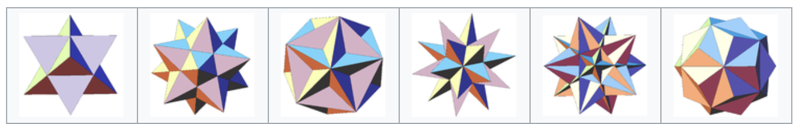

# Geometry

## Half-spaces

A half-space is either of the two parts into which a hyperplane $(\boldsymbol{a} ^\top \boldsymbol{x} = b)$ divides an affine space.

A strict linear inequality specifies an **open** half-space:

$$\boldsymbol{a} ^\top \boldsymbol{x} >b$$

A non-strict one specifies a **closed** half-space:

$$\boldsymbol{a} ^\top \boldsymbol{x}  \ge b$$

A half-space is a convex set.

## Polytopes

Let's first review some basics.

- A **polygon** (多边形) is a 2-dimensional polytope

  :::{figure} geometry-polygon
  

  Polygons [[Wikipedia](https://en.wikipedia.org/wiki/Polytope)]
  :::

- A **polyhedron** (多面体) is a 3-dimensional polytope.

  :::{figure} geometry-polyhedron
  

  Polyhedrons [[Wikipedia](https://en.wikipedia.org/wiki/Polytope)]
  :::

Then, a **polytope** (多胞体) is a generalization in any number of dimensions. It a geometric object with flat sides. Flat sides mean that the sides of a (k+1)-polytope consist of k-polytopes that may have (k−1)-polytopes in common. For instance, the sides of a polyhedron consist of polygons that may have 1-polytope (dion) in common.

Properties

- **Convex**: A polytope can be convex. For instance, intersection of a set of half-spaces.

- **Bounded**: A polytope is bounded if there is a ball of finite radius that contains it.

## Ellipsoids

An ellipsoid is a generalization of an ellipse into any number of dimensions.
