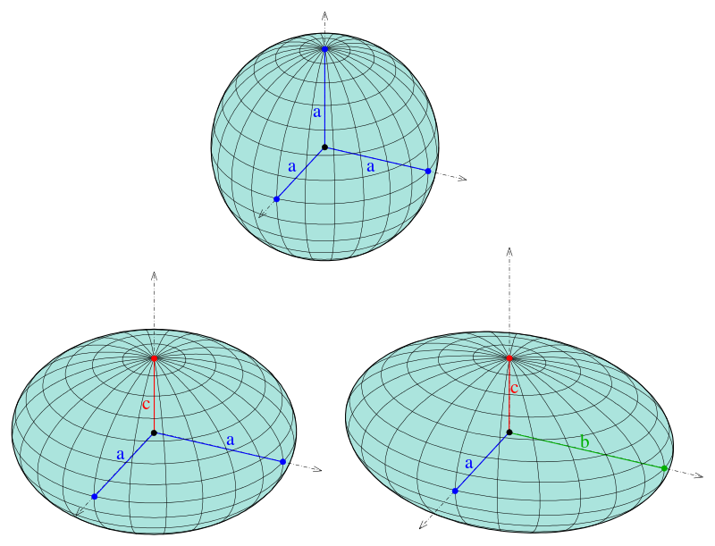

# Geometry

## Half-spaces

A half-space is either of the two parts into which a hyperplane $(\boldsymbol{a} ^\top \boldsymbol{x} = b)$ divides an affine space.

A strict linear inequality specifies an **open** half-space:

$$\boldsymbol{a} ^\top \boldsymbol{x} >b$$

A non-strict one specifies a **closed** half-space:

$$\boldsymbol{a} ^\top \boldsymbol{x}  \ge b$$

A half-space is a convex set.

## Polytopes

Let's first review some basics.

- A **polygon** (多边形) is a 2-dimensional polytope

  :::{figure} geometry-polygon
  

  Polygons [[Wikipedia](https://en.wikipedia.org/wiki/Polytope)]
  :::

- A **polyhedron** (多面体) is a 3-dimensional polytope.

  :::{figure} geometry-polyhedron
  

  Polyhedrons [[Wikipedia](https://en.wikipedia.org/wiki/Polytope)]
  :::

Then, a **polytope** (多胞体) is a generalization in any number of dimensions. It a geometric object with flat sides. Flat sides mean that the sides of a (k+1)-polytope consist of k-polytopes that may have (k−1)-polytopes in common. For instance, the sides of a polyhedron consist of polygons that may have 1-polytope (dion) in common.

Properties

- **Convex**: A polytope can be convex. For instance, intersection of a set of half-spaces.

- **Bounded**: A polytope is bounded if there is a ball of finite radius that contains it.

Definition (full-dimensional)
: A polyhedron $P \in \mathbb{R} ^n$ is full-dimensional if it has positive volume. Equivalently,
  - if it has $n+1$ affinely independent points
  - if it contains a ball of positive radius

## Ellipsoids

An ellipsoid is a generalization of an ellipse into any number of dimensions.

In 3-d case, the implicit equation of an ellipsoid has the standard form

$$
\frac{x^{2}}{a^{2}}+\frac{y^{2}}{b^{2}}+\frac{z^{2}}{c^{2}}=1
$$

:::{figure} geometry-ellipsoid

Sphere ($a = b = c$, top), Spheroid ($a = b \ne c$, bottom left), Tri-axial ellipsoid ($a,b,c$ all different, bottom right)
:::

Formally, a set $E$ of vectors in $\mathbb{R} ^n$ of the form

$$
E=E(\boldsymbol{z} , \boldsymbol{D})=\left\{\boldsymbol{x}  \in \mathbb{R}^{n} \mid(\boldsymbol{x} -\boldsymbol{z} )^{\prime} \boldsymbol{D} ^{-1}(\boldsymbol{x} -\boldsymbol{z} ) \leq 1\right\}
$$

where $\boldsymbol{D}$ is an $n\times n$ positive definite symmetric matrix, is called an ellipsoid with center $\boldsymbol{z} \in \mathbb{R} ^n$.

For any $r >0$, the ellipsoid

$$
\begin{aligned}
E\left(z, r^{2} I\right) &=\left\{x \in \mathbb{R}^{n} \mid(x-z)^{\prime}(x-z) \leq r^{2}\right\} \\
&=\left\{x \in \mathbb{R}^{n} \mid\|x-z\| \leq r\right\}
\end{aligned}
$$

is called a **ball** centered at $\boldsymbol{z}$ of radius $r$.
