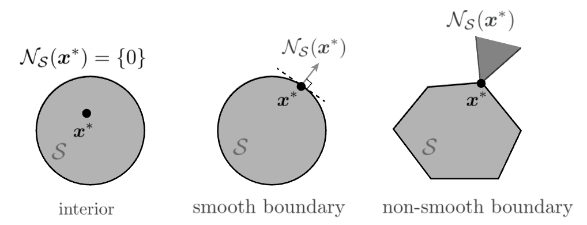

# Geometry

## Hyperplanes and Half-spaces

(hyperplanes)=
### Hyperplanes

For $\boldsymbol{x} \in \mathbb{R} ^n$, the equation $\boldsymbol{a} ^\top \boldsymbol{x} = b$ defines a hyperplane $H$ in $\mathbb{R} ^n$,

$$
H = \left\{ \boldsymbol{x} \in \mathbb{R} ^n \mid \boldsymbol{a} ^{\top} \boldsymbol{x} = b \right\}
$$

where
- $\boldsymbol{a}$ is a normal vector of that hyperplane, meaning that it is orthogonal to the hyperplane, i.e. it is orthogonal to any vector on the hyperplane. Specifically, let $\boldsymbol{x} _1, \boldsymbol{x} _2$ be two points on the hyperplane, then $\boldsymbol{x} _1 - \boldsymbol{x} _2$ is a vector on the hyperplane, and hence $\boldsymbol{a} ^{\top} (\boldsymbol{x}_1 - \boldsymbol{x}_2) = 0$ for all $\boldsymbol{x} _1, \boldsymbol{x} _2 \in H$.
- $b$ is the distance from the origin to this hyperplane.

The distance from a point $\boldsymbol{y}$ to this hyperplane is

$$
\frac{1}{\left\Vert \boldsymbol{a}  \right\Vert } \left\vert \boldsymbol{a} ^\top  \boldsymbol{y}  - b  \right\vert
$$

note that the distance is always positive.

:::{admonition,dropdown,seealso} *Derivation*

For any two points with coordinates $\boldsymbol{x}_1, \boldsymbol{x}_2$ on the hyperplane we have

$$\begin{align}
\boldsymbol{a} ^\top \boldsymbol{x}_1 &= b \\
\boldsymbol{a} ^\top \boldsymbol{x}_2 &= b
\end{align}$$

Hence,

$$
\boldsymbol{a} ^\top (\boldsymbol{x}_1 - \boldsymbol{x}_2)= 0
$$

which implies that the vector $\boldsymbol{a}$ is orthogonal to the hyperplane.

The distance from an arbitrary point $\boldsymbol{y}$ to the hyperplane can be formulated as

$$
d = \left\vert  \langle \frac{\boldsymbol{a}}{\left\| \boldsymbol{a}  \right\| }, \boldsymbol{y} - \boldsymbol{x} \rangle \right\vert
$$

where $\frac{\boldsymbol{a}}{\left\Vert \boldsymbol{a}  \right\Vert }$ is a unit vector orthogonal to the hyperplane and $\boldsymbol{y} - \boldsymbol{x}$ is a vector pointing from point $\boldsymbol{x}$ (on the hyperplane) to point $\boldsymbol{y}$. The absolute value of this cross product is the length of the projection of vector $\boldsymbol{y} - \boldsymbol{x}$ onto the direction of $\boldsymbol{a}$.

Substituting $\boldsymbol{a} ^\top \boldsymbol{x} = b$ to this equation gives

$$
d = \frac{1}{\left\Vert \boldsymbol{a}  \right\Vert}\left\vert \boldsymbol{a} ^\top \boldsymbol{y} - b \right\vert
$$

:::

### Half-spaces

A half-space is either of the two parts into which a hyperplane $(\boldsymbol{a} ^\top \boldsymbol{x} = b)$ divides an affine space.

A strict linear inequality specifies an **open** half-space:

$$\boldsymbol{a} ^\top \boldsymbol{x} >b$$

A non-strict one specifies a **closed** half-space:

$$\boldsymbol{a} ^\top \boldsymbol{x}  \ge b$$

A half-space is a convex set.

## Polytopes

Let's first review some basics.

- A **polygon** (多边形) is a 2-dimensional polytope

  :::{figure} geometry-polygon
  

  Polygons [[Wikipedia](https://en.wikipedia.org/wiki/Polytope)]
  :::

- A **polyhedron** (多面体) is a 3-dimensional polytope.

  :::{figure} geometry-polyhedron
  

  Polyhedrons [[Wikipedia](https://en.wikipedia.org/wiki/Polytope)]
  :::

Then, a **polytope** (多胞体) is a generalization in any number of dimensions. It a geometric object with flat sides. Flat sides mean that the sides of a (k+1)-polytope consist of k-polytopes that may have (k−1)-polytopes in common. For instance, the sides of a polyhedron consist of polygons that may have 1-polytope (dion) in common.

Properties

- **Convex**: A polytope can be convex. For instance, intersection of a set of half-spaces.

- **Bounded**: A polytope is bounded if there is a ball of finite radius that contains it.

Definition (full-dimensional)
: A polyhedron $P \in \mathbb{R} ^n$ is full-dimensional if it has positive volume. Equivalently,
  - if it has $n+1$ affinely independent points
  - if it contains a ball of positive radius

(ellipsoid)=
## Ellipsoids

An ellipsoid is a generalization of an ellipse into any number of dimensions.

In 3-d case, the implicit equation of an ellipsoid has the standard form

$$
\frac{x^{2}}{a^{2}}+\frac{y^{2}}{b^{2}}+\frac{z^{2}}{c^{2}}=1
$$

:::{figure} geometry-ellipsoid

Sphere ($a = b = c$, top), Spheroid ($a = b \ne c$, bottom left), Tri-axial ellipsoid ($a,b,c$ all different, bottom right)
:::

### Characterization

Formally, a set $E$ of vectors in $\mathbb{R} ^n$ of the form

$$
E=E(\boldsymbol{z} , \boldsymbol{D})=\left\{\boldsymbol{x}  \in \mathbb{R}^{n} \mid(\boldsymbol{x} -\boldsymbol{z} )^{\top} \boldsymbol{D} ^{-1}(\boldsymbol{x} -\boldsymbol{z} ) \leq 1\right\}
$$

where $\boldsymbol{D}$ is an $n\times n$ positive definite matrix, is called an ellipsoid with center $\boldsymbol{z} \in \mathbb{R} ^n$.

Other formulation: $E(\boldsymbol{b} , \boldsymbol{A})=\left\{\boldsymbol{x} \in \mathbb{R} ^2:\|\boldsymbol{A} \boldsymbol{x} -\boldsymbol{b} \|_{2} \leq 1\right\}$ where $\boldsymbol{A}$ is p.d. The volume of $E$ is [proportional](https://math.stackexchange.com/questions/3252200/volume-of-ellipsoid-via-determinant#:~:text=be%20the%20equation%20of%20a,det(A%E2%88%921)) to $\operatorname{det} (\boldsymbol{A} ^{-1} )$.

Relation between $(\boldsymbol{z} ,\boldsymbol{D})$ and $(\boldsymbol{b}, \boldsymbol{A})$:

$$\begin{aligned}
\|\boldsymbol{A} \boldsymbol{x} -\boldsymbol{b} \|_{2} &\leq 1 \\
\left( \boldsymbol{A} \boldsymbol{x}  - \boldsymbol{b}  \right) ^{\top} (\boldsymbol{A} \boldsymbol{x} - \boldsymbol{b} )&\le 1 \\
[\boldsymbol{A} \left( \boldsymbol{x}  - \boldsymbol{A} ^{-1}  \boldsymbol{b}  \right)] ^{\top} [\boldsymbol{A} \left( \boldsymbol{x}  - \boldsymbol{A} ^{-1}  \boldsymbol{b}  \right)]&\le 1 \\
(\boldsymbol{x} - \boldsymbol{A} ^{-1} \boldsymbol{b} ) ^{\top} (\boldsymbol{A} ^{\top} \boldsymbol{A} ) (\boldsymbol{x} - \boldsymbol{A} ^{-1} \boldsymbol{b} )&\le 1\\
\end{aligned}$$

Hence, the relation is $\boldsymbol{z} = \boldsymbol{A} ^{-1} \boldsymbol{b}$ and $\boldsymbol{D} = (\boldsymbol{A} ^{\top} \boldsymbol{A} ) ^{-1}$, or $\boldsymbol{b} = \boldsymbol{A} \boldsymbol{z}$ and $\boldsymbol{A} = \boldsymbol{D} ^{-1/2}$. Hence $\operatorname{vol} (E) \propto \operatorname{det} (\boldsymbol{D} ^{1/2})$, or $\operatorname{det} (\boldsymbol{D} ) \propto \operatorname{vol}(E)^2$. We use many properties of positive definite matrices, see the relevant [section](pd-matrix).

### Ball

[Wikipedia](https://en.wikipedia.org/wiki/Ball_(mathematics))

For any $r >0$, the ellipsoid

$$
\begin{aligned}
E\left(\boldsymbol{z} , r^{2} I\right) &=\left\{\boldsymbol{x}  \in \mathbb{R}^{n} \mid(\boldsymbol{x} -\boldsymbol{z} )^{\top}(\boldsymbol{x} -\boldsymbol{z} ) \leq r^{2}\right\} \\
&=\left\{\boldsymbol{x}  \in \mathbb{R}^{n} \mid\|\boldsymbol{x} -\boldsymbol{z} \|_2 \leq r\right\}
\end{aligned}
$$

is called a **ball** centered at $\boldsymbol{z}$ of radius $r$.

## Cones

(normal-cones)=
### Normal Cones

The normal cone of a convex set $S$ at a point $\boldsymbol{x} \in S$ is defined as

$$
N_{S}(\boldsymbol{x}) := \left\{ \boldsymbol{d} \mid \langle \boldsymbol{y} - \boldsymbol{x} , \boldsymbol{d}  \rangle \le 0, \forall \boldsymbol{y} \in S  \right\}
$$

:::{figure} geometry-normal-cones

Normal cones [[Friedlander and Joshi](https://friedlander.io/19T2-406/notes/Constrained_optimization/)]
:::

For instance,
- For an affine set

  $$S = \left\{ \boldsymbol{x}  \mid \boldsymbol{c} _i ^{\top} \boldsymbol{x}  = b_i, i = 1, 2, \ldots, m \right\}$$

  The normal cone is just a linear combination of all vectors perpendicular to the hyperplanes

  $$N_S (\boldsymbol{x}) = \left\{ \sum_{i=1}^m \lambda_i \boldsymbol{c} _i \mid \lambda _i \in \mathbb{R} \right\}$$

  It easy to see that $\boldsymbol{c} _i ^{\top} (\boldsymbol{y} - \boldsymbol{x} ) = 0$ for all $i$ and $\boldsymbol{y} \in S$. If we write $\boldsymbol{C} \boldsymbol{x}  = \boldsymbol{b}$, then the normal cone is the linear combination of rows of $\boldsymbol{C}$, i.e. $\operatorname{range} (\boldsymbol{C} ^{\top})$.

- For a set of points with non-negative coordinates

  $$S = \left\{ \boldsymbol{x} \in \mathbb{R} ^n \mid x_j \ge 0, \forall j = 1, 2, \ldots, n  \right\}$$

  For a point $\boldsymbol{x} \in S$, define an active set $A(\boldsymbol{x}) = \left\{ j \mid x_j = 0 \right\}$ that consists of the indices of zero coordinates of $\boldsymbol{x}$. The normal cone of $S$ at $\boldsymbol{x}$ is

  $$N_S (\boldsymbol{x} ) = \left\{ - \sum_{j \in A(\boldsymbol{x})} \mu_j \boldsymbol{e} _j \mid \mu_{j} \ge 0\right\}$$

  where $\boldsymbol{e}_j$ are canonical vectors. The set can also be expressed as

  $$N_S (\boldsymbol{x} ) = \left\{ - \sum_{j=1}^n \mu_j \boldsymbol{e} _j \mid \mu_{j} \ge 0, \sum_{j=1}^n\mu_j x_j =0\right\}$$

  which states that $\mu_j = 0$ as long as $x_j \ne 0$. In matrix form, we can write it as

  $$N_S (\boldsymbol{x} ) = \left\{ - \boldsymbol{\mu} \mid \boldsymbol{\mu} \ge 0, \langle \boldsymbol{\mu} , \boldsymbol{x}  \rangle > 0\right\}$$

- More generally, combining them together,

  $$S = \left\{ \boldsymbol{x}  \in \mathbb{R} ^n\mid \boldsymbol{c} _i ^{\top} \boldsymbol{x}  = b_i, x_j \ge 0 \ \forall i \in [m], j \in [n]\right\}$$

  The normal cone is

  $$N_S (\boldsymbol{x} ) = \left\{  \sum_{i=1}^m \lambda_i \boldsymbol{c} _i - \boldsymbol{\mu} \mid \lambda _i \in \mathbb{R}, \boldsymbol{\mu} \ge 0, \langle \boldsymbol{\mu} , \boldsymbol{x}  \rangle > 0\right\}$$
