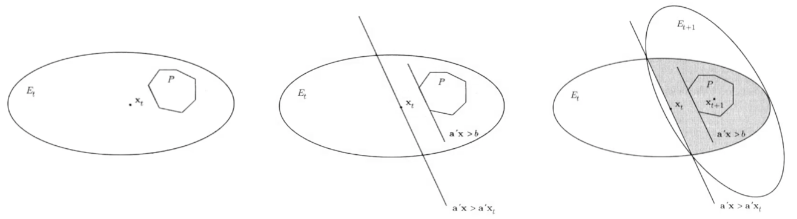

# Linear Programming

## Canonical Form

A linear programming problem consists of three elements

- $n$ variables $x_1, x_2, \ldots, x_n$

- one objective function that is linear in variables

$$
\max/\min \ c_1 x_1 + c_2 x_2 \ldots c_n x_n
$$

- $m$ constraints that are linear in variables, for $j = 1, 2, \ldots, m$

$$a_{j1}x_1 + a_{j2}x_2 \ldots + a_{jn}x_n \ (\ge \text{or}  \le \text{or}  =) \ b_j$$

```{margin} Integer programming
Sometimes we want $x_i$ to have integer value, then it's called integer programming. But we cannot solve this kind of problem efficiently.
```

The canonical form of a linear programming is

$$\begin{aligned}
\max && \sum_{i=1}^n c_i x_i &&& \\
\text{s.t.} && \sum_{i=1}^n a_{ji} x_i &\le b_j &&\forall\ 1 \le j \le m\\
&& x_i &\ge 0 &&\forall\ 1 \le i \le n \\
\end{aligned}$$

Or in matrix form,

$$\begin{aligned}
\max
&& \boldsymbol{c} ^\top \boldsymbol{x} && \\
\text{s.t.}
&&\boldsymbol{A} \boldsymbol{x} &\le \boldsymbol{b} &\\
&& \boldsymbol{x} &\ge \boldsymbol{0} &
\end{aligned}$$

To convert a problem into the canonical form,

1. if it's $\min$, negate the objective function to get $\max$

1. replace $=$ with simultaneous $\ge$ and $\le$.

1. replace $\ge$ with $\le$ by negation.

1. if some variable $x_i$ is unconstrained, replace $x_i$ with by $x_i^+ - x_i^-$, where the two variables $x_i^+,x_i^- \ge 0$.


:::{admonition,note} Geometry's perspective

From geometry's perspective, every constraint is a hyperplane that partitions the space into half-spaces. The intersection of half-spaces defined by the constraints is called a feasible region, usually it is a polyhedron. If the feasible region is bounded, then it's a polytope.

:::


## Examples

### Line Fitting

Input
: $n$ points $\boldsymbol{x}_i \in \mathbb{R}^d$ with label $y_i \in \mathbb{R}$.

```{margin} Mind the notation
Here $\boldsymbol{x}_i$ are constant data, while $a_j$'s and $b$ are variables.
```

Objective
: Find a linear function $h: \mathbb{R} ^d \rightarrow \mathbb{R}$ parameterized by $\boldsymbol{a} \in \mathbb{R}^d$ and $b \in \mathbb{R}$, such that the value $h(\boldsymbol{x}_i) = \boldsymbol{a} ^\top \boldsymbol{x}_i + b$ is close to the label $y_i$.

In other words, we want $h$ to minimize the total error

$$
\sum_{i=1}^n \left\vert h(\boldsymbol{x}_i ) - y_i \right\vert
$$

To convert this problem into the canonical form of LP, we need to get rid of the absolute value operation. We introduce LP variables $\boldsymbol{z}_i$ to represent the error terms.

$$\begin{aligned}
z_i &\ge \boldsymbol{a} ^\top \boldsymbol{x}_i + b - y_i  \\
z_i &\ge - (\boldsymbol{a} ^\top  \boldsymbol{x}_i + b - y_i)
\end{aligned}$$

The objective is to minimize $\sum_{i=1}^n z_i$.

In all, the LP problem in the canonical form is

$$\begin{aligned}
\max
&&- \sum_{i=1}^n z_i && \\
\text{s.t.}
&&  z_i - \boldsymbol{a} ^\top \boldsymbol{x}_i - b &\ge -y_i &\forall\ 1 \le i \le n\\
&&  z_i + \boldsymbol{a} ^\top \boldsymbol{x}_i + b &\ge y_i &\forall\ 1 \le i \le n\\
\end{aligned}$$

with variables $\left\{ \boldsymbol{a} ,b , \boldsymbol{z}  \right\}$.

### Binary Classifier

Now suppose the label is binary.


Input
: $n$ points $\boldsymbol{x}_i \in \mathbb{R}^d$ with label $y_i \in \left\{ -1, 1 \right\}$.

Objective
: Find a linear function $h: \mathbb{R} ^d \rightarrow \mathbb{R}$ parameterized by $\boldsymbol{a} \in \mathbb{R}^d$ and $b \in \mathbb{R}$, such that the value $h(\boldsymbol{x}_i) = \boldsymbol{a} ^\top \boldsymbol{x}_i + b$ has the same sign with $y_i$.

Let $i^+$ be the index of points with positive label $y_i = 1$ and let $i^-$ be the index of points with negative label $y_i = -1$. The objective is

$$\begin{aligned}
h(\boldsymbol{x}_{i^+}) &> 0 &&\forall \ i^+\\
h(\boldsymbol{x}_{i^-}) &< 0 &&\forall \ i^-\\
\end{aligned}$$

#### Separable

We first assume such hyperplane exists, i.e. the two kinds of points are separable.

To convert this to problem into the canonical form, we need to get rid of the $>$ and $<$ signs. We introduce a **slack** variable $\delta$. The new problem is

$$\begin{aligned}
\max &&\delta && \\
\text{s.t.}
&&\  h(\boldsymbol{x}_{i^+}) - \delta &\ge 0 &&\forall \ i^+\\
&&\  h(\boldsymbol{x}_{i^-}) + \delta &\le 0 &&\forall \ i^-\\
\end{aligned}$$

with variables $\left\{ \boldsymbol{a} , b, \delta \right\}$.

Actually the $\max$ does not matter. If we can find a LP solution with $\delta > 0$, then the original $>$ and $<$ conditions must hold.

#### Non-Separable

If there is no hyperplane to perfectly separate the points, we introduce buffer, say $d>0$, such that beyond the buffer region all points are correctly classified. That is, the following conditions always holds

$$\begin{aligned}
i \in \left\{ i^+ \right\} \quad \forall \ i: h(\boldsymbol{x}_{i}) &\ge d \\
i \in \left\{ i^- \right\} \quad \forall \ i: h(\boldsymbol{x}_{i}) &\le -d \\
\end{aligned}$$

Note that if there exists a solution $\left\{ \boldsymbol{a} ,b \right\}$, then we can scale the solution down by $\frac{1}{d}$ so the solution remains valid. So w.l.o.g., the buffer can simply be $d=1$.

Then, we introduce an error term to quantify the mis-classification error. It measures the absolute deviation between the value $h(\boldsymbol{x}_i )$ to the buffer line $(1/-1)$ in its correct region.

- If a data point with index $i^+$ is mis-classified, the absolute deviation is $1-h(\boldsymbol{x}_i)$.
- If a data point with index $i^-$ is mis-classified, the absolute deviation is $h(\boldsymbol{x}_i) - (-1) = 1+ h(\boldsymbol{x}_i)$.

In sum, we have

$$
e_i = \left\{\begin{array}{ll}
1 - h(\boldsymbol{x}_i) & \text { for } i \in \left\{ i^+ \right\} \text{ but } h(\boldsymbol{x}_i) < -1 \\
1 + h(\boldsymbol{x}_i) & \text { for } i \in \left\{ i^- \right\} \text{ but } h(\boldsymbol{x}_i) > 1 \\
\end{array}\right.
$$

To incorporate the correctly classified points into account, the error is

$$
e_i = \left\{\begin{array}{ll}
\max \left\{ 1 - h(\boldsymbol{x}_i), 0 \right\} & \text { for } i \in \left\{ i^+ \right\} \\
\max \left\{ 1 + h(\boldsymbol{x}_i), 0 \right\} & \text { for } i \in \left\{ i^- \right\} \\
\end{array}\right.
$$

The objective is to minimize the total mis-classification error $\sum {e_i}$.

The original conditions for the correctly classified points

$$\begin{aligned}
i \in \left\{ i^+ \right\} \quad \forall \ i: h(\boldsymbol{x}_{i}) &\ge 1 \\
i \in \left\{ i^- \right\} \quad \forall \ i: h(\boldsymbol{x}_{i}) &\le -1 \\
\end{aligned}$$

now can be rewritten as

$$\begin{aligned}
e_{i^+} + h(\boldsymbol{x}_{i^+}) &\ge 1 \quad &&\forall \ i^+\\
e_{i^-} - h(\boldsymbol{x}_{i^+}) &\le -1 \quad &&\forall \ i^-\\
\end{aligned}$$

which can be interpreted as we pull the mis-classified points back into their correct region.

Therefore, the LP problem is

$$\begin{aligned}
\max && -\sum_{i} e_i && \\
\text{s.t.}
&& e_{i^+} +  h(\boldsymbol{x}_{i^+}) &\ge 1 &&\forall \ i^+\\
&& e_{i^-} - h(\boldsymbol{x}_{i^+}) &\le -1 &&\forall \ i^-\\
&& e_i &\ge 0 &&\forall \ i\\
\end{aligned}$$

with variables $\left\{ \boldsymbol{a} ,b , \boldsymbol{e}  \right\}$.

#### Non-linear Separable

If the two kinds of points are non-linearly separable, we can consider feature transformation $\boldsymbol{x}  \rightarrow \boldsymbol{\phi}(\boldsymbol{x} )$ and then solve the LP problem.

The feature transformation can involve non-linear terms such as $x_1^2, x_1 x_2$ etc.

### Independent Set

$x_v=1$ if vertex $v$ is chosen into the independent set and 0 otherwise.

$$\begin{aligned}
\max && \sum_v x_v & &&\\
\mathrm{s.t.}
&& x_u + x_v &\leq 1 && \forall e=(u,v) \in E \\
&& x_v &\in \left\{ 0,1 \right\}  && \forall v \in V \\
\end{aligned}$$

### Vertex Cover

In an undirected graph $G=(V,E)$, a set $S\subseteq V$ is a vertex cover if for any edge in graph $G$, at least one of its endpoint is in $S$. Formally,  $\forall e = (u, v)\in E: u\in S$ or $v\in S$ or both. We want to find a minimum-cardinality vertex cover.

Let $x_v = 1$ if $x_v \in S$ and 0 otherwise.

$$\begin{aligned}
\min && \sum _{v \in V} x_v & &&\\
\mathrm{s.t.}
&& x_u + x_v &\ge 1 && \forall e=(u,v) \in E\\
&& x_v &\in \left\{ 0,1 \right\}  && \forall v \in V  \\
\end{aligned}$$

Dual

$$\begin{aligned}
\max && \sum_{e \in E} y_e  & &&\\
\mathrm{s.t.}
&& \sum_{e\in d(v)} y_e  &\leq 1 && \forall v \in V \\
&& y_e &\ge 0 && \forall e \in E  \\
\end{aligned}$$


### Edge Cover

An edge cover of a graph is a set $S$ of edges such that every vertex of the graph is incident to at least one edge of the set.

Let $x_e = 1$ if $x_e \in S$ and 0 otherwise.

$$\begin{aligned}
\min && \sum _{e \in E} x_e & &&\\
\mathrm{s.t.}
&& \sum_{e \in d(v)} x_e &\ge 1 && \forall v \in V\\
&& x_e &\in \left\{ 0,1 \right\}  && \forall e \in E  \\
\end{aligned}$$

Dual:

$$\begin{aligned}
\max && \sum _{v \in V} y_v & &&\\
\mathrm{s.t.}
&& y_u + y_v &\leq 1 && \forall e=(u,v) \in E \\
&& y_v &\ge 0 && \forall v \in V  \\
\end{aligned}$$


### Set Cover

We are given a universe $U=\left\{ e_1, \ldots, e_n \right\}$ of $n$ elements and a family of $m$ subsets $\mathcal{F} = \left\{ S_1, \ldots, S_m \right\}$, where each $S_i \subseteq U$. Further, each set $S \in F$ has an associated cost $w_S \ge 0$. The goal is to choose a sub-collection of $\mathcal{F}$, called a set cover, of minimum total cost such that the union of all sets in this sub-collection is $U$. In other words, every element $e \in U$ must belong to
some subset in the set cover.

LP formulation: we have an indicator variable $x_S$ which is 1 if the set $S$ is included in the set cover, and 0 otherwise.


$$
\begin{array}{ll}
\min & \sum_{S \in \mathcal{F}} w_{S} x_{S} & \\
\text { s.t. } & \sum_{S: e \in S} x_{S} \geq 1 & \forall e \in U \\
& x_{S} \in\{0,1\} &\forall S \in \mathcal{F}
\end{array}
$$

To obtain an LP, we will relax the integrality constraint $x_S \in \left\{ 0,1 \right\}$ to $x_S \in [0,1]$. We can additionally relax $x_S \in [0,1]$ to $x_S \ge 0$, sin in the optimal solution, if $x^*_S>1$, we can set $x_S^* = 1$ without violating any constraints, and the total weight can only decrease.

A natural LP relaxation is,

$$
\begin{array}{ll}
\min & \sum_{S \in \mathcal{F}} w_{S} x_{S} & \\
\text { s.t. } & \sum_{S: e \in S} x_{S} \geq 1 & \forall e \in U \\
& x_{S} \geq 0 & \forall S \in \mathcal{F}
\end{array}
$$

Dual is


$$
\begin{array}{ll}
\text { max } & \sum_{e \in U} y_{e} &\\
\text { s.t. } & \sum_{e \in U: S \ni e} y_{e} \leq w_{S} & \forall S \in \mathcal{F} \\
& y_{e} \geq 0 & \forall e \in U
\end{array}
$$


## Duality

### Primal and Dual

Consider an LP minimization problem of the form

$$\begin{aligned}
\min && f(\boldsymbol{x} ) &= \boldsymbol{c}^{\top} \boldsymbol{x} \\
\text { s.t.} && \boldsymbol{A} \boldsymbol{x} &\ge \boldsymbol{b} \\
&& \boldsymbol{x} &\geq \mathbf{0}
\end{aligned}$$

where $\boldsymbol{A} \in \mathbb{R} ^{m \times n}, \boldsymbol{b} \in \mathbb{R} ^{m}$.

Before solving it, we consider a lower bound $\ell$ for $f(\boldsymbol{x} ^*)$, by linearly combine the constraints $\boldsymbol{a} _{1 \cdot} ^\top \boldsymbol{x} \ge b_1$, $\boldsymbol{a} _{2 \cdot} ^\top \boldsymbol{x} \ge b_2$, etc, where $\boldsymbol{a} _{i\cdot}$ is $i$-th row of $\boldsymbol{A}$. Let $y_1, y_2, \ldots$ be the corresponding non-negative multipliers. The linear combination of the constraints is

$$
y_1(\boldsymbol{a} _{1 \cdot} ^\top \boldsymbol{x} ) + y_2(\boldsymbol{a} _{2 \cdot} ^\top \boldsymbol{x} ) + \ldots + y_m (\boldsymbol{a} _{m \cdot} ^\top \boldsymbol{x}) \ge y_1 b_1 + y_2 b_2 + \ldots + y_m b_m
$$

or

$$
\boldsymbol{y} ^\top \boldsymbol{A} \boldsymbol{x} \ge \boldsymbol{y} ^\top \boldsymbol{b}
$$

If the LHS's coefficients of $x_i$ is **smaller** than $c_i$, i.e., $\sum_{j=1}^m y_j a_{ji} = \boldsymbol{a} _{\cdot i} ^\top \boldsymbol{y} < c_i$ where $\boldsymbol{a} _{\cdot j}$ is the $j$-th column of $\boldsymbol{A}$, then due to non-negativity of $x_i$, we always have

$$\boldsymbol{c}  ^\top \boldsymbol{x} \ge [\boldsymbol{a} _{\cdot 1} ^\top \boldsymbol{y} \quad \boldsymbol{a} _{\cdot 2} ^\top \boldsymbol{y} \quad \ldots \quad \boldsymbol{a} _{\cdot m} ^\top \boldsymbol{y}] \ \boldsymbol{x} = \boldsymbol{y} ^\top \boldsymbol{A} \boldsymbol{x}  \ge \boldsymbol{b} ^\top \boldsymbol{y}$$

So $\boldsymbol{b} ^\top \boldsymbol{y}$ is always a lower bound of $f(\boldsymbol{x})$. Moreover, we want the lower bound to be as larger as possible so that we can have a good estimate of the minimum value  $\min _ \boldsymbol{c} \boldsymbol{c} ^\top \boldsymbol{x}$. To sum up, we want to find $\boldsymbol{y}$ of the following maximization problem


$$\begin{aligned}
\max && g(\boldsymbol{y} ) &= \boldsymbol{b}^{\top} \boldsymbol{y} \\
\text { s.t. } && \boldsymbol{A} ^\top  \boldsymbol{y} &\le \boldsymbol{c} \\
&& \boldsymbol{y} &\geq \mathbf{0}
\end{aligned}$$

Any solution to this $\max g(\boldsymbol{y})$ problem provides a lower bound of $f(\boldsymbol{x} ^*)$.

$$
g(\boldsymbol{y}) \le f(\boldsymbol{x}^*)
$$

The problem $\max f(\boldsymbol{x} )$ is called **primal**, the problem $\min g(\boldsymbol{y} )$ is called **dual**.

Likewise, we can find an upper bound of $g(\boldsymbol{y} )$ by similar operation. Denote the multipliers by $\boldsymbol{z}$,

$$\begin{aligned}
\min && h(\boldsymbol{z} ) &= \boldsymbol{c}^{\top} \boldsymbol{z} \\
\text { s.t. } && \boldsymbol{A} \boldsymbol{z} &\ge \boldsymbol{b} \\
&& \boldsymbol{z} &\geq \mathbf{0}
\end{aligned}$$

Note that $h(\boldsymbol{z} )$ has exactly the same form with $f(\boldsymbol{x} )$. Hence, the dual of dual is primal.

(duality)=
### Duality Theorem

Theorem (Weak duality)
: If $P$ is a primal linear program in maximization standard form, $D$ is its dual, then
  - If one of them is unbounded, then the other is infeasible;
  - If $P$ and $D$ are both feasible and bounded, then $\operatorname{OPT}(P) \le \operatorname{OPT} (D)$.

Theorem (Strong duality)
: If either $P$ or $D$ is feasible and bounded, then so is the other, and $\operatorname{OPT}(P) = \operatorname{OPT} (D)$.


To summarize, dual is bounded and feasible $\Leftrightarrow$ dual has a finite optimal solution $\Leftrightarrow$ primal has a finite optimal solution $\Leftrightarrow$ primal is bounded and feasible. Sometimes to the first two is hard, we can prove the last two in lieu.


## Relaxation

Definition (Relaxation)
: Consider two problem $P$ and $P_r$, if any solution to $P$ corresponds to a solution to $P_r$ with the **same** value of the objective function in $P$, then we say problem $P_r$ is a relaxation to problem $P$. In this sense, $OPT_r$ is always better than or equal to $OPT$.


### Integrality Gap

Definition (Integrality Gap)
: Integrality gap $IG$ measures the goodness of an LP relaxation to an integer program problem. It is defined as the largest ratio between the objective value of an optimal integral solution to problem P, and that of an optimal fractional solution to its relaxed LP problem, over all instances of problem P.

  - For minimization problem, $IG = \max \frac{OPT_P}{OPT_{LP}}$
  - For maximization problem, $IG = \max \frac{OPT_{LP}}{OPT_P}$

  It is easy to see $IG \ge 1$. If $IG=1$, then an optimal integral solution and an optimal fractional solution gives the same objective value.


## Algorithms

In every LP, one of the following holds

- no feasible solution
- finite optimal solutions
- optimal solution is unbounded

There are many algorithms to find a solution. Let $L$ be the maximal coefficients.

- Ellipsoid method $O(n^6 L)$. Slow but useful.
- Interior point method $O(n^{3.5}L)$.


### Ellipsoid Methods

Originally, the ellipsoid method can be used to identify whether a polyhedron $P=\left\{\boldsymbol{x}  \in \mathbb{R}^{n} \mid \boldsymbol{A}  \boldsymbol{x}  \geq \boldsymbol{b} \right\}$ is empty or not. It also can be used to solve LP.

#### To Identify Non-empty Polyhedron

```{margin}
We can modify the input to the ellipsoid method if $P$ does not necessarily satisfy these two assumptions.
```

**Assumptions**

- The polyhedron $P$ is bounded: there exists a ball $E_0 = E(\boldsymbol{x} _0, r^2 \boldsymbol{I} )$ with volume $V$, that contains $P$
- The polyhedron $P$ is either empty $(\operatorname{Vol}(P) =0)$ or full-dimensional (i.e., it has some positive volume $\operatorname{Vol}(P) > v$ for some $v > 0$.)

**Inputs**

- A matrix $\boldsymbol{A}$ and a vector $\boldsymbol{b}$ that define the polyhedron $P=\left\{\boldsymbol{x}  \in \mathbb{R}^{n} \mid \boldsymbol{A}  \boldsymbol{x}  \geq \boldsymbol{b} \right\}$
- A number $v>0$, such that either $P$ is empty or $\operatorname{Vol}(P) > v$
- A ball $E_0 = E(\boldsymbol{x} _0, r^2 \boldsymbol{I} )$ with volume at most $V$ such that $P \subset E_0$.

**Output**

- A feasible point $\boldsymbol{x} ^* \in P$ if $P$ is non-empty, or
- A statement that $P$ is empty.

We know introduce the algorithm details.

Given a polyhedron $P=\left\{\boldsymbol{x}  \in \mathbb{R}^{n} \mid \boldsymbol{A}  \boldsymbol{x}  \geq \boldsymbol{b} \right\}$, the algorithm generates a sequence of ellipsoids $E_t$ with centers $\boldsymbol{x} _t$, such that $P$ is contained in $E_t$. It then check if the center $\boldsymbol{x} _t \in P$.
- If yes, then $P$ is nonempty and then the algorithm terminates.
- Else, there exists a constraint $\boldsymbol{a}_i ^{\top} \boldsymbol{x} < b_i$, and any element $\boldsymbol{x} \in P$ satisfies $\boldsymbol{a} _i ^{\top} \boldsymbol{x} \ge b_i \ge \boldsymbol{a} _i ^{\top} \boldsymbol{x} _t$.

More specifically, $P$ is contained in the intersection of the ellipsoid and the half-space

$$E_t \cap \left\{ \boldsymbol{x} \in \mathbb{R} ^n \vert \boldsymbol{a} _i ^{\top} \boldsymbol{x}  \ge \boldsymbol{a} _i ^{\top} \boldsymbol{x} _t \right\}$$

Since the half-space passes through the center of the ellipsoid, we call this intersection **half-ellipsoid**.

Then we can find a new ellipsoid $E_{t+1}$ that covers the half-ellipsoid and whose volume is only a fraction of the volume of the previous ellipsoid $E_t$ (by the theorem below).

Repeat the above process to obtain a sequence of smaller and smaller ellipsoids. Since a non-empty full-dimensional polyhedron cannot be smaller than a certain threshold. If eventually the volume of $E_t$ is small than this threshold, we conclude that $P$ is empty.

:::{figure} lp-ellipsoid-illustration


One iterations in ellipsoid method
:::


Theorem (Strictly decreasing ellipsoid volume)
: Let $E = E(\boldsymbol{z} , \boldsymbol{D} )$ be an ellipsoid in $\mathbb{R} ^n$, and let $\boldsymbol{a}$ be a nonzero $n$-vector. Consider the half-space $H = \left\{ \boldsymbol{x} \in \mathbb{R} ^n \vert \boldsymbol{a} ^{\top} \boldsymbol{x} \ge \boldsymbol{a} ^{\top} \boldsymbol{z} \right\}$ and let


$$\begin{aligned}
\boldsymbol{z} ^\prime &= \boldsymbol{z} + \frac{1}{n+1} \frac{\boldsymbol{D} \boldsymbol{a} }{\sqrt{\boldsymbol{a} ^{\top} \boldsymbol{D} \boldsymbol{a} }}   \\
\boldsymbol{D} ^\prime &= \frac{n^2}{n^2 - 1} \left( \boldsymbol{D} - \frac{2}{n+1} \frac{\boldsymbol{D} \boldsymbol{a} \boldsymbol{a} ^{\top} \boldsymbol{D}}{\boldsymbol{a} ^{\top} \boldsymbol{D} \boldsymbol{a} } \right) \\
\end{aligned}$$

Then

- $\boldsymbol{D} ^\prime$ is symmetric and p.d., hence $E ^\prime = E(\boldsymbol{z} ^\prime , \boldsymbol{D} ^\prime )$ is an ellipsoid
- $E \cap H \subset E ^\prime$
- $\operatorname{Vol}(E ^\prime ) < \exp(-\frac{1}{2(n+1)} ) \operatorname{Vol}(E)$


To sum up, the algorithm is


---
Ellipsoid Method

---

- Initialization
  - $t^* = \lceil 2(n+1) \ln \frac{V}{v} \rceil$, maximum number of iterations
  - $E_0 = E(\boldsymbol{x} _i, r^2 \boldsymbol{I})$
  - $t=0$

- Iteration
  - If $t=t^*$ then stop, return $P$ is empty
  - If $\boldsymbol{x} _t \in P$ then stop, return $P$ is non-empty
  - If $\boldsymbol{x} _t \notin P$, find a a violated constrain $i$ such that $\boldsymbol{a} ^{\top} _i \boldsymbol{x} < b_i$.
    - Let $H_t= \left\{ \boldsymbol{x} \in \mathbb{R} ^n \vert \boldsymbol{a}_i ^{\top} \boldsymbol{x} \ge \boldsymbol{a} ^{\top}_i \boldsymbol{x}_t \right\}$. Find an ellipsoid $E_{t+1}$ containing $E_t \cap H_t$ by applying the Theorem above.
  - $t \mathrel{+}= 1$

**Correctness**

:::{admonition,dropdown,seealso} *Proof*

Let's look at the $\operatorname{Vol}\left(E_{t^{*}}\right)$ when $t = t^*$.

$$\begin{aligned}
\operatorname{Vol}\left(E_{t^{*}}\right)
&< \operatorname{Vol}\left(E_{0}\right) e^{-t^{*} /(2(n+1))} \quad \because \text{Theorem} \\
&\leq V e^{-\left\lceil 2(n+1) \log \frac{V}{v}\right\rceil /(2(n+1))} \quad \because \text{definition of } t^* \\
&\leq V e^{-\log \frac{V}{v}} \\
&=V e^{\log \frac{v}{V}} \\
&= v\\
\end{aligned}$$

That is, $\operatorname{Vol}(P) \leq \operatorname{Vol}\left(E_{t^{*}}\right) \leq v$. By assumption either $(\operatorname{Vol}(P) =0)$ or $\operatorname{Vol}(P) > v$. Hence, this implies that $P$ is empty.

:::


:::{admonition,note} 1-d case

In one-dimensional case, e.g.

$$
P=\left\{x \in \mathbb{R}^{1} \mid x \geq 0, x \geq 1, x \leq 2, x \leq 3\right\}
$$

the ellipsoid method is used to determine if there is an intersection of half-lines.

:::

**Complexity**

If $V$ and $v$ is given, we've shown that the number of iterations is at most $O(n \log (V/v))$.


#### To Solve LP

To find an optimal solution in LP, we can add a constraint $f^*$ on the objective function $f \le f^*$ and replace the objective function by a constant, then use binary search and ellipsoid method to find the optimum value.

The question is, some LP problem have exponential constraints, e.g. [LP-cut](LP-flow-cut). The ellipsoid methods are still efficient if we have a separation oracle.

#### Separation Oracle

Separation oracle for an LP is an **efficient** $(\operatorname{Poly}(n) )$ algorithm that, given a point $\boldsymbol{x} \in \mathbb{R} ^n$ and a polytope $P = \left\{\boldsymbol{x} \in \mathbb{R}^{n} \mid \boldsymbol{A} \boldsymbol{x} \geq \boldsymbol{b}\right\}$, it either
- return True if $\boldsymbol{x} \in P$, or
- produces an LP-constraint that $\boldsymbol{x}$ violates

Usually, even though the number of constraints is exponential, one can still write a custom separation oracle that works in polynomial time

Recall the constraints in LP-cut are

```{margin}
In an optimal solution, we always have $y_e \le 1$, so adding this constraint is fine.
```

$$\begin{aligned}
\sum_{e} c(e) y_e &\le c^* \\
y_e &\in [0,1]\quad \forall e \in E \\
\sum_{e \in E(P)} y_e &\ge 1 \quad \forall P \in \mathcal{P}\\
\end{aligned}$$

where $\mathcal{P}$ is the collection of $s-t$ paths. To check $\sum_{e \in E(P)} y_e \ge 1$ for all path $P \in \mathcal{P}$, we can simply check the **shortest** path length, by running Dijkstra algorithm, which is $\operatorname{Poly}(n)$. If it is larger than $1$, then all constraints hold; otherwise the path defines a violated constraint.
