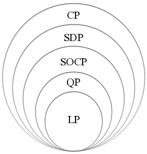
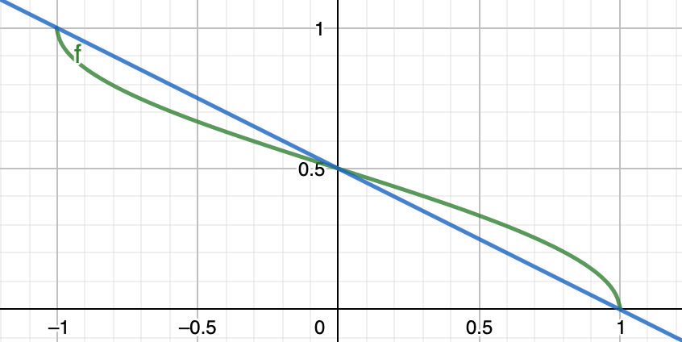

<!-- ---
jupytext:
  formats: md:myst
  text_representation:
    extension: .md
    format_name: myst
    format_version: 0.12
    jupytext_version: 1.8.2
kernelspec:
  display_name: R
  language: R
  name: ir
--- -->

# Non-linear Programming

:::{figure} opt-hierarchy


A hierarchy of convex optimization problems. (LP: linear program, QP: quadratic program, SOCP second-order cone program, SDP: semidefinite program, CP: cone program.) [[Wikipedia](https://en.wikipedia.org/wiki/Convex_optimization)]
:::


**TBC**

Primal and Dual short [intro](https://zhuanlan.zhihu.com/p/46944722).

Lagrange multiplier:

-   geometric [motivation](https://www.youtube.com/watch?v=yuqB-d5MjZA&t=16s&ab_channel=KhanAcademy) of the method: align tangency of the objective function and the constraints.
-   [formulation](https://www.youtube.com/watch?v=hQ4UNu1P2kw&t=311s&ab_channel=KhanAcademy) of Lagrangean $\mathcal{L}$: combining all equations to $\nabla\mathcal{L} = 0$.
-   [interpretation](https://www.youtube.com/watch?v=m-G3K2GPmEQ&t=185s&ab_channel=KhanAcademy) and [proof](https://www.youtube.com/watch?v=b9B2FZ5cqbM&ab_channel=KhanAcademy) of the Lagrange multiplier $\lambda$ as $\frac{\partial f}{\partial c}$, e.g. if budget change, how much will revenue change?

(rayleigh-quotient)=
## Rayleigh Quotients

Consider the following constrained optimization:

$$\begin{aligned}
\max_{\boldsymbol{x}} && \boldsymbol{x} ^{\top} \boldsymbol{A} \boldsymbol{x}  & \\
\mathrm{s.t.}
&& \left\| \boldsymbol{x}  \right\|^2 &= 1  \\
\end{aligned}$$

An equivalent unconstrained problem is

$$\begin{aligned}
\max_{\boldsymbol{x} \ne \boldsymbol{0}} && \frac{\boldsymbol{x} ^{\top} \boldsymbol{A} \boldsymbol{x} }{\boldsymbol{x} ^{\top} \boldsymbol{x} }  & \\
\end{aligned}$$

which makes the objective function invariant to scaling of $\boldsymbol{x}$. How do we solve this?

Definition (Quadratic forms)  
Let $\boldsymbol{A}$ be a symmetric real matrix. A quadratic form corresponding to $\boldsymbol{A}$ is a function $Q: \mathbb{R} ^n \rightarrow \mathbb{R}$ with

$$
  Q_{\boldsymbol{A}}(\boldsymbol{x}) = \boldsymbol{x} ^{\top} \boldsymbol{A} \boldsymbol{x}
  $$

A quadratic form is can be written as a polynomial with terms all of second order

$$
  \boldsymbol{x} ^{\top} \boldsymbol{A} \boldsymbol{x}  = \sum_{i, j=1}^n a_{ij} x_i x_j
  $$

Definition (Rayleigh quotient)  
-   For a fixed symmetric matrix $\boldsymbol{A}$, the normalized quadratic form $\frac{\boldsymbol{x} ^{\top} \boldsymbol{A} \boldsymbol{x}}{\boldsymbol{x} ^{\top} \boldsymbol{x} }$ is called a Rayleigh quotient.
    -   In addition, given a positive definite matrix $\boldsymbol{B}$ of the same size, the quantity $\frac{\boldsymbol{x} ^{\top} \boldsymbol{A} \boldsymbol{x} }{\boldsymbol{x} ^{\top} \boldsymbol{B} \boldsymbol{x} }$ is called a generalized Rayleigh quotient.

Applications  
-   PCA: $\max _{\boldsymbol{v} \neq 0} \frac{\boldsymbol{v}^{\top} \boldsymbol{\Sigma} \boldsymbol{v}}{\boldsymbol{v}^{\top} \boldsymbol{v}}$ where $\boldsymbol{\Sigma}$ is a covariance matrix
    -   LDA: $\max _{\boldsymbol{v} \neq 0} \frac{\boldsymbol{v}^{\top} \boldsymbol{S}_{b} \boldsymbol{v}}{\boldsymbol{v}^{\top} \boldsymbol{S}_{w} \boldsymbol{v}}$ where $\boldsymbol{S} _b$ is a between-class scatter matrix, and $\boldsymbol{S} _w$ is a within-class scatter matrix
    -   Spectral clustering (relaxed Ncut): $\max _{\boldsymbol{v} \neq \boldsymbol{0}} \frac{\boldsymbol{v}^{\top} \boldsymbol{L} \boldsymbol{v}}{\boldsymbol{v}^{\top} \boldsymbol{D} \boldsymbol{v}} \quad {s.t.} \boldsymbol{v} ^{\top} \boldsymbol{D} \boldsymbol{1} = 0$ where $\boldsymbol{L}$ is graph Laplacian and $\boldsymbol{D}$ is degree matrix.

Theorem (Range of Rayleigh quotients)  
For any symmetric matrix $\boldsymbol{A} \in \mathbb{R} {n \times n}$,

$$\begin{aligned}
  \max _{\boldsymbol{x} \in \mathbb{R}^{n}: \boldsymbol{x} \neq \boldsymbol{0}} \frac{\boldsymbol{x}^{\top} \boldsymbol{A} \boldsymbol{x}}{\boldsymbol{x}^{\top} \boldsymbol{x}} &=\lambda_{\max } \\
  \min _{\boldsymbol{x} \in \mathbb{R}^{n}: \boldsymbol{x} \neq \boldsymbol{0}} \frac{\boldsymbol{x}^{\top} \boldsymbol{A} \boldsymbol{x}}{\boldsymbol{x}^{\top} \boldsymbol{x}} &=\lambda_{\min }
  \end{aligned}$$

That is, the largest and the smallest eigenvalues of $\boldsymbol{A}$ gives the range for the Rayleigh quotient. The maximum and the minimum is attainted when $\boldsymbol{x}$ is the corresponding eigenvector.

In addition, if we add an orthogonal constraint that $\boldsymbol{x}$ is orthogonal to all the $j$ largest eigenvectors, then

$$
  \max _{\boldsymbol{x} \in \mathbb{R}^{n}: \boldsymbol{x} \neq \boldsymbol{0}, \boldsymbol{x} \perp \boldsymbol{v} _1 \ldots, \boldsymbol{v} _j} \frac{\boldsymbol{x}^{\top} \boldsymbol{A} \boldsymbol{x}}{\boldsymbol{x}^{\top} \boldsymbol{x}} =\lambda_{j+1}
  $$

and the maximum is achieved when $\boldsymbol{x} = \boldsymbol{v} _{j+1}$.

:::{admonition,dropdown,seealso} *Proof: Linear algebra approach*

Consider EVD of $\boldsymbol{A}$:

$$
  \boldsymbol{x}^{\top} \boldsymbol{A} \boldsymbol{x}=\boldsymbol{x}^{\top}\left(\boldsymbol{U} \boldsymbol{\Lambda} \boldsymbol{U}^{\top}\right) \boldsymbol{x}=\left(\boldsymbol{x}^{\top} \boldsymbol{U}\right) \boldsymbol{\Lambda}\left(\boldsymbol{U}^{\top} \boldsymbol{x}\right)=\boldsymbol{y}^{\top} \boldsymbol{\Lambda} \boldsymbol{y}
  $$

where $\boldsymbol{y} = \boldsymbol{U} ^{\top} \boldsymbol{x}$ is also a unit vector since $\left\| \boldsymbol{y} \right\| ^2 = 1$. The original optimization problem becomes

$$
  \max _{\boldsymbol{y} \in \mathbb{R}^{n}:\|\boldsymbol{y}\|=1} \quad \boldsymbol{y}^{\top} \underbrace{\boldsymbol{\Lambda}}_{\text {diagonal }} \boldsymbol{y}
  $$

Note that the objective and constraint can be written as a weighted sum of eigenvalues

$$
  \boldsymbol{y}^{\top} \boldsymbol{\Lambda} \boldsymbol{y}=\sum_{i=1}^{n} \underbrace{\lambda_{i}}_{\text {fixed }} y_{i}^{2} \quad \text { (subject to } y_{1}^{2}+y_{2}^{2}+\cdots+y_{n}^{2}=1)
  $$

Let $\lambda_1 \ge \lambda_2 \ge \ldots \ge \lambda_n$, then when $y_1^2 = 1$ and $y_2^2 = \ldots = y_n ^2 = 0$, the objective function attains its maximum $\boldsymbol{y} ^{\top} \boldsymbol{\Lambda} \boldsymbol{y} = \lambda_1$. In terms of $\boldsymbol{x}$, the maximizer is

$$
  \boldsymbol{x} ^* = \boldsymbol{U} \boldsymbol{y} ^* = \boldsymbol{U} (\pm \boldsymbol{e} _1) = \pm \boldsymbol{u}_1   
  $$

In conclusion, when $\boldsymbol{x} = \pm \boldsymbol{u} _1$, i.e. the largest eigenvector, $\boldsymbol{x} ^{\top} \boldsymbol{A} \boldsymbol{x}$ attains its maximum value $\lambda_1$

:::

:::{admonition,dropdown,seealso} *Proof: Multivariable calculus approach*

Alternatively, we can use the Method of Lagrange Multipliers to prove the theorem. First, we form the Lagrangian function

    $$
    L(\boldsymbol{x}, \lambda)=\boldsymbol{x}^{\top} \boldsymbol{A} \boldsymbol{x}-\lambda\left(\|\boldsymbol{x}\|^{2}-1\right)
    $$

    Differentiation gives

    $$
    \begin{aligned}
    \frac{\partial L}{\partial \boldsymbol{x}} &=2 \boldsymbol{A} \boldsymbol{x}-\lambda(2 \boldsymbol{x})=0 & \longrightarrow & \boldsymbol{A} \boldsymbol{x}=\lambda \boldsymbol{x} \\
    \frac{\partial L}{\partial \lambda} &=\|\boldsymbol{x}\|^{2}-1=0 & \longrightarrow &\|\boldsymbol{x}\|^{2}=1
    \end{aligned}
    $$

    This implies that $\boldsymbol{x}$ and $\lambda$ must be an eigenpair of $\boldsymbol{A}$. Moreover, for any solution $\lambda=\lambda_{i}, \boldsymbol{x}=\boldsymbol{v}_{i}$, the objective function takes the value


    $$
    \boldsymbol{v}_{i}^{\top} \boldsymbol{A} \boldsymbol{v}_{i}=\boldsymbol{v}_{i}^{\top}\left(\lambda_{i} \boldsymbol{v}_{i}\right)=\lambda_{i}\left\|\boldsymbol{v}_{i}\right\|^{2}=\lambda_{i}
    $$

    Therefore, the eigenvector $\boldsymbol{v} _1$ (corresponding to largest eigenvalue $\lambda_1$ of $\boldsymbol{A}$) is the global maximizer, and it yields the absolute maximum value $\lambda_1$.

:::

Corollary (Generalized Rayleigh quotient problem)  
For the generalized Rayleigh quotient $\frac{\boldsymbol{x}^{\top} \boldsymbol{A} \boldsymbol{x}}{\boldsymbol{x}^{\top} \boldsymbol{B} \boldsymbol{x}}$, the smallest and largest values $\lambda$ satisfy

$$
  \boldsymbol{A v}=\lambda \boldsymbol{B v} \quad \Longleftrightarrow \quad \boldsymbol{B}^{-1} \boldsymbol{A v}=\lambda \boldsymbol{v}
  $$

That is, the smallest/largest quotient value equals the smallest/largest eigenvalue of $(\boldsymbol{B} ^{-1} \boldsymbol{A})$. The left equation is called a generalized eigenvalue problem.

:::{admonition,dropdown,seealso} *Proof*

-   Substitution approach

    Since $\boldsymbol{B}$ is p.d., we have $\boldsymbol{B} ^{1/2}$. Let $\boldsymbol{y} = \boldsymbol{B} ^{1/2}\boldsymbol{x}$, then the denominator can be written as

    $$
    \boldsymbol{x}^{\top} \boldsymbol{B} \boldsymbol{x}=\boldsymbol{x}^{\top} \boldsymbol{B}^{1 / 2} \boldsymbol{B}^{1 / 2} \boldsymbol{x}=\boldsymbol{y}^{\top} \boldsymbol{y}
    $$

    Substitute $\boldsymbol{x}=\left(\boldsymbol{B}^{1 / 2}\right)^{-1} \boldsymbol{y} \stackrel{\text { denote }}{=} \boldsymbol{B}^{-1 / 2} \boldsymbol{y}$ y into the numerator to rewrite it
    in terms of the new variable $\boldsymbol{y}$. This will convert the generalized Rayleigh
    quotient problem back to a regular Rayleigh quotient problem, which has
    been solved.

    $$
    \frac{\boldsymbol{y} \boldsymbol{B} ^{-1/2} \boldsymbol{A} \boldsymbol{B} ^{-1/2} \boldsymbol{y} }{\boldsymbol{y} ^{\top} \boldsymbol{y}}
    $$

-   Lagrange multipliers:

    $$
    \max _{\boldsymbol{x} \neq \boldsymbol{0}} \frac{\boldsymbol{x}^{\top} \boldsymbol{A} \boldsymbol{x}}{\boldsymbol{x}^{\top} \boldsymbol{B} \boldsymbol{x}}
    $$

    $$
    \max _{\boldsymbol{x} \in \mathbb{R}^{n}} \boldsymbol{x}^{\top} \boldsymbol{A} \boldsymbol{x} \quad \text { subject to } \boldsymbol{x}^{\top} \boldsymbol{B} \boldsymbol{x}=1
    $$

    $$
    L(\boldsymbol{x}, \lambda)=\boldsymbol{x}^{\top} \boldsymbol{A} \boldsymbol{x}-\lambda\left(\boldsymbol{x}^{\top} \boldsymbol{B} \boldsymbol{x}-1\right)
    $$

    Then

    $$
    \begin{aligned}
    \frac{\partial L}{\partial \boldsymbol{x}} &=2 \boldsymbol{A} \boldsymbol{x}-2\lambda \boldsymbol{B}  \boldsymbol{x}=0 & \longrightarrow & \boldsymbol{A} \boldsymbol{x}=\lambda \boldsymbol{B}\boldsymbol{x} \\
    \frac{\partial L}{\partial \lambda} &=0 & \longrightarrow & \boldsymbol{x} ^{\top} \boldsymbol{B} \boldsymbol{x} =1
    \end{aligned}
    $$

:::

reference: [notes](https://www.sjsu.edu/faculty/guangliang.chen/Math253S20/lec4RayleighQuotient.pdf)


## Semi-definite Programming

We introduce semi-definite programming. Then use it solve max-cut problem, and analyze its performance for min-cut problem over stochastic block model.

### Introduction

A linear programming problem is one in which we wish to maximize or minimize a **linear** objective function of real variables over a polytope. In semidefinite programming, we instead use **real-valued vectors** and are allowed to take the **dot product** of vectors. In general, a SDP has a form

$$
\begin{array}{l}
\min _{\boldsymbol{x}_{1}, \ldots, \boldsymbol{x}_{n} \in \mathbb{R}_{n}}& \sum_{i, j \in[n]} c_{ij} \langle \boldsymbol{x}_{i}, \boldsymbol{x}_{j} \rangle \\
\text {s.t.} &\sum_{i, j \in[n]} a_{ijk}\langle \boldsymbol{x}_{i}, \boldsymbol{x}_{j} \rangle \leq b_{k} \text { for all } k
\end{array}
$$


The array of real variables in LP is then replaced by an array of vector variables, which form a matrix variable. By using this notation, the problem can be written as


$$
\begin{aligned}
\min _{\boldsymbol{X} \in \mathbb{R}^{n \times n}}\ &\langle \boldsymbol{C} , \boldsymbol{X} \rangle\\
\text {s.t.}\ & \left\langle \boldsymbol{A} _{k}, \boldsymbol{X} \right\rangle\leq b_{k}, \quad k=1, \ldots, m \\
& X_{ij} = \boldsymbol{x}_i ^{\top} \boldsymbol{x} _j
\end{aligned}
$$

where $C_{ij} = (c_{ij} + c_{ji})/2, A_{ij}^{(k)} = (a_{ijk} + a_{jik})/2$ and $\langle \boldsymbol{P}, \boldsymbol{Q} \rangle = \operatorname{tr}\left(\boldsymbol{P}  ^{\top} \boldsymbol{Q} \right) = \sum_{i,j}^n p_{ij}q_{ij}$ is the [Frobenius inner product](https://en.wikipedia.org/wiki/Frobenius_inner_product).

Note that an $n \times n$ matrix $\boldsymbol{M}$ is said to be positive semidefinite if it is the Gramian matrix of some vectors (i.e. if there exist vectors $\boldsymbol{v} _1, \ldots, \boldsymbol{v} _n$ such that $M_{ij} = \langle \boldsymbol{v} _i, \boldsymbol{v} _j \rangle$ for all $i,j$). Hence, the last constraint is just $\boldsymbol{X} \succeq \boldsymbol{0}$. That is, the nonnegativity constraints on real variables in LP are replaced by semidefiniteness constraints on matrix variables in SDP.

$$
\begin{aligned}
\min _{\boldsymbol{X} \succeq \boldsymbol{0}}\ &\langle \boldsymbol{C} , \boldsymbol{X} \rangle\\
\text {s.t.}\ & \left\langle \boldsymbol{A} _{k}, \boldsymbol{X} \right\rangle\leq b_{k}, \quad k=1, \ldots, m \\
\end{aligned}
$$

All linear programs can be expressed as SDPs. SDPs are in fact a special case of cone programming and can be efficiently solved by interior point methods. Given the solution $\boldsymbol{X}^*$ to the SDP in the standard form, the vectors $\boldsymbol{v}_1, \ldots, \boldsymbol{v} _n$ can be recovered in $\mathcal{O} (n^3)$ time, e.g. by using an incomplete Cholesky decomposition of $\boldsymbol{X}^* = \boldsymbol{V} ^{\top} \boldsymbol{V}$ where $\boldsymbol{V} = [\boldsymbol{v} _1, \ldots \boldsymbol{v} _n]$.

### From Rayleigh Quotient

Recall that an Rayleigh quotient can be formulated as

$$
\max\  \boldsymbol{x} ^{\top} \boldsymbol{A} \boldsymbol{x}  \qquad \mathrm{s.t.}\ \boldsymbol{x} ^{\top} \boldsymbol{x} = 1
$$

Since both the objective and the constraint are scalar valued, we can re-write them using trace

$$
\max\  \operatorname{tr}\left( \boldsymbol{x} ^{\top} \boldsymbol{A} \boldsymbol{x}  \right) \qquad \mathrm{s.t.}\ \operatorname{tr}\left( \boldsymbol{x} ^{\top} \boldsymbol{x} \right) = 1
$$

Then, by the property of trace, we have

$$
\max\  \operatorname{tr}\left(\boldsymbol{A} \boldsymbol{x} \boldsymbol{x} ^{\top}  \right) \qquad \mathrm{s.t.}\ \operatorname{tr}\left( \boldsymbol{x} \boldsymbol{x} ^{\top} \right) = 1
$$

Let $\boldsymbol{X} = \boldsymbol{x} \boldsymbol{x} ^{\top}$, then the variable $\boldsymbol{x}$ can be replaced by a rank-1 matrix $\boldsymbol{X} = \boldsymbol{x} \boldsymbol{x} ^{\top}$


$$
\max\  \operatorname{tr}\left(\boldsymbol{A} \boldsymbol{X} \right) \qquad \mathrm{s.t.}\ \operatorname{tr}\left( \boldsymbol{X}  \right) = 1, \boldsymbol{X} = x
\boldsymbol{x} ^{\top}
$$

Note that $\boldsymbol{X} = \boldsymbol{x} \boldsymbol{x} ^{\top}$ if and only if $\operatorname{rank}\left( \boldsymbol{X}  \right)=1$ and $\boldsymbol{X} \succeq \boldsymbol{0}$, hence the constraints are equivalent to.


$$
\max\  \operatorname{tr}\left(\boldsymbol{A} \boldsymbol{X} \right) \qquad \mathrm{s.t.}\ \operatorname{tr}\left( \boldsymbol{X}  \right) = 1, \operatorname{rank}\left( \boldsymbol{X}  \right)=1, \boldsymbol{X} \succeq 0 \qquad (RQ)
$$

Call this problem RQ, if we drop the rank 1 constraint, then this would be a semidefinite program, where $\operatorname{tr}\left( \boldsymbol{X} \right)$ can be viewed as $\langle \boldsymbol{I} , \boldsymbol{X} \rangle = 1$.

$$
\max\  \operatorname{tr}\left(\boldsymbol{A} \boldsymbol{X} \right) \qquad \mathrm{s.t.}\ \operatorname{tr}\left( \boldsymbol{X}  \right) = 1, \boldsymbol{X} \succeq 0 \qquad (SDP)
$$

In fact, any optimal solution $\boldsymbol{X} _{SDP}^*$ to this SDP can always be convert to an rank-1 matrix $\boldsymbol{X} _{RQ}^*$ with the same optimal value. Hence, solving the SDP is equivalent to solving the RQ.

:::{admonition,dropdown,seealso} *Proof*

In SDP, since $\boldsymbol{X} \succeq \boldsymbol{0}$, let its EVD be $\boldsymbol{X} = \sum_{i=1}^n \lambda_i \boldsymbol{u}_i \boldsymbol{u}_i ^{\top}$, then the objective function is

$$
\operatorname{tr}\left( \boldsymbol{A} \sum_{i=1}^n \lambda_i \boldsymbol{u} _i \boldsymbol{u} _i ^{\top} \right) = \sum_{i=1}^n \lambda_i \operatorname{tr}\left( \boldsymbol{A} \boldsymbol{u} _i \boldsymbol{u} _i ^{\top} \right)
$$

Note that $1 = \operatorname{tr}\left( \boldsymbol{X} \right) = \sum_{i=1}^n \lambda_i$ and $\lambda_i \ge 0$. Thus, the objective function is a convex combination of $\operatorname{tr}\left( \boldsymbol{A} \boldsymbol{u} _i \boldsymbol{u} _i ^{\top} \right)$. Hence, for any feasible solution $\boldsymbol{X} _{SDP} =\sum_{i=1}^n \lambda_i \boldsymbol{u}_i \boldsymbol{u}_i ^{\top}$, we can formulate another rank-1 feasible solution, by selecting $j = \arg\max_i \operatorname{tr}\left( \boldsymbol{A} \boldsymbol{u} _i \boldsymbol{u} _i ^{\top} \right)$, and setting $\lambda_j=1$ while $\lambda_{-j}=0$. The rank-1 feasible solution is then $\boldsymbol{X} _{RQ} = \boldsymbol{u}_j \boldsymbol{u}_j ^{\top}$, and has a better objective value $\operatorname{tr}\left( \boldsymbol{A} \boldsymbol{X} _{RQ} \right) \ge \operatorname{tr}\left( \boldsymbol{A} \boldsymbol{X} _{SDP}\right)$. Therefore, for any optimal solution $\boldsymbol{X} _{SDP}^*$, we can find a rank-1 matrix $\boldsymbol{X} _{RQ}^*$, such that it is still optimal, since $\operatorname{tr}(\boldsymbol{A} \boldsymbol{X} _{SDP}^* ) = \operatorname{tr}(\boldsymbol{A} \boldsymbol{X} _{RQ}^* )$.

In this way, the optimal value is then

$$\max \operatorname{tr}\left( \boldsymbol{A} \boldsymbol{u} _j \boldsymbol{u} _j ^{\top} \right) = \max \boldsymbol{u} _j ^{\top} \boldsymbol{A} \boldsymbol{u} _j = \lambda_{\max}(\boldsymbol{A})$$

where the eigenvector $\left\| \boldsymbol{u} \right\| =1$. This goes back to the formulation of Rayleigh quotient.

:::


### Max-cut Problem

In a graph $G = (V, E)$ with edge weights $\boldsymbol{W}$, we want to find a maximum bisection cut

$$
\operatorname{cut} (\boldsymbol{W}) = \max_{\boldsymbol{x} \in \left\{ \pm 1 \right\}^n} \frac{1}{2} \sum_{i,j=1}^n w_{ij} (1 - x_i x_j)
$$

where the product $x_i x_j$ is an indicator variable that equals 1 if two vertices $i, j$ are in the same part, and $-1$ otherwise. Hence, the summation only involves the case when $x_i x_j = -1$, and we divide it by half since $(1- x_i x_j)=2$.

Denote $\boldsymbol{X} = \boldsymbol{x} \boldsymbol{x} ^{\top} \in \mathbb{R} ^{n \times n}$. Then the domain $\boldsymbol{x} \in \left\{ \pm 1 \right\}^n$ is bijective to $\Omega = \left\{ \boldsymbol{X} \in \mathbb{R} ^{n \times n} : \boldsymbol{X} \succeq 0, X_{ii}=1, \operatorname{rank}\left( \boldsymbol{X} \right) = 1 \right\}$. The optimization problem can then be expressed as

$$\begin{aligned}
\operatorname{cut} (\boldsymbol{W})
&= \max_{\boldsymbol{X} \in \Omega} \frac{1}{2}  \operatorname{tr}\left( \boldsymbol{W} (\boldsymbol{1} \boldsymbol{1} ^{\top}  - \boldsymbol{X}) \right) \\
\end{aligned}$$

Solving this integer optimization is NP-hard. We work with relaxation of $\Omega$.


### Relaxation

#### Spectral Relaxation

Two relaxations:
- drop the rank 1-constraint $\operatorname{rank}\left( \boldsymbol{X} \right) = 1$
- replace the diagonal constraint $X_{ii}=1$ by $\operatorname{tr}\left( \boldsymbol{X} \right) = n$

To solve it, it is equivalent to solve

$$
\max\ \operatorname{tr}\left( -\boldsymbol{W}\boldsymbol{X} \right) \qquad \text{s.t. }\boldsymbol{X} \succeq \boldsymbol{0} , \operatorname{tr}\left( \boldsymbol{X} \right) = n
$$

which has the form

$$
\max\ \operatorname{tr}\left( \boldsymbol{C} \boldsymbol{X} \right) \qquad \text{s.t. }\boldsymbol{X} \succeq \boldsymbol{0} , \operatorname{tr}\left( \boldsymbol{X} \right) = n
$$

which is equivalent (what if $\operatorname{rank} (\boldsymbol{X})=2$ ??) to

$$
\max\ \boldsymbol{x} ^{\top} \boldsymbol{C} \boldsymbol{x} \qquad \text{s.t.}  \left\| \boldsymbol{x}  \right\| = \sqrt{n}
$$

#### SDP Relaxation

Only one relaxation: drop the rank-1 constraint, which is non-convex. The remaining two constraints forms a domain

$$\Omega_{SDP} = \left\{ \boldsymbol{X} \in \mathbb{R} ^{n \times n}:  \boldsymbol{X} \succeq 0, X_{ii}=1 \right\}$$

The optimization problem is then

$$
\operatorname{SDP} (\boldsymbol{W}) = \max_{\boldsymbol{X} \in \Omega_{SDP}} \frac{1}{2}  \sum_{i,j=1}^n w_{ij} (1 - X_{ij})
$$

Note that after we drop the rank-1 constraint,
- $\operatorname{SDP}(\boldsymbol{W} ) \ge \operatorname{cut} (\boldsymbol{W})$.
- The solution $\boldsymbol{X} ^*$ to $\operatorname{SDP} (\boldsymbol{W})$ may not be rank-1. If it is rank-1 then the above equality holds.

It remains to solve $\operatorname{SDP} (\boldsymbol{W})$ for $\boldsymbol{X}$, and then find a way to obtain the binary partition assignment $\hat{\boldsymbol{x}} \in \left\{ \pm 1 \right\}^n$ from $\boldsymbol{X}$.

:::{admonition,note,dropdown} Lifting

$\Omega_{SDP}$ is equivalent to $\left\{\boldsymbol{X} \in \mathbb{R} ^{n \times n}: \boldsymbol{X} = \boldsymbol{V} ^{\top} \boldsymbol{V}, \left\| \boldsymbol{v} _i \right\| ^2 = 1 \right\}$. In this way, we convert a scalar constraint $X_{ii}$ to a vector constraint $\left\| \boldsymbol{v} _i \right\| =1$, aka ‘lifting’.

:::

### Random Rounding

#### Algorithm

-   Solve $\operatorname{SDP} (\boldsymbol{W})$ and obtain $\hat{\boldsymbol{X}}$
-   Decompose $\hat{\boldsymbol{X}} = \hat{\boldsymbol{V}} ^{\top} \boldsymbol{\hat{V}}$, e.g. using EVD $\boldsymbol{\hat{X}} ^{\top} = \boldsymbol{\hat{U}} \sqrt{\boldsymbol{\hat{\Lambda}}}$, or using Cholesky. Note that $\left\| \boldsymbol{\hat{v}} _i \right\| =1$ always holds, due to the constraint $\hat{X}_{ii}=1$.
-   Sample a direction $\boldsymbol{r}$ uniformly from $S^{p-1}$
-   Return binary partition assignment $\hat{\boldsymbol{x}} = \operatorname{sign} (\boldsymbol{\hat{V}} ^{\top} \boldsymbol{r} )$

#### Intuition

- Randomly sample a hyperplane in $\mathbb{R} ^n$ characterized by vector $\boldsymbol{r}$. If $\hat{\boldsymbol{v}} _i$ lies on the same side of the hyperplane with $\boldsymbol{r}$, then set $\hat{x}_i =1$, else $\hat{x}_i = -1$.
- If there indeed exists a partition $I$ and $J$ of vertices characterizedd by $\boldsymbol{x}$, then the two groups of directions $\boldsymbol{v} _i$’s and $\boldsymbol{v} _j$’s should point to opposite direction since $\boldsymbol{v} _i ^{\top} \boldsymbol{v} _j = x_i x_j = -1$. After random rounding, they should be well separated. Hence, if $\hat{\boldsymbol{v}}_i ^{\top} \hat{\boldsymbol{v} }_j$ recovers $\boldsymbol{v}_i ^{* \top} \boldsymbol{v}^* _j$ well enough, then $\hat{\boldsymbol{x}}$ well recovers $\boldsymbol{x}^*$, the optimal max-cut in $\operatorname{cut}(\boldsymbol{W})$.

$$\begin{aligned}
\boldsymbol{X} ^* \text{ to }  \operatorname{cut} \ & \Leftrightarrow \quad  \boldsymbol{x} ^* \text{ to } \operatorname{cut}\\
\text{SDP relaxation}\quad \downarrow \quad  &\qquad \qquad \uparrow \text{recover} \\
\boldsymbol{\hat{X}} \text{ to } \operatorname{SDP} &  \xrightarrow[\text{rounding} ]{\text{random} } \hat{\boldsymbol{x}} = \operatorname{sign} (\boldsymbol{\hat{V}} ^{\top} \boldsymbol{r} )\\
\end{aligned}$$

To see how $\boldsymbol{V}$ looks like for $\boldsymbol{x} \in \left\{ \pm 1 \right\} ^n$, let $\boldsymbol{x} = [1, 1, -1, -1, -1]$, then

$$
\boldsymbol{X} = \left[\begin{array}{rrrrr}
1 & 1 & -1 & -1 & -1 \\
1 & 1 & -1 & -1 & -1 \\
-1 & -1 & 1 & 1 & 1 \\
-1 & -1 & 1 & 1 & 1 \\
-1 & -1 & 1 & 1 & 1
\end{array}\right],\qquad \boldsymbol{V} = \left[ \begin{array}{rrrrr}
-1 & -1 & 1 & 1 & 1 \\
0 & 0 & 0 & 0 & 0 \\
0 & 0 & 0 & 0 & 0 \\
0 & 0 & 0 & 0 & 0 \\
0 & 0 & 0 & 0 & 0
\end{array} \right]
$$
<!--
```{code-cell} R
:tags: [hide-input]
x = c(rep(1, 2), rep(-1, 3))
X = x %*% t(x)
Lam = diag(eigen(X)$value)
U = eigen(X)$vectors
V = t(U %*% sqrt(Lam))
print('X:')
print(X)
print('V:')
print(round(V, 2))
```
 -->

#### Analysis

How well the algorithm does, in expectation? We define Geomans-Williams quantity, which is the expected cut value returned by the algorithm, where randomness comes from random direction $\boldsymbol{r}$.

$$\operatorname{GW} (\boldsymbol{W}) = \mathbb{E}_{\boldsymbol{r}} [f_{\boldsymbol{W} }(\hat{\boldsymbol{x}}) ] = \mathbb{E}_{\boldsymbol{r}}  \left[ \frac{1}{2} \sum_{i,j=1}^n w_{ij} (1 - \hat{x}_i \hat{x}_j)\right]$$

Obviously $\operatorname{GW} (\boldsymbol{W}) \le \operatorname{cut} (\boldsymbol{W})$, since we are averaging the value of feasible solutions $\hat{\boldsymbol{x}}$ in $\left\{ \pm 1\right\}^n$, and each of them is $\le \operatorname{cut} (\boldsymbol{W})$. But how small can $\operatorname{GW} (\boldsymbol{W})$ be?

Theorem  
$\operatorname{GW}(\boldsymbol{W}) \ge \alpha \operatorname{cut}(\boldsymbol{W})$ where $\alpha \approx 0.87$. That is, the random rounding algorithm return a cut value not too small than the optimal value, in expectation.

::::{admonition,dropdown,seealso} *Proof*

We randomly sample direction $\boldsymbol{r}$ from unit sphere $S^{p-1}$. If $\boldsymbol{v} _i$ and $\boldsymbol{v} _j$ lie on different side of hyperplane characterized by $\boldsymbol{r}$, we call such direction 'good'.

In $p=2$ case, we sample from a unit circle. All good $\boldsymbol{r}$ lie on two arcs on the circle, whose length are related to the angle between $\boldsymbol{v} _i$ and $\boldsymbol{v} _j$, denoted $\theta$. The probability of sampling good equals the ratio between the total length of the two arcs and the circumference. Thus,

$$\begin{aligned}
\mathbb{E} \left[ \frac{1}{2}(1 - \hat{x}_i \hat{x}_j) \right]
&= \mathbb{P} (\hat{x}_i \hat{x}_j = -1) \\
&= \mathbb{P} (\boldsymbol{v} _i, \boldsymbol{v} _j \text{ lie on different side of hyperplane}) \\
&= \frac{\theta}{2 \pi} \times 2  \\
&= \frac{\arccos (\boldsymbol{v} _i ^{\top} \boldsymbol{v} _j)}{\pi} \\
\end{aligned}$$

In $p = 3$ case, we sample $\boldsymbol{r}$ from a unit sphere. All good $\boldsymbol{r}$ lie on a 'belt' on the sphere. The probability of sampling good $\boldsymbol{r}$ equals the ratio between the area of the belt and the area of the sphere. Consider partitioning the sphere into a collection of infinite many semicircles (like longitude arcs), then the probability for each semicircle is $\theta/\pi$. Hence, the overall probability for the sphere is still $\theta/\pi$. It remains constant in higher dimensional cases.


Now we compare $\operatorname{GW}(\boldsymbol{W}) = \sum_{i,j}^n w_{ij} \frac{1}{\pi}\arccos (\boldsymbol{v} _i ^{\top} \boldsymbol{v} _j)$ and $\operatorname{SDP} (\boldsymbol{W}) = \sum_{i,j}^n w_{ij} \frac{1}{2} (1 - \boldsymbol{v} _i ^{\top} \boldsymbol{v} _j)$.

Let’s first see two functions $f(y) = \frac{1}{\pi}\arccos(y)$ and $g(y) = \frac{1}{2}(1-y)$ for $-1 \le y \le 1$. Let $\alpha = \min_{-1 \le y \le 1} \frac{f(y)}{g(y)}$, then it is easy to find $\alpha \approx 0.87$.

:::{figure} max-cut-gw-thm


Plots of $f(y)$ and $g(y)$
:::

Therefore, let $y_{ij} = \boldsymbol{v} _i \boldsymbol{v} _j$, since $w_{ij} \ge 0$, we have $\operatorname{GW} (\boldsymbol{W}) \ge \alpha \operatorname{SDP} (\boldsymbol{W})$. Using the SDP relaxation inequality $\operatorname{SDP} (\boldsymbol{W}) \ge \operatorname{cut} (\boldsymbol{W})$, we have $\operatorname{GW} (\boldsymbol{W}) \ge \alpha \operatorname{cut} (\boldsymbol{W})$.

Note that we require $w_{ij} \ge 0$.

::::

How large can the SDP relaxation value $\operatorname{SDP} (\boldsymbol{W})$ be? **Grothendieck’s Inequality** says

$$
\operatorname{SDP}(\boldsymbol{W}) \le K \operatorname{cut}(\boldsymbol{W})  
$$

where $K \approx 1.7$. Hence, the SDP relaxation $\Omega_{SDP}$ does not relax the original domain $\Omega$ too much (otherwise we may see $\operatorname{SDP}(\boldsymbol{W}) \gg \operatorname{cut}(\boldsymbol{W})$). Hence $\hat{\boldsymbol{v}}_i ^{\top} \boldsymbol{\hat{v}} _j$ should recover binary $x_i^* x_j^*$ well.

### For SBM

The above inequalities applies to any problem instance $G=(V, E, \boldsymbol{W})$. It may give too generous or useless guarantee for some particular model. Let’s see its performance in [stochastic block models](stochastic-block-models).

We work with the mean-shifted matrix $\boldsymbol{B} = 2\boldsymbol{A} - \boldsymbol{1} \boldsymbol{1} ^{\top}$, where

$$
b_{ij} = \left\{\begin{array}{ll}
1, & \text { if } a_{ij}=1 \\
-1, & \text { if } a_{ij}=0
\end{array}\right.
$$

Essentially, $\boldsymbol{B}$ just re-codes the connectivity in $G$ from 1/0 to 1/-1. Note that in SBM, $\boldsymbol{B}$ is random, depending on parameters $p$ and $q$. In the perfect case, if $p=1, q=0$, then we can tell cluster label $\boldsymbol{x}\in \left\{ \pm 1 \right\}^n$ directly from $\boldsymbol{B}$, which can be expressed exactly as $\boldsymbol{B} = \boldsymbol{x} \boldsymbol{x} ^{\top}$. In general cases, $\boldsymbol{B}$ cannot be expressed as $\boldsymbol{x} \boldsymbol{x} ^{\top}$ for some $\boldsymbol{x} \in \left\{ \pm 1 \right\}^n$. We in turn want to find some $\boldsymbol{X} = \boldsymbol{x} \boldsymbol{x} ^{\top}$ that is close enough to $\boldsymbol{B}$, and then use $\boldsymbol{x}$ as the approximated cluster label.

Similar to the max-cut case, we apply SDP relaxation that drops the rank-1 constraint to $\boldsymbol{X}$. The SDP problem is then

$$
\max\ \operatorname{tr}\left( \boldsymbol{B} \boldsymbol{X} \right) \qquad \text{s.t. } \boldsymbol{X} \succeq 0, X_{ii}=1
$$

Note $\operatorname{tr}\left( \boldsymbol{B} \boldsymbol{X} \right) = \langle \boldsymbol{B} , \boldsymbol{X} \rangle = \sum_{i,j}^n b_{ij} x_{ij}$. Next, we show that the solution to the above problem $\hat{\boldsymbol{X}}$ is exactly rank-1, even we've dropped the rank-1 constraint.

:::{admonition,dropdown,seealso} *Proof*

First we convert it to an equivalent minimization problem

$$\min\ - \langle  \boldsymbol{B}, \boldsymbol{X} \rangle \qquad \text{s.t. } \boldsymbol{X} \succeq 0, X_{ii}=1$$

The Lagrangean is

$$
\mathcal{L} (\boldsymbol{X} ; \boldsymbol{z} , \boldsymbol{\Lambda})= - \langle \boldsymbol{B} , \boldsymbol{X} \rangle - \langle \boldsymbol{z} , \operatorname{diag}\left( \boldsymbol{X}  \right)  - \boldsymbol{1}\rangle - \langle \boldsymbol{\Lambda} , \boldsymbol{X} \rangle
$$

where $\boldsymbol{z} \in \mathbb{R} ^n$ and $\boldsymbol{\Lambda} \succeq \boldsymbol{0}$ are dual variables (??). Then

$$
\min_{\boldsymbol{X}} \max _{\boldsymbol{\Lambda}, \boldsymbol{z}} \mathcal{L} (\boldsymbol{X} ; \boldsymbol{z} , \boldsymbol{\Lambda}) \ge \max _{\boldsymbol{\Lambda}, \boldsymbol{z}}\min_{\boldsymbol{X}}  \mathcal{L} (\boldsymbol{X} ; \boldsymbol{z} , \boldsymbol{\Lambda})
$$

Now we solve the RHS dual problem. For the inner minimization problem $\min_{\boldsymbol{X}} \mathcal{L} (\boldsymbol{X} ; \boldsymbol{z} , \boldsymbol{\Lambda})$,

$$
\frac{\partial \mathcal{L} }{\partial \boldsymbol{X}} = - \boldsymbol{B} - \operatorname{diag}\left( \boldsymbol{z}  \right) - \boldsymbol{\Lambda} = \boldsymbol{0}
$$

Plug this identity to $\mathcal{L}$ gives the RHS outer maximization problem

$$
\max _{\boldsymbol{\Lambda} \succeq \boldsymbol{0} , \boldsymbol{z}}\ \boldsymbol{z} ^{\top} \boldsymbol{1}
$$

:::
.

.

.

.

.

.

.

.
