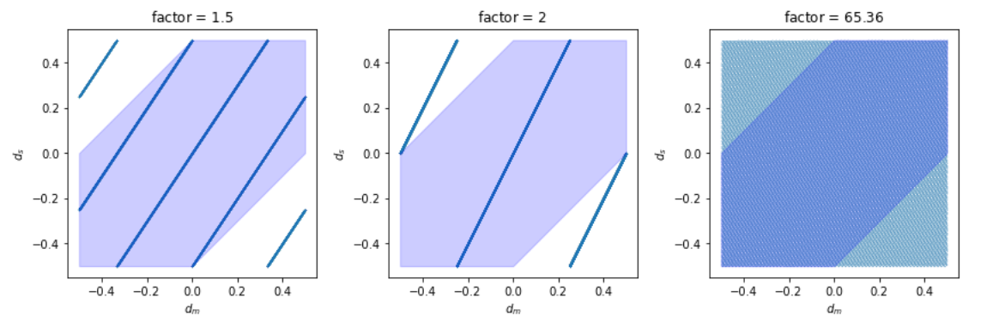
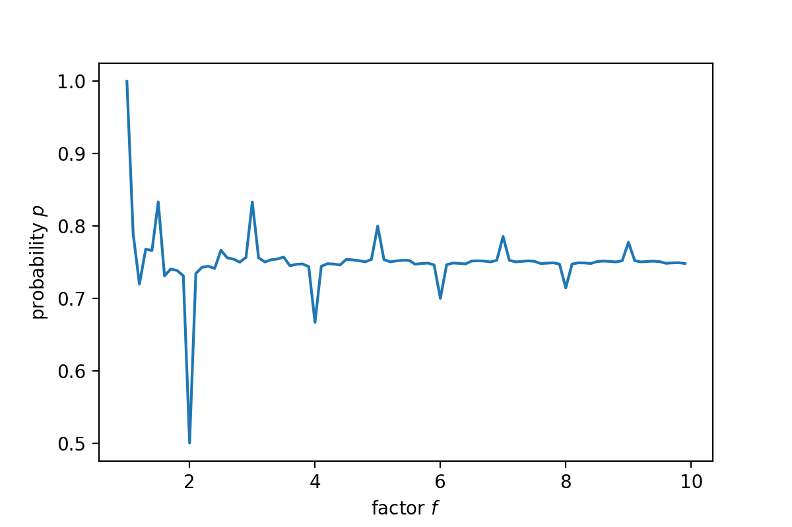

# Puzzles

This section contains some interesting math puzzles.

## 10-digit Number Puzzle

Tags: Jane Street, Trader, 18Q4

*There is a 10-digit number. From left to right, the first digit equals the number of 0's in that number, the second digit equals the number of 1's in that number, and so on. What is this number?*


:::{admonition,dropdown,seealso} *Sol.1 Enumeration by Hand*

Suppose this number is $\underline{d_0d_1d_2d_3d_4d_5d_6d_7d_8d_9}$, where

$$d_{i} = \sum_{j=0}^9\mathbb{I}[d_j=i]\in \{0,1,2,\dots,9\}$$

Consider the summation of the digits,

$$S_1 = \sum_{i=0}^{9} d_i$$

Since each digit counts the number of appearances and there are 10 digits in total, the summation should be $S_1=10$.

Note that the summation can also be written as

$$S_2 = \sum_{i=0}^{9} d_i \times i$$

Thus, we have

$$S_1 = S_2 = 10$$

Then we find $d_i$ by trial and error by applying the above constraints and the definition. We start from the first digit and follow the reasoning: suppose $d_0=k$, then $d_k\ge 1$. If $d_k = l$, then $d_l\ge 1$.

- If $d_0=9$, then $d_9=1$, then $d_1\ge1$, violating the constraint $S_1=10$
- If $d_0=8$, then $d_8=1$, then we must have $d_1=1$ to satisfy the constraint $S_1=10$, but it violates the definition since 1 appears twice.
- If $d_0=7$, then $d_7=1$, then $d_1=2$, then $d_2\ge 1$, violating the constraint $S_1=10$
- If $d_0=6$, then $d_6=1$, then $d_1=2$ or 3
  - If $d_1=2$, then we have $d_2 = 1$ to satisfy $S_1=10$. Check and find that $S_2=10$, so 6210001000 is a **correct** number.
  - If $d_1=3$, then $d_3\ge1$, violating $S_1=10$

- If $d_0=5$, then $d_5=1$, then $d_1=2,3,4$
  - If $d_1=2$, then $d_2\ge1$
    - If $d_2=1$, then the sum is 9. Increasing other $d$ to satisfy $S=10$ will make $d_1=3$, contradiction
    - If $d_2=2$, then we need an additional $d$ to be 1, but the sum is already 10
  - If $d_1=3$, then $d_3=1$, violating $S_2=10$
  - If $d_1=4$, then $d_4=1$, violating $S_1=10$
- If $d_0=4$, then $d_4=1$, then $d_1=2,3,4,5$
  - If $d_1=2$, then $d_2 = 1, 2$
    - If $d_2=1$, then $S_1 = S_2 = 8$, it's impossible to increase other $d$'s such that the two constraints are satisfied since $3\times d_3\ge 3$
    - If $d_2=2$, then $S_2 = 10$, but $S_1=9$
  - If $d_1=3$, then $d_3=1$, then $S_2=10$ but $S_1=9$
  - If $d_1=4$, then 4 appears twice, contradiction
  - If $d_1=5$, then $S_1=10$ but $S_2=9$
- If $d_0=3$, then $d_3\ge1$, and $d_1\le 6$
  - If $d_1=6$, then $S_1=10$ but $S_2=9$
  - If $d_1=5$, then $d_5=1$, violating $S_2=10$
  - If $d_1\le 4$, then $\sum_{i=2}^9d_i\times i \ge 7$ and $S_2\ge11$


...

Enumeration by hand is tedious. We have found a solution 6210001000 but we have to enumerate all other cases to see if there exists any other solutions.

:::

:::{admonition,dropdown,seealso} *Sol.2 Enumeration by Computer*


It seems that the time complexity is $O(10^{n})$ for an $n$-digit number ($n <= 10$), but in fact we can optimize it by adding the constraints.

Since $\sum_{i=0}^9 i\cdot d_i = n$ we have $d_i \le \lfloor \frac{n}{i} \rfloor$ for $i \ge 1$. So the time complexity is greatly reduced to $O(\Pi_{i=1}^{n-1} \lfloor \frac{n}{i} \rfloor)$

A python script is shown below

```python
from itertools import product
for ds in product(range(1, 10), *(range(10 // i + 1) for i in range(1, 10))):
    if sum(ds) == 10 and sum(i * ds[i] for i in range(10)) == 10: # verify property S1 = S2
        for i in range(10):
            if ds.count(i) != ds[i]: # verify definition for each digit
                break # next number
        else: # definition satisfied, output
            print("".join(str(d) for d in ds))
```

It turns out that 6210001000 is the unique solution.

:::

:::{admonition,dropdown,seealso} *Sol.3 Mathematical Reasoning*

In the above solutions we did partial reasoning and partial enumeration. Now we try to use more rigorous reasoning.

Consider an $n$-digit number. Define a set $A = \{d_i\vert d_i\ge 1\}$. Then the cardinality is

$$\vert A \vert = \sum_{i=0}^{n-1} \mathbb{I}[d_i \ge 1] = n - \sum_{i=0}^{n-1} \mathbb{I}[d_i=0] =   n - d_0$$

and the sum of the elements in $A$ is

$$\sum_{d_i \in A} d_i = \sum_{i=0}^{n-1} d_i = n$$

Define another set $B = A \backslash \{d_0\} = \{d_i\vert d_i \ge 1, i\ge 1 \}$. Then

$$\vert B \vert = \vert A \vert - 1 = n - d_0 - 1$$

and the sum of the elements in $B$ is

$$\sum_{d_i \in B} d_i = \sum_{d_i \in A}d_i - d_0 = n - d_0$$

Given the above two equalities and note that $d_i \ge 1 \ \forall \  d_i\in B$, there must be exactly $n-d_0-2$ number of $1$'s and one $2$ in $B$. Hence, we obtain three constraints


$$
\begin{align}
d_1 &= n - d_0 - 2 + \mathbb{I}[d_0=1]  &(1)\\
d_2 &= 1 + \mathbb{I}[d_0=2] &(2) \\
d_i &\le 2 \ \  \forall \ i\ge1 &(3)
\end{align}
$$


We assuming that $n>6$.

- If $d_0=1$, then by $(1)$ we have $d_1=n-2 > 4$, contradicting with $(3)$.
- If $d_0=2$, then $d_1 = n-4 > 2$, contradicting with $(3)$.

Therefore, $d_0 \ge 3$ and $d_{d_0} = 1$. Hence,

$$A = \{d_0, d_1 = n-d_0-2, d_2=1, d_{d_0}=1 \}$$

Recall that $\vert A \vert = n-d_0$. As a result, $d_0 = n-4, d_1 = 2$, and the number is

$$(n-4)210\ldots010\ldots0$$

In particular, if $n=10$, the number is 6210001000.

When $n\le 6$, if $d_0 \ge 3$, then $\vert A \vert =4$ and $n=d_0+4>7$, contradiction. Hence $d_0 = 1$ or $2$.

- If $d_0=1$, then by $(1)-(2)$, $d_1 = n-2, d_2=1$.
  - When $n=4$, the number is 1210.
  - When $n=5$, $d_1=3, d_3=1, \sum_{i\le3}=6>n$, contradiction.
  - When $n=6$, $d_1=4, d_4=1, \sum_{i\le4}=7>n$, contradiction.
- If $d_0=2$, then by $(1)-(2)$, $d_1 = n-4, d_2=2$.
  - When $n-4$, $d_1=0$, the number is 2020.
  - When $n=5$, $d_1=1$, the number if 21200.
  - When $n=6$, $d_1=2$, so $2$ appears three times but $d_2=2$, contradiction.

:::


## Trailing zeros in $n$ factorial

*Find the number of trailing zeros in $n!$*.

It is easy to see the trailing zeros are produced by prime factors $2$ and $5$. If there are $m$ number of factor $2$ and $n$ number of factor $5$ in $n!$, then there will be $\min(m,n)$ number of trailing zeros.

Also note that
- $m>n$, since every $5$ numbers produce a factor $5$ and at least $3$ factors of $2$.
- multiples of 5 like $25, 125$ bring more than one factor of $5$.

Therefore, we conclude that $\min(m,n) = n$. How to count $n$? The easiest way is $\lfloor \frac{n}{5} \rfloor$. But we have to take numbers like $25, 125$ into consideration. A easy way is to to add $\lfloor \frac{n}{25} \rfloor, \lfloor \frac{n}{125} \rfloor$, etc. to the solution.

```python
def count_trailing_zeros(n):

    count = 0
    i = 5
    while (n/i >= 1):
        count += n // i
        i *= 5

    return int(count)
```

(random-points-semi)=
## Random Points on a common Semi-circle

*We randomly distribute $n$ points on the circumference of a circle. What is the probability that they will all fall in a common semi-circle?*


:::{admonition,dropdown,seealso} *Solution*

We introduce a easy-to-understand solution. First we consider $n$ *distinguishable* points. We want to distribute them on the circumference of a circle. If ther fall in a common semi-circle, then there must be a *leading* point such that all other $n-1$ points fall in a semi-circle in a clockwise direction starting from this leading point. Let's call this semi-circle the *right* semi-circle of the leading point, and the other half the *left* semi-circle.

Now we fix a leading point, and discuss how to distribute the remaining $n-1$ points such that they fall in a common semi-circle. For each of the remaining $n-1$ points, it has $1/2$ probability to fall in the right semi-circle and $1/2$ probability to fall in the left semi-circle. Therefore, the probability that all of the $n-1$ points fall into the right semi-circle is $(1/2)^{n-1}$.

Finally, there are $n$ distinguishable points that can be chosen as a leading point. Hence, the probability is $n\cdot (1/2)^{n-1}$.

:::

Related problems

- Equivalent problems
  - Randomly distribute $n$ points *inside* a circle. What is the probability that they will all fall in a common semi-circle?

- Complementary problems
  - Randomly distribute $n$ points on the circumference of a circle. Draw a polygon whose vertices are these $n$ points. What is the probability that the center of the circle is inside this? (Hint: A polygon covers the center iff all the vertices are NOT on a common semi-ciecle.)
  - If you break a stick at two points chosen uniformly, what's the probability the three resulting sticks form a triangle? (Hint: connect the two ends of the stick to form a circle, and break it at three random points. A triangle is feasible iff no stick is longer than 1/2, i.e. three points are NOT on a common semi-circle)

- Extension
  - What's the probability that the origin 0 is not in the convex hull of $n$ random points in $\mathbb{R} ^{d}$? See [here](https://mathoverflow.net/questions/33112/estimate-probability-0-is-in-the-convex-hull-of-n-random-points).


## Clock

### Hands Overlap

*How many times a day do a clock’s hands overlap?*

:::{admonition,dropdown,seealso} *Solution*

**Summary**

1. There are 22 times a day if you only count the minute and hour hands overlapping.
2. There are 2 times a day if you only count when all three hands overlap. This occurs at midnight and noon.

**Analysis**

We assume that the hands rotates continuously. In reality, they rotate discretely. You can see the second hand 'jump' over an interval on quartz watches.

We analyse the first case. Every miniute, the hour hand rotates $30/60=0.5°$, the minute hand rotates $360/60=6°$, the relative speed is $6-0.5=5.5°$. Hence, the time needed for the minite hand to catch up the hour hand is $360/5.5=720/11 = 65 \frac{5}{11}$ minutes. In a half-day (a full cycle of the clock) there are 720 minutes. Hence there are $720/(720/11)=11$ times of overlaps. A day has 22 overlaps.

For the second case, it should be a subset of the 11 times above. We may check where the second hand is for these 11 times. But before that, note that it must be a factor of 11 (think about what happen otherwise). Therefore, we only need to check the 1st time and the 11th time. For the 1st time at $65 \frac{5}{11}$ minutes, the second hand is near 6 while the hour and minute hands are near 1, not feasible. For the 11th time, all three hands are at 12. Hence, there are two overlaps.


:::

### Hands in a Common Semi-circle

*What's the probability that all three hands are in a common semi-circle?*

::::{admonition,dropdown,seealso} *Solution*

Let the speed of the hour, minute, second hands be $\omega_h, \omega_m, \omega_s$. It is easy to see that $\omega_m = 12 \omega_h$ and $\omega_s = 60\omega_m = 720 \omega_h$. Now we use the hour hand as a reference system. The relative speeds are $\omega_m ^\prime = \omega_m - \omega_h = 11 \omega_h$ and $\omega_s ^\prime = \omega_s - \omega_h = 719 \omega_h$. This means that, when the minute hand rotates 1 cycle, the second hand rotates $\frac{719}{11}$ cycles. Let $d_m \in [0, 1]$ be the angle that the proportion of a cycle that the minute hand rotates, and let $d_s = (\frac{719}{11} d_m \times ) \ \%\ 1$ be that for the second hand, where $\%$ is the modulus operation. The conditions that all three hands are in a common semi-circle are
- $d_m < 0.5$ and $d_s < 0.5$
- $d_m > 0.5$ and $d_s > 0.5$
- $\left\vert d_m - d_s \right\vert > 0.5$

To simplify these conditions, we can shift the values $d_m, d_s$ in $[0.5, 1]$ to $[-0.5, 0]$. Then the three conditions reduce to $\left\vert d_m - d_s \right\vert < 0.5$.

One can then write a code to simulate $d_m, d_s$ and compute the probability. A python code is given below.


```python
import numpy as np
import matplotlib.pyplot as plt

def prob(slope, plot=False):
    m = np.arange(0, 11, 0.0001)
    s = m*slope
    m = m % 1
    s = s % 1
    m = np.where(m > 0.5, m-1, m)
    s = np.where(s > 0.5, s-1, s)
    semi = np.abs(m - s) < 0.5

    if plot:

        plt.scatter(m, s, s=0.005)
        plt.axis('square')
        y1 = [0, 0.5, 0.5]
        y2 = [-0.5, -0.5, 0]
        x = [-0.5, 0, 0.5]
        plt.fill_between(x, y1, y2,
                         facecolor="orange", # The fill color
                         color='blue',       # The outline color
                         alpha=0.2)          # Transparency of the fill
        plt.show()

    return sum(semi) / len(semi)
```

We can plot $d_s$ vs $d_m$, as well as the region $\left\vert d_m - d_s \right\vert < 0.5$. Since the factor $\frac{719}{11}$ is too large, the parallel lines are quite dence. We also show the case when the factor is $2$.

:::{figure} clock-semi-prob


Plot of $d_s$ vs $d_m$ with different factor $2$ (left) and $\frac{719}{11}$ (right).
:::

The simulated probability when the factor is $\frac{719}{11}$ is close to $0.75$. It is easy to see this result from the plot above since the parallel lines almost 'fill' the $[-0.5, 0.5] \times [-0.5, 0.5]$ region. Besides, it is easy to compute that if $f=1$ then $p=1$, and if $f=2$ then $p=0.5$ (plot above). Their relations are shown in the plot below

:::{figure} clock-semi


Relation between probability $p$ and factor $f$.

:::

The probability $p$ converges to $0.75$ as the factor $f$ increases. When $f$ is large, we can regard the deterministic relation between $d_s$ and $d_m$ as random -- the three hands are three uniformly random points in a circle, and we are going to find the probability that they fall in to a common semicircle, which is introduced [above](random-points-semi).


::::
