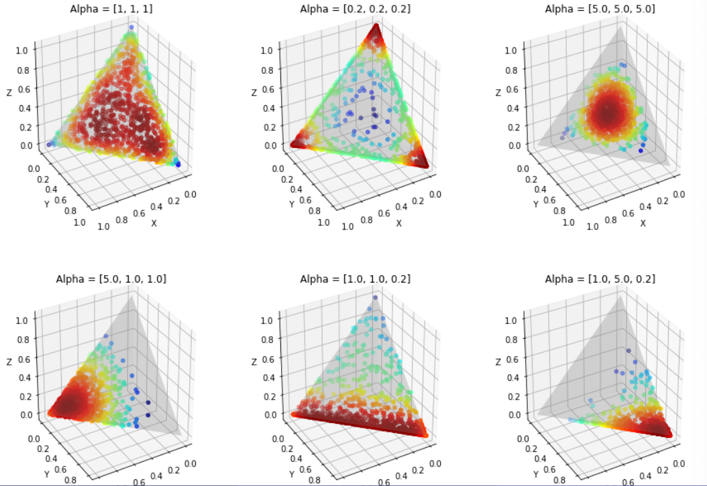

# Bayesian Models

binomial <- ?

multinomial <- Dirichlet

## Dirichlet as Prior

$$
p(\boldsymbol{\theta} ; \boldsymbol{\alpha})=\frac{1}{c(\boldsymbol{\alpha})} \prod_{j=1}^{k} \theta_{k}^{\alpha_{k}-1}
$$

where $c(\boldsymbol{\alpha} )$ is a normalizer and $\boldsymbol{\alpha} \in \mathbb{R} ^k$.

The support is a $(k-1)$-dimensional simplex (hyper-triangle)

$$
0<\theta_{1}, \ldots, \theta_{k}<1 \quad \theta_{1}+\ldots+\theta_{k}=1
$$

:::{figure} bay-dirichlet-vis

Dirichlet distributions with $k=3$
:::

img28

- same alpha => symmetric w.r.t. center of simplex

- large alpha => uniform
- small alpha => concentrate on all angles
- imbalance alpha => some particular edge / angles
