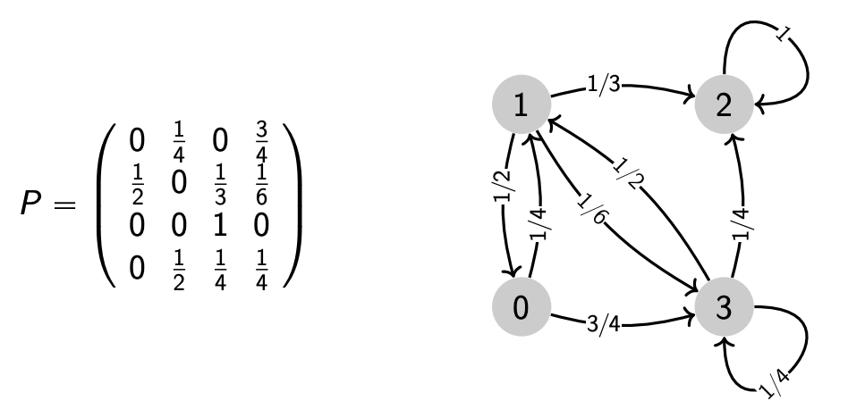

---
jupytext:
  cell_metadata_filter: -all
  formats: md:myst
  text_representation:
    extension: .md
    format_name: myst
    format_version: 0.12
    jupytext_version: 1.9.1
kernelspec:
  display_name: Python 3
  language: python
  name: python3
---


# Markov Chain

## Definitions

### Basics

A **stochastic process** $\boldsymbol{X} = \left\{ X_t: t\in T \right\}$ is a collection of random variables indexed by $t$. We call $X_t$ the **sate** of the process at time $t$. If $T$ is countable infinite, then we call $\boldsymbol{X}$ a **discrete** time process.

A discrete time process $\boldsymbol{X} = \left\{ X_0, X_1, \ldots \right\}$ is called a **Markov chain** if, for any positive integer $t$ and any states $i_0, \ldots, i_t, j$,

$$
\mathbb{P}\left(X_{t+1}=j \mid X_{t}=i, X_{t-1}=i_{t-1}, \ldots, X_{0}=i_{0}\right) =\mathbb{P}\left(X_{t+1}=j \mid X_{t}=i\right) \\
$$

Verbally, we say that, given the past history of the process up through time $t$, the distribution of the process at time $t+1$ depends only on the state at time $t$.

We say a Markov chain has a **discrete state space** if the set of values of the random variables is countably infinite $\left\{ v_0, v_1, \ldots \right\}$. For simplicity, we assume the discrete state space is given by the set of nonnegative integers $\left\{ 0,1,\ldots \right\}$. We say a Markov chain is **finite** if the set of values of the random variables if a finite set $\left\{ v_0, v_1, \ldots, v_{n-1} \right\}$. In the following discussion we assume the Markov chains are finite.

A Markov chain is homogeneous if $\mathbb{P}\left(X_{t+1}=j \mid X_{t}=i\right)=p_{i j}$ for all $t$. This indicates that this conditional distribution does not very with $t$. The values $p_{ij}$ are called **transition probabilities**, which can be stored in a transition matrix $\boldsymbol{P}$. We can find that $p_{ij}^{(t)} = [\boldsymbol{P}^t] _{ij}$ is the probability that, starting in state $i$, the Markov chain is found in state $j$ after $t$ transitions.

A Markov chain with state space $V$ and transition matrix $\boldsymbol{P}$ can be represented by a labeled directed graph, where edges are given by transitions with nonzero probability $E = \left\{ (u,v) \mid p_{u,v} >0 \right\}$. Note that self-loops are allowed for $p_{ii} > 0$.

:::{figure} mc-graph


Graphical representation of a Markov chain
:::

### Irreducibility

A state $j$ is **accessible** from state $i$ if there exists some $n \ge 0$ such that $p_{ij}^{(t)} > 0$. Two states $i$ and $j$ **communicate** if they are accessible from each other, written as $i \leftrightarrow j$. In the graph-representation of the chain, we have $i \leftrightarrow j$ if there are directed paths from $i$ to $j$ and from $j$ to $i$. Some states form a communication class if all states in that class communicate.

A Markov chain is **irreducible** if any state is accessible from any other in some finite number of transitions, i.e.

$$\forall i, j, \exists t: \quad p_{ij}^{(t)} > 0$$

Equivalently,
- all states belong to one communication class, or
- its graph representation is a strongly connected graph.

### Periodicity

The period $d(k)$ of a state $k$ of a homogeneous Markov chain is defined as

$$
d(k) = \mathrm{gcd} \left\{ t: p_{k} ^{t} >0 \right\}
$$

where $\mathrm{gcd}$ stands for greatest common divisor.

If $d(k)=1$, we say that state $k$ is aperiodic. A Markov chain is **aperiodic** if and only if all its states are aperiodic.

If a finite Markov chain is aperiodic, then there exists a positive integer $m$, such that for all states $i$, it is guaranteed to return to that state in a finite number of transitions, i.e.

$$\exists m, \forall i, t \ge m: \quad p_{ii}^{(t)} > 0$$

If a Markov chain is irreducible and aperiodic, then there exists an integer $m$, such that any state is accessible from any other after at least $m$ transitions, i.e.

$$
\exists m, \forall i, t \ge m: \quad \quad p_{ij}^{(t)} > 0
$$

***Proof***

$$
\underbrace{\mathbb{P} \left[X_{m}=j \mid X_{0}=i\right]}_{p_{i, j}^{(m)}} \geqslant \underbrace{\mathbb{P} \left[X_{m}=j \mid X_{m-n_{i, j}}=i\right]}_{\text{irreducible: } p_{i, j}^{(n_{i, j})}>0} \cdot \underbrace{\mathbb{P} \left[X_{m-n_{i, j}}=i \mid X_{0}=i\right]}_{\text{aperiodic: } p_{i, i}^{(m-n_{i, j})}>0} .
$$

$\square$


## Exercise

### Infect 1000

*There are 1,000 people in one room. One of them carries a disease which infects 100% if one shares hands with an infected person. In each minute all the people in the room are randomly paired to share hands with each other. What is your estimate of the expected number of people infected after 10 minutes? Can you use only pen and paper to solve this?*


#### Sol.1 Markov Chain

Let $I_t$ be the number of infected individuals after $t$ minutes. Define a transition matrix $\boldsymbol{P}=\left\{ p_{i,j} \right\}$, where

$$p_{i,j} = \mathrm{P}(I_{t+1}=j\vert I_t=i)$$

It's easy to see that

- $p_{1,2}=1$
- $p_{2,2}=\frac{1}{999}, p_{2,4}=\frac{998}{999}$

In general, we have, for $l=0,1,\ldots, \min(k, \frac{n}{2}-k)$,

$$p_{2k, 2(t+l)}= \frac{C_{2k}^{2l} C_{n-2k}^{2l} P_{2l}^{2l} R_{2k-2l} R_{n-2k-2l}}{R_{n}}$$

where
- $C_{2k}^{2l}$ is the number of ways to select $2l$ infected individuals from the total $2k$ infected individuals, to be paired with $2l$ healthy individuals
- $C_{n-2k}^{2l}$ is the number of ways to select $2l$ healthy individuals from the total $n-2k$ healthy individuals, to be paired with $2l$ infected individuals
- $P_{2l}^{2l}$ is the number of ways to pair $2l$ infected individuals and $2l$ healthy individuals, such that additional $2l$ individuals are infected
- $R_m$ is the number of ways to arrange a even number $m$ of individuals into $\frac{m}{2}$ pairs. It's easy to find

$$R_m=\frac{C_m^2C_{m-2}^2\ldots C_2^2 }{\frac{m}{2}!} = \frac{m!}{(2!)^{\frac{m}{2}}(\frac{m}{2}!)}$$

+++

- $R_{2k-2l}$ is the number of ways to arrange $2k-2l$ infected individuals into pairs, who do not share hands with healthy individuals
- $R_{n-2k-2l}$ is the number of ways to arrange $n-2k-2l$ healthy individuals into pairs, who do not share hands with infected individuals and keep being healthy
- $R_n$ is the total number of ways to arrange $n$ people into $n/2$ pairs in the room

Simplification gives

$$p_{2k, 2(k+l)} =\frac{C_{n/2}^{k+l}C_{k+l}^{2l}4^l}{C_n^{2k}}$$

Then the distribution of $I_{10}$ is

$$\boldsymbol{p}_{I_{10}}^\top=\boldsymbol{e}_1^\top \boldsymbol{P}^{10}$$

where $\boldsymbol{e}_1 = [1,0,\ldots,0]$ and $\boldsymbol{p}_{I_{10}} = [p_{1,1}^{(10)}, \ldots, p_{1,n}^{(10)}]$

The expected number is

$$\mathrm{E}(I_{10}) = [1,2,3,\ldots, n]^\top\boldsymbol{p}_{I_{10}} $$

A python script to implement the above steps:

```{code-cell}
import numpy as np
import scipy.sparse as sparse
from scipy.special import comb, perm, factorial

n = 1000
t = 10
ks = list(range(1, 500+1))
rows = [0, 1]
cols = [0, 2]
ps = [0, 1]
for k in ks:
    for l in range(0, int(min(k, n/2-k))+1):
        rows.append(2 * k)
        cols.append(2 * (k+l))
        ps.append(comb(n/2, k+l) * comb(k+l, 2*l) * 4**l / comb(n, 2*k))

P = sparse.coo_matrix((ps, (rows,cols)), shape=(n+1, n+1))
Pt = P**t
distribution = Pt[1, :]
Et = sum([i * distribution.toarray()[0, i] for i in range(1, n+1)])
print(Et)
```

+++

+++

#### Sol.2 Conditional Expectation

Let $p_{t,j}$ be the probability that infected individual $j$ is paired with a **healthy** individual from time $t$ to $t+1$, we have

$$p_{t,j} = \frac{n-I_t} {n - 1} =: p_t$$

Let $I_{t+1, j}$ be the number of individuals infected by infected individual $j$ from time $t$ to $t+1$, we have

$$
I_{t+1,j}=\begin{cases}
1 & p_{t}\\
0 & 1-p_{t}
\end{cases}
$$

Hence,

$$
\begin{align}
\mathrm{E}\left( I_{t+1, j} \right) &= p_{t} \times 1 + (1-p_{t}) \times 0  \\
& = p_{t} \\
\end{align}
$$

Therefore, the conditional expectation of the total number of infected individuals is given by

$$
\begin{align}
\mathrm{E}(I_{t+1}|I_t) & = \mathrm{E}\left( I_t +  \sum_{j=1}^{I_t} I_{t+1,j} \right)\\
&= I_t + \sum_{j=1}^{I_t} \mathrm{E}\left( I_{t+1, j} \right) \\
& = I_t + I_t \times p_t \\
& = I_t + I_t \times \frac{n-I_t}{n - 1} \\
\end{align}
$$

How to solve it?

By the law of total expectation,

$$
\begin{align}
\mathrm{E}(I_{t+1}) & = \mathrm{E}\left( \mathrm{E}(I_{t+1}|I_t) \right) \\
& = \mathrm{E}\left(I_t + I_t \times \frac{n-I_t}{n - 1} \right)\\
& = \frac{2n-1}{n-1}\mathrm{E}\left( I_t \right) - \frac{1}{n-1}\mathrm{E}\left( I_t^2 \right)
\end{align}
$$

+++

In particular, since $\mathrm{P}(I_1=2\vert I_0=1)=1$, there is no randomness in $I_1$, such that

$$
\begin{align}
\mathrm{E}(I_2) &= \mathrm{E}\left( \mathrm{E}(I_2\vert I_1) \right) \\
&= \mathrm{E}\left(I_1 + I_1 \times \frac{n-I_1}{n - 1}\right)\\
& = 2 + 2 \times 998 / 999 \\
& = 3994/999
\end{align}
$$

But when $t\ge 3$, the computation become complicated due to the second-order term $\mathrm{E}\left( I_t^2 \right)$

One attempt is to approximate $\mathrm{E}\left( I_t^2 \right)$ by $\left[ \mathrm{E}\left( I_t \right) \right]^2$ such that we have a **recurrence relation**

$$\mathrm{E}\left( I_{t+1} \right) \approx \frac{2n-1}{n-1}\mathrm{E}\left( I_t \right) - \frac{1}{n-1}\left[ \mathrm{E}\left( I_t \right) \right]^2$$

Note that this will lead to a larger result since $\mathrm{E}\left( I_t^2 \right) - \left[ \mathrm{E}\left( I_t \right) \right]^2 = \mathrm{Var}\left( I_t \right) \ge 0$. But since $\mathrm{Var}\left( I_t \right)$ is small, the positive error is also small.

+++

A python script of the iteration is

```{code-cell}
def f(n, t, I0=1):
    Is = [I0] # initial number of infected
    for _ in range(1, t+1):
        Is.append(Is[-1] + Is[-1] * (n - Is[-1]) / (n - 1))

    return Is[-1]

n = 1000
t = 10
print(f(n, t))
```

The result $642.975$ is slightly larger than the result $642.347$ in Solution 1.

If we take a closer look at the recurrence relation, dividing $2n-1$ on both sides gives

$$\frac{\mathrm{E}\left( I_{t+1} \right)}{2n-1} \approx \frac{2n-1}{n-1} \frac{\mathrm{E}\left( I_t \right)}{2n-1} - \frac{2n-1}{n-1}\left[ \frac{\mathrm{E}\left( I_t \right)}{2n-1} \right]^2$$

Let $x_t = \frac{\mathrm{E}\left( I_t \right)}{2n-1}$ then it becomes

$$x_{t+1} \approx 2x_t(1-x_t)$$

when $n$ is large.

Given $x_0$, if the equality holds, we can solve for $x_t$ by

$$x_{t} = \frac{1}{2}\left\{1-\exp \left[2^{t} \ln \left(1-2 x_{0}\right)\right]\right\}$$

For details, see [Logistic Map](https://mathworld.wolfram.com/LogisticMap.html).

+++

+++

#### Sol.3 Simulation

To verify the solutions above, we can simulate the infection process.

```{code-cell}
import numpy as np

class Population():
    def __init__(self, n):
        self.size = n
        self.infected = np.array([0]) # indexes of infected individuals

    def count_infected(self):
        return len(self.infected)

    def infect(self, t=1, return_records=False):
        """
        simulate infection for t minutes
        """
        It_records = []
        for _ in range(t):
            perm = np.random.permutation(self.size)
            perm_pairs = perm.reshape(n//2, 2) # random pairs
            status = np.isin(perm, self.infected, assume_unique=True)
            status_pairs = status.reshape(self.size//2, 2)
            new_pairs = np.logical_xor(status_pairs[:,0], status_pairs[:,1])
            new_boolean = ~status_pairs[new_pairs]
            new_individuals = perm_pairs[new_pairs][new_boolean].flatten()
            self.infected = np.hstack((self.infected, new_individuals))
            It_records.append(self.count_infected())

        if return_records:
            return np.array(It_records)


np.random.seed(0)
n = 1000
t = 10
pop = Population(n)
pop.infect(t)
print(pop.count_infected())
```

To get the expected number $E(I_{10})$, we can try to simulate $m$ times and take the average.

```{code-cell}
np.random.seed(0)
m = 10000
t = 10
Its = np.empty((m,t))
for i in range(m):
    pop = Population(n)
    Its[i] = pop.infect(t, return_records=True)
print(Its[:, 9].mean())
```

We see the simulation result $642.286$ is quite close to the result $E(I_{10}) = 642.347$ in Solution 1.

The plot below shows $m$ trajectories of $I_t$ in the simulation. We can see all lines are close to each other, which verifies that the variance is quite small.

```{code-cell}
import matplotlib.pyplot as plt
for row in range(m):
    plt.plot(Its[row], c='C0', alpha=0.1)
plt.ylabel(r'infected number $I_t$')    
plt.xlabel(r'time $t$')    
plt.show()
```
