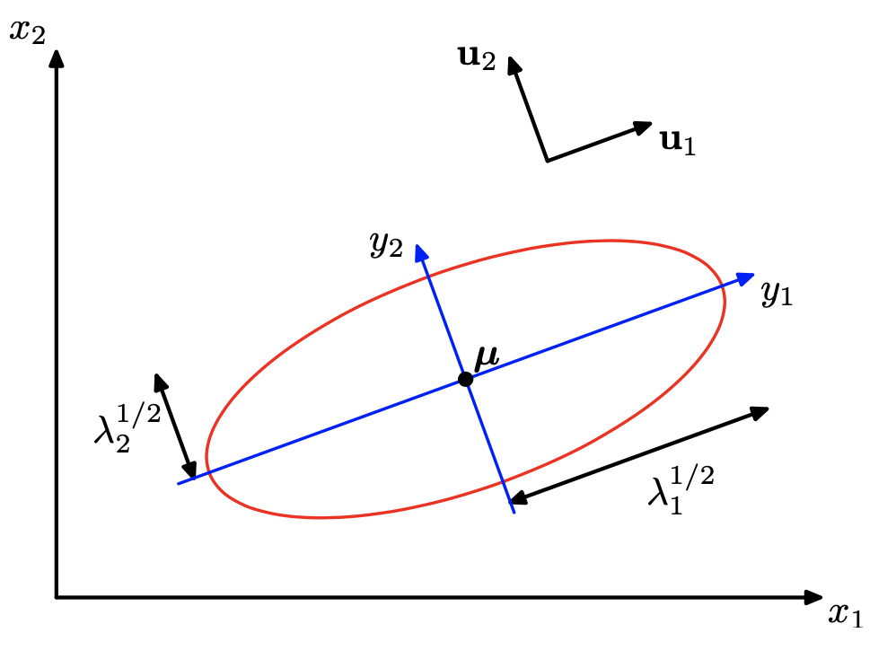

# Exponential Families

(multi-gaussian)=
## Multivariate Gaussian

### Definition

Definition (Multivariate normal)
: A $p$-variate random vector $\boldsymbol{x}$ is said to have a multivariate normal distribution (multinormal distribution) if **every** linear combination of its components has a univariate normal distribution. That is, $\boldsymbol{c} ^{\top} \boldsymbol{x} \sim \mathcal{N} (\boldsymbol{c} ^{\top} \boldsymbol{\mu} _x,  \boldsymbol{c} ^{\top}  \boldsymbol{\Sigma}_x \boldsymbol{c})$ for any $\boldsymbol{c} \in \mathbb{R} ^p$.

For a multivariate normal distribution $\boldsymbol{x} \sim \mathcal{N}(\boldsymbol{\mu} , \boldsymbol{\Sigma} )$, the probability density function is

$$
\begin{equation}
f(\boldsymbol{x} ;\boldsymbol{\mu}, \boldsymbol{\Sigma})=\frac{1}{(2 \pi)^{p / 2}|\boldsymbol{\Sigma}|^{1 / 2}} \exp \left(-\frac{1}{2}(\boldsymbol{x}-\boldsymbol{\mu})^{\top} \boldsymbol{\Sigma}^{-1}(\boldsymbol{x}-\boldsymbol{\mu})\right)
\end{equation}
$$

where
- $\boldsymbol{\mu}$ is the mean vector
- $\boldsymbol{\Sigma}$ is the covariance matrix, with $\sigma_{ij} = \operatorname{Cov}\left( x_i, x_j \right)$
- The fraction $\frac{1}{(2 \pi)^{p / 2}|\boldsymbol{\Sigma}|^{1 / 2}}$ is a normalizing constant.
- The determinant $\left\vert \boldsymbol{\Sigma}  \right\vert = \operatorname{det}(\boldsymbol{\Sigma})$ is called [generalized variance](covariance-matrix). It can be viewed as a higher dimension generalization of the scalar-valued $\sigma^2$ in univariate case that measures uncertainty of the distribution. Hence we have the square root $\left\vert \cdot \right\vert ^{1/2}$, as $\sigma$ in the univariate Gaussian density.

### Properties

- **Transformation**: If $\boldsymbol{x}$ is $p$-variate normal $\mathcal{N} (\boldsymbol{\mu} , \boldsymbol{\Sigma})$, and $\boldsymbol{y} = \boldsymbol{A} \boldsymbol{x} + \boldsymbol{c}$, where $\boldsymbol{A}$ is a $k \times p$ matrix and $\boldsymbol{c}$ is a $k$-vector of constants, then $\boldsymbol{y}$ is of $k$-variate normal, with mean $\boldsymbol{A} \boldsymbol{\mu} + \boldsymbol{c}$ and variance $\boldsymbol{A} \boldsymbol{\Sigma} \boldsymbol{A} ^{\top}$.
  - If $k=1$, then $\boldsymbol{y} = \boldsymbol{a} ^{\top} \boldsymbol{x} \sim \mathcal{N} ( \boldsymbol{a} ^{\top} \boldsymbol{\mu} , \boldsymbol{a} ^{\top} \boldsymbol{\Sigma} \boldsymbol{a})$
  - if $\boldsymbol{x}$ is standard normal $\mathcal{N}(\boldsymbol{0}, \boldsymbol{I})$, then $\boldsymbol{y} \sim \mathcal{N} (\boldsymbol{c} , \boldsymbol{A} \boldsymbol{A} ^{\top})$
- **MGF**: $M_{\boldsymbol{x}}(\boldsymbol{t})=\exp \left(\boldsymbol{t}^{\prime} \boldsymbol{\mu}+\frac{1}{2} \boldsymbol{t}^{\prime} \boldsymbol{\Sigma} \boldsymbol{t}\right)$.
- **Sum**: if $\boldsymbol{x} \sim \mathcal{N} _p (\boldsymbol{\mu} _1, \boldsymbol{\Sigma} _1)$ and $\boldsymbol{y} \sim \mathcal{N} _p (\boldsymbol{\mu} _2, \boldsymbol{\Sigma} _2)$ are independent, then $\boldsymbol{x} + \boldsymbol{y}  \sim \mathcal{N} _p (\boldsymbol{\mu} _1 + \boldsymbol{\mu} _2, \boldsymbol{\Sigma} _1 + \boldsymbol{\Sigma} _2)$.
- What is the condition for a valid covariance matrix $\boldsymbol{\Sigma}$? Given a positive definite matrix $\boldsymbol{\Sigma}$, then $\boldsymbol{x} \sim \mathcal{N} _p (\boldsymbol{\mu} , \boldsymbol{\Sigma})$ iff there exists a non-singular matrix $\boldsymbol{B}$ and $\boldsymbol{z} \sim \mathcal{N} _p (\boldsymbol{0} , \boldsymbol{I})$ such that $\boldsymbol{x} = \boldsymbol{\mu} + \boldsymbol{B} \boldsymbol{z}$. In this case $\boldsymbol{\Sigma} = \boldsymbol{B} \boldsymbol{B} ^{\top}$.
- **Sub-vectors**: if $\boldsymbol{x} \in \mathcal{N} _{p + q} (\boldsymbol{\mu} , \boldsymbol{\Sigma})$, let $\boldsymbol{x}_1$ be its first $p$ components and $\boldsymbol{x} _2$ be the rest $q$ components, then
  - still normal: $\boldsymbol{x}_{1} \sim \mathcal{N}_{p}\left(\boldsymbol{\mu}_{1}, \boldsymbol{\Sigma}_{11}\right),  \boldsymbol{x}_{2} \sim \mathcal{N}_{q}\left(\boldsymbol{\mu}_{2}, \boldsymbol{\Sigma} _{22}\right)$
  - $\boldsymbol{x} _1$ and $\boldsymbol{x} _2$ are independent iff $\operatorname{Cov}\left( \boldsymbol{x} _1, \boldsymbol{x} _2 \right) = \boldsymbol{\Sigma} _{12} = \boldsymbol{0}_{p \times q}$ (hint for $\Leftarrow$: use definition $f_{12} = f_1 f_2$)
  - $(\boldsymbol{x} _1 - \boldsymbol{\Sigma} _{12} \boldsymbol{\Sigma} _{22} ^{-1} \boldsymbol{x} _2)$ is independent of $\boldsymbol{x} _2$ and is distributed as $\mathcal{N} _p (\boldsymbol{\mu} _1 -  \boldsymbol{\Sigma} _{12} \boldsymbol{\Sigma} _{22} ^{-1} \boldsymbol{\mu} _2, \boldsymbol{\Sigma} _{11}-  \boldsymbol{\Sigma} _{12} \boldsymbol{\Sigma} _{22} ^{-1} \boldsymbol{\Sigma} _{21})$.
  - conditional distribution is normal:

    $$
    \boldsymbol{x}_{1} \mid \boldsymbol{x}_{2} \sim  N_{p}\left(\boldsymbol{\mu}_{1}+\boldsymbol{\Sigma}_{12} \boldsymbol{\Sigma}_{22}^{-1}\left(\boldsymbol{x}_{2}-\boldsymbol{\mu}_{2}\right), \boldsymbol{\Sigma}_{11}-\boldsymbol{\Sigma}_{12} \boldsymbol{\Sigma}_{22}^{-1} \boldsymbol{\Sigma}_{21}\right)
    $$

    note the variance does not change with $\boldsymbol{x} _2$. In particular, for $p=q=1$,

    $$
    \begin{aligned}
    X_{1} \mid X_{2}=x_{2} \sim & N\left(\mu_{1}+\frac{\sigma_{12}}{\sigma_{22}}\left(x_{2}-\mu_{2}\right), \sigma_{11}-\frac{\sigma_{12}^{2}}{\sigma_{22}}\right) \\
    &=N\left(\mu_{1}+\rho \frac{\sigma_{1}}{\sigma_{2}}\left(x_{2}-\mu_{2}\right), \sigma_{1}^{2}\left(1-\rho^{2}\right)\right)
    \end{aligned}
    $$

    :::{figure,myclass} gaussian-marginal-conditional
    

    Marginal Gaussian and conditional Gaussian are also Gaussians [Shi 2021]
    :::
- **Quadratic form**: if $\boldsymbol{x} \sim \mathcal{N} _p (\boldsymbol{\mu} , \boldsymbol{\Sigma})$ and $\boldsymbol{\Sigma}$ is p.d., then $(\boldsymbol{x} - \boldsymbol{\mu} ) ^{\top} \boldsymbol{\Sigma} ^{-1} (\boldsymbol{x} - \boldsymbol{\mu} ) \sim \chi ^2 _p$.
- Independency after transformation: for any $m\times p$ matrix $\boldsymbol{A}$ and $n\times p$ matrix $\boldsymbol{B}$,
  - $\boldsymbol{A} \boldsymbol{x}  \perp \boldsymbol{B} \boldsymbol{x} \Leftrightarrow \boldsymbol{A} \boldsymbol{\Sigma} \boldsymbol{B} ^{\top} = \boldsymbol{0}$
  - when $\boldsymbol{A}$ is symmetric, $\boldsymbol{x} ^{\top}\boldsymbol{A} \boldsymbol{x}  \perp \boldsymbol{B} \boldsymbol{x} \Leftrightarrow \boldsymbol{B} \boldsymbol{\Sigma} \boldsymbol{A} = \boldsymbol{0}$
  - when both $\boldsymbol{A}, \boldsymbol{B}$ are symmetric, $\boldsymbol{x} ^{\top}\boldsymbol{A} \boldsymbol{x}  \perp \boldsymbol{x} ^{\top} \boldsymbol{B} \boldsymbol{x} \Leftrightarrow \boldsymbol{A} \boldsymbol{\Sigma} \boldsymbol{B} = \boldsymbol{0}$
- Since EVD $\boldsymbol{\Sigma} = \boldsymbol{U} \boldsymbol{\Lambda} \boldsymbol{U} ^\top$, then $\left\vert \boldsymbol{\Sigma}  \right\vert = \left\vert \boldsymbol{U} \boldsymbol{\Lambda} \boldsymbol{U} ^\top  \right\vert = \left\vert \boldsymbol{\Lambda}  \right\vert$
- For every multivariate Gaussian $\boldsymbol{x} \sim N(\boldsymbol{\mu} , \boldsymbol{\Sigma} )$ with $\Sigma
  = \boldsymbol{U} \boldsymbol{\Lambda} \boldsymbol{U} ^\top$, there exists a transformation $\boldsymbol{x} ^\prime = \boldsymbol{U} ^\top \boldsymbol{x}, \boldsymbol{\mu} ^\prime= \boldsymbol{U} ^\top \boldsymbol{\mu}$ such that

  $$
  f(\boldsymbol{x} ; \boldsymbol{\mu}, \boldsymbol{\Sigma} ) = f(\boldsymbol{x} ^\prime; \boldsymbol{\mu} ^\prime, \boldsymbol{\Lambda})
  $$

  where

  $$\begin{align}
  f(\boldsymbol{x} ^\prime; \boldsymbol{\mu} ^\prime, \boldsymbol{\Lambda})
  &= \frac{1}{(2 \pi)^{p / 2}|\boldsymbol{\Lambda}|^{1 / 2}} \exp \left(-\frac{1}{2}(\boldsymbol{x}^\prime-\boldsymbol{\mu} ^\prime)^{\top} \boldsymbol{\Lambda} ^{-1}(
    \boldsymbol{x} ^\prime -\boldsymbol{\mu} ^\prime)\right) \\
  &=  \frac{1}{(2 \pi)^{p / 2}\Pi_{i=1}^p \lambda_i} \exp \left(-\sum_{i=1}^p\frac{1}{2\sigma^2}(x_i^\prime-\mu_i ^\prime)^2\right) \\
  &= \prod_{i=1}^{p} \frac{1}{(2 \pi)^{1 / 2} \lambda_{i}} \exp \left(-\frac{1}{2 \lambda_{i}^{2}}\left(x_{i}^{\prime}-\mu_{i}^{\prime}\right)^{2}\right)
  \end{align}$$

  which is a product of PDFs of univariate Gaussians, since $\boldsymbol{\Lambda}$ is diagonal. Geometrically, $U$ rotate the axes of the distribution but keep the function value intact.

### Visualization

All $\boldsymbol{x}$ satisfy the equality below is a contour. This contour is an ellipsoid.

$$
c = f(\boldsymbol{x} ;\boldsymbol{\mu}, \boldsymbol{\Sigma})
$$

- $\boldsymbol{\mu}$ determines the center of the ellipsoid.
- $\boldsymbol{U}$ determines the rotation angle of the ellipsoid. The vectors $\boldsymbol{u} _i$ are the directions of the axes of the ellipsoid.
- $\boldsymbol{\Lambda}$ determines the lengths of the axes. The length should be proportional to $\sqrt{\lambda_i}$. If all eigenvalues are the same, the ellipsoid reduces to a ball.
- As shown above, the transformation $\boldsymbol{x} ^\prime = \boldsymbol{U} ^\top \boldsymbol{x}, \boldsymbol{\mu} ^\prime = \boldsymbol{U} ^\top \boldsymbol{\mu}, \boldsymbol{\Sigma} ^\prime = \boldsymbol{\Lambda}$ will transform the distribution will change the center, align the ellipsoid axes to the coordinate axes (so the variables becomes independent and the joint PDF factorizes to univariate PDF), while keep the axes lengths intact (rotation preserve lengths and angles).

In the 2-d case, an ellipsoid reduces to an ellipse.

:::{figure,myclass} gaussian-contour-2d

Gaussian ellipse in 2-d plane [Shi 2020]
:::

### Estimation and Inference

#### MLE

:::{admonition,dropdown,seealso} *Proof*

$$

\begin{aligned}
L(\boldsymbol{\mu}, \boldsymbol{\Sigma}) &=f\left(\boldsymbol{x}_{1}, \boldsymbol{x}_{2}, \ldots, \boldsymbol{x}_{n}\right) \\
&=f\left(\boldsymbol{x}_{1}\right) f\left(\boldsymbol{x}_{2}\right) \cdots f\left(\boldsymbol{x}_{n}\right) \quad \boldsymbol{x}_{1}, \boldsymbol{x}_{2}, \ldots, \boldsymbol{x}_{n} \text { are independent } \\
&=\prod_{i=1}^{n} f\left(\boldsymbol{x}_{i}\right) \\
&=\prod_{i=1}^{n} \frac{1}{(2 \pi)^{\frac{p}{2}}|\boldsymbol{\Sigma}|^{\frac{1}{2}}} \exp \left\{-\frac{1}{2}\left(\boldsymbol{x}_{i}-\boldsymbol{\mu}\right)^{\prime} \boldsymbol{\Sigma}^{-1}\left(\boldsymbol{x}_{i}-\boldsymbol{\mu}\right)\right\} \\
&=\frac{1}{(2 \pi)^{\frac{n p}{2}}|\boldsymbol{\Sigma}|^{\frac{n}{2}}} \exp \left\{-\frac{1}{2} \sum_{i=1}^{n}\left(\boldsymbol{x}_{i}-\boldsymbol{\mu}\right)^{\prime} \boldsymbol{\Sigma}^{-1}\left(\boldsymbol{x}_{i}-\boldsymbol{\mu}\right)\right\}
\end{aligned}

$$

$$
\begin{aligned}
\ell(\boldsymbol{\mu}, \boldsymbol{\Sigma}) &=\log L(\boldsymbol{\mu}, \boldsymbol{\Sigma}) \\
&=-\frac{n p}{2} \log (2 \pi)-\frac{n}{2} \log |\boldsymbol{\Sigma}|-\frac{1}{2} \sum_{i=1}^{n}\left(\boldsymbol{x}_{i}-\boldsymbol{\mu}\right)^{\prime} \boldsymbol{\Sigma}^{-1}\left(\boldsymbol{x}_{i}-\boldsymbol{\mu}\right) \\
&=-\frac{n p}{2} \log (2 \pi)-\frac{n}{2} \log |\boldsymbol{\Sigma}|-\frac{1}{2} \sum_{i=1}^{n} \operatorname{tr}\left[\left(\boldsymbol{x}_{i}-\boldsymbol{\mu}\right)^{\prime} \boldsymbol{\Sigma}^{-1}\left(\boldsymbol{x}_{i}-\boldsymbol{\mu}\right)\right] \\
&=-\frac{n p}{2} \log (2 \pi)-\frac{n}{2} \log |\boldsymbol{\Sigma}|-\frac{1}{2} \operatorname{tr}\left[\boldsymbol{\Sigma}^{-1} \sum_{i=1}^{n}\left(\boldsymbol{x}_{i}-\boldsymbol{\mu}\right)\left(\boldsymbol{x}_{i}-\boldsymbol{\mu}\right)^{\prime}\right]
\end{aligned}
$$
:::

### Pros and Cons

Pros
- Related to CLM
- Evaluation is convenient
- Can be convert to product of univariate Gaussians in some rotated space
- Mixtures of Gaussian are sufficient to approximate a wide range of distributions
- Arbitrary linear combinations of jointly Gaussian variables are also Gaussian
- Marginals and conditionals of multivariate Gaussians are also Gaussian
- Sums of many i.i.d. random variables converge to Gaussian variables (Central Limit Theorem)
- Log of Gaussian looks like a weighted Euclidean distance, related to squared loss

    $$
    -\ln \sqrt{(2 \pi \sigma)}-\frac{(x-\mu)^{2}}{\left(2 \sigma^{2}\right)}
    $$

Cons
- $\boldsymbol{\Sigma}$ is hard and expensive to estimate in high dimensions
  - sol: assume special structure: diagonal, spherical

  ## Univariate Gaussian

  Test normality:

  - QQ-plots (quantile-quantile plot)
  - Kolmogorov–Smirnov test
  - Jarque–Bera test
  - Shapiro–Wilk test

  ### Transformation

  Power transform

  Box-Cox transformation

  <!-- ## Weibull Distribution -->
