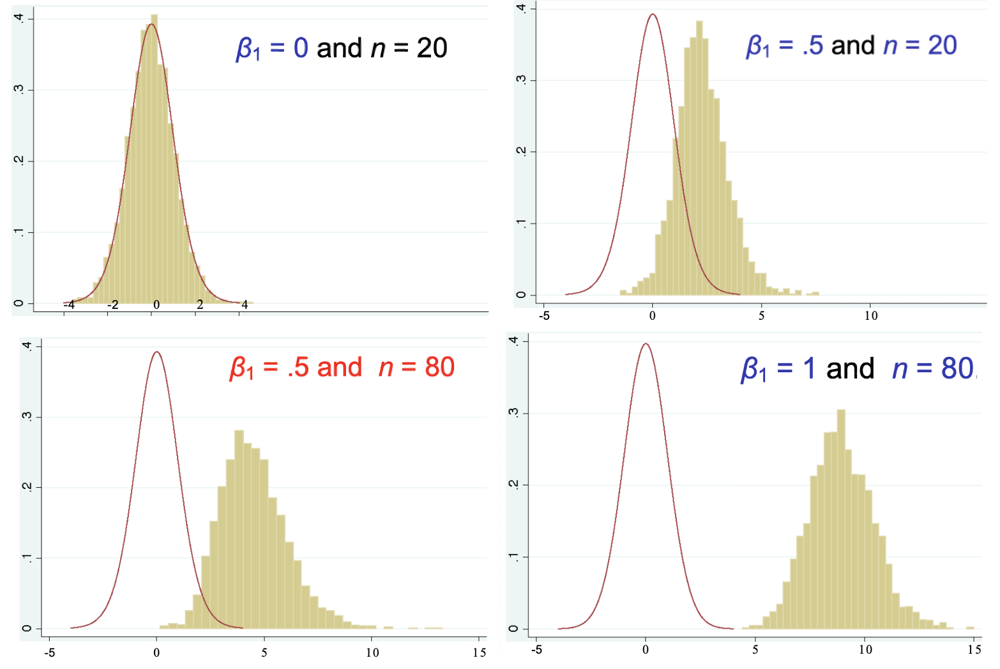
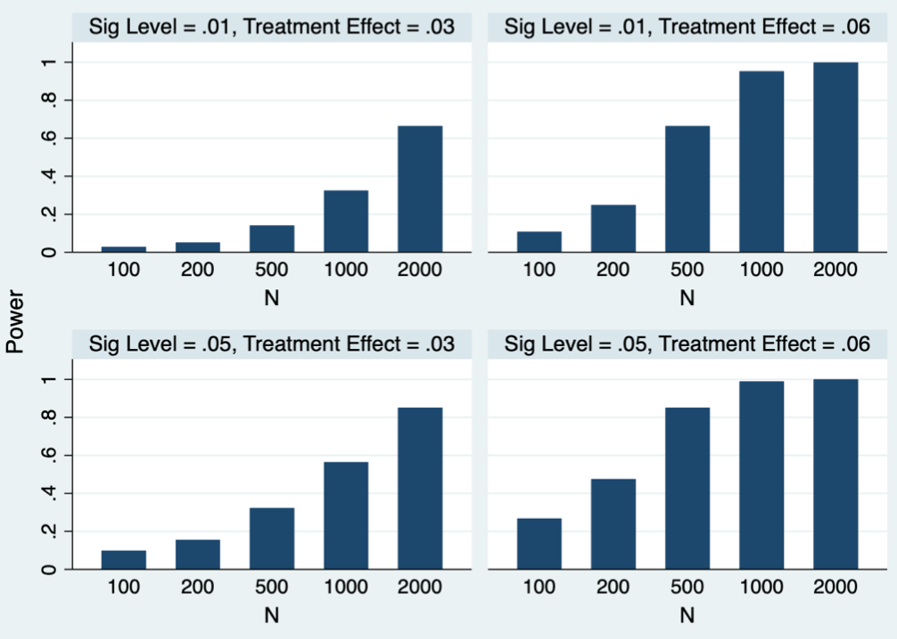
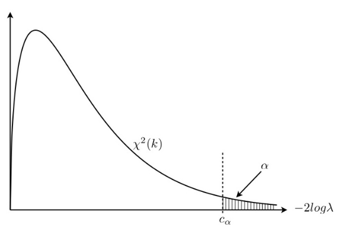

# Hypothesis Testing

When we investigate a question of interest, we first formulate a null hypothesis and an alternative hypothesis, denoted as $H_0$ and $H_1$ respectively. For instance,

$$H_0: \theta = \theta_0\quad \text{vs} \quad H_1: \theta > \theta_0$$

To conduct a hypothesis test, there are three components

1. Null and alternative hypothesis $H_0,H_1$
2. Test statistic $T$
3. Rejection rule, e.g. $T>c$

Give the null hypothesis $H_0$, we collect data and compute some test statistic $T$, and use its value in some rejection rule $(T>c)$ to see whether we reject the null hypothesis or not.

There are many other components that analysis the goodness of a test,

- $p$-value
- significance level
- Type I error, Type II error
- Power of a test

We will introduce them one by one.

:::{admonition,note} Fail to reject $H_0$

Remember that failing to reject a null hypothesis does not necessarily mean that the null hypothesis is true. So we don’t say “accept the null”, instead we say "fail to reject the null" or "$H_0$ is not rejected".

:::

## Basic Concepts

### $p$-value

After we collected data and find the estimate, we want to know whether the estimate prefer $H_0$ or $H_1$. The $p$-value describe that how likely it is to observe more extreme cases than your current estimate, under the null hypothesis.

$$p\text{-value}=\operatorname{\mathbb{P}}(\text{more extreme cases of your estimate}\,\vert\, H_0)$$

If the $p$-value is small, then it means your current estimate and the more extreme cases are unlikely to be observed under the null. But you do observed it, which implies the null may not hold. Hence, when $p$-value is too small, we reject $H_0$. That is, comparing $p$-value and some threshold can be one of the rejection rules.

The threshold is called significance level, which is the type I error we want to control, and set before the test.

### Type I error and Type II error

#### Definitions

**Type I error**, aka **size** of a test, denoted $\alpha$, is defined as

$$\alpha = \operatorname{\mathbb{P}}\left( H_0 \text{ is rejected} \,\vert\, H_0 \text{ is true}\right) $$

**Type II error**, $\beta$, is defined as

$$\beta = \operatorname{\mathbb{P}}\left( H_0 \text{ is not rejected} \,\vert\, H_0 \text{ is false}\right) $$

**Power** of a test is defined as

$$\begin{aligned}
\text{power}
&= \operatorname{\mathbb{P}}\left( H_0 \text{ is rejected} \,\vert\, H_0 \text{ is false}\right)\\
&= 1 - \beta\\
\end{aligned}$$

$\beta$ and power depends on the distribution of the parameter and the rejection rule (e.g., $\left\vert T \right\vert) > t_{df}^{(1-\alpha/2)}$). If $H_0$ is false, the distribution of the test statistic depends on the true parameter value, so do $\beta$ and power. Since the true parameter value is unknown, there is no easy formula for $\beta$ and power.

#### Error Control

Both type I error and type II error are important. We want small $\alpha$ and small $\beta$ (large power). Though $\alpha$ can be pre-set, $\beta$ is hard to control. Recall the power is

$$\begin{aligned}
\text{power}
&= \operatorname{\mathbb{P}}\left(H_{0} \text { is rejected } \mid H_{1} \text { is true }\right) \\
&= \operatorname{\mathbb{P}}\left( T > c\mid H_{1} \text { is true }\right) \\
\end{aligned}$$

Usually the constant $c$ in the rejection rule $T>c$ involves $\alpha$. The distribution of $T$ under $H_1$ depends on the true parameter in $H_1$, and probably sample size $n$. To see their effect, we look at the following examples of $t$-test in simple linear regression.

Example (Linear regression $t$-test with different $H_1$)
: In linear regression, $t$-test can be used to test parameter value. Suppose $H_0: \ \beta_1=0$, we see how the true distribution of the test statistic varies with varying true value of $\beta_1$ and sample size $n$.

  The null distribution $t_{n-2}$ (red curve) does not change with true $\beta_1$, which is unknown. Suppose the type I error is fixed at $\alpha$. Recall that the rejection rule is $\left\vert T \right\vert > t_{n-2}^{{1-\alpha/2}}$, which is roughly $2$. The power is then

  $$\begin{aligned}
  \text{power}
  &= \operatorname{\mathbb{P}}\left(H_{0} \text { is rejected } \mid H_{1} \text { is true }\right) \\
  &= \operatorname{\mathbb{P}}\left( \left\vert T \right\vert > t_{n-2}^{{1-\alpha/2}}\mid H_{1} \text { is true }\right) \\
  &= \text{yellow area to the right of } 2 \text{ and to the left of } -2
  \end{aligned}$$

  The power increases with larger sample size and farther true $\beta_1$ from null $0$.

  :::{figure} test-power-phase1
  

  Comparison of null and true distribution in $t$-test [Meyer 2021]
  :::

Example (Linear regression $t$-test with different $\alpha$)
: From the above example we can see power also depends on $\alpha$. We change $\alpha$ and see its effect on power.

  The observation is, **larger $\alpha$ leads to larger power (smaller $\beta$)**. So there is a tradeoff between type I error and type two error.

  :::{figure} test-power-phase2
  

  How power changes with $\alpha,n$ and $H_1$ in $t$-test [Meyer 2021]
  :::

In practice, to control both types of errors, usually we **fixed** on type I error $\alpha$ (the value is called significance level), and try to minimize type II error $\beta$ by some methods, such as increasing the sample size $n$.

### Sample Size

How to choose a sample size? This depends on how we want to control our errors.

As discussed above, we first fixed $\alpha$, and then control $\beta$. Take $t$-test in simple linear regression as an example. The power $(1-\beta)$ is

$$\begin{aligned}
\text{power}
&= \operatorname{\mathbb{P}}\left(H_{0} \text { is rejected } \mid H_{1} \text { is true }\right) \\
&= \operatorname{\mathbb{P}}\left( \left\vert T \right\vert > t_{n-2}^{{1-\alpha/2}}\mid H_{1} \text { is true }\right) \\
&\ge \text{threshold} \\
\end{aligned}$$

So we can see it depends on $\alpha, n$, and distribution of $T$ under $H_1$, which involves the true parameter $\beta_1$ and variance of observations $\sigma^2$.

To choose a sample size to ensure power is larger than some threshold, we need to

1. fixed type I error $\alpha$

1. assume true $\beta_1$ and $\sigma^2$

1. find the distribution of the test statistic $T$ under the above settings

1. solve the inequality for $n$

### Confidence Interval

A $(1-\alpha)$-confidence interval is an interval such that when you repeat the experiments many times, there is $(1-\alpha)$ of the times that the estimate falls into the interval.

A $(1-\alpha)$-confidence interval can be constructed with an estimate and its standard error.

$$\hat \theta \pm c_\alpha \cdot \mathrm{se}(\hat \theta)$$

where $c_\alpha$ is a coefficient that depends on $\alpha$ such that the interval cover $(1-\alpha)$ of the cases.

:::{admonition,note,dropdown} Duality of Hypothesis Testing and Confidence Interval

Consider an example of testing $H_0: \mu = \mu_0$ against $H_1: \mu \ne \mu_0$. Suppose a random sample $X_1, X_2, \ldots, X_n$ drawn from a normal distribution with unknown mean $\mu$ and known variance $\sigma^2$. Intuitively, if $\left\vert \bar{X} - \mu_0 \right\vert$ is sufficiently large, say larger than $x_0$, then $H_0$ is favorable to be rejected based on the observed random sample. By picking $x_0 = z_{\alpha/2} \frac{\sigma}{\sqrt{n}}$, we assure that the probability of Type I error is $\alpha$. Then, $H_0$ **cannot** be rejected for $X = \left\{ X_1, X_2, \ldots, X_n \right\}$ over the set

$$
A=\left\{X:\left|\bar{X}-\mu_{0}\right| \leq z_{\alpha / 2} \frac{\sigma}{\sqrt{n}}\right\}
$$

Alternatively, this set can be rewritten as

$$
A=\left\{X: \bar{X}-z_{\alpha / 2} \frac{\sigma}{\sqrt{n}} \leq \mu_{0} \leq \bar{X}+z_{\alpha / 2} \frac{\sigma}{\sqrt{n}}\right\}
$$

On the other hand, consider $(1 − \alpha)100\%$ confidence interval for $\mu$.

$$
C=\left\{\mu: \bar{X}-z_{\alpha / 2} \frac{\sigma}{\sqrt{n}} \leq \mu \leq \bar{X}+z_{\alpha / 2} \frac{\sigma}{\sqrt{n}}\right\}
$$

Clearly, it can be checked that $X \in A$ **if and only if** $\mu_0 \in C$. In other words, the data $X$ falls within the non-rejection region $A$ under $H_0$ if and only if $\mu_0$ belongs to the confidence interval $C$ obtained from the data $X$. This relationship can be used to construct the confidence intervals from the tests of hypothesis and the tests of hypothesis from the confidence intervals.

:::

In multivariate setting, the extension of confidence interval is confidence region. A $100(1-\alpha) \%$ confidence region $R(\boldsymbol{X})$ for parameter $\boldsymbol{\theta}$ based on a $p$-variate random sample $\boldsymbol{X} = \left\{ \boldsymbol{x} _1, \ldots, \boldsymbol{x} _n \right\}$ is defined as

$$
P(\boldsymbol{\theta} \in R(\boldsymbol{X}))=1-\alpha
$$

in the sense that among all possible sample data $\boldsymbol{X}$, the parameter vector $\boldsymbol{\theta}$ is in the the region $R(\boldsymbol{X} )$ for $100(1-\alpha) \%$ of the time.

The shape of the confidence region in $\mathbb{R} ^p$ can be ellipsoid, or hyper-rectangular, etc.

### Credible Interval

In Bayesian statistics, a credible interval is constructed from the posterior distribution of the parameter of interest. The are various methods to choose which $(1-\alpha)$ interval to be the credible interval, e.g. equal tail $\alpha/2$, horizontal cutoff of the PDF, etc.

### Bonferroni Correction

When there are $p$ confidence intervals $C_k$ for parameter $\mu_k$, each of confidence level $\left(1-\alpha_{k}\right) 100 \%$, we like to consider them simultaneously: what's the probability that $C_k$ cover $\mu_k$ for all $k=1, 2, \ldots, p$?

$$
\begin{aligned}
\mathbb{P} \left(C_{k}=\text { true }, k=1, \cdots, p\right) &=1-\mathbb{P}\left(C_{k}=\text { false, for some } k\right) \\
& \geq 1-\sum_{k=1}^{p} \mathbb{P}\left(C_{k}=\text { false }\right) \\
& =1-\sum_{k=1}^{p}\left(1-\mathbb{P}\left(C_{k}=\text { true }\right)\right) \\
&=1-\sum_{k=1}^{p} \alpha_{k} \\
\end{aligned}
$$

Suppose we want them hold simultaneously w.p. at least $1-\alpha$, then a convenient choice is to pick $\alpha_k = \frac{\alpha}{p}$ for all $k = 1, 2, \ldots, p$.

## Likelihood Ratio Test

The target statistic is

$$
\lambda\left(\boldsymbol{x}_{1}, \ldots, \boldsymbol{x}_{n}\right)=\frac{\max _{\boldsymbol{\theta} \in \boldsymbol{\omega}} L\left(\boldsymbol{\theta} ; \boldsymbol{x}_{1}, \ldots, \boldsymbol{x}_{n}\right)}{\max _{\boldsymbol{\theta} \in \boldsymbol{\Omega}} L\left(\boldsymbol{\theta} ; \boldsymbol{x}_{1}, \ldots, \boldsymbol{x}_{n}\right)}
$$

which is the ratio of two maximum likelihoods, one under the restriction imposed by $H_0$ and under the restriction imposed by ($H_0$ or $H_1$), where $\boldsymbol{\omega}$ and $\boldsymbol{\Omega}$ are the parameter sets under the restrictions imposed by $H_0$ and $H_0 \cup H_1$ respectively. Thus, this ratio has a value in the interval $(0, 1]$, and large values of the ratio are more favorable to $H_0$. Thus, we reject $H_0$ at significance level $\alpha$ if $\lambda\left(\boldsymbol{x}_{1}, \ldots, \boldsymbol{x}_{n}\right)< c_\alpha$ where $c _\alpha$, known as the **critical value**, is to be determined so that

$$
P\left(\text { reject } H_{0} \mid H_{0}\right)=\max _{\boldsymbol{\theta} \in \boldsymbol{\omega}} P\left(\lambda\left(\boldsymbol{x}_{1}, \ldots, \boldsymbol{x}_{n}\right)<c_{\alpha} \mid \boldsymbol{\theta}\right)=\alpha
$$

Or equivalently, if the p-value for an observed value, $\lambda_0$, of likelihood ratio is less than $\alpha$, i.e.

$$
p \text { -value }\left(\lambda_{0}\right)=P\left(\lambda\left(\boldsymbol{x}_{1}, \ldots, \boldsymbol{x}_{n}\right)<\lambda_{0} \mid H_{0}\right)<\alpha
$$

In practice, the sampling distribution of likelihood ratio λ is difficult to be determined, so we usually **express** λ in terms of an intermediate statistic which is related to a well-known distribution or which can facilitate easier computation of $p$-value (or critical value), so that the LRT will be more conveniently performed based on that statistic.

When the sample size tends to infinity, the statistic, $−2log\lambda$, is distributed asymptotically as $\chi ^2 _k$ where the degree of freedom $k$ equals the number of free parameters under $H_0 \cup H_1$ minus that under $H_0$, or $k = \operatorname{dim}(\boldsymbol{\Omega} )  − \operatorname{dim}(\boldsymbol{\omega} )$. In other words, $k$ is the difference between the number of free parameters under unrestricted model and that under restricted model.

:::{figure} test-chi

Distribution of test statistic $-2\log \lambda$
:::

The “negative twice log likelihood ratio” was first called “$G^2$-statistic” by Sir R.A. Fisher and later re-named by McCullagh and Nelder as the **deviance** between the two models respectively under $H_0$ and $H_1$ in their theory of Generalized Linear Model.

(UIT)=
## Union Intersection Test (UIT)

Union intersection tests are used in multivariate setting. It express the multivariate null hypothesis as an intersection of the family of univariate null hypotheses in terms of all possible linear combinations of the $p$ variables. The multivariate null hypothesis is not rejected if and only if all the univariate null hypotheses are not rejected.

For instance, consider $H_0: \boldsymbol{\mu} = \boldsymbol{\mu} _0$ versus $H_1: \boldsymbol{\mu} \ne \boldsymbol{\mu} _0$. Let $\bar{\boldsymbol{x}}, \boldsymbol{S}$ be the mean vector and covariance matrix of a random sample of $n$ observations from $\mathcal{N} _p(\boldsymbol{\mu} ,\boldsymbol{\Sigma})$. Then observe that

$$
\begin{array}{l}
H_{0}: \boldsymbol{\mu}=\boldsymbol{\mu}_{0} \Leftrightarrow \bigcap_{\boldsymbol{a}}\left\{H_{0}(\boldsymbol{a}): \boldsymbol{a}^{\prime} \boldsymbol{\mu}=\boldsymbol{a}^{\prime} \boldsymbol{\mu}_{0}\right\} \\
H_{1}: \boldsymbol{\mu} \neq \boldsymbol{\mu}_{0} \Leftrightarrow \bigcup_{\boldsymbol{a}}\left\{H_{1}(\boldsymbol{a}): \boldsymbol{a}^{\prime} \boldsymbol{\mu} \neq \boldsymbol{a}^{\prime} \boldsymbol{\mu}_{0}\right\} .
\end{array}
$$

Consequently,

$$\begin{aligned}
\text{not reject }  H_{0} &\Leftrightarrow \text{ not reject } H_{0}(\boldsymbol{a}) \text{ for all }  \boldsymbol{a} \\ \text{ reject }  H_{0} &\Leftrightarrow \text{ reject }  H_{0}(\boldsymbol{a}) \text{ at least one }  \boldsymbol{a}
\end{aligned}$$

We recall that for any $\boldsymbol{a}$, the univariate null $H_0(\boldsymbol{a})$ will not be rejected for small values of

$$
t^{2}(\boldsymbol{a})=n\left(\boldsymbol{a}^{\prime} \overline{\boldsymbol{x}}-\boldsymbol{a}^{\prime} \boldsymbol{\mu}_{0}\right)^{2} / \boldsymbol{a}^{\prime} \boldsymbol{S} \boldsymbol{a}
$$

Note that $t^{2}(\boldsymbol{a})$ can be regarded as the squared $t$-statistic. Then, according to the above UIT argument, we do not reject $H_0$ when the following value is small

$$
\max _{a} t^{2}(\boldsymbol{a})=\max _{\boldsymbol{a}} \frac{n\left(\boldsymbol{a}^{\prime} \overline{\boldsymbol{x}}-\boldsymbol{a}^{\prime} \boldsymbol{\mu}_{0}\right)^{2}}{\boldsymbol{a}^{\prime} \boldsymbol{S} \boldsymbol{a}}=n\left(\overline{\boldsymbol{x}}-\boldsymbol{\mu}_{0}\right)^{\prime} \boldsymbol{S}^{-1}\left(\overline{\boldsymbol{x}}-\boldsymbol{\mu}_{0}\right)
$$

The test statistic is called the Hotelling’s $T^2$ whose distribution is related to the $F$ distribution follows. Note that the UIT is also the LRT for this case.
