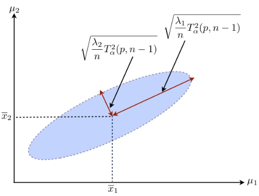
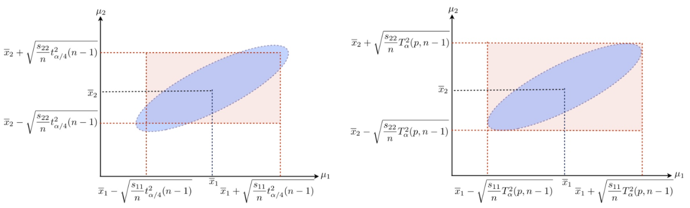

# Common Tests

<!-- ## Median test

Mood's median test is a special case of Pearson's chi-squared test. It is a nonparametric test that tests the null hypothesis that the medians of the populations from which two or more samples are drawn are identical.

## $z$-test

## $t$-test

## $F$-test

$F$ -distribution with degrees of freedom $\left(d_{1}, d_{2}\right)$, denoted as $F_{d_{1}, d_{2}}$, has the form
$$
\frac{Y_{1} / d_{1}}{Y_{2} / d_{2}}
$$
with $Y_{1} \sim \chi_{d_{1}}^{2}, \quad Y_{1} \sim \chi_{d_{2}}^{2}$ and $Y_{1} \Perp Y_{2}$.

## $\chi^2$-test -->

## Two-sample Mean Tests

Suppose we have two samples of data $\left\{x_{1}, \cdots, x_{n}\right\}$ and $\left\{y_{1}, \cdots, y_{m}\right\}$.

A question of interest: Did the two samples come from the same distribution, as opposed to, one sample having larger values than the other on average?

To model them, we assume

- $X_{i}, \cdots, X_{n}$ i.i.d. sampled from a distribution with mean with mean $\mu_X$ and variance $\sigma^2 _X$

- $Y_{i}, \cdots, Y_{m}$ i.i.d. sampled from a distribution with mean with mean $\mu_Y$ and variance $\sigma^2 _Y$

We are interested in comparing the two samples, often by comparing the two means $\mu_X$ and $\mu_Y$.

An unbiased estimator for the difference in mean $\mu_X - \mu_Y$ is $\bar{X} - \bar{Y}$. To provide standard error to this estimator, $\operatorname{Var}\left( \bar{X} - \bar{Y} \right)$ need to be estimated, contingent on sample properties.


### Paired

In many studies, the $i$-th measurements in the two samples $x_i$ and $y_i$ actually are related, such as measurements before and after a treatment from the same subject.

When $m = n$ and $\operatorname{Corr}\left( X_i,Y_i \right) = \rho \ne 0$, very often $\rho >0$. Then,

$$
\begin{aligned}
\operatorname{Var}(\bar{X}-\bar{Y}) &=\operatorname{Var}(\bar{X})+\operatorname{Var}(\bar{Y})-2 \times \operatorname{Cov}(\bar{X}, \bar{Y}) \\
& \leq \operatorname{Var}(\bar{X})+\operatorname{Var}(\bar{Y}) \quad \text{when }\rho >0
\end{aligned}
$$

To have a more precise variance estimate, it is appropriate to consider pairing $X_i$ and $Y_i$ by investigating their difference:

$$
D_{i}=X_{i}-Y_{i}, \quad i=1, \cdots, n
$$

Note that $D_i$'s are i.i.d. under the i.i.d. assumption of each of the two samples, with

$$
\mu_{D}=\mu_{X}-\mu_{Y}, \quad \sigma_{D}^{2}=\sigma_{X}^{2}+\sigma_{Y}^{2}-2 \rho \sigma_{X} \sigma_{Y}
$$

Then essentially, we changed the inference problem into that of a **one-sample case**.

An unbiased estimator for the variance of difference $\sigma^2_D$ is the sample variance.

$$
S_{D}^{2}=\frac{1}{n-1} \sum_{i=1}^{n}\left(D_{i}-\bar{D}\right)^{2}=\widehat{\operatorname{Var}}\left(D_{i}\right)=\hat{\sigma}_{D}^{2}
$$

#### Normal

If $X \sim \mathcal{N} \left(\mu_{X}, \sigma_{X}^{2}\right), Y \sim \mathcal{N} \left(\mu_{Y}, \sigma_{Y}^{2}\right)$, then we have the distributions for the sample estimators

$$
\frac{\bar{D}-\mu_{D}}{\sigma_{D} / \sqrt{n}} \sim \mathcal{N}(0,1), \quad \frac{(n-1) S_{D}^{2}}{\sigma_{D}^{2}} \sim \chi_{n-1}^{2}
$$

In addition, they are independent. By the definition of $t$-distribution, the test statistic

$$
\frac{\bar{D}-\mu_{D}}{S_{D} / \sqrt{n}} \sim t_{n-1}
$$

is a pivot quantity not depending on the parameters if we are testing a hypothesis on $\mu_D$. For instance,

$$
H_{0}: \mu_{D}=0
$$

A $(1-\alpha)\%$ confidence interval for the true difference in mean $\mu_X - \mu_Y$ is


$$
\bar{X}-\bar{Y} \pm t_{n-1}^{(1-\alpha / 2)} \frac{S_{D}}{\sqrt{n}}
$$

#### Non-normal

When the samples are not normally distributed, $t_{n-1}$ can be used as an approximate distribution.

When n is large, we may use the Central Limit Theorem,

$$
\frac{\bar{D}-\mu_{D}}{S_{D} / \sqrt{n}} \overset{\mathcal{D}}{\longrightarrow} \mathcal{N}(0,1)
$$

The asymptotic pivotal property can be used to conduct hypothesis tests.

A $(1-\alpha)\%$ confidence interval for the true difference in mean $\mu_X - \mu_Y$ is

$$
\bar{X}-\bar{Y} \pm z^{(1-\alpha / 2)} \frac{S_{D}}{\sqrt{n}}
$$

### Independent

Now we consider $X_i$ and $Y_j$ are independent.

#### Equal Variance

If $\sigma^2 _X = \sigma^2 _Y$, then

$$
\operatorname{Var}(\bar{X}-\bar{Y})=\frac{\sigma_{X}^{2}}{n}+\frac{\sigma_{Y}^{2}}{m}=\sigma^{2}\left(\frac{1}{n}+\frac{1}{m}\right)
$$

and both sample variances $S_X^2$ and $S_Y^2$ are unbiased estimators of $\sigma^2$

A better unbiased estimator is the **pooled sample variance**

$$
S_{p}^{2}=S_{\text {pooled }}^{2}=\frac{(n-1) S_{X}^{2}+(m-1) S_{Y}^{2}}{n+m-2}
$$

which has a **larger testing power** than the two sample variances.

##### Normal

If both $X$ and $Y$ are of normal distributions, then the test statistic is

$$
\frac{(\bar{X}-\bar{Y})-\left(\mu_{X}-\mu_{Y}\right)}{S_{p} \sqrt{\frac{1}{n}+\frac{1}{m}}} \sim t_{n+m-2}
$$

A $(1-\alpha)\%$ confidence interval for the true difference in mean $\mu_X - \mu_Y$ is

$$
\bar{X}-\bar{Y} \pm t_{n+m-2,1-\alpha / 2} S_{p} \sqrt{\frac{1}{n}+\frac{1}{m}}
$$


##### Non-normal

When the samples are not normally distributed, $t_{n+m-2}$ distribution can be used as an approximation.

When **both** $n$ and $m$ are large, we may apply the Central Limit Theorem,

$$
\frac{(\bar{X}-\bar{Y})-\left(\mu_{X}-\mu_{Y}\right)}{S_{p} \sqrt{\frac{1}{n}+\frac{1}{m}}} \overset{\mathcal{D}}{\longrightarrow} \mathcal{N}(0,1)
$$


:::{admonition,note} Pooling vs paring

Consider the case n = m with equal variance.

- Under assumption that the two samples are independent, the variance is

    $$
    \operatorname{Var}(\bar{X}-\bar{Y})= \frac{2 \sigma^{2}}{n}
    $$

    The pooled sample variance is the appropriate estimator to be used.

- If the two samples were correlated with $Corr(X_i, X_j) = \rho > 0$, the variance becomes smaller

    $$
    \operatorname{Var} (\bar{X}-\bar{Y})=(1-\rho) \frac{2 \sigma^{2}}{n}< \frac{2 \sigma^{2}}{n}
    $$

As a result, when correlation exists, the smaller paired sample variance is the appropriate one to use, since the test statistic using it has a **larger power**.

On the other hand, if the correlation is substantial and we fail to take it into consideration, the pooled sample variance estimator likely will overestimate the variance, and the estimate could be too large to be useful.

:::

#### Unequal Variance

If $\sigma_{X}^{2} \neq \sigma_{Y}^{2}$, the variance we are interested to estimate has the form

$$
\operatorname{Var}(\bar{X}-\bar{Y})=\frac{\sigma_{X}^{2}}{n}+\frac{\sigma_{Y}^{2}}{m}
$$

which can be estimated by the unbiased estimator

$$
\frac{S_{X}^{2}}{n}+\frac{S_{Y}^{2}}{m}
$$

It is complicated to construct a pivot quantity like we did for the previous cases. Consider

$$
T=\frac{\bar{X}-\bar{Y}-\left(\mu_{X}-\mu_{Y}\right)}{\sqrt{\frac{S_{X}^{2}}{n}+\frac{S_{Y}^{2}}{m}}}
$$

When both $X$ and $Y$ are of normal distributions, we have

$$
(n-1) S_{X}^{2} / \sigma_{X}^{2} \sim \chi_{n-1}^{2}, \quad(m-1) S_{Y}^{2} / \sigma_{Y}^{2} \sim \chi_{m-1}^{2}
$$

But since $\sigma_{X}^{2} \neq \sigma_{Y}^{2}$, the summation

$$
\frac{S_{X}^{2}}{n}+\frac{S_{Y}^{2}}{m} \sim \frac{\sigma_{X}^{2}}{n(n-1)} x_{n-1}^{2}+\frac{\sigma_{Y}^{2}}{m(m-1)} X_{m-1}^{2}
$$

is not a multiple of a $\chi^2$ distribution.

Hence, $T$ is not $t$-distributed.

If $n$ and $m$ are both large, we can resort to Central Limit Theorem as usual,

$$
T=\frac{\left( \bar{X}-\bar{Y} \right)-\left(\mu_{X}-\mu_{Y}\right)}{\sqrt{\frac{S_{X}^{2}}{n}+\frac{S_{Y}^{2}}{m}}} \stackrel{\mathcal{D}}{\longrightarrow} \mathcal{N}(0,1)
$$

The asymptotic approximation lead to a $(1-\alpha)\%$ confidence interval for the true difference in mean $\mu_X - \mu_Y$

$$
\bar{X}_{i}-\bar{Y} \pm z_{1-\alpha / 2} \sqrt{\frac{S_{X}^{2}}{n}+\frac{S_{Y}^{2}}{m}}
$$

However, there is a better approximation using $t_v$ distribution than the normal approximation.

$$
T=\frac{\bar{X}-\bar{Y}-\left(\mu_{X}-\mu_{Y}\right)}{\sqrt{\frac{S_{X}^{2}}{n}+\frac{S_{Y}^{2}}{m}}} \stackrel{\mathcal{D}}{\longrightarrow} t_v
$$

But the degree of freedom $v$ is involved. It is estimated by  Welch-Satterthwaite approximation,


$$
\nu \approx \frac{\left(\frac{S_{X}^{2}}{n}+\frac{S_{T}^{2}}{m}\right)^{2}}{\left(\frac{S_{x}^{2}}{n}\right)^{2} /(n-1)+\left(\frac{S_{Y}^{2}}{m}\right)^{2} /(m-1)}
$$

The asymptotic approximation lead to a $(1-\alpha)\%$ confidence interval for the true difference in mean $\mu_X - \mu_Y$,

$$
\bar{X}_{i}-\bar{Y} \pm t_{\nu}^{1-\alpha / 2} \sqrt{\frac{S_{X}^{2}}{n}+\frac{S_{Y}^{2}}{m}}
$$

### Summary

The analysis for the above cases are summarized into the table below. In general, if $X$ and $Y$ are of normal distributions, the pivot quantity follows a known distribution. If not, we use CLT to obtain an approximate distribution, which requires **large** $n$ and $m$.

$$
H_0: \mu_X - \mu_Y = 0
$$


| Dependency | Test statistic | Normal | Non-normal, large $n, m$ |
| - | - | - | - |
| Paired (reduced to a univariate test)| $\frac{\bar{D}-\mu_{D}}{S_{D} / \sqrt{n}}$ | $\sim t_{n-1}$ | $\stackrel{\mathcal{D}}{\longrightarrow} \mathcal{N}(0,1)$ |
| Independent with equal variance | $\frac{(\bar{X}-\bar{Y})-\left(\mu_{X}-\mu_{Y}\right)}{S_{p} \sqrt{\frac{1}{n}+\frac{1}{m}}}$ | $\sim t_{n+m-2}$ | $\stackrel{\mathcal{D}}{\longrightarrow} \mathcal{N}(0,1)$ |
| Independent with unequal variance | $\frac{\left( \bar{X}-\bar{Y} \right)-\left(\mu_{X}-\mu_{Y}\right)}{\sqrt{\frac{S_{X}^{2}}{n}+\frac{S_{Y}^{2}}{m}}}$ | / | $\stackrel{\mathcal{D}}{\longrightarrow} t_v$ |


## Multivariate Settings

### Hotelling's $T^2$ Distribution

Definition (Hotelling's $T^2$ Distribution )
: Suppose $\boldsymbol{x} \sim \mathcal{N} _p(\boldsymbol{0} , \boldsymbol{\Sigma} )$ and $\boldsymbol{V} \sim W_p(k, \boldsymbol{\Sigma} )$ are independent. Define

  $$
  T^2 = k \boldsymbol{x} ^{\top} \boldsymbol{V} ^{-1} \boldsymbol{x}
  $$

  Then $T^2$ is said to follow a Hotelling's $T^2$ distribution with parameter $p$ and $k$, denoted as $T^2(p, k)$.

  In univariate sense, the Hotelling’s $T^2$ statistic can be reduced to the squared $t$-statistic.

Properties
: - If $\bar{\boldsymbol{x}}$ and $\boldsymbol{S}$ are respectively the sample mean vector and sample covariance matrix of a random sample of size $n$ taken from $\mathcal{N} _p(\boldsymbol{\mu} , \boldsymbol{\Sigma} )$, then

    $$n(\overline{\boldsymbol{x}}-\boldsymbol{\mu})^{\top} \boldsymbol{S}^{-1}(\overline{\boldsymbol{x}}-\boldsymbol{\mu}) \sim T^{2}(p, n-1)$$

  - The distribution of the quadratic form under non-normality is reasonably robust as long as the underlying multivariate distribution has pdf contours close to elliptical shape, but $T^2$ is sensitive to the departure from such elliptical symmetry of the distribution.
  - Invariant under transformation of $\boldsymbol{x}$:$\boldsymbol{C} \boldsymbol{x} + \boldsymbol{d}$, where $\boldsymbol{C}$ is non-singular.

  - Related to other distribution:
    - $T^{2}(p, k)=\frac{k p}{k-p+1} F(p, k-p+1)$, usually used to find quantile $T^2(\alpha)$.
    - $T^{2}(1, k)=t^{2}(k)=F(1, k)$
    - $T^{2}(p, \infty) \rightarrow \chi ^2 _p$ by CLT, without assuming normality of the distribution of $\boldsymbol{x}$
  - Related to Mahalanobis distance: $T^{2}=n D_{\boldsymbol{S}}^{2}(\overline{\boldsymbol{x}}, \boldsymbol{\mu})$


### One-sample Mean

Assume $\boldsymbol{x} \sim \mathcal{N} _p(\boldsymbol{0} , \boldsymbol{\Sigma} )$, want to test

$$
H_{0}: \boldsymbol{\mu}=\boldsymbol{\mu}_{0} \operatorname{vs } H_{1}: \boldsymbol{\mu} \neq \boldsymbol{\mu}_{0}
$$

Test statistic under $H_0$
: - $\boldsymbol{\Sigma}$ is known:   

    $$T^{2}=n\left(\overline{\boldsymbol{x}}-\boldsymbol{\mu}_{0}\right)^{\top} \boldsymbol{\Sigma}^{-1}\left(\overline{\boldsymbol{x}}-\boldsymbol{\mu}_{0}\right) \sim \chi^{2}(p)$$

  - $\boldsymbol{\Sigma}$ is unknown, estimated by $\boldsymbol{S}$:


    $$\begin{aligned}
    T^{2}=n\left(\overline{\boldsymbol{x}}-\boldsymbol{\mu}_{0}\right)^{\top} \boldsymbol{S}^{-1}\left(\overline{\boldsymbol{x}}-\boldsymbol{\mu}_{0}\right) &\sim T^{2}(p, n-1) \\
    &\sim \frac{(n-1) p}{n-p} F(p, n-p) \\
    & \rightarrow \chi ^2 _p \quad \text{as } n \rightarrow \infty  
    \end{aligned}$$

  - Analogously, in univariate case,

    $$
    \left\{\begin{array}{l}
    \frac{\sqrt{n}\left(\bar{x}-\mu_{0}\right)}{\sigma} \sim N(0,1) \text { if } \sigma^{2} \text { is known } \\
    \frac{\sqrt{n}\left(\bar{x}-\mu_{0}\right)}{s} \sim t(n-1) \text { if } \sigma^{2} \text { is unknown. }
    \end{array}\right.
    $$


Confidence Region
: - A $(1-\alpha)100\%$ confidence region for $\boldsymbol{\mu}$ is a $p$-dimensional ellipsoid centered at $\bar{\boldsymbol{x}}$, i.e. a collection of all those $\boldsymbol{\mu}$ which will not be rejected by the above $T^2$ test at significance level $\alpha$.

    $$
    \left\{\boldsymbol{\mu}: n(\overline{\boldsymbol{x}}-\boldsymbol{\mu})^{\top} \boldsymbol{S}^{-1}(\overline{\boldsymbol{x}}-\boldsymbol{\mu}) \leq T_{\alpha}^{2}(p, n-1)=c_{\alpha}\right\}
    $$

    :::{figure} test-ellipsoid
    

    Confidence region
    :::

  - This confidence ellipsoid above is the most precise confidence region of the vector $\boldsymbol{\mu}$, in the sense that any other form of confidence region for $\boldsymbol{\mu}$ with the same confidence level $(1-\alpha)$ will have **larger volume** in the $p$-dimensional space of $\boldsymbol{\mu}$ and hence less precise.

Simultaneous confidence interval
: - Individual CI: Sometimes people get used to confidence intervals for individual components, such as

    $$
    \bar{x}_{j}-t^{\alpha / 2}_{n-1} \frac{s_j}{\sqrt{n}} <\mu_{j}<\bar{x}_{j}+t^{\alpha / 2}_{n-1} \frac{s_j}{\sqrt{n}}
    $$

    where $\bar{x}_j$ and $s_j$ are respectively the sample mean and standard deviation of the $j$-th variate that has mean $\mu_j$.

  - Problem: while each of the $p$ intervals has confidence level $(1-\alpha)$, the joint probability (joint confidence level) that all the $p$ statements are true simultaneously is less than $(1-\alpha)$.
    - for instance, if all the $p$ variates are independent, then the joint confidence level is $(1-\alpha)^p$.
    - to correct this, we can use Bonferroni or Scheffe's simultaneous C.I., which forms a hyper-rectangular region in $\mathbb{R} ^p$.
  - The $(1-\alpha)100\%$ Bonferroni simultaneous C.I.s for $m$ **pre-determined** linear components of means, $\boldsymbol{a}_{i}^{\top} \boldsymbol{\mu}(i=1, \ldots, m)$, are given by

    $$
    \boldsymbol{a}_{i}^{\top} \overline{\boldsymbol{x}} \pm t ^{\alpha/(2m)}_{n-1} \sqrt{\frac{\boldsymbol{a}_{i}^{\top} \boldsymbol{S} \boldsymbol{a}_{i}}{n}}
    $$

  ```{margin}
  Scheffe simultaneous C.I. works like a guarantee for any 'data snooping' linear combinations in exploratory data analysis. Besides, it is related to [union intersection test](UIT).
  ```

  - The $(1-\alpha)100\%$ Scheffe simultaneous C.I.s for **all possible** linear combinations of means $\boldsymbol{a} ^{\top} \boldsymbol{\mu}$ are given by

    $$
    \boldsymbol{a}^{\top} \overline{\boldsymbol{x}} \pm \sqrt{T_{\alpha}^{2}(p, n-1)} \sqrt{\frac{\boldsymbol{a}^{\top} \boldsymbol{S a}}{n}}
    $$

  - Pros: Compared with the advantages of ellipsoidal confidence regions, these hyper-rectangles (orthotopes) are easier to form and to compute.

  - Cons: Both Bonferroni and Scheffé intervals are **wider** (hence less accurate) than the ordinary confidence intervals which are constructed with separate confidence level of $(1-\alpha)$.

    ```{margin}
    Are Scheffe interval boundaries tangent to the ellipsoid confidence region??
    ```

    :::{figure} test-multi-Bon-Sch
    

    Bonferroni (left) and Scheffe (right) simultaneous C.I.s.
    :::

  - If we just want to conduct univariate tests of means $H_0: \mu_k = 0$ for each $k = 1, 2, \ldots, p$, i.e. $\boldsymbol{a} _k = \boldsymbol{e} _k$, then the C.I. has the general form $\bar{x}_{k} \pm c_{n, p, \alpha} \sqrt{\frac{s_{k k}}{n}}$ for some multiplier $c_{n, p, \alpha}$ depending on $n,p,\alpha$. The above methods can be summarized as follows
    - marginal C.I. using $t$ statistics (ignoring dependence among components): $t_{n-1}^{\alpha/2}$
    - Bonferroni simultaneous C.I. using $t$ statistics: $t_{n-1}^{\alpha/(2p)}$
    - Scheffe simultaneous C.I.: $\sqrt{T^2_\alpha (p, n-1)}$
    - Asymptotic simultaneous C.I. using $\chi ^2$ statistic as $n$ is large: $\sqrt{\chi ^2 _p (\alpha)}$
