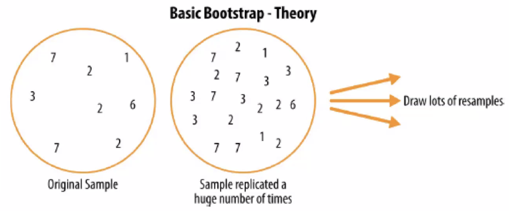

# Bootstrap

One easy and effective way to estimate the sampling distribution of a statistic, or of model parameters, is to draw additional samples, with **replacement**, from the sample itself and **recalculate** the statistic or model for each resample. This procedure is called the bootstrap, and it does not necessarily involve any assumptions about the data or the sample statistic being normally distributed.

:::{figure} bootstrap-idea

Idea of bootstrap
:::

- Input
  - a sample
- Output
  - a sequence of statistic

- Main
  - Repeat $R$ times
    - Draw $m$ observation $x$ from input sample
    - Use the $m$ observations to form a new sample, and compute a sample statistic of interest
  - Use the $R$ number of sample statistics to obtain
    - standard deviation (se)
    - histogram or box-plot
    - confidence interval (trim tails)

Assumption
- sample is a good representation of population

Pros
- enlarge samples without increasing the cost of acquiring samples

Cons:
- no "new" observations from population

## Bootstrap Aggregation (Bagging)

The bootstrap can be used with multivariate data, where the rows are sampled as units. A model might then be run on the bootstrapped data, for example, to estimate the stability (variability) of model parameters, or to improve predictive power.

With classification and regression trees (also called decision trees), running multiple trees on bootstrap samples and then **averaging** their predictions (or, with classification, taking a majority vote) generally performs better than using a single tree. This process is called bagging (short for "bootstrap aggregating"

In addition to bagging in rows, there is bagging in columns (features), i.e. drop some features, like regularization.

cf. permutation test.
.

.

.

.

.

.

.

.
