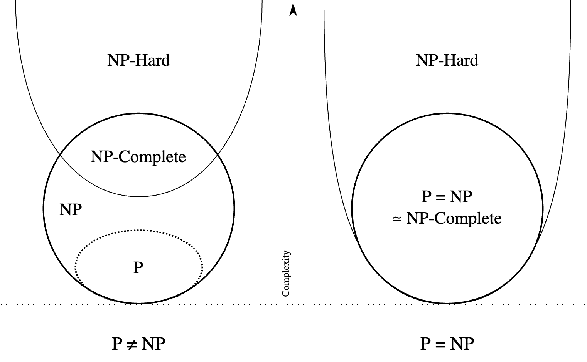

# NP-hardness

Let $s$ encodes graph $G$, integer $k$ and $G$ has independent set of size $k$. Let IS be a set of such string.

We say $A$ is an efficient algorithm for problem $x$ iff there is a function $f:\mathbb{R} ^+ \rightarrow \mathbb{R} ^+$, where $n$ is the length of $s$, such that
- $f(n)\le \operatorname{Poly}(n)$
- on input $s$, A runs for at most $f(n)$ time steps, and returns "yes" iff $s$ is an instance of $s\in x$

$P$ is a class of all problems that have efficient algorithms.

Definition (Verifier for problem $x$)
: A verifier for problem $x$ is an efficient algorithm with input string $s$ (problem instance) and another string $t$ (certificate). Efficient means the run time is $\operatorname{Poly}(\left\vert s \right\vert + \left\vert t \right\vert)$. It returns *yes* or *no*.

A is a valid verifier for problem $x$ iff there is a function $g: \mathbb{R} ^+ \rightarrow \mathbb{R} ^+$, $g(n)\le \operatorname{Poly}(n)$ such that for all s:
- if $s\in x$, then there is a certificate $t$ with length $\left\vert t \right\vert \le g(\left\vert s \right\vert)$ such that given $s, t$ verifier returns "yes" (accept).
- if $s\notin x$, then for every certificate $t$ with length $\left\vert t \right\vert\le g(\left\vert s \right\vert)$, it returns "no" (reject).

Non-deterministic polynomial (NP) is a class of all problems for which an **efficient** and **valid** verifier exists.

e.g. SAT, IS, VC

Observation: Every problem in P belongs to NP.

Proof:
Given input $s, t$, the verifier ignores $t$, solve problem instance $s$ and accepts or reject accordingly.

Question: NP is in P?

Definition
$X$ is in NP-complete problem iff
-  $x\in NP$
- $\forall\, y \in NP, y \le_p x$.

Observation: Let $x$ be any NP-complete problem, then $P=NP$ iff there is an efficient algorithm for $x$.

Proof

## P

## NP

## NP-completeness

:::{figure} np-p-and-np

:::

Let $\phi$ be an instance of SAT formula, $\phi = c_1 \wedge c_2 \wedge \ldots \wedge c_m$.

### $k$-coloring

Given a graph $G$, assign to each vertex one of $k$ colors, such that no adjoint vertices are assigned different colors.

Decision version: Given a graph, is it $k$-colorable?

For instance, bipartite graph is 2-colorable. To find whether a graph is 2-colorable, ...

Claim
: 3-coloring is NP-complete.

.
