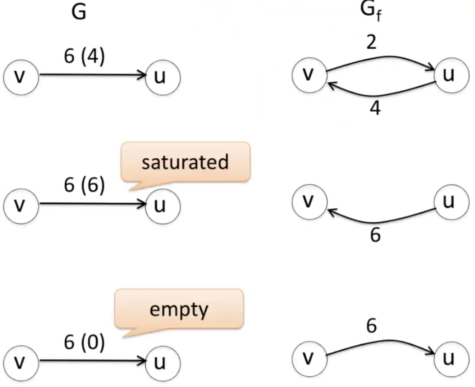
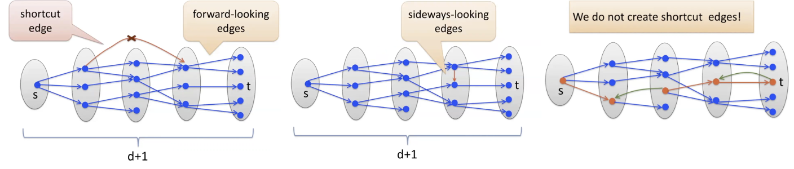
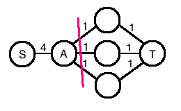

# Maximum Flow

Widely used in algorithms on graphs.

## Problem

Send something from a place to another over some networks, e.g. information, package, oil.

Each edge has capacity limit.

Input
: directed graph $G=(V,E)$, capacities $c(e)\ge 0$, source vertex $s\in V$, destination vertex $t \in V$.

Goal
: find the maximum volume flowing from $s$ to $t$ subject to the capacity constraint.


## Analysis

Assume

- all capacities are integers (capacity is a finite number. if not integer, scale.)

- no edges enter $s$ or leave $t$ (makes no sense to use those edges)

- call all edges entering $v$ by $\delta ^- (v)$

- call all edges leaving $v$ by $\delta ^+ (v)$

```{margin}
If the two vertices of an edge are $e=(u,v)$, sometimes we write $f(u,v)$ for convenience. If there is no edge between two vertices $u$ and $v$, then $f(u,v)=0$.
```

Definition (Flow)
: A function $f:E \rightarrow \mathbb{R}$ which assign a value $f(e)$ to every edge $e \in E$, subject to

- capacity constraints: edge flow less than edge capacity

  $$\forall e: \quad 0\le f(e) \le c(e)$$

- flow conservation constraint: in-flow = out-flow for all intermediate nodes.

  $$\forall v \in V \backslash \left\{ s,t \right\}: \quad \sum_ {e\in \delta^- (v)} f(e) = \sum_ {e\in \delta^+ (v)} f(e) \quad$$

  or

  $$f^{\text{in}}(v) = f^{\text{out}}(v)$$

Definition (Value of flow)
: The value of a flow is the amount of out-flow from source node $s$ (assuming no in-flow to $s$).

  $$
  \operatorname{val}(f) = f^{\text{out}}(s) = \sum_ {e\in \delta^+ (s)} f(e)
  $$


Observation (Flow cancelation operation on anti-parallel edges)
: For two anti-parallel edges $e = (u,v)$ and $e ^\prime  = (v,u)$. Suppose $f(e), f(e ^\prime ) >0$.

  Let $\Delta = \min \left\{ f(e), f(e ^\prime ) \right\}$ and assign new flow

  $$
  f ^\prime (e) = f(e) - \Delta \\
  f ^\prime (e ^\prime ) = f(e ^\prime ) - \Delta
  $$

  Then the new flow $f ^\prime$ is still a feasible flow with the same value of flow $f$.

  $$
  \operatorname{val}(f ^\prime ) = \operatorname{val}(f)
  $$


:::{admonition,dropdown,note} Greedy algorithms not optimal

Given a simple $s-t$ path $P$ and a flow $f$, how much available capacity left?

$$
\Delta(P) = \min _{e \in E(P)} \left\{ c(e) - f(e) \right\}
$$

- Start: $\forall e \in E, f(e) = 0$

- While there is a simple $s-t$ path $P$ with $\Delta(P)>0$, set for every $e \in E(P)$.

$$
f(e)\leftarrow f(e) + \Delta(p)
$$

This gives a feasible solution. Optimal? No, depends on the order of $s-t$ path in `WHILE`.

:::

## Algorithm

We first make an additional assumption and define residual flow networks.


```{margin}
This assumption is not necessary for the algorithm to run, but make the algorithm easier to understand.
```

Assumption (No anti-parallel edges)
: Input $G$ has no anti-parallel edges. If there is, say $e = (u,v)$ and $e ^\prime  = (v,u)$, then add a node $x$ in-between $e = (u,v)$ and the new edges have the same capacity $c(u,x) = c(x,v) = c(u,v)$.

Definition (Residual Flow Network)
: Given a graph $G$ and a feasible flow $f$ in $G$, let $G_f$ be a new graph with the same vertices but new edges.

```{margin}
One can check if the residual capacity assigned to a pair of forward edge and backward edge in the residual flow network are correct by checking their sum of residual capacity $c_f(e) + c_f(e ^\prime)$, which should be $c(e)$.
```

  - For every $e(u,v) \in G$, add edges and assign capacity (called **residual capacity**)

    - add a forward edge to reflect **unused** capacity of $e$

        $$
        c_f (u,v) = c(e) - f(e)
        $$

    - add a backward edge $(v,u)$ to reflect **used** capacity

        $$
        c_f (v,u) = f(e)
        $$

  - For every edge $e ^\prime$ in $G_f$ with zero residual capacity $c_f (e ^\prime ) = 0$, delete.

:::{figure} max-flow-three-edges


Three kinds of edge in $G$ [Chuzhoy 2021]
:::


Ford-Fulkerson algorithm is an iterative algorithm. In each iteration, we compute the residual floe network of the current graph and use that to improve the original graph. Note that flow $f()$ only exists in the original graph.

---
**Ford-Fulkerson's algorithm**

---
- Start:

    - For all edge $e \in E(G)$, initialize zero flow $f(e)=0$.

    - Compute the residual flow network $G_f$. For every $e(u,v) \in G$, add edges and assign capacity (called **residual capacity**)

      - add a forward edge to reflect **unused** capacity of $e$

          $$
          c_f (u,v) = c(e) - f(e)
          $$

      - add a backward edge $(v,u)$ to reflect **used** capacity

          $$
          c_f (v,u) = f(e)
          $$

      - delete edges with zero residual capacity

```{margin}
An augmenting path in residual graph can be found using DFS or BFS.
```

- While $\exists$ a simple path $s-t$ path $P$ in the residual flow network $G_f$, we "push" flow along this path (aka *augmenting path*).

  - Compute the smallest residual capacity along that path

      $$\Delta \leftarrow \min _{e \in E(P)} \left\{ c_f(e) \right\}$$

  - For each edge $e=(u,v) \in P$, check whether it is a forward edge or a backward edge w.r.t. the original graph.

    - If $e=(u,v)$ is a forward edge, then $(u,v) \in G$, and we **increase** the flow of that edge by $\Delta$,

        $$f(u,v)\leftarrow f(u,v) + \Delta$$

    - Else, $e=(u,v)$ is a backward edge, then $(v,u) \in G$, and we **decrease** the flow of $(v,u)$ by $\Delta$,

        $$f(v,u) \leftarrow f(v,u) - \Delta$$

  - Re-compute $G_f$.
---


## Correctness

### Feasibility

Claim (Stops in finit time)
: The FF algorithm stops after at most $\sum_{v\in \operatorname{succ}(s)} c(s, v)$ iterations.

:::{admonition,dropdown,seealso} *Proof*

Upon initialization, $f(e)=0$ are integers. In each iteration, in $G_f$, all residual capacities $c_f(e)$ are integers and at least 1. The smallest residual capacity is also integer and at least 1. So the update flow of each edge in $G$ is $f(e)\leftarrow f(e) \pm \Delta$.

Note that along the augmenting path $P$, the first edge out from $s$ is always a forward edge (by assumption). As a result, the updated flow of that edge is $f(e) \mathrel{+}= \Delta$. Hence, the updated value of the flow is $\operatorname{val}(f) \mathrel{+}= \Delta$, which is at least 1.

Therefore, the algorithm stops after at most $\sum_{v\in \operatorname{succ}(s)} c(s, v)$ iterations.

$\square$

:::


Claim 2 (Always a valid flow)
: Flow $f$ always remains a valid flow. That is, the flow always satisfies the capacity constraints and the conservation constraints.

:::{admonition,dropdown,seealso} *Proof by induction*

- Base: $\forall e: f(e)=0$ at initialization is a valid flow

- Step: if at the beginning of an iteration, $f$ is valid, then after the iteration, it remains valid.

We now prove the capacity constraints and the conservation of flow constraints.

**Capacity constraints**

For every edge $e=(u,v)$ in the augmenting path $P$,

  - If $e$ is a forward edge, $e \in G$, then we increases $f(e) \mathrel{+}= \Delta$. By definition, $\Delta \le c_f (e) =  c(e) - f(e)$. Hence $f(e)+\Delta \le c(e)$.

  - If $e$ is a backward edge, then $e ^\prime = (v,u)\in G$, we decrease $f(e ^\prime) \mathrel{-}= \Delta$. Will it be negative? No, since by definition, $\Delta \le c_f(e) = f(e ^\prime)$, so $f(e ^\prime) - \Delta \ge 0$.

$\square$

**Conservation of flow constraints**

By definition, we want to prove $\forall v \in V \backslash \left\{ s,t \right\}$

$$f^{\text{in}}(v) = f^{\text{out}}(v)$$

Suppose along $P$ the two edges of $v$ are $e_1, e_2$

$$ \text{along } P: \quad \ldots \overset{e_1}{\longrightarrow} v \overset{e_2}{\longrightarrow} \ldots$$

We have the following 3 possible situations for $e_1$ and $e_2$,

1.  both forward edges, then we increase both $f(e_1)$ and $f(e_2)$ by $\Delta$, so the in- and out-flow of $v$ both increases by $\Delta$.

    $$ \text{in } G: \quad \ldots \overset{e_1}{\longrightarrow} v \overset{e_2}{\longrightarrow} \ldots$$

1. both backward edges, then we decrease $f(e_1 ^\prime)$ and $f(e_2 ^\prime)$ by $\Delta$, so the in- and out-flow of $v$ both decreases by $\Delta$.

    $$\text{in } G: \quad \ldots \overset{e_1 ^\prime }{\longleftarrow} v \overset{e_2 ^\prime }{\longleftarrow} \ldots$$

1. $e_1$ forward, $e_2$ backward, then $f(e_1)$ increases by $\Delta$, and $f(e_2 ^\prime)$ decreases by $\Delta$, so the two changes to in-follow of $v$ cancel out. No change to out-flow.

    $$\text{in } G: \quad \ldots \overset{e_1}{\longrightarrow} v \overset{e_2 ^\prime }{\longleftarrow} \ldots$$

1. $e_2$ forward, $e_1$ backward, similar to the case 3.

$\square$

:::


Therefore, we show that after an iteration is completed, the constraints remain to be satisfied, so the feasibility is guaranteed.

### Optimality

To prove optimality of the FF algorithm, we first introduce some definitions.

Recall the definition of in-flow to and out-flow from a node $v$

$$
f^{\text{in}}(v) = \sum_{e \in \delta^{-}(v)} f(e) \\
f^{\text{out}}(v) =\sum_{e \in \delta^{+}(v)} f(e)
$$

We define similar quantities for a set of vertices.

Definition (In- and out-flow of a set of vertices)
: For a set of vertices $S \subseteq V$, ,

  $$
  f^{\text{in}}(S) = \sum_{u\notin S, v \in S} f(u, v) \\
  f^{\text{out}}(S) = \sum_{u\in S, v \notin S} f(u, v) \\
  $$


Definition ($s-t$ cut)
: An $s-t$ cut $(A,B)$ is a cut in $G$ such that the source node $s\in A$ and the destination node $t\in B$. The in- and out-flow of $A$ and $B$ have the relations

  $$
  f^{\text{in}}(A) = f^{\text{out}}(B) \\
  f^{\text{out}}(A) = f^{\text{in}}(B)
  $$


Definition (Capacity of an $s-t$ cut)
: The capacity of an $s-t$ cut $(A,B)$ is defined as the sum of capacities of the edges from $A$ to $B$

  $$
  c(A,B) = \sum _{u\in A, v \in B} c(u, v)
  $$

Property (Compute flow value from a cut)
: Let $f$ be any flow in $G$, recall that the definition of flow value $\operatorname{val}(f)=f^{\text{out}}(s)$. For any $s-t$ cut $c(A,B)$ in $G$, the value of the flow $f$ can be computed as

  $$
  \operatorname{val}(f) = f^{\text{out}}(A) - f^{\text{in}}(A)
  $$

:::{admonition,dropdown,seealso} *Proof*

$$\begin{aligned}
\operatorname{val}(f)
&= \sum_{u \in A} \left[ f^{\text{out}}(u) - f^{\text{in}}(u) \right] \\
&= \sum_{u \in A} \left[ \sum_{v} f(u,v) - \sum_{v} f(v,u) \right] \\\\
&= \sum_{u \in A, v \in A}  f(u,v) + \sum_{u \in A, v \in B}  f(u,v) - \sum_{u \in A, v \in A} f(v,u) - \sum_{u \in A, v \in B} f(v,u)  \\\\
&= \sum_{u \in A, v \in B}  f(u,v) - \sum_{u \in A, v \in B} f(v,u)  \\\\
&= f^{\text{out}}(A)- f^{\text{in}}(A)  \\\\
\end{aligned}$$

$\square$

:::


```{margin}
This corollary is the key for subsequent analysis
```

Corollary
: $\operatorname{val}(f) \le c(A,B)$, with equality iff $f^{\text{in}}(A) = 0$ and $f^{\text{out}}(A) = c(A,B)$.


Theorem
: If $f$ is any $s-t$ flow and $(A,B)$ is any $s-t$ cut, and $\operatorname{val}(f) = c(A,B)$, then $f$ is a maximum flow, by Corollary.

How about existence?

Claim (Optimality)
: If $f$ is the flow returned by FF algorithm, then there exists an $s-t$ cut $(A,B)$ such that $\operatorname{val}(f) = c(A,B)$. So $f$ is optimal by the above theorem.

:::{admonition,dropdown,seealso} *Proof*

Recall that FF algorithm stops if there is no $s-t$ path. After it stops, consider a cut $(A,B)$ in $G_f$, where $A$ is the set of all vertices $v \in V$ such that there is an $s-v$ path in $G_f$, and all other vertices (e.g., $t$) are in $B$. By this definition, there is no edge from $A$ to $B$.

Now, for the cut $(A,B)$ in $G$, we want to prove

$$
\operatorname{val}(f) = c(A,B)
$$

By Corollary, this holds iff $f^{\text{in}}(A) = 0$ and $f^{\text{out}}(A) = c(A,B)$. Equivalently,

1. $\forall e^+ \in \delta^+(A), f(e^+) = c(e^+)$

1. $\forall e^- \in \delta^-(A), f(e^-) = 0 \\$

These two conditions are indeed satisfied when FF algorithm stops.

1. If there exists $e^+ = (a,b): f(e^+) < c(e^+)$, then there is an forward edge $(a,b)$ from $A$ to $B$ in $G_f$ with residual capacity $c_f(a,b) = c(e^+) - f(e^+)>0$, contradiction to the stoping condition of $G_f$.

1. If there exists $e^- = (b,a): f(e^-) > 0$, then there is an edge $(a,b)$ from $A$ to $B$ in $G_f$ with residual capacity $c_f(a,b) > 0$, contradiction to the stoping condition of $G_f$.

$\square$

:::


## Minimum Cut


### Problem

**Input**

- A directed graph $G=(V,E)$.
- Capacity $c(e)$.
- Two special vertices $s$ and $t$.

**Goal**

Find an $s-t$ cut $(A,B)$ where $s \in A, t \in B$, with minimal cut capacity $c(A,B)$, which is the sum of capacities of edge from $A$ to $B$, $c(A, B) = \sum_{u\in A, v\in B} c(u,v)$.

In other words, we want to remove some edges to disconnect $s$ and $t$, and minimize the total capacities of these removed edges.

The vertex partition's perspective and edge removal's perspective are actually equivalent.


### Analysis

Theorem (Equivalency of maximum flow and minimum cut)
: In any flow network $G$, the value of a maximum $s-t$ flow is equal to the capacity of a minimum $s-t$ cut.

The proof is simply from the Corollary.

Thus, FF algorithm also gives an algorithm for finding a minimum $s-t$ cut.

## Complexity

Let $m$ be the number of edges in the graph $G$.

Recall that there are at most $\sum_{v\in \operatorname{succ}(s)} c(s, v)$ iterations. The bound is upper bounded by $n \times c _{\max}(e)$.

 In each iteration

- Finding augmenting path $P$ takes $O(m)$
- Pushing flow along $P$ takes $O(m)$
- Recompute $G_f$ takes $O(m)$

So the total running time is $O(m\cdot n\cdot c _{\max})$


:::{admonition,note} Is FF algorithm efficient?

There are two inputs.

- Graph, which is a combinatorial part of size $(n,m)$
- Capacities, which is a numerical part of size $m$

Recall different running time

- strong-polynomial time: $Poly(\text{input size of the combinatorial part})$, e.g. $O(n)$
- weak-polynomial time: $Poly(\text{input sizes of both parts})$, e.g. $O(n \log c_\max)$
- pseudo-polynomial time: $Poly(\text{the largest integer present in the input})$, e.g. $O(c_\max)$

:::


## Improvement and Extension

$O(mn c_\max)$ is not efficient. There are alternative algorithms to improve this.

### Edmonds-Korp Algorithm

Instead of using an arbitrary augmenting path, we use the **shortest** path $s-t$ in $G$ that minimizes number of edges. This work takes $O(m)$ by BFS or DFS, so each iteration still takes $O(m)$. But it reduces the number of iterations from $O(nc_\max)$ to $O(nm)$, this leads to the Edmonds-Korp algorithm with complexity $O(nm^2)$.

To show that, we first run that algorithm, record the length of the chosen shortest path in each iteration, and then partition these the execution into phases, where each phase lasts as long as the lengths of augmenting paths chosen remains the same.


$$\begin{aligned}
\text{iteration} &\quad 1 \quad2 \ \quad 3 \  \quad4 \ \quad 5 \quad6 \quad 7\\
\text{shortest path length} &\quad \underbrace{2 \quad 2}_{\text{phase 1} } \quad \underbrace{3\quad 3}_{\text{phase 2} } \quad \underbrace{5 \quad 5 \quad 5}_{\text{phase 3} }  \\
\end{aligned}$$


Claim (Non-decreasing shortest path length)
: From iteration to iteration, the length of the augmenting path is non-decreasing. Hence, the number of phases is at most $n$.

Claim ($O(m)$ iterations in each phase)
: Every phase covers at most $O(m)$ iterations.

::::{admonition,dropdown,seealso} *Proof*

To prove them, let $G_f$ be the residual graph at the *start* of iteration $i$, and $G_f ^\prime$ be the residual path at the *end* of iteration $i$, and $P$ be the augmenting path in iteration $i$. From the algorithm we observe that

- if $e \in E(G_f)$ but $e \notin E(G_f ^\prime)$, then $e \in E(P)$
- at least one edge $e\in P$ has to disappear in $G ^\prime _f$
- if $e \notin E(G_f)$ but $e \in E(G_f ^\prime)$ then its anti-parallel edge $e ^\prime  \in E(P)$.

Now consider using BFS from to find a shortest path $s-t$ in $G_f$. Suppose the path length is $d$, then there are $d+1$ layers. The first layers only contains $s$, and the last layer contains $t$. In each iteration, we delete some forward-looking edge, and add a backward-looking edge or sideways-looking edge, but **no** shortcut edge. So the shortest path is non-decreasing. Beside, there are at most $m$ layers to delete in a phase with path length $d$, so at most $O(m)$ iterations in that phase.

:::{figure} max-flow-bfs


BFS in $G_f$ [Chuzhoy 2021]
:::

$\square$

::::

### Approximation

$(1+\epsilon)$-approximation returns a flow of value at least $\frac{OPT}{1+\epsilon}$.


### Other Properties

Theorem (Integrality of flow)
: If all capacities are integers, then the FF algorithm finds a maximum flow where $f(e)$ is integers for all $e$.

### Flow-path Perspective

Recall the flow is define for edges. We can consider a path-based flow $f^\prime : \mathcal{P}\rightarrow \mathbb{R} _{\ge 0}$. Let $\mathcal{P}$ be a set of all $s-t$ paths. Let $f ^\prime (P)$ be a flow of a path $P \in \mathcal{P}$. It is valid iff

$$
\forall e:\quad \sum_{P: P \in \mathcal{P} \text{ and } e \in E(P)} f ^\prime (P) \le c(e)
$$

The value of the set $\mathcal{P}$ is $\sum_{P \in \mathcal{P}}f ^\prime (P)$.

Theorem (Equivalence)
: If the original edge-defined flow $\left\{ f(e) \right\}_{e \in E}$ was feasible, then the path-defined flow $\left\{ f ^\prime (P) \right\}_{P \in \mathcal{P}}$ is also feasible and has some **integral** value. That is, the two kinds of definition are equivalent.


### Undirected Graphs

To find max-flow in undirected graph with capacities $c(e)>0$, we can make the graph directed.

- Convert every undirected edge to two anti-parallel directed edges with the same capacity as the undirected edge.
- Run the algorithm for directed graph.
- Finally, run flow cancelation, such that one of the two anti-parallel edges is reduced to 0.

Meanwhile, we can find a minimum cut on a undirected graph, the capacity/cost of the cut is the sum of the capacities of the edges across $A$ and $B$.

$$
\sum _{e \in E(A,B)} c(e)
$$

Likewise, we convert every undirected edge to two anti-parallel directed edges, run FF algorithm to find a $s-t$ cut. This gives the same value of max $s-t$ flow.

More efficient algorithm is under research.

### Edge-Disjoint Paths and $S-T$ Cut

```{margin}
Edge-disjoint path = EDP
```

For a directed graph with two disjoint **sets** of vertices $S$ and $T$, we want to find a maximum set $\mathcal{P}$ of $S-T$ paths that are edge-disjoint, i.e. no path in $\mathcal{P}$ can share any edges.

To solve this,

1. For every edge $e\in G$, set capacity $c(e)=1$. Add one node $s$ that connects to every vertex $u$ in $S$ with capacity $\infty$. Add one node $t$ that connects to every vertex $v$ in $T$ with capacity $\infty$.

1. Run FF algorithm and obtain a flow $f$. Since $f(e)$ is integer, it is 1.

1. Run flow-path decomposition, then each path also carries flow value 1. After we delete the path, we remove all edges along the path since $c(e)=1$. Then, the subsequent paths must be disjoint with this one. We will get a collection of EDP from $S$ to $T$. The number of paths equals to the flow value.

**$S-T$ Cut**

Given two sets of vertices $S$ and $T$ in a directed graph $G$, what is the minimum number of edges needed to disconnect $S$ from $T$? Formally, find a minimum-cardinality edge set $E ^\prime \subset E$ such that in the remaining graph $G \backslash E ^\prime$, there is **no** path from a vertex of $S$ to a vertex of $T$.

Menger's Theorem
: The maximum number of EDPs connecting $S$ to $T$ is equal to the minimum number of edges needed to disconnect $S$ from $T$.

The same can be done for undirected graphs.

### Vertex-capacity Max Flow

In reality, capacities are often defined on vertices, such as computer networks. There are algorithms to solve vertex-capacity max-flow problem.

## Applications


### Image Segmentation

An image can be viewed as a vertex. We want to partition an image into two parts, e.g. foreground and background. For pixel/vertex $s$, let $a_v$ be how likely $v$ to be in a part, and $b_v$ be how likely $v$ to be in the other part.

To solve this, we define strength/similarity for every pair of pixels $s_{u,v}$. The ultimate task is to partition the pixels into two sets $X$ and $Y$. The similarity of two pixels from different partition should be small. The objective is

$$
\max \left\{ \sum_{v \in X} a_v  + \sum_{u \in Y} b_u  - \sum_{v \in X, u\in Y} s_{v,u}  \right\}
$$

which is equivalent to

$$
\min \left\{ \sum_{v \in X, u\in Y} P_{v,u}  - \sum_{v \in X} a_v  - \sum_{u \in Y} b_u  \right\}
$$

which is equivalent to

$$
\min \left\{ \sum_{v \in X, u\in Y} s_{v,u}  - \sum_{v \in X} a_v  - \sum_{u \in Y} b_u + \sum_{w \in V} (a_w + b_w) \right\}
$$

which is

$$
\min \left\{ \sum_{v \in X, u\in Y} s_{v,u}  + \sum_{v \in Y} a_v  + \sum_{u \in X} b_u \right\}
$$

We can solve this with minimum cut on undirected graph. The capacity of an edge is the strength of that edge. For every vertex $v$, add edge $(s,v)$ of capacity $a_v$, and edge $(v, t)$ of capacity $b_v$. Also for add edge $e(v,u)$ of capacity $s_{v,u}$ for $u,v \ne s,t$. Consider an $s-t$ cut $(A,B)$, denote $X = A \backslash \left\{ s \right\}$ and $Y = B \backslash \left\{ t \right\}$.

Claim
: The capacity of the cut equals the value of the objective function. So the optimization problem in image segmentation can be solved by the minimum cut problem.

$$
c(A,B) = \sum _{e \in E(A,B)} c(e) = f(X,Y)
$$

***Proof***

There are 3 kinds of across-set edges in $E(A, B)$

1. $e=(u,v), u\ne s, v\ne t$, contribute $s_e$
2. $e=(s,x), x\in B \backslash \left\{ t \right\}$ with edge capacity $a_x$. Total contribute $\sum_{x \in Y} a_x$
1. $e=(y,t), y\in A \backslash \left\{ s \right\}$ with edge capacity $a_x$. Total contribute $\sum_{b \in X} b_y$

Hence

$$
c(A,B) = \sum_{v \in X, u\in Y} s_{v,u}  + \sum_{v \in Y} a_v  + \sum_{u \in X} b_u
$$

which is exactly the objective function.

$\square$


## Exercise

Let $G$ be an arbitrary (directed) flow network with integral edge capacities


1. T/F: Let $(A,B)$ be a minimum $s-t$ cut in G. Let $e=(u,v)$ be an edge of $G$ with $u\in A,v\in B$, and $c(e) ≥ 1$. Then **decreasing** the capacity of $e$ by 1 decreases the maximum flow value by $1$.

    True, since the capacity of all other minimum $s-t$ cut **without** edge $e$ are unchanged.

1. T/F: Let $(A,B)$ be a minimum $s-t$ cut in G. Let $e=(u,v)$ be an edge of $G$ with $u\in A,v\in B$, and $c(e) ≥ 1$. Then **increasing** the capacity of $e$ by 1 increases the maximum flow value by $1$.

    False, there may be another minimum $s-t$ cut **without** edge $e$.

1. T/F: Let $(A,B)$ be a minimum $s-t$ cut in G. If we **increase** the capacity of **each** edge in $E(G)$ by $1$, then $(A,B)$ remains a minimum $s-t$ cut in the new flow network.

    False. (1) Had G contained edges of different capacities, increased capacity might have resulted in different minimum cut. (2) When all edges have same capacity then minimum cut would remain same.

    Example of (1):

    :::{figure} max-flow-ex-1
    

    New min-cut becomes $S-A$ with cut capacity $5$.
    :::

    For (2), if all edges have the same capacity $c$, then the capacity of any cut is $nc$ where $n$ is the number of edges cut. So a min-cut has $n_\min$. After $c$ becomes $c+1$, it is still a min-cut since it has $n_\min$.

1. If $f$ is a valid $s-t$ flow in graph $G$ of value $v_f$, and $f ^\prime$ is a valid $s-t$ flow in the residual graph $G_f$ of value $v(f ^\prime)$, then there is a valid $s-t$ flow in graph G of value $v(f) + v(f ^\prime)$.

    True. Moreover, let $v (f_\max)$ be the value of a max-flow in $G$ and $v (f ^\prime _\max)$ be the value of a max-flow in residual graph $G_f$, then we have $v(f) + v(f ^\prime) \le v (f_\max)$ with equality iff $v(f ^\prime) = v(f ^\prime _\max)$.

1. Increasing the capacity of a single edge $(u,v)$ by $1$ can result in an increase of at
most 1 in the max flow.

    If $(u, v)$ is in every min cut, then increasing the capacity of $(u, v)$ by 1 increases
the min cut value by 1. If (u, v) is not in every min cut, then increasing the capacity of $(u, v)$ by 1 leaves the min cut value unchanged. Either way, the capacity increases by at most 1. The claim follows from the max-flow-min-cut theorem.


1. Increasing the capacity of a single edge $(u, v)$ by a positive integer $k$ can result in
an increase of at most $k$ in the max flow.

    Increasing by $k$ is the same as increasing in $k$ steps of 1. By part 1, each such step
increases the max flow by at most 1. So the total increase is at most $k$.

    Algorithm:
      - Repeat at most k times:

        - Look for an augmenting path in the residual network by BFS/DFS
        - If there is one, then add it to the existing flow, else return

    Each pass takes $O(m)$, total $O(km)$.

1. Decreasing the capacity of a single edge $(u, v)$ by 1 can result in a decrease of at most 1 in the max flow.

    If $(u, v)$ is in some min cut, then decreasing the capacity of $(u, v)$ decreases the
min cut value by 1. If $(u, v)$ is not in every min cut, then decreasing the capacity of
$(u, v)$ by 1 leaves the min cut value unchanged. Either way, the capacity decreases
by at most 1. The claim follows from the max-flow-min-cut theorem.

    If $c(u,v) \ge f(u,v) + 1$, then the max flow remains the same. If $c(u,v) = f(u,v)$ (saturated edge), then to satisfy the constraint, we need to remove one unit of flow from $s$ to $t$ that goes through edge $(u,v)$. The algorithm is

      - Find a path $s-u$ and a path $v-t$ that contain only edges of positive flow. Remove 1 unit of flow for each edge on path $s-u$, and $v-t$. This step takes $O(m)$.
      - Run FF. There is at most one iteration since the flow will increases by at most 1. One iteration takes $O(m)$.

1. Decreasing the capacity of a single edge $(u, v)$ by a positive integer $k$ can result
in a decrease of at most $k$ in the max flow.

    Decreasing by $k$ is the same as decreasing in $k$ steps of 1. Each such step
decreases the max flow by at most 1. So the total decrease is at most $k$.

1. Vertex-capacity max-flow: capacity constraints are on vertices. Each vertex has capacity constraint $c(v)$.

    Sol: assign infinite capacity to all edges. Convert each vertex to two vertices connected by an edge, with edge weight $c(e) = c(v)$. Equivalent.

1. Vertex-disjoint path problem: fin maximum number of vertex-disjoint paths (no two paths share vertices) connecting $S$ to $T$.

   Recall Menger’s Theorem:
   - The maximum number of EDPs connecting $S$ to $T$ is equal to the minimum number of edges needed to disconnect $S$ from $T$.

   The corresponding version in this setting is:
   - The maximum number of **VDPs** connecting $S$ to $T$ is equal to the minimum number of **vertices** needed to disconnect $S$ from $T$.


http://www.cim.mcgill.ca/~langer/251/E11-networkflow-2.pdf

http://web.stanford.edu/class/archive/cs/cs161/cs161.1176/maxflow_problems.pdf

https://courses.engr.illinois.edu/cs573/fa2012/hw/files/hw_3_pract.pdf

https://www.cs.cornell.edu/courses/cs6820/2016fa/handouts/flows.pdf
