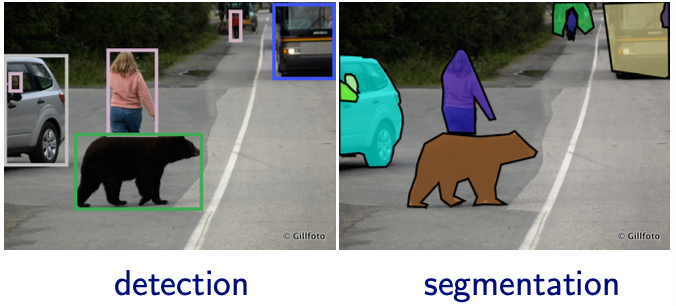

# Machine Learning Basics

For each model, we introduce

- Objective
  - What is the structural form of the model
  - What quantity to optimize

- Learning
  - Aka training, fitting, estimation
  - How to train a model capable for prediction

- Properties
  - Properties of the model

- Model Selection
  - How to select a good hyperparameter

- Interpretation
  - The logic behind the model
  - The parameter of the model
  - The results of the model

- Extension
  - Variants of the model

## Applications

### Vision

Tasks

- Classification
  - assign a label to an object in the image, e.g. digit, object ...
  - error measure: top-5 error
  - sometimes labeling is very expensive, e.g. medical images
- Detection
  - find a tight bounding box on the (visible portion) of each object from a given class
  - error measure: accuracy of the bounding box, e.g., overlap with true box
  - note: multiple classes per image, multiple instances per class
- Segmentation
  - find pixel-level outline of each object (more precise than a box)
    - instance level: separate instances of objects
    - category level (semantic segmentation): label pixels with class, do not distinguish between instances.

  :::{figure} vision-tasks
  

  Image detection and segmentation [Shakhnarovich 2021]
  :::

- For other tasks, usually use transfer learning

  1. Train a NN on ImageNet for classification
  2. For a new task,
     - if small data set, retrain only the classifier (treat CNN as fixed feature extractor)
     - if medium data set, finetune higher layers or even retrain all of the network

### Speech

Speech processing = getting machines to do everything humans do when listening to/producing/learning speech

- Listening (speech as input)
  -  Who is speaking? (Speaker identification)
  -  What are the speaker characteristics (gender, age, dialect, ...)?
  -  Separating speech from background audio, other speakers (Speech separation)
  -  What is the speaker’s emotional/health state? (Emotion recognition, ...)
  -  What words is the speaker uttering? (Speech recognition)
  -  Was a particular word/phrase uttered? (Keyword spotting/spoken term detection)
  -  What is the semantic information conveyed? (Spoken language understanding)
  -  Other “NLP” tasks on speech (translation, summarization, ...)

- Producing (generation, translation, etc):
  - What do I want to say? (Language generation)
  - How do I say a given word string? (Text-to-speech synthesis)
  - How do I convey the importance of different parts of this thought, or my emotion? (Expressive synthesis)
  - Can I imitate another speaker’s voice? (Voice conversion)

- Learning (embedding, etc)
  - What are the sounds in this language? (Phonetic unit discovery)
  - What are the units of meaning (e.g. words) in this language? (Spoken term discovery)
  - What do the words in this language mean?
  - How are words combined in this language? (Grammar induction)

  (Getting more into NLP...)

## Connections

- Representation learning & density estimation
- Clustering $\approx$ discrete representation learning

Is unsupervised learning all representation learning? Is it all density estimation? How about graph-based methods?
