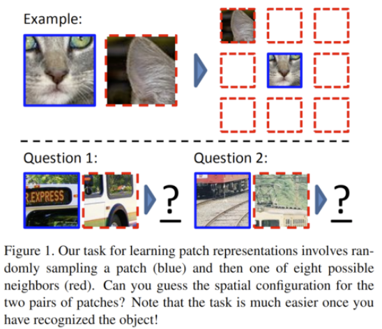
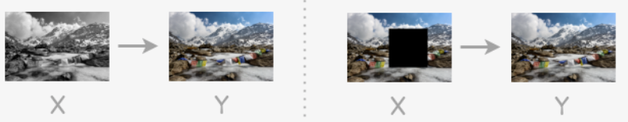
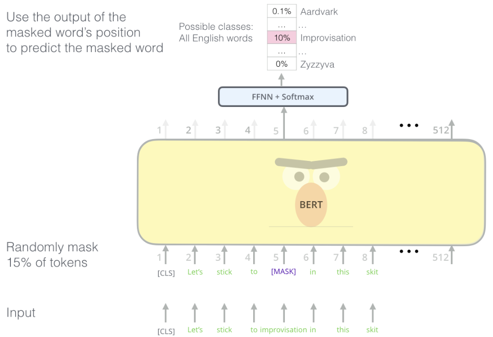

# Self-supervised Learning

```{margin}
The term "self-supervised" is used fairly loosely, and the boundary between self-supervised and other types of unsupervised learning is often unclear
```

Even if we **only** have unlabeled data, we may have some additional information that we can use to devise “proxy” or “pretext” tasks. Examples of additional information: another modality, context.

Even without any obvious additional signal, we may be able to define such pretext tasks by modifying the input somehow. A good pretext task is one that, in order to solve it well, we need to represent the “useful” information in the input.

Some examples of tasks


- Given two patches of an image, determine which location they come from.

  :::{figure} selfsup-cv-patch
  

  Image patches
  :::

- Colorization

  Color gray scale images

- Inpainting (mask reconstruction)

  Fill a masked part in an image

  :::{figure} selfsup-col-inpainting
  

  Colorization and inpainting
  :::

- Masked word reconstruction

  :::{figure} selfsup-bert
  

  Word reconstruction
  :::

In these reconstruction tasks, some layers in the model can be regarded as the learned representation of the image/text/speech, which can be used for downstream tasks.
