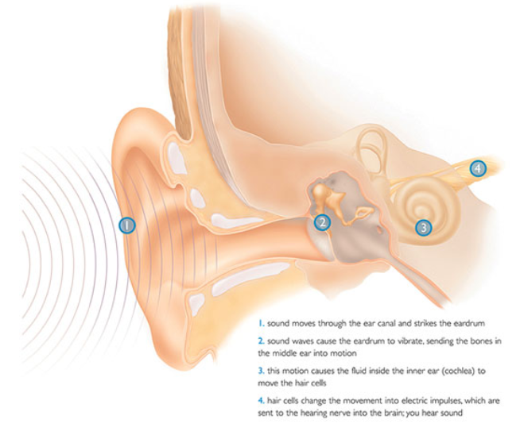
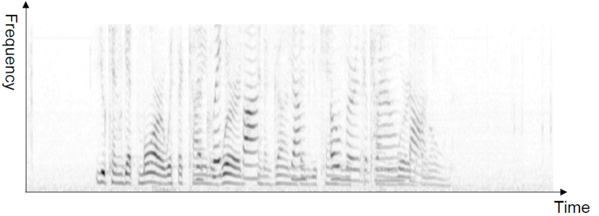

# Fourier Transform-based Representations

Why study Fourier transform in ML?

- Staple of feature representation for many types of data (audio, images, others) for many decades, still useful in many settings
- Also useful for deriving new algorithms in machine learning

Before we do any learning, we start with some data representation. Typically, this involves converting raw data into feature vectors. These days, much of feature engineering is replaced by neural network-based feature learning. But not all...choice of initial representation can still be important for

- Visualization of raw data
- Qualitative understanding of the data
- Better input to a learning algorithm
- When number of observations is small, handcraft features are also useful than complicated models, e.g. neural networks

Fourier methods include

Fourier methods include:

- Discrete-time and continuous-time Fourier series
- Discrete-time and continuous-time Fourier transforms
- Discrete Fourier transform (most common for digital signals)


## Basics

### Main idea

Decompose a signal $\left\{ \boldsymbol{x} _t \right\}=x_0, x_1, \ldots, x_{N-1}$ as a sum of multiple sinusoids at different frequencies

$$x_t=\sum_{k} a_{k} f_{k}(t)$$

where

- Signal = function of a discrete “time” variable $n$
- Subscript notation reminds us that the time variable is discrete
- $f_k(t)$ sinusoid (sine/cosine function) at frequency indexed by $k$
- $a_k =$ “amount” of frequency $k$ present in $\left\{ \boldsymbol{x} _t \right\}$, aka "**spectrum**" of the signal (but this word has other meanings).
- Fourier transform algorithms: ways of finding $a_k$ given $\left\{ \boldsymbol{x} _t \right\}$

Demo:
- http://www.falstad.com/dfilter/
- https://www.youtube.com/watch?v=spUNpyF58BY&ab_channel=3Blue1Brown

### Motivation

Physiology of hearing suggest that the structure of human ears are doing Fourier transform.

:::{figure} fourier-ear


Hairs in the cochlea (3) have different frequency responses [[image link](http://texasearcenter.com)]
:::


### Examples and Applications

- Speech

  :::{figure} fourier-speech
  

  Separate components from a speech
  :::

- Financial market data
- Weather data
- Medical imaging, other scientific imaging
- Image compression (e.g. JPEG)


Applications to machine learning

- Feature extraction, compression and de-noising of speech/images: Can be an important precursor to unsupervised (or supervised) learning
- Approximating kernels [Rahimi & Recht 2007]
- Speeding up convolutional neural networks [Mathieu et al. 2013]
- Analyzing and regularizating neural networks [Aghazadeh et al. 2020]


## Discrete Fourier Transform (DFT)

We often start with a very long signal and compute its spectrum over sub-sequences (“windows”) of fixed length $N$ starting at sample $t$

$$
\left\{ \boldsymbol{x}_t \right\} = x_t, x_{t+1}, \ldots x_{t+N-1}
$$

### Transformation

```{margin}
Euler's relation $e^{j a}=\cos (a)+j \sin (a)$ is used in derivation
```

The *discrete Fourier transform* (DFT) transforms $\left\{ \boldsymbol{x}_t \right\}$ into another sequence $\left\{ \boldsymbol{X} _k \right\} = X_0, X_1, \ldots, X_{N-1}$ where

$$
X_k=\sum_{n=t}^{t+N-1} x_n e^{-j 2 \pi k n / N}, \quad k=0, \ldots, N-1
$$

- The DFT $\left\{ \boldsymbol{X} _k \right\}$ is also called the **spectrum**. $X_k$ is the value of the spectrum at the $k$-th frequency
- Equivalently, we can consider $k = −N/2,...,0,...,N/2$, i.e. the sequence is $N$-periodic. Sometimes people write $\sum_{n=<N>}$ for simplicity
- The fast Fourier transform (FFT) is an algorithm used to compute DFT for window length $M = 2m$ for some $m$.
- After doing this for all frames (windows) of a signal, the result is a
**spectrogram**
- $X_k$ is in general complex-valued
  - often only the real part of it is used. (Why complex numbers? Real-world signals are real... but complex signals are often much easier to analyze)
  - we often use only its magnitude or phase

- units:
  - Each time sample n corresponds to a time in seconds
  - Each frequency sample k corresponds to a frequency $f(k) = \frac{k}{N} R$ in Hz, where R is the sampling rate.

Important property: Spectra of real signals are conjugate-symmetric

- Magnitude is symmetric about $k = 0$ (equivalently about $N/2$)
- Phase is anti-symmetric about $k = 0$ (equivalently about $N/2$)
- So we need only think about positive frequencies


### Relation between $X_k$ and $a_k$


For historical reasons we will define $X_k=N a_k$, i.e.

$$
a_{k}=\frac{1}{N} \sum_{n=<N>} x_n e^{-j k \omega_{0} n}
$$

which is called the **analysis equation**.

The decomposition is called the **synthesis equation**

$$
x_n=\sum_{k=<N>} a_{k} e^{j k \omega_{0} n}
$$

Note that

- $ω0 = 2π/N$
- Notation: Sometimes written $x_n \leftrightarrow a_k$
- Convenient to think of $a_k$ as being defined for all $k$, although we only need a subset of $N$ of them: $a_{k+N} = a_k$
- Since $x_n$ is periodic, it is specified uniquely by only $N$ numbers, either in time or in frequency domain


### Examples

Cosine function

$$
\begin{aligned}
x_n &=\cos \left(\frac{\pi}{4} n\right) \\
&=\frac{1}{2}\left(e^{j \pi n / 4}+e^{-j \pi n / 4}\right) \\
\Longrightarrow \omega_{0} &=\pi / 4, N=8, a_{1}=a_{-1}=1 / 2, X[1]=X[-1]=8 \frac{1}{2}=4
\end{aligned}
$$

Sine function

$$
\begin{aligned}
x_n &=\sin \left(\frac{\pi}{4} n\right) \\
&=\frac{1}{2 j}\left(e^{j \pi n / 4}-e^{-j \pi n / 4}\right) \\
\Longrightarrow \omega_{0} &=\pi / 4, N=8, a_{1}=\frac{1}{2 j}, a_{-1}=-\frac{1}{2 j}
\end{aligned}
$$


## Continuous-time Fourier Transform

Even though we mainly deal with digitized data, we sometimes wish to reason about continuous-time functions. Continuous-time Fourier transform describes signals as continuous “sums” (integrals) of sinusoids at arbitrary frequency $\omega$.


$$\begin{aligned}
x(t) &=\frac{1}{2 \pi} \int_{-\infty}^{\infty} X(j \omega) e^{j \omega t} \mathrm{~d} \omega &\text { Synthesis equation } \\
X(j \omega) &=\int_{-\infty}^{\infty} x(t) e^{-j \omega t}  \mathrm{~d} t & \text { Analysis equation }
\end{aligned}$$

## 2-D Discrete-“time” Fourier series/transforms

$$
\begin{aligned}
X_{k l}=& \frac{1}{M N} \sum_{<N>} \sum_{<M>} x[m, n] e^{-j 2 \pi(n k / N+m l / M)} \\
& \text{where }  0 \leq k \leq N-1,0 \leq l \leq M-1 \\
x[m, n]=& \sum_{k=0}^{N-1} \sum_{l=0}^{M-1} X_{k l} e^{j 2 \pi(n k / N+m l / M)}
\end{aligned}
$$

- Equivalent to 1-D transforms when one frequency dim is **fixed**.

- 2-D fast Fourier transform requires $M N (\log _{2} M) (\log _{2} N)$ operations.

### 2-D Discrete-"time" convolution

$$
y\left[n_{1}, n_{2}\right]=x\left[n_{1}, n_{2}\right] * h\left[n_{1}, n_{2}\right]=\sum_{k_{1}=-\infty}^{\infty} \sum_{k_{2}=-\infty}^{\infty} x\left[k_{1}, k_{2}\right] h\left[n_{1}-k_{1}, n_{2}-k_{2}\right]
$$

- This is the operation being done in convolutional neural networks, on the image $x$ and the filter $h$.
- But we typically don’t bother with flipping the filter and state it as a dot product
- The properties of convolution tell us $Y_{k l}=X_{k l} H_{k l}$
