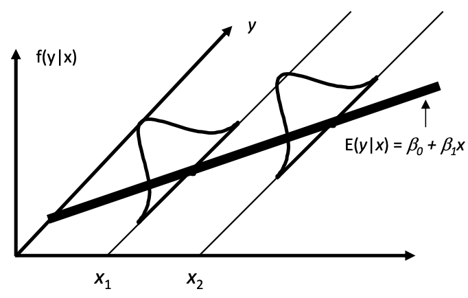

# Linear Models

<!-- TOC -->

- [Linear Models](#linear-models)
  - [Objective](#objective)
    - [Assumptions](#assumptions)
  - [Learning (Estimation)](#learning-estimation)
    - [Least Squares](#least-squares)
    - [Maximum Likelihood](#maximum-likelihood)
    - [Gradient Descent](#gradient-descent)
  - [Properties](#properties)
    - [Coefficients](#coefficients)
    - [Residual](#residual)
    - [Decomposition of Total Sum of Squares](#decomposition-of-total-sum-of-squares)
  - [Model Selection](#model-selection)
- [Special Cases](#special-cases)
  - [Interpretation](#interpretation)
    - [What is ANOVA?](#what-is-anova)

<!-- /TOC -->


## Objective

To estimate how $y$ change with $x$.

Model:

$$Y_i  = \boldsymbol{x}_i ^\top \boldsymbol{\beta}  + \varepsilon_i $$

In matrix form,

$$
\boldsymbol{y} = \boldsymbol{X} \boldsymbol{\beta} + \boldsymbol{\varepsilon}.
$$

where
- $\boldsymbol{X}_{n\times p}$ is called the design matrix. There are $p$ independent variables (aka covariates) $X_1, X_2, \ldots, X_p$ and $n$ observations. The first columns is usually $\boldsymbol{1}$ , i.e. intercept.
- $\boldsymbol{y}_{n \times 1}$ is a vector of dependent variable.
- $\boldsymbol{\beta}_{n \times 1}$ are coefficients to be estimate
- $\boldsymbol{\varepsilon}_{n \times 1}$ are unobserved random error

When $p=2$, we have

$$
Y_i = \beta_0 + \beta_1 x_i + \varepsilon_i
$$


### Assumptions

Weak assumptions

- $\boldsymbol{x}_i$ is known and fixed
- $\operatorname{E}\left( y_i \right) = \boldsymbol{x}_i ^\top \boldsymbol{\beta}$ is linear in covariates $X_j$.
- The error terms are i.i.d. distributed with mean $\operatorname{E}\left( \varepsilon_i \right) = 0$ and variance $\operatorname{Var}\left( \varepsilon_i \right) = \sigma^2$.

  As a result, $\operatorname{E}\left( \boldsymbol{y}  \mid \boldsymbol{X} \right) = \boldsymbol{X} \boldsymbol{\beta}$, or $\operatorname{E}\left( y \mid x \right) = \beta_0 + \beta_1 x$ when $p=2$, which can be illustrated by the plots below.

  <div align="center">
  
  </div>

  <div align="center">
  
  </div>

  To predict $\hat{y}_i$, we just use $\hat{y}_i = \boldsymbol{x}_i ^\top \hat{\boldsymbol{\beta}}$ .


```{note}
In some social science courses, there is an Zero Conditional Mean assumption: $\operatorname{E}\left( \varepsilon_i \mid \boldsymbol{x}_i  \right) = 0$ and it is used for estimation.
```

Strong assumptions on the distribution of error term (necessary for some inference)

- The error terms follow Gaussian distribution $\varepsilon_i \overset{\text{iid}}{\sim}N(0, \sigma^2)$, or $\boldsymbol{\varepsilon} \sim N_n (\boldsymbol{0} , \sigma^2 \boldsymbol{I} _n)$.

  As a result, we have $Y_i \sim N(\boldsymbol{x}_i ^\top \boldsymbol{\beta} , \sigma^2 )$ or $\boldsymbol{y} \sim N_n(\boldsymbol{X} \boldsymbol{\beta} , \sigma^2 \boldsymbol{I} _n)$


## Learning (Estimation)


### Least Squares

We can estimate the parameter $\hat{\boldsymbol{\beta}}$ by minimizing the sum of squared errors.


$$\begin{align}
\hat{\boldsymbol{\beta}} &= \underset{\boldsymbol{\beta} }{\mathrm{argmin}} \, \left\Vert \boldsymbol{y}  - \hat{\boldsymbol{y}}  \right\Vert ^2 \\
&= \underset{\boldsymbol{\beta} }{\mathrm{argmin}} \, \left\Vert \boldsymbol{y}  - \boldsymbol{X}  \boldsymbol{\beta}  \right\Vert ^2 \\
\end{align}$$


The gradient w.r.t. $\boldsymbol{\beta}$ is

$$\begin{align}
\nabla_{\boldsymbol{\beta}} &= -2 \boldsymbol{X}  ^\top (\boldsymbol{y} - \boldsymbol{X} \boldsymbol{\beta} )  \\
&\overset{\text{set}}{=} \boldsymbol{0}
\end{align}$$

Hence, we have

$$
\boldsymbol{X} ^\top \boldsymbol{X} \boldsymbol{\beta} = \boldsymbol{X} ^\top \boldsymbol{y}
$$

This linear system is called the **normal equation**.

The closed form solution is
$$\hat{\boldsymbol{\beta}} = \left( \boldsymbol{X} ^\top \boldsymbol{X}   \right)^{-1}\boldsymbol{X} \boldsymbol{y}  $$

```{note}
Computer programs use specific functions to solve the normal equation $\boldsymbol{X} ^\top \boldsymbol{X} \boldsymbol{\beta}$ for $\boldsymbol{\beta}$, instead of using the inverse $(\boldsymbol{X} ^\top \boldsymbol{X}) ^{-1}$ directly which can be slow and unstable.
```

An unbiased estimator of the error variance $\sigma^2 = \operatorname{Var}\left( \varepsilon \right)$ is (to be discussed [later])

$$
\hat{\sigma}^2 = \frac{\left\Vert \boldsymbol{y} - \boldsymbol{X} \hat{\boldsymbol{\beta}} \right\Vert ^2}{n-p}
$$


When $p=2$, we have


$$\hat{\beta_0}, \hat{\beta_1} =  \underset{\beta_0, \beta_1 }{\mathrm{argmin}} \, \sum_i \left( y_i - \beta_0 - \beta_1 x_i \right)^2$$

Differentiation w.r.t. $\beta_1$ gives

$$
- 2\sum_i (y_i - \beta_0 - \beta_1 x_i) x_i = 0
$$

Differentiation w.r.t. $\beta_0$ gives

$$
- 2\sum_i (y_i - \beta_0 - \beta_1 x_i)= 0
$$

Solve the system of the equations, we have

$$\begin{align}
\hat{\beta}_{1} &=\frac{\sum_{i=1}^{n}\left(x_{i}-\bar{x}\right)\left(y_{i}-\bar{y}\right)}{\sum_{i=1}^{n}\left(x_{i}-\bar{x}\right)^{2}} \\
\hat{\beta}_{0} &=\bar{y}-\hat{\beta}_{1} \bar{x}
\end{align}$$

Moreover,


$$
\hat{\sigma}^2 = \frac{1}{n-2} \sum_i \hat\varepsilon_i^2
$$

where $\hat\varepsilon_i = y_i - \hat{\beta}_0 - \hat{\beta}_1 x_i$.


```{note}
The objective function, sum of squared errors,

$$
\left\Vert \boldsymbol{y}  - \boldsymbol{X}  \boldsymbol{\beta}  \right\Vert ^2 = \sum_i \left( y_i - \boldsymbol{x}_i ^\top \boldsymbol{\beta} \right)^2
$$

can be replaced by mean squared error,


$$
\frac{1}{n} \sum_i \left( y_i - \boldsymbol{x}_i ^\top \boldsymbol{\beta} \right)^2
$$

and the results are the same.
```


### By Assumptions

In some social science courses, the estimation is done by using the assumptions
- $\operatorname{E}\left( \varepsilon \right) = 0$
- $\operatorname{E}\left( \varepsilon \mid X \right) = 0$

The first one gives


$$
\begin{equation}
\frac{1}{n}  \sum_{i=1}^{n}\left(y_{i}-\hat{\beta}_{0}-\hat{\beta}_{1} x_{i}\right)=0
\end{equation}
$$

The second one gives


$$\begin{align}
\operatorname{Cov}\left( X, \varepsilon \right)
&= \operatorname{E}\left( X \varepsilon \right) - \operatorname{E}\left( X \right) \operatorname{E}\left( \varepsilon \right) \\
&= \operatorname{E}\left[ \operatorname{E}\left( X \varepsilon \mid X \right) \right] - \operatorname{E}\left(  X \right)\operatorname{E}\left[ \operatorname{E}\left( \varepsilon \mid X\right) \right]\\
&= \operatorname{E}\left[ X \operatorname{E}\left( \varepsilon \mid X \right) \right] - \operatorname{E}\left(  X \right)\operatorname{E}\left[ \operatorname{E}\left( \varepsilon \mid X\right) \right]\\
&= 0
\end{align}$$

which gives


$$
\frac{1}{n}  \sum_{i=1}^{n} x_{i}\left(y_{i}-\hat{\beta}_{0}-\hat{\beta}_{1} x_{i}\right)=0
$$

Therefore, we have the same normal equations to solve for $\hat{\beta}_0$ and $\hat{\beta}_1$.


### Maximum Likelihood

biased. TBD.

### Gradient Descent

TBD.

## Properties

### Sign of Slope vs Correlation

When $p=2$, we can see from the solution

$$\begin{align}
\hat{\beta}_{1} &=\frac{\sum_{i=1}^{n}\left(x_{i}-\bar{x}\right)\left(y_{i}-\bar{y}\right)}{\sum_{i=1}^{n}\left(x_{i}-\bar{x}\right)^{2}}
\end{align}$$

that

$$\begin{align}
\hat{\beta_1} &= \frac{\widehat{\operatorname{Cov}}\left( Y, X \right)}{\widehat{\operatorname{Var}}\left( X \right)}  \\
&= r_{X,Y} \frac{s_Y}{s_X}
\end{align}$$

Thus, the slope has the same sign with the correlation $r_{X,Y}$, and equals to the correlation times a ratio of the sample standard deviations of the dependent variable over the independent variable.

### Fitted Line Passes Sample Mean

Since $\hat{\beta}_{0} =\bar{y}-\hat{\beta}_{1} \bar{x}$, we have $\bar{y} = \hat{\beta}_{0} + \hat{\beta}_{1} \bar{x}$, i.e. the regression line always goes through the mean $(\bar{x}, \bar{y})$ of the sample.


### Inference

#### Slope

The OLS estimators are unbiased since

$$\begin{align}
\operatorname{E}\left( \hat{\boldsymbol{\beta} } \right) &= \operatorname{E}\left( (\boldsymbol{X} ^\top \boldsymbol{X} ) ^{-1} \boldsymbol{X}^\top  \boldsymbol{y}  \right) \\
&=  (\boldsymbol{X} ^\top \boldsymbol{X} ) ^{-1} \boldsymbol{X} ^\top  \operatorname{E}\left( \boldsymbol{y} \right) \\
&=  (\boldsymbol{X} ^\top \boldsymbol{X} ) ^{-1} \boldsymbol{X} ^\top  \boldsymbol{X} \boldsymbol{\beta} \\
&= \boldsymbol{\beta}
\end{align}$$

when $p=2$,

$$\begin{align}
\hat{\beta}_{1}
&=\frac{\sum_{i=1}^{n}\left(x_{i}-\bar{x}\right)\left(y_{i}-\bar{y}\right)}{\sum_{i=1}^{n}\left(x_{i}-\bar{x}\right)^{2}} \\
\end{align}$$

Using the fact that for any constant $c$,

$$
\sum_i (x_i - \bar{x})c = 0
$$


the numerator becomes

$$\begin{align}
\sum_{i=1}^{n}\left(x_{i}-\bar{x}\right)\left(y_{i}-\bar{y}\right)
&=\sum\left(x_{i}-\bar{x}\right)\left(\beta_{0}+\beta_{1} x_{i}+u_{i}\right) \\
&=\sum\left(x_{i}-\bar{x}\right) \beta_{0}+\sum\left(x_{i}-\bar{x}\right) \beta_{1} x_{i} +\sum\left(x_{i}-\bar{x}\right) u_{i} \\
&=\beta_{0} \sum\left(x_{i}-\bar{x}\right)+\beta_{1} \sum\left(x_{i}-\bar{x}\right) x_{i} +\sum\left(x_{i}-\bar{x}\right) u_{i} \\
&=\beta_{1} \sum\left(x_{i}-\bar{x}\right)^2 +\sum\left(x_{i}-\bar{x}\right) u_{i} \\
\end{align}$$

Hence

$$
\begin{equation}
\hat{\beta}_{1}=\beta_{1}+\frac{\sum\left(x_{i}-\bar{x}\right) u_{i}}{\sum \left(x_{i}-\bar{x}\right)^{2}}
\end{equation}
$$


Variance

$$\begin{align}
\operatorname{Var}\left( \hat{\beta}_1 \right)
&= \operatorname{Var}\left( \beta_{1}+\frac{\sum\left(x_{i}-\bar{x}\right) u_{i}}{\sum \left(x_{i}-\bar{x}\right)^{2}} \right)\\
&= \frac{\operatorname{Var}\left( \sum\left(x_{i}-\bar{x}\right) u_{i} \right)}{\left[ \sum \left(x_{i}-\bar{x}\right)^{2} \right]^2}\\
&= \frac{\sum\left(x_{i}-\bar{x}\right)^2 \operatorname{Var}\left( u_{i} \right)}{\left[ \sum \left(x_{i}-\bar{x}\right)^{2} \right]^2}\\
&= \sigma^2 \frac{\sum\left(x_{i}-\bar{x}\right)^2 }{\left[ \sum \left(x_{i}-\bar{x}\right)^{2} \right]^2}\\
&= \frac{\sigma^2}{\sum \left(x_{i}-\bar{x}\right)^{2}}\\
&= \frac{\sigma^2}{(n-1)s_X^2}\\
\end{align}$$

We conclude that

- The larger the error variance, $\sigma^2$, the larger the variance of the slope estimator
- The larger the variability in the $x_i$, the smaller the variance of the slope estimator
- A larger sample size should decrease the variance of the slope estimator
- A problem is that the error $\sigma^2$ variance is unknown

We can estimate $\sigma^2$ by $\hat{\sigma}^2=\frac{\sum_i (x_i - \bar{x})}{n-2}$ (to be shown below), and substitute it into $\operatorname{Var}\left( \hat{\beta}_1 \right)$. Since $\hat{\sigma}^2$ is estimated, the variance $\operatorname{Var}\left( \hat{\beta}_1 \right)$ is estimated too, and the square root is called standard error of $\hat{\beta}$, instead of standard deviation.


$$\begin{align}
\operatorname{se}\left(\hat{\beta}_{1}\right)
&= \sqrt{\widehat{\operatorname{Var}}\left( \hat{\beta}_1 \right)}\\
&= \frac{\hat{\sigma}}{\sqrt{\sum \left(x_{i}-\bar{x}\right)^{2}}}
\end{align}$$

#### Residual

The residual $\hat\varepsilon_i = y_i - \hat{y}_i$ is an estimate of the error term $\varepsilon_i$, and is the vertical difference between the fitted regression line and the observation points.

The sum of the residual is zero. Recall the normal equation

$$
\boldsymbol{X} ^\top (\boldsymbol{y} - \boldsymbol{X} \hat{\boldsymbol{\beta} }) = \boldsymbol{0}
$$

Since the first column of $\boldsymbol{X}$ is $\boldsymbol{1}$ , we have

$$\begin{align}
\sum_i \hat{\varepsilon}_i  
&= \sum_i(y_i - \hat{y}_i)  \\
&= \sum_i(y_i - \boldsymbol{x}_i ^\top \hat{\boldsymbol{\beta} }_i)  \\
&= 0
\end{align}$$

From the normal equation we can also get

$$
\sum_i x_{ij} \hat{\varepsilon}_i = 0
$$

for all $j$.

These two equations together gives the zero sample covariance between residuals and each covariate $X_j$.

$$
\widehat{\operatorname{Cov}}\left(X_j, \varepsilon \right) = 0
$$


### Decomposition of Total Sum of Squares

We can think of each observation as being made up of an explained part, and an unexplained part.

- Total sum of squares: $SST = \sum\left(y_{i}-\bar{y}\right)^{2}$
- Sum of squares due to regression : $SSR = \sum\left(\hat{y}_{i}-\bar{y}\right)^{2}$
- Sum of squared errors: $SSE = \sum (y_i - \hat{y}_i)^2$

Then

$$\begin{align}
SST
&=\sum\left(y_{i}-\bar{y}\right)^{2} \\
&=\sum\left[\left(y_{i}-\hat{y}_{i}\right)+\left(\hat{y}_{i}-\bar{y}\right)\right]^{2} \\
&=\sum\left[\hat{\varepsilon}_{i}+\left(\hat{y}_{i}-\bar{y}\right)\right]^{2} \\
&=\sum \hat{\varepsilon}_{i}^{2}+2 \sum \hat{\varepsilon}_{i}\left(\hat{y}_{i}-\bar{y}\right)+\sum\left(\hat{y}_{i}-\bar{y}\right)^{2} \\
&=\mathrm{SSR}+2 \sum \hat{\varepsilon}_{i}\left(\hat{\beta}_0 + \hat{\beta}_1 x_{i}-\bar{y}\right)+SSE \\
&= SSR + SSE
\end{align}$$

where use the fact that $\sum_i \varepsilon_i = 0$ and $\sum_i \varepsilon_i x_i = 0$ shown [above].


```{warning}
Some social science courses use $SSR$ and $SSE$ denote the opposite quantity in statistics courses.

Explained sum of squares: $SSE = \sum\left(\hat{y}_{i}-\bar{y}\right)^{2}$
Residual sum of squares: $SSR = SSE = \sum (y_i - \hat{y}_i)^2$
```

#### Error Variance

Now we find an unbiased estimator for $\sigma^2$.


## Model Selection


### $R$-squared

R-squared (R2) is a statistical measure that represents the proportion of the variance for a dependent variable that's explained by an independent variable or variables in a regression model. Whereas correlation explains the strength of the relationship between an independent and dependent variable, R-squared explains to what extent the variance of one variable explains the variance of the second variable.

$$
R^2 = \frac{SSR}{SST}  = 1 - \frac{SSE}{SST}
$$

relation with $\beta$ in simple linear models:


## Special Cases

### Non-zero Mean of Error Term

If $\operatorname{E}\left( \varepsilon \right) = \mu_\varepsilon \ne 0$, we can just denote $\varepsilon = \mu_\varepsilon + v$, where $v$ is a new error term with zero mean. Our model becomes

$$
y_i = (\beta_0 + \mu_\varepsilon) + \beta_1 x_1 + v
$$

where $(\beta_0 + \mu_\varepsilon)$ is the new intercept. We can still apply the methods above to conduct estimation and inference.

### No Intercept

If there is no intercept, consider a simple case

$$
y = \beta x + \varepsilon
$$

Then by minimizing sum of squared errors

$$
\min \sum_i (y_i - \beta x)^2
$$

we have


$$
-2 \sum_i (y_i - \beta x) x = 0
$$

and hence,


$$\begin{align}
\tilde{\beta}
&= \frac{\sum_i x_i y_i}{\sum_i x_i^2} \\
&= \frac{\sum_i x_i (\beta x_i + \varepsilon_i)}{\sum_i x_i^2}\\
&= \beta + \frac{\sum x_i \varepsilon_i}{\sum_i x_i^2}
\end{align}$$

Therefore, $\tilde{\beta}$ is still an unbiased estimator of $\beta$, while its variance is smaller than the variance calculated assuming the intercept is non-zero.

$$
\operatorname{Var}\left( \tilde{\beta} \right) = \frac{\sigma^2}{\sum x_i^2} \le  \frac{\sigma^2}{\sum (x_i - \bar{x})^2} = \operatorname{Var}\left( \hat{\beta}  \right)
$$

Hence, if the intercept is known to be zero, better use $\tilde\beta$ instead of $\hat\beta$, since the standard error of the $\tilde\beta$ is smaller, and both are unbiased.

If the true model has a non-zero intercept, then $\tilde\beta$ is biased for $\beta$, but it has a smaller variance, which brings a tradeoff of bias vs variance.

### Transformation

If $X ^\prime = aX + b$, then the new slope estimate is


$$\begin{align}
\tilde{\beta}_1 &= \frac{\widehat{\operatorname{Cov}}\left( Y, X ^\prime \right)}{\widehat{\operatorname{Var}}\left( X ^\prime \right)}  \\
&= \frac{\widehat{\operatorname{Cov}}\left( Y, aX + b  \right)}{\widehat{\operatorname{Var}}\left( aX+b \right)}  \\
&= \frac{a\widehat{\operatorname{Cov}}\left( Y, X \right)}{a^2\widehat{\operatorname{Var}}\left( X \right)}  \\
&= \frac{1}{a} \hat\beta_1 \\
\end{align}$$

and the new intercept is

$$\begin{align}
\tilde\beta_0
&= \bar{y} - \tilde\beta_1 \bar{x} ^\prime \\
&= \bar{y} - \hat\beta_1 \frac{1}{a}  (a\bar{x}+b) \\
&= \hat\beta_0 - \hat\beta_1 \frac{b}{a} \\
\end{align}$$

If $Y ^\prime = cY + d$ then


$$\begin{align}
\tilde{\beta}_1 &= \frac{\widehat{\operatorname{Cov}}\left( Y ^\prime, X ^\prime \right)}{\widehat{\operatorname{Var}}\left( X ^\prime \right)}  \\
&= \frac{\widehat{\operatorname{Cov}}\left( cY+d, X  \right)}{\widehat{\operatorname{Var}}\left( X \right)}  \\
&= \frac{c\widehat{\operatorname{Cov}}\left( Y, X \right)}{c\widehat{\operatorname{Var}}\left( X \right)}  \\
&= c \hat\beta_1 \\
\end{align}$$

and 

$$\begin{align}
\tilde\beta_0
&= \bar{y}^\prime - \tilde\beta_1 \bar{x} \\
&= (c\bar{y}+d) - c\hat\beta_1 \bar{x} \\
&= c\hat\beta_0 + d\\
\end{align}$$

### Omitted Variable Bias

TBD

### Heteroscedasticity

TBD

## Interpretation


### What is ANOVA?
The Analysis Of Variance, popularly known as the ANOVA, can be used in cases where there are more than two groups.

https://www.1point3acres.com/bbs/thread-703302-1-1.html
