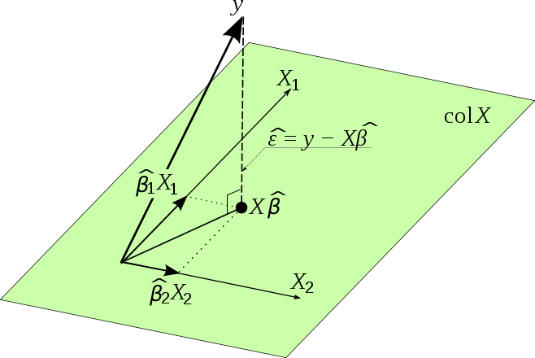

---
jupytext:
  formats: md:myst
  text_representation:
    extension: .md
    format_name: myst
    format_version: 0.12
    jupytext_version: 1.9.1
kernelspec:
  display_name: Python 3
  language: python
  name: python3
---

# Linear Models - Estimation

From this section we introduce linear models from a statistics’ perspective. There are three sections in total.

1. The first section covers the model fundamentals, including assumptions, estimation, interpretation and some exercise.

2. The next section introduce statistical inference for linear models, such as distribution of the estimated coefficients, $t$-test, $F$-test, etc. Usually machine learning community focuses more on prediction, less on inference. But inference does matters. It analyzes how important each variable is in the model from a rigorous approach.

3. The third section introduce some issues in linear models, e.g. omitted variables bias, multicollinearity, heteroscedasticity, and some alternative models, e.g. Lasso, ridge regression, etc.


:::{admonition,dropdown,note} Statistics’ perspective vs social science’s perspective

The introduction from econometrics’ perspective or social science’s perspective may be different. In short, the statistics’ perspective focuses on general multivariate cases and heavily rely on linear algebra for derivation, while the econometrics’ or the social science’s perspective prefers to introduce models in univariate cases by basic arithmetics (whose form can be complicated without linear algebra notations) and extend the intuitions and conclusions into multivariate cases.

Personally, I involved in four courses that introduced linear models, i.e. at undergrad/grad level offered by stat/social science department. The style of the two courses offered by the stat departments were quite alike while the graduate level one covered more topics. In both undergrad/grad level courses offered by the social science departments, sometimes I got confused by the course materials that were contradictory to my statistics training , but the instructors had no clear response or even no response at all...

In sum, to fully understand the most fundamental and widely used statistical model, I highly suggest to take a linear algebra course first and take the regression course offered by math/stat department.

:::


## Objective

Linear models aim to model the relationship between a scalar response and one or more explanatory variables in a linear format:

$$Y_i  = \beta_0 + \beta_1 x_{i,1} + \ldots + \beta_{p-1} x_{i,p-1}  + \varepsilon_i $$

for observations $i=1, 2, \ldots, n$.

In matrix form,

$$
\boldsymbol{y} = \boldsymbol{X} \boldsymbol{\beta} + \boldsymbol{\varepsilon}.
$$

where
- $\boldsymbol{X}_{n\times p}$ is called the design matrix. The first column is usually set to be $\boldsymbol{1}$, i.e., intercept. The remaining $p-1$ columns are designed values $x_{ij}$ where $i = 1, 2, \ldots, n$ and $j=1, \ldots, p-1$. These $p-1$ columns are called explanatory/independent variables, or covariates.
- $\boldsymbol{y}_{n \times 1}$ is a vector of response/dependent variables $Y_1, Y_2, \ldots, Y_n$.
- $\boldsymbol{\beta}_{p \times 1}$ is a vector of coefficients to be estimated.
- $\boldsymbol{\varepsilon}_{n \times 1}$ is a vector of unobserved random errors, which includes everything that we have not measured and included in the model.

When $p=2$, we have

$$
Y_i = \beta_0 + \beta_1 x_i + \varepsilon_i
$$

which is called **simple linear regression**.

When $p>2$, it is called **multiple linear regression**. For instance, when $p=3$

$$
Y_i = \beta_0 + \beta_1 x_1 + \beta_2 x_2 + \varepsilon_i
$$

When there are multiple dependent variables, we call it **multivariate regression**, which will be introduced in another section.

When $p=1$,

- if we include intercept, then the regression model $y_i = \beta_0$ means that we use a single constant to predict $y_i$. The estimator, $\hat{\beta}_0$, by ordinary least square, should be the sample mean $\hat{y}$.
- if we do not include intercept, then the regression model $y_i = \beta x_i$ means that we expect that $y$ is proportional to $x$.

:::{admonition,dropdown,note} Fixed or random $\boldsymbol{X}$?
In natural science, researchers design $n\times p$ values in the design matrix $\boldsymbol{X}$ and run experiments to obtain the response $y_i$. We call this kind of data **experimental data**. In this sense, the explanatory variables $x_{ij}$’s are designed before the experiment, so they are also constants. The coefficients $\beta_j$’s are unknown constants. The error term $\varepsilon_i$ is random. The response variable $Y_i$ on the left hand side is random due to the randomness in the error term $\varepsilon_i$.

In social science, most of data is **observational data**. That is, researchers obtain the values of many variables at the same time, and choose one of interest to be the response variable $y_i$ and some others to be the explanatory variables $\boldsymbol{x}_i$. In this case, $\boldsymbol{X}$ is viewed as a data set, and we can talk about descriptive statistics, such as variance of each explanatory variable, or covariance between pair of explanatory variables. This is valid since we often view the columns of a data set as random variables.

However, the inference methods of the coefficients $\boldsymbol{\beta}$ are developed based on the natural science setting, i.e., the values of explanatory variables are pre-designed constants. Many social science courses frequently use descriptive statistics of the explanatory variables which assumes they are random, and apply inference methods which assumes they are constant. This is quite confusing for beginners to linear models.

To be clear, we stick to the natural science setting and make the second assumption below. We use subscript $i$ in every $y_i, x_i, \varepsilon_i$ instead of $y, x, \varepsilon$ which gives a sense that $x$ is random. And we use descriptive statistics for the explanatory variables only when necessary.
:::

## Assumptions

Basic assumptions

1.  $\operatorname{E}\left( y_i \right) = \boldsymbol{x}_i ^\top \boldsymbol{\beta}$ is **linear** in covariates $X_j$.

2.  The values of explanatory variables $\boldsymbol{x}_i$ are known and fixed. Randomness only comes from $\varepsilon_i$.

3.  No $X_j$ is constant for all observations. No exact linear relationships among the explanatory variables (aka no perfect multicollinearity, or the design matrix $\boldsymbol{X}$ is of full rank).

4.  The error terms are uncorrelated $\operatorname{Cov}\left( \varepsilon_i, \varepsilon_j \right)= 0$, with common mean $\operatorname{E}\left( \varepsilon_i \right) = 0$ and variance $\operatorname{Var}\left( \varepsilon_i \right) = \sigma^2$ (homoskedasticity).

    As a result, $\operatorname{E}\left( \boldsymbol{y} \mid \boldsymbol{X} \right) = \boldsymbol{X} \boldsymbol{\beta}$, or $\operatorname{E}\left( y_i \mid x_i \right) = \beta_0 + \beta_1 x_i$ when $p=2$, which can be illustrated by the plots below.

    :::{figure} lm-distribution-of-y-given-x
    

    Distributions of $y$ given $x$ \[Meyer 2021\]
    :::

    :::{figure} lm-observation-of-y-given-x
    

    Observations of $y$ given $x$ \[Meyer 2021\]
    :::

    To predict $\hat{y}_i$, we just use $\hat{y}_i = \boldsymbol{x}_i ^\top \hat{\boldsymbol{\beta}}$ .

5.  The error terms are independent and follow Gaussian distribution $\varepsilon_i \overset{\text{iid}}{\sim}N(0, \sigma^2)$, or $\boldsymbol{\varepsilon} \sim N_n (\boldsymbol{0} , \sigma^2 \boldsymbol{I} _n)$.

    As a result, we have $Y_i \sim N(\boldsymbol{x}_i ^\top \boldsymbol{\beta} , \sigma^2 )$ or $\boldsymbol{y} \sim N_n(\boldsymbol{X} \boldsymbol{\beta} , \sigma^2 \boldsymbol{I} _n)$

These assumptions are used for different objectives. The first 3 assumptions are the base, and in additiona to them,
- derivation of $\hat{\boldsymbol{\beta}}$ by least squares uses no more assumptions.
- derivation of $\hat{\boldsymbol{\beta}}$ by maximal likelihood uses assumptions 4 and 5.
- derivation of $\operatorname{E}\left( \hat{\boldsymbol{\beta}} \right)$ uses $\operatorname{E}\left( \varepsilon_i \right) = 0$ in 4.
- derivation of $\operatorname{Var}\left( \hat{\boldsymbol{\beta}} \right)$ uses 1, 2, $\operatorname{Cov}\left( \varepsilon_i, \varepsilon_j \right) = 0$ and $\operatorname{Var}\left( \epsilon_i \right) = \sigma^2$ in 4.
- proof of Gaussian-Markov Theorem (BLUE) uses 4.
- derivation of the distribution of $\hat{\boldsymbol{\beta} }$ uses 4 and 5.

:::{admonition,dropdown,note} Zero conditional mean assumption
In some social science or econometrics courses, they follow the “Gauss-Markov assumptions” that are roughly the same to the assumptions, but in different formats. One of them is zero conditional mean assumption.

In general, it says

$$
\operatorname{E}\left( \varepsilon \mid x_1, x_2, \ldots, x_p\right) = 0
$$

For $p=2$, it is

$$\operatorname{E}\left( \varepsilon \mid x  \right) = 0$$

which (in their setting) implies

$$\begin{align}
\operatorname{E}\left( \varepsilon \right)
&= \operatorname{E}\left( \operatorname{E}\left( \varepsilon \mid x \right) \right)\\
&= 0\\
\operatorname{Cov}\left( \varepsilon, x \right)
&= \operatorname{E}\left( \varepsilon x \right) - \operatorname{E}\left( \varepsilon \right)\operatorname{E}\left( x \right)\\
&= \operatorname{E}\left( \operatorname{E}\left( \varepsilon x \mid x \right) \right)- 0 \times \operatorname{E}\left( x \right)\\
&= \operatorname{E}\left( x \operatorname{E}\left( \varepsilon \mid x \right) \right) \\
&= 0
\end{align}$$

Then they these two corollaries are used for [estimation](lm-estimation-by-assumpation).

As discussed above, in their setting $x$ is random (at this stage), so they use notations such as $\operatorname{E}\left( \varepsilon \mid x \right)$ and $\operatorname{Cov}\left( x, \varepsilon \right)$. It also seems that they view $\varepsilon$ as an “overall” measure of random error, instead of $\varepsilon_i$ for specific $i$ in the natural science setting. But they can mean so by using the conditional notation $\operatorname{E}\left( \varepsilon \mid x \right)$.
:::

## Estimation

We introduce various methods to estimate the parameters $\boldsymbol{\beta}$ and $\sigma^2$.

### Ordinary Least Squares

The most common way is to estimate the parameter $\hat{\boldsymbol{\beta}}$ by minimizing the sum of squared errors $\sum_i(y_i-\hat{y}_i)^2$.

```{margin} A note on substitution
We substitute the predicted $\hat{\boldsymbol{y} }$ by $\boldsymbol{X} \boldsymbol{\beta}$. The $\boldsymbol{\beta}$ here just means a variable in the optimization problem, not the unknown constant coefficients in our model.
```

$$\begin{align}
\hat{\boldsymbol{\beta}} &= \underset{\boldsymbol{\beta} }{\mathrm{argmin}} \, \left\Vert \boldsymbol{y}  - \hat{\boldsymbol{y}}  \right\Vert ^2 \\
&= \underset{\boldsymbol{\beta} }{\mathrm{argmin}} \, \left\Vert \boldsymbol{y}  - \boldsymbol{X}  \boldsymbol{\beta}  \right\Vert ^2 \\
\end{align}$$

The gradient w.r.t. $\boldsymbol{\beta}$ is

$$\begin{align}
\nabla_{\boldsymbol{\beta}} &= -2 \boldsymbol{X}  ^\top (\boldsymbol{y} - \boldsymbol{X} \boldsymbol{\beta} )  \\
&\overset{\text{set}}{=} \boldsymbol{0}
\end{align}$$

Hence, we have

$$
\boldsymbol{X} ^\top \boldsymbol{X} \boldsymbol{\beta} = \boldsymbol{X} ^\top \boldsymbol{y}
$$

This linear system is called the **normal equation**.

The closed form solution is

$$\hat{\boldsymbol{\beta}} = \left( \boldsymbol{X} ^\top \boldsymbol{X}   \right)^{-1}\boldsymbol{X} ^\top  \boldsymbol{y}  $$


Note that $\hat{\boldsymbol{\beta}}=(\boldsymbol{X} ^\top \boldsymbol{X} ) ^{-1} \boldsymbol{X}^\top \boldsymbol{y}$ is a random variable, since it is a linear combination of the random vector $\boldsymbol{y}$. This means that, keeping $\boldsymbol{X}$ fixed, repeat the experiment, we will probably get different response values $\boldsymbol{y}$, and hence different $\hat{\boldsymbol{\beta}}$. As a result, there is a sampling distribution of $\hat{\boldsymbol{\beta}}$, and we can find its mean, variance, and conduct hypothesis testing.


::::{admonition,dropdown,tip} View least squares as projection
Substitute the solve $\hat{\boldsymbol{\beta}}$ into the prediction $\hat{\boldsymbol{y}}$ we have


$$
\hat{\boldsymbol{y}} = \boldsymbol{X} \hat{\boldsymbol{\beta}} = \underbrace {\boldsymbol{X} (\boldsymbol{X} ^\top \boldsymbol{X} ) ^{-1} \boldsymbol{X} ^\top}_{\boldsymbol{H}} \boldsymbol{y}
$$

Here $\boldsymbol{H}$ is a projection matrix onto the column space (image) of $\boldsymbol{X}$. Recall that a projection matrix onto the column span of a matrix $\boldsymbol{X}$ has the form $\boldsymbol{P} _{\operatorname{col}(\boldsymbol{X} )} = \boldsymbol{X} \boldsymbol{X} ^\dagger$ where $\boldsymbol{X} ^\dagger =  (\boldsymbol{X} ^\top \boldsymbol{X} ) ^{-1} \boldsymbol{X} ^\top$ is the pseudo inverse of $\boldsymbol{X}$.

Essentially, we are trying to find a vector $\hat{\boldsymbol{y}}$ in the column space of the data matrix $\boldsymbol{X}$ that is as close to $\boldsymbol{y}$ as possible, and the closest one is just the projection of $\boldsymbol{y}$ onto $\operatorname{col}(\boldsymbol{X})$, which is $\boldsymbol{H}\boldsymbol{y}$. The distance is measured by the norm $\left\| \boldsymbol{y} - \hat{\boldsymbol{y}}  \right\|$, which is the squared root of sum of squared errors. Note that $\boldsymbol{y} - \hat{\boldsymbol{y}} = (\boldsymbol{I} - \boldsymbol{H} ) \boldsymbol{y} \in \operatorname{col}(\boldsymbol{X}) ^ \bot$ since $\boldsymbol{I} - \boldsymbol{H} = \boldsymbol{I}  - \boldsymbol{P}_{\operatorname{col}(\boldsymbol{X}) } = \boldsymbol{P}_{\operatorname{col}(\boldsymbol{X}) ^ \bot}$ is the projection matrix onto the orthogonal complement $\operatorname{col}(\boldsymbol{X}) ^ \bot$.

:::{figure} lm-projection


Least squares as a projection [[Gold 2017]](https://waterprogramming.wordpress.com/2017/05/12/an-introduction-to-econometrics-part-1-classical-ordinary-least-squares-regression/)
:::

::::


:::{admonition,dropdown,note} Solving the linear system by software
Computing software use specific functions to solve the normal equation $\boldsymbol{X} ^\top \boldsymbol{X} \boldsymbol{\beta} = \boldsymbol{X} ^\top \boldsymbol{y}$ for $\boldsymbol{\beta}$, instead of using the inverse $(\boldsymbol{X} ^\top \boldsymbol{X}) ^{-1}$ directly which can be slow and numerically unstable. For instance, one can use QR factorization of $X$,

$$
\boldsymbol{X} = \boldsymbol{Q} \left[\begin{array}{l}
\boldsymbol{R}_{p \times p}  \\
\boldsymbol{0}_{(n-p) \times p}
\end{array}\right]
$$

Hence,

$$
\begin{aligned}
\| \boldsymbol{y} - \boldsymbol{X}  \boldsymbol{\beta}  \|^{2}
&=\left\|\boldsymbol{Q} ^{\top} \boldsymbol{y}  - \boldsymbol{Q} ^\top \boldsymbol{X} \boldsymbol{\beta}  \right\|^{2} \\
&=\left\|\left(\begin{array}{c}
\boldsymbol{f}  \\
\boldsymbol{r}
\end{array}\right)-\left(\begin{array}{c}
\boldsymbol{R} \boldsymbol{\beta}  \\
\boldsymbol{0}
\end{array}\right)\right\|^{2} \\
&=\|\boldsymbol{f} - \boldsymbol{R} \boldsymbol{\beta} \|^{2}+\|\boldsymbol{r} \|^{2}
\end{aligned}
$$

Finally

$$
\boldsymbol{\beta} = \boldsymbol{R} ^{-1} \boldsymbol{f}
$$
:::


An unbiased estimator of the error variance $\sigma^2 = \operatorname{Var}\left( \varepsilon \right)$ is (to be discussed \[later\])

$$
\hat{\sigma}^2 = \frac{\left\Vert \boldsymbol{y} - \boldsymbol{X} \hat{\boldsymbol{\beta}} \right\Vert ^2}{n-p}
$$

When $p=2$, we have

$$\hat{\beta}_0, \hat{\beta}_1 =  \underset{\beta_0, \beta_1 }{\mathrm{argmin}} \, \sum_i \left( y_i - \beta_0 - \beta_1 x_i \right)^2$$

Differentiation w.r.t. $\beta_1$ gives

$$
- 2\sum_i (y_i - \beta_0 - \beta_1 x_i) x_i = 0
$$

Differentiation w.r.t. $\beta_0$ gives

$$
- 2\sum_i (y_i - \beta_0 - \beta_1 x_i) = 0
$$

Solve the system of the equations, we have

$$\begin{align}
\hat{\beta}_{1} &=\frac{\sum_{i=1}^{n}\left(x_{i}-\bar{x}\right)\left(y_{i}-\bar{y}\right)}{\sum_{i=1}^{n}\left(x_{i}-\bar{x}\right)^{2}} \\
\hat{\beta}_{0} &=\bar{y}-\hat{\beta}_{1} \bar{x}
\end{align}$$

The expression for $\hat{\beta}_0$ implies that the fitted line cross the sample mean point $(\bar{x}, \bar{y})$.

Moreover,

$$
\hat{\sigma}^2 = \frac{1}{n-2} \sum_i \hat\varepsilon_i^2
$$

where $\hat\varepsilon_i = y_i - \hat{\beta}_0 - \hat{\beta}_1 x_i$.

:::{admonition,note} Minimizing mean squared error
The objective function, **sum of squared errors**,

$$
\left\Vert \boldsymbol{y}  - \boldsymbol{X}  \boldsymbol{\beta}  \right\Vert ^2 = \sum_i \left( y_i - \boldsymbol{x}_i ^\top \boldsymbol{\beta} \right)^2
$$

can be replaced by **mean squared error**,

$$
\frac{1}{n} \sum_i \left( y_i - \boldsymbol{x}_i ^\top \boldsymbol{\beta} \right)^2
$$

and the results are the same.
:::


(lm-estimation-by-assumpation)=
### By Assumptions

In some social science courses, the estimation is done by using the assumptions

- $\operatorname{E}\left( \varepsilon \right) = 0$
- $\operatorname{E}\left( \varepsilon \mid X \right) = 0$

The first one gives

$$
\frac{1}{n}  \sum_{i=1}^{n}\left(y_{i}-\hat{\beta}_{0}-\hat{\beta}_{1} x_{i}\right)=0
$$

The second one gives

$$\begin{align}
\operatorname{Cov}\left( X, \varepsilon \right)
&= \operatorname{E}\left( X \varepsilon \right) - \operatorname{E}\left( X \right) \operatorname{E}\left( \varepsilon \right) \\
&= \operatorname{E}\left[ \operatorname{E}\left( X \varepsilon \mid X \right) \right] - \operatorname{E}\left(  X \right)\operatorname{E}\left[ \operatorname{E}\left( \varepsilon \mid X\right) \right]\\
&= \operatorname{E}\left[ X \operatorname{E}\left( \varepsilon \mid X \right) \right] - \operatorname{E}\left(  X \right)\operatorname{E}\left[ \operatorname{E}\left( \varepsilon \mid X\right) \right]\\
&= 0
\end{align}$$

which gives

$$
\frac{1}{n}  \sum_{i=1}^{n} x_{i}\left(y_{i}-\hat{\beta}_{0}-\hat{\beta}_{1} x_{i}\right)=0
$$

Therefore, we have the same normal equations to solve for $\hat{\beta}_0$ and $\hat{\beta}_1$.


:::{admonition,warning} Warning

Estimation by the two assumptions derived from the zero conditional mean assumption can be problematic. Consider a model without intercept $y_i = \beta x_i + \varepsilon_i$. Fitting by OLS, we have only ONE first order condition

$$
\sum_{i=1}^{n} x_{i}\left(y_{i}-\hat{\beta}_{1} x_{i}\right)=0
$$

If we fit by assumptions, then in addition to the condition above, the first assumption $\operatorname{E}\left( \varepsilon \right) = 0$ also gives

$$
 \sum_{i=1}^{n}\left(y_{i}-\hat{\beta}_{1} x_{i}\right)=0
$$

These two conditions may not hold at the same time.
:::


### Maximum Likelihood

biased. TBD.

### Gradient Descent

TBD.

## Interpretation


### Value of Estimated Coefficients

$\beta_j$ is the expected change in the value of the response variable $y$ if the value of the covariate $x_j$ increases by 1, holding other covariates fixed.

$\beta_0$ is the expected value of the response variable $y$ if all covariates have values of zero.

If the response is in log format, i.e. $\log(Y)$, then the $\beta_j$ can be interpreted as the percentage change in $Y$ associated with one unit increase of $X_j$.


``` {warning}
Linear regression models only reveal linear associations between the response variable and the independent variables. But association does not imply causation. Simple example: in SLR, regress $X$ over $Y$, the coefficient has same sign and significance, but causation cannot be reversed.

Only when the data is from a randomized controlled trial, correlation will imply causation.
```

We can measure if a coefficient is statistically significant by [$t$-test](lm-t-test).

### $R$-squared

We will introduce $R$-squared in detail in next section.

Definition ($R$-squared)
: $R$-squared is a statistical measure that represents the **proportion of the variance** for a dependent variable that’s **explained** by an independent variable or variables in a regression model.

$$
R^2 = \frac{\sum (\hat{y}_i - \bar{y})^2}{\sum (y_i - \bar{y})^2}
$$

### Partialling Out Explanation for MLR

We can interpret the coefficients in multiple linear regression from “partialling out” perspective.

When $p=3$, i.e.,

$$
\hat{y}=\hat{\beta}_{0}+\hat{\beta}_{1} x_{1}+\hat{\beta}_{2} x_{2}
$$

We can obtain $\hat{\beta}_1$ by the following three steps

1.  regress $x_1$ over $x_2$ and obtain

    $$\hat{x}_{1}=\hat{\gamma}_{0}+\hat{\gamma}_{1} x_{2}$$

2.  compute the residuals $\hat{u}_{1}$ in the above regression

    $$
     \hat{u}_{i} = x_{1i} - \hat{x}_{1i}
     $$

3.  regress $y$ on the the residuals $\hat{u}_{1}$, and the estimated coefficient equals the required coefficient.

    $$\begin{align}
     \hat{y}
     &=\hat{\alpha}_{0}+\hat{\alpha}_{1} \hat{u} \\
     \hat{\alpha}_{1}
     &= \frac{\sum (\hat{u}_i - \bar{\hat{u}}_i)(y_i - \bar{y})}{\sum (\hat{u}_i - \bar{\hat{u}}_i)^2} \\
     &= \frac{\sum \hat{u}_{i}y_i}{\sum \hat{u}_{i}^2} \qquad \because \bar{\hat{u}}_i = 0\\
     &\overset{\text{claimed}}{=} \hat{\beta}_1
     \end{align}$$

In this approach, $\hat{u}$ is interpreted as the part in $x_1$ that cannot be predicted by $x_2$, or is uncorrelated with $x_2$. We then regress $y$ on $\hat{u}$, to get the effect of $x_1$ on $y$ after $x_2$ has been “partialled out”.


## Exercise

SLR stands for simple linear regression $y_i = \beta_0 + \beta_1 x_i + \varepsilon_i $

1. *In SLR, can you compute $\hat{\beta}_1$ from correlation $r_{X,Y}$ and standard deviations $s_X$ and $s_Y$?*

    :::{admonition,dropdown,seealso} *Solution*

    In SLR, we can see from the solution

    $$\begin{align}
    \hat{\beta}_{1} &=\frac{\sum_{i=1}^{n}\left(x_{i}-\bar{x}\right)\left(y_{i}-\bar{y}\right)}{\sum_{i=1}^{n}\left(x_{i}-\bar{x}\right)^{2}}
    \end{align}$$

    that

    $$\begin{align}
    \hat{\beta}_1 &= \frac{\widehat{\operatorname{Cov}}\left( Y, X \right)}{\widehat{\operatorname{Var}}\left( X \right)}  \\
    &= r_{X,Y} \frac{s_Y}{s_X}
    \end{align}$$

    Thus, the slope has the same sign with the correlation $r_{X,Y}$, and equals to the correlation times a ratio of the sample standard deviations of the dependent variable over the independent variable.

    Once can see that the magnitude of $\hat\beta_1$ increases with the magnitude of $r_{X,Y}$ and $s_Y$, and decreases with $s_X$, holding others fixed.

    :::

2. *In SLR, can you compute $\bar{y}$ given $\hat{\beta}_0,\hat{\beta}_1$ and $\bar{x}$?*

    :::{admonition,dropdown,seealso} *Solution*

    Since $\hat{\beta}_{0} =\bar{y}-\hat{\beta}_{1} \bar{x}$, we have $\bar{y} = \hat{\beta}_{0} + \hat{\beta}_{1} \bar{x}$, i.e. the regression line always goes through the mean $(\bar{x}, \bar{y})$ of the sample.

    This also hold for multiple regression, by the first order condition w.r.t. $\beta_0$.

    :::

3. *What if the mean of the error term is not zero? Can you write down an equivalent model?*

    :::{admonition,dropdown,seealso} *Solution*

    If $\operatorname{E}\left( \varepsilon \right) = \mu_\varepsilon \ne 0$, we can just denote $\varepsilon = \mu_\varepsilon + v$, where $v$ is a new error term with zero mean. Our model becomes

    $$
    y_i = (\beta_0 + \mu_\varepsilon) + \beta_1 x_1 + v
    $$

    where $(\beta_0 + \mu_\varepsilon)$ is the new intercept. We can still apply the methods above to conduct estimation and inference.

    :::

1. *Assume the intercept $\beta_0$ in the model $y=\beta_0 + \beta_1 x + \varepsilon$ is zero. Find the OLS estimate for $\beta_1$, denoted $\tilde{\beta}$. Find its mean, variance, and compare them with those of the OLS estimate for $\beta_1$ when there is an intercept term.*

    :::{admonition,dropdown,seealso} *Solution*

    If there is no intercept, consider a simple case

    $$
    y_i = \beta x_i + \varepsilon_i
    $$

    Then by minimizing sum of squared errors

    $$
    \min \sum_i (y_i - \beta x_i)^2
    $$

    we have

    $$
    -2 \sum_i (y_i - \beta x_i) x_i = 0
    $$

    and hence,

    $$\begin{align}
    \tilde{\beta}
    &= \frac{\sum_i x_i y_i}{\sum_i x_i^2} \\
    &= \frac{\sum_i x_i (\beta x_i + \varepsilon_i)}{\sum_i x_i^2}\\
    &= \beta + \frac{\sum x_i \varepsilon_i}{\sum_i x_i^2}
    \end{align}$$

    Therefore, $\tilde{\beta}$ is still an unbiased estimator of $\beta$, while its variance is smaller than the variance calculated assuming the intercept is non-zero.

    $$
    \operatorname{Var}\left( \tilde{\beta} \right) = \frac{\sigma^2}{\sum x_i^2} \le  \frac{\sigma^2}{\sum (x_i - \bar{x})^2} = \operatorname{Var}\left( \hat{\beta}  \right)
    $$

    Hence, we conclude that

    - if the intercept is known to be zero, better use $\tilde\beta$ instead of $\hat\beta$, since the standard error of the $\tilde\beta$ is smaller, and both are unbiased.

    - If the true model has a non-zero intercept, then $\tilde\beta$ is biased for $\beta$, but it has a smaller variance, which brings a tradeoff of bias vs variance.

    :::

1. *What happen to $\beta$, its standard error, and its p-value, if we scale the $j$-th covariate $x_j$, or add a constant to $x_j$? How about if we change $Y$?*

    :::{admonition,dropdown,seealso} *Proof*

    In short, for an affine transformation on $x_j$ or $Y$, since the column space of $\boldsymbol{X}$ and the direction of $\boldsymbol{y}$ are unchanged, the overall fitting should be unchanged, such as $R^2$, $t$-test and $F-test$. The estimates (coefficients, residuals) may change.

    One can re-write the model and compare with the original one. Suppose the original model is

    $$
    Y = \beta_0 + \beta_1 x_1 + \ldots + \beta_j x_j + \varepsilon
    $$

    Let $x_j ^\prime = ax_j + b$, and let $\gamma_j$ be the new slope, $\gamma_0$ be the new intercept, and $u$ be the new error term.

    $$
    Y = \gamma_0 + \gamma_1 x_1 + \ldots + \gamma_j (ax_j + b) + u
    $$

    Comparing the two models, we obtain

    $$\begin{aligned}
    \gamma_j &= \frac{1}{a} \beta_j  \\
    \gamma_0 &= \beta_0 - \gamma_j b \\
    &= \beta_0 - \beta_j \frac{b}{a}  \\
    \end{aligned}$$

    Others slope and the error term are unchanged.

    The estimated variance becomes

    $$
    \widehat{Var}(\hat{\gamma}_j) = \hat{\sigma}^2 \frac{1}{1-R_j^2} \frac{1}{\sum (x ^\prime - \bar{x} ^\prime)^2} = \frac{1}{a^2}  \widehat{Var}(\hat{\beta}_j)
    $$

    Hence, the standard error is $\operatorname{se}(\hat{\gamma}_j) = \operatorname{se}(\hat{\beta}_j)$ and the $t$-test statistic is

    $$
    \frac{\hat{\gamma}_j}{\operatorname{se}(\hat{\gamma}_j) } = \frac{\beta_j/a}{\operatorname{se}(\hat{\beta}_j)/a}   =  \frac{\beta_j}{\operatorname{se}(\hat{\beta}_j)}
    $$

    which is unchanged as expected.

    For the case $Y ^\prime = c Y + d$, it is easy to write

    $$
    cY + d = \gamma_0 + \gamma_1 x_1 + \ldots + \gamma_j x_j + u
    $$

    and we have

    $$\begin{aligned}
    \gamma_j &= c \beta_j \quad \forall j\\
    \gamma_0 &= c \beta_0 + d\\
    \end{aligned}$$

    The residuals are scaled by $c$ such that the standard error is scaled by $c$ too. Finally, the $t$-test statistic remains unchanged.

    The takeaway is that, one can scale the variable to a proper unit for better interpretation.

    :::


1. *True or False: In SLR, exchange $X$ and $Y$, the new slope estimate equals the reciprocal of the original one*.

    :::{admonition,dropdown,seealso} *Solution*

    False.

    Since $\hat{\beta}_1 = r_{X,Y}\frac{s_Y}{s_X}$, the new slope estimate is $\hat{\gamma}_1 = r_{X,Y}\frac{s_X}{s_Y}$. We only have $\hat{\beta}_1 \hat{\gamma}_1 = r_{X,Y}^2 = R^2$. The last equality holds in SLR, see [proof](lm-rsquared).

    More analysis:

    - Since in this case $F$-test depends only on $R^2$ ([proof](lm-F-test)), then the $F$-test are the same.

    - Since in this case $F$-test is equivalent to $t$-test ([proof](lm-F-test)), the $t$-test for $\hat{\beta}_1$ and $\hat{\gamma}_1$ are the same.

    - Hence, we have

        $$
        \frac{\sqrt{\hat{\sigma}_1^2 / s_X^2}}{\sqrt{\hat{\sigma}_2^2 / s_Y^2}} =  \frac{\operatorname{se}(\hat{\beta}_1)}{\operatorname{se}(\hat{\gamma_1})} = \frac{\hat{\beta}_1}{\hat{\gamma_1}} = \frac{s_Y^2}{s_X^2}
        $$

        then

        $$
        \frac{\hat{\sigma}_1}{\hat{\sigma}_2} = \frac{s_Y}{s_X} = \sqrt{\frac{\hat{\beta}_1}{\hat{\gamma_1}}}
        $$

    :::


1. *True or False: if $\operatorname{Cov}\left( Y, X_j \right) = 0$ then $\beta_j= 0$?*

    :::{admonition,dropdown,seealso} *Solution*

    In SLR, this is true, but in MLR, this is generally not true. See [here](lm-rss-nonincreasing) for explanation.

    :::


1. *What affect estimation precision?*

    :::{admonition,dropdown,seealso} *Solution*

    Recall

    $$
    \begin{aligned}
    \operatorname{Var}\left(\hat{\beta}_{j}\right) &=\sigma^{2}\left[\left(\boldsymbol{X}^{\top} \boldsymbol{X}\right)^{-1}\right]_{[j, j]} \\
    &=\sigma^{2} \frac{1}{1-R_{j}^{2}} \frac{1}{\sum_{i}\left(x_{i j}-\bar{x}_{j}\right)^{2}}
    \end{aligned}
    $$

    -   The larger the error variance, $\sigma^2$, the larger the variance of the coefficient estimates.
    -   The larger the variability in the $x_i$, the smaller the variance.
    -   A larger sample size should decrease the variance.
    -   In multiple regression, reduce the relation between $X_j$ and other covariates (e.g. by orthogonal design) can decreases $R^2_{j}$, and hence decrease the variance.

    :::


1. To compare the effects of two variable $X_j, X_k$, can we say they have the same effect since the confidence interval of $\beta_j, \beta_k$ overlaps?

    :::{admonition,dropdown,seealso} *Solution*

    No, since

    - the two coefficients are probably correlated $\operatorname{Cov}\left( \boldsymbol{\beta} _j, \beta_k \right) \ne 0$
    - even if they are not correlated, we still need to find a pivot quantity for $\theta = \beta_j - \beta_k$ and conduct a hypothesis testing on $\theta=0$. See the [$t$-test section](lm-t-test).
    :::

1. *Does the partialling out method holds for $p \ge 3$*?


1. Causal?

    313.qz1.q2

    TBD.

1. Add/Remove a Variable/Observation

    TBD

    Table summary.

    Rows: E(b), Var(b), RSS, TSS, R^2
