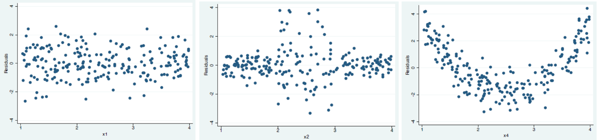

---
jupytext:
  formats: md:myst
  text_representation:
    extension: .md
    format_name: myst
kernelspec:
  display_name: Python 3
  language: python
  name: python3
---

# Linear Regression - Extension

No models are perfect. In this section we introduce what happen when our model is misspecified or when some assumptions fail. We will introduce how to diagnose these problems, and corresponding remedies and alternative models, e.g. Lasso, ridge regression, etc.

## Special Observations

### Outliers

Definition (Outliers)
: There are many ways to define outliers. Observations $i$ is an outlier

  - univariate measure: if $\left\vert x_{ji} - \mu_j \right\vert$ is larger than some threshold, say some multiples of standard deviations of $X_j$, then the $j$-th value of observation $i$ is an outlier w.r.t. other observations of variable $X_j$.

  - multivariate measure: if $\left\| \boldsymbol{x}_i -\boldsymbol{\mu}  \right\|^2$ is larger than some threshold, then $\boldsymbol{x}_i$ an outlier w.r.t. other data points in $\boldsymbol{X}$.

  - if its studentized residual $\left\vert t_i \right\vert$ is larger than some threshold, say $t_{n-p}^{(\alpha/2n)}$

Solution
: - If outlier is a mistake (typo) you can drop it (or correct it)

  - If outlier is valid but unusual, look for robustness – does dropping it change answer?

  - If it does change answer, report both versions – and argue for the approach you think more appropriate


### Leverage Points

```{margin}
Unlike outliers which can be a univariate measure, leverage looks at the whole data vector $\boldsymbol{x}_i$ w.r.t. all data $\boldsymbol{X}$.
```

Definition (Leverages and leverage points)
: - Leverage of an observation $i$ is defined as $h_i = \boldsymbol{x}_i ^\top (\boldsymbol{X} ^\top \boldsymbol{X} ) ^{-1} \boldsymbol{x}_i$. It is the $i$-th diagonal entry of the projection matrix $\boldsymbol{H} = \boldsymbol{X} (\boldsymbol{X} ^\top \boldsymbol{X} )^{-1} \boldsymbol{X} ^\top = \boldsymbol{P}_{\operatorname{im} (\boldsymbol{X} )}$.
  - If $h_i$ is large than some threshold, say $2p/n$, then we say $i$ is a **leverage point**.


Properties
: - In particular, we have $0<h_i<1$ and $\sum_{i=1}^n h_i = p$, or $\bar{h} = p/n$
  - Recall that $\operatorname{Var}\left( \hat{\boldsymbol{\varepsilon} } \right) = \operatorname{Var}\left( \boldsymbol{y} - \hat{\boldsymbol{y}} \right)= \sigma^2 (\boldsymbol{I} - \boldsymbol{H} )$, so $\operatorname{Var}\left( \hat{\varepsilon}_i \right) = \sigma^2 (1-h_i)$

Definition (Standardized residuals)
: Standardized residuals is defined as

  $$
  r_i = \ \frac{\hat{\varepsilon}_i}{\sigma\sqrt{1- h_i}}
  $$

  It is standardized since $\operatorname{Var}\left( r_i \right) = 1$. But in practice, we don't know $\sigma$. So we plug in its estimate $\hat{\sigma}$.

### Influential Points

Definition (Influential points)
: Influential points are data points such that if we remove it, the model changes substantially. It can be quantified by Cook's distance

  $$
  D_i = \frac{r_i ^2}{p} \frac{h_i}{1-h_i}  
  $$


:::{admonition,note} Note
- a influential point can be close to the fitted line. If we drop it, then there seems no linear relation in the remaining data cloud.

- Two or more influential points near each other can mask each other's influence in a leave-one-out regression. That is, if remove any one of them, then the regression results do not change substantially, but if we remove both of them, then the results change substantially.
:::


Properties
: - leverate $h_i$ is related to


(lm-omit-variable)=
## Omit a Variable

Suppose the true model is

$$
\boldsymbol{y} = \boldsymbol{X}_{n \times p} \boldsymbol{\beta} + \boldsymbol{\varepsilon}  
$$

And we omit one explanatory variable $X_j$. Thus, our new design matrix has size $n \times (p-1)$, denoted by $\boldsymbol{X}_{-j}$. Without loss of generality, let it be in the last column of the original design matrix, i.e. $\boldsymbol{X} = \left[ \boldsymbol{X} _{-j} \quad \boldsymbol{x}_j \right]$. The new estimated coefficients vector is denoted by $\hat{\boldsymbol{\beta}}_{-j}$. The coefficient for $\boldsymbol{x}_j$ in the true model is denoted by $\beta_j$, and the vector of coefficients for other explanatory variables is denoted by $\boldsymbol{\beta} _{-j}$. Hence, $\boldsymbol{\beta} ^\top = \left[ \boldsymbol{\beta} _{-j} \quad \beta_j \right] ^\top$.

``` {margin}
Though the common focus is on bias, omitting a variable probably decreases variance. See the relevant section [below](lm-include-variable), or the variance expression [above](lm-inference-variance).
```

*Question: Is $\hat{\boldsymbol{\beta}}_{-j}$ unbised for $\boldsymbol{\beta}_{-j}$?*

*Answer: No. Omitting a relevant variable increases bias. There is a deterministic identity for the bias.*

We will see the meaning of “relevant” later.

We first find the expression of the new estimator $\hat{\boldsymbol{\beta}}_{-j}$

$$\begin{align}
 \hat{\boldsymbol{\beta} }_{-j}
&= \left( \boldsymbol{X} ^\top _{-j} \boldsymbol{X}  _{-j} \right) ^{-1} \boldsymbol{X} ^\top _{-j} \boldsymbol{y} \\
&= \left( \boldsymbol{X} ^\top _{-j} \boldsymbol{X}  _{-j} \right) ^{-1} \boldsymbol{X} ^\top _{-j} \left\{ \left[ \boldsymbol{X} _{-j} \quad \boldsymbol{x}_j \right]\left[\begin{array}{l}
\boldsymbol{\beta} _{-j}  \\
\beta _j
\end{array}\right] + \boldsymbol{\varepsilon}  \right\}\\
&= \left( \boldsymbol{X} ^\top _{-j} \boldsymbol{X}  _{-j} \right) ^{-1} \boldsymbol{X} ^\top _{-j} \left( \boldsymbol{X} _{-j} \boldsymbol{\beta} _{-j} +  \boldsymbol{x}_j \beta _j + \boldsymbol{\varepsilon}  \right) \\
&=  \boldsymbol{\beta} _{-j} + \left[ \left( \boldsymbol{X} ^\top _{-j} \boldsymbol{X}  _{-j} \right) ^{-1} \boldsymbol{X} ^\top _{-j} \right]\left(  \boldsymbol{x}_j \beta _j+ \boldsymbol{\varepsilon}  \right)\\
\end{align}$$

The expectation, therefore, is

$$
\operatorname{E}\left( \hat{\boldsymbol{\beta} }_{-j} \right) =  \boldsymbol{\beta} _{-j} + \left[ \left( \boldsymbol{X} ^\top _{-j} \boldsymbol{X}  _{-j} \right) ^{-1} \boldsymbol{X} ^\top _{-j} \boldsymbol{x}_j \right]\beta _j\\
$$

What is $\left( \boldsymbol{X} ^\top _{-j} \boldsymbol{X} _{-j} \right) ^{-1} \boldsymbol{X} ^\top _{-j} \boldsymbol{x}_j$? You may recognize this form. It is actually the vector of estimated coefficients when we regress the omitted variable $X_j$ on all other explanatory variables $\boldsymbol{X} _{-j}$. Let it be $\boldsymbol{\alpha}_{(p-1) \times 1}$.

Therefore, we have, for the $k$-th explanatory variable in the new model,

$$
\operatorname{E}\left( \hat{\beta} _{-j,k} \right) = \beta_{k} + \alpha_k \beta_j
$$


So the bias is $\alpha_k \beta_j$. The sign can be positive or negative.

This identity can be converted to the following diagram. The explanatory variable $X_k$ is associated with the response $Y$ in two ways. First is directly by itself with strength is $\beta_k$, and second is through the omitted variable $X_j$, with a “compound” strength $\alpha_k \beta_j$.

$$
X_k \quad \overset{\quad \beta_{k} \quad }{\longrightarrow} \quad Y
$$

$$
\alpha_k \searrow \qquad \nearrow \beta_j
$$

$$
X_j
$$

When will the bias be zero?

-   If $\alpha_k = 0$, that is, the omitted variable $X_j$ and the concerned explanatory variable $X_k$ is uncorrelated, i.e., $\boldsymbol{x}_j ^\top \boldsymbol{x}_k = 0$ in the design matrix.
-   If $\beta_j = 0$, that is, the omitted variable $X_j$ and the response $Y$ is uncorrelated, i.e., $\boldsymbol{x}_j ^\top \boldsymbol{y} = 0$.

```{margin}
The takeaway here is that we should include all relevant omitted factors to reduce bias. But in practice, we can never know what all relevant factors are, and rarely can we measure all relevant factors.
```

That’s how we define “relevant”.

What is the relation between the sample estimates? The relation has a similar form.

$$
\hat{\beta }_{-j,k} =  \hat{\beta}_k + \hat{\alpha}_k\hat{\beta}_j
$$

Proof: TBD. Need linear algebra about inverse.

Verify:

```{code-cell}
import numpy as np
from sklearn.linear_model import LinearRegression

n = 1000
b0 = np.ones(n)
x1 = np.random.normal(0,1,n)
x2 = np.random.normal(0,1,n)
rho = 0.5
x3 = rho * x2 + np.sqrt(1-rho**2) * np.random.normal(0,1,n)
e = np.random.normal(0,1,n)*0.1
y = 1 + 1* x1 + 2*x2 + 3*x3 + e
y = y.reshape((-1,1))
X = np.vstack([b0,x1,x2,x3]).transpose()

lm = LinearRegression(fit_intercept=False).fit(X, y)
print("coefficients in y ~ x1 + x2 + x3 :", lm.coef_)
r = y - lm.predict(X)

lmo = LinearRegression(fit_intercept=False).fit(X[:, :-1], y)
print("coefficients in y ~ x1 + x2 :", lmo.coef_)
ro = y - lmo.predict(X[:, :-1])

lmx = LinearRegression(fit_intercept=False).fit(X[:, :-1], X[:, [-1]])
print("coefficients in x3 ~ x1 + x2 :", lmx.coef_)
rx = y - lmx.predict(X[:, :-1])

print("reconstruction difference of b0, b1, b2 :", lm.coef_[0,:3] + lmx.coef_[0] * lm.coef_[0, -1] - lmo.coef_[0])
```


(lm-include-variable)=
## Add a Variable

What if we add a new variable $X_j$? What will happen to the existing estimator $\hat\beta_k$?

Increase

$$\operatorname{Var}\left(\hat{\beta}_{k}\right)=\sigma^{2} \frac{1}{1-R_k^{2}} \frac{1}{\sum_{i}\left(x_{i k}-\bar{x}_{k}\right)^{2}}$$

if $R_{k}^2$ increases. When will $R^2_{k}$ be unchanged? When the new variable $X_j$ has no explanatory power to $X_k$. See the [section](lm-rss-nonincreasing).

In terms of bias, if we say the model with $X_p$ is "true", then $\operatorname{E}\left( \hat{\beta}_k \right)$ is probably closer to $\beta_k$ according to the equation described in the above [section](lm-omit-variable).


## Multicollinearity

Definition (Multicollinearity)  
Multicollinearity measure the extent of pairwise correlation of variables in the design matrix.

```{margin} Multicollinearity in computation
From numerical algebra's perspective, the extent of correlation of variables in the design matrix $\boldsymbol{X}$ determines the condition number of $\boldsymbol{X} ^\top \boldsymbol{X}$. As the correlation increases, its inverse becomes unstable. When perfect linear relation exists, then $\boldsymbol{X} ^\top \boldsymbol{X}$ is not of full rank, and thus no inverse exists.
```

Definition (Perfect multicollinearity)  
A set of variables is perfectly multicollinear if a variable does not vary, or if there is an exact linear relationship between a set of variables:

$$
X_{j}=\delta_{0}+\delta_{1} X_{1}+\cdots+\delta_{j-1} X_{j-1}+\delta_{i+1} X_{i+1}+\cdots+\delta_{k} X_{k}
$$

As long as the variables in the design matrix are not uncorrelated, then multicollinearity exists.

### Diagnosis

Some common symptoms include
- Large standard error $\operatorname{se}(\beta_j)$
- Overall $F$-test is significant, $R^2$ is good, but individual $t$-tests are not significant due to large standard errors.

We can measure the extent of multicollinearity by **variance inflation factor** (VIF) for each explanatory variable.

$$
\operatorname{VIF}_j = \frac{1}{1-R_j^2}
$$

where $R_j^2$ is the value of $R^2$ when we regress $X_j$ over all other explanatory variables excluding $X_j$. The value of $\operatorname{VIF}_j$ can be interpreted as: the standard error $\operatorname{se}(\beta)$ is $\sqrt{\operatorname{VIF}_j}$ times larger than it would have been without multicollinearity.

A second way of measurement is the **condition number** of $\boldsymbol{X} ^\top \boldsymbol{X}$. If it is greater than $30$, then we can conclude that the multicollinearity problem cannot be ignored.

$$
\kappa_2 \left( \boldsymbol{X} ^\top \boldsymbol{X}  \right) = \sqrt{\frac{\lambda_1 (\boldsymbol{X} ^\top \boldsymbol{X} )}{\lambda_p (\boldsymbol{X} ^\top \boldsymbol{X} )} }
$$

Finally, **correlation matrix** can also be used to measure multicollinearity since it is closely related to the condition number $\kappa_2 \left( \boldsymbol{X} ^\top \boldsymbol{X} \right)$.

### Consequences

1.  It inflates $\operatorname{Var}\left( \hat{\beta}_j \right)$.

    $$\begin{align}
     \operatorname{Var}\left( \hat{\beta}_j \right)
     &= \sigma^2 \frac{1}{1- R^2_{j}} \frac{1}{\sum_i (x_{ij} - \bar{x}_j)^2}  \\
     &=  \sigma^2 \frac{\operatorname{VIF}_j}{\operatorname{Var}\left( X_j \right)}  
     \end{align}$$

    When perfect multicollinearity exists, the variance goes to infinity since $R^2_{j} = 1$.

2.  $t$-tests fail to reveal significant predictors, due to 1.

3.  Estimated coefficients are sensitive to randomness in $Y$, i.e. unreliable. If you run the experiment again, the coefficients can change dramatically, which is measured by $\operatorname{Var}\left( \hat{\boldsymbol{\beta} } \right)$.

4.  If $\operatorname{Corr}\left( X_1, X_2 \right)$ is large, then we expect to have large $\operatorname{Var}\left( \hat{\beta}_1 \right), \operatorname{Var}\left( \hat{\beta}_2 \right), \operatorname{Var}\left( \hat{\beta}_1, \hat{\beta}_2 \right)$, but $\operatorname{Var}\left( \hat{\beta}_1 + \hat{\beta}_2 \right)$ can be small. This means we cannot distinguish the effect of $X_1 + X_2$ on $Y$ is from $X_1$ or $X_2$, i.e. **non-identifiable**.

    :::{admonition,dropdown,seealso} *Proof*

    By the fact that, for symmetric positive definite matrix $\boldsymbol{S}$, if

    $$
    \boldsymbol{a} ^\top \boldsymbol{S} \boldsymbol{a}  = \boldsymbol{a} \boldsymbol{U} \boldsymbol{\Lambda} \boldsymbol{U} ^\top \boldsymbol{a} = \boldsymbol{b} ^\top \boldsymbol{\Lambda} \boldsymbol{b} = \sum \lambda_i b_i ^2
    $$

    then

    $$
    \boldsymbol{a} ^\top \boldsymbol{S} ^{-1}  \boldsymbol{a}  = \boldsymbol{a} \boldsymbol{U} \boldsymbol{\Lambda} ^{-1}  \boldsymbol{U} ^\top \boldsymbol{a} = \boldsymbol{b} ^\top \boldsymbol{\Lambda} ^{-1}  \boldsymbol{b} = \sum \frac{1}{\lambda_i}  b_i ^2
    $$

    we have:

    If

    $$
    \left( \boldsymbol{x}_1 - \boldsymbol{x}_2 \right) ^\top \left( \boldsymbol{x}_1 - \boldsymbol{x}_2 \right)  = \left( \boldsymbol{e}_1 - \boldsymbol{e}_2   \right) ^\top \boldsymbol{X} ^\top \boldsymbol{X} \left( \boldsymbol{e}_1 - \boldsymbol{e} _2   \right) \approx 0
    $$

    then

    $$
    \operatorname{Var}\left( \hat{\beta}_1 - \hat{\beta}_2 \right)  = \sigma^2  \left( \boldsymbol{e}_1 - \boldsymbol{e}_2   \right) ^\top \left( \boldsymbol{X} ^\top \boldsymbol{X} \right) ^{-1}  \left( \boldsymbol{e}_1 - \boldsymbol{e} _2   \right) \approx \infty
    $$

    If

    $$
    \left( \boldsymbol{x}_1 + \boldsymbol{x}_2 \right) ^\top \left( \boldsymbol{x}_1 + \boldsymbol{x}_2 \right)  = \left( \boldsymbol{e}_1 + \boldsymbol{e}_2   \right) ^\top \boldsymbol{X} ^\top \boldsymbol{X} \left( \boldsymbol{e}_1 + \boldsymbol{e} _2   \right) \approx \text{constant}
    $$

    then

    $$
    \operatorname{Var}\left( \hat{\beta}_1 + \hat{\beta}_2 \right)  = \sigma^2  \left( \boldsymbol{e}_1 + \boldsymbol{e}_2   \right) ^\top \left( \boldsymbol{X} ^\top \boldsymbol{X} \right) ^{-1}  \left( \boldsymbol{e}_1 + \boldsymbol{e} _2   \right) \approx \text{constant}
    $$

    :::

### Implications

If $X_1$ and $X_2$ show high correlation, then

1.  $X_1$ may be a proxy of $X_2$.
2.  $X_1 - X_2$ may just be noise.
3.  If $X_2$ is removed, $X_1$ may still be good for prediction.

## Heteroskedasticity

When $\operatorname{Var}\left( \varepsilon _i \right)$ is not a constant, we say heteroskedasticity of error variance exists. This may happen because data attributes, or due to transformation of $y$, e.g. $\log(y)$. We can diagnose its existence by plots or tests.

If it exists, OLS is still unbiased & consistent. But $\operatorname{Var}_{OLS}\left( \hat{\boldsymbol{\beta}}  \right)$ which uses homoskedastic assumption is incorrect now. There are problems in testing.

- To fix that for testing purpose, we can use robust standard error.
- To get more precise estimate and correct standard errors, we can try alternative models that produces homoskedastic errors.


### Diagnosis

#### Plot

:::{figure} lm-residual-plot


Homoskedastic (left, right) and Heteroskedasticity (middle)
:::

#### Breusch-Pagan Test

$$H_0: \text{homoskedasticity}$$

Idea: under homoskedasticity, the covariate $X_1, X-2, \ldots, X_p$ should have no explanatory power on the error $\varepsilon$. That is, in the regression $\varepsilon \sim X_1 \ldots X_p$, the $F$-test should be insignificant.

- Run regression $Y \sim X_1 \ldots X_p$, obtain $\hat{\varepsilon}$
- Run regression $\hat{\varepsilon} \sim X_1 \ldots X_p$, run $F$-test (actually $\chi ^2$ test).

#### White Test

The Breusch-Pagan test will detect any linear forms of heteroskedasticity, while the White test allows for nonlinearities by using squares and crossproducts of all the covariates.

- Run regression $Y \sim X_1 \ldots X_p$, obtain $\hat{y}$
- Run regressions $\hat{\varepsilon}^2 \sim \hat{y}$ and $\hat{\varepsilon}^2 \sim \hat{y}^2$
- Use the $R^2$ to form an $F$ test statistic


### Correction by Robust Error


### Alt Model: Weighted Least Squares

We can use weighted least squares as an alternative model. Assume $Var(\varepsilon_i) = \sigma_i$, then we can scale the error $\varepsilon_i$ by $\frac{1}{\sigma_i}$. The new error term has the same unit variance $Var(\frac{\varepsilon_i}{\sigma_i} ) = 1$.

The optimization problem is therefore

$$
\hat{\boldsymbol{\beta}} _{WLS} = \arg\min \sum_{i} (y_i - \boldsymbol{x}_i ^\top \boldsymbol{\beta} )^2 / \sigma_i ^2
$$

We will talk about how to find $\sigma_i$ later.

### Estimation

To find the solution, we introduce an $n\times n$ diagonal matrix $\boldsymbol{W}$, whose diagonal entries are the scaling factor $w_{ii} = \frac{1}{\sigma^2 _i}$. Hence,


$$\begin{aligned}
\hat{\boldsymbol{\beta}} _{WLS}
&= \arg\min\ \sum_{i} (y_i - \boldsymbol{x}_i ^\top \boldsymbol{\beta} )^2 / \sigma_i ^2\\
&= \arg\min\ (\boldsymbol{y} - \boldsymbol{X} \boldsymbol{\beta} )^\top \boldsymbol{W} (\boldsymbol{y} - \boldsymbol{X} \boldsymbol{\beta} )\\
&= (\boldsymbol{X} ^\top \boldsymbol{W} \boldsymbol{X}  ) ^{-1} \boldsymbol{X} ^\top \boldsymbol{W} \boldsymbol{y}\\
\end{aligned}$$

In particular,
- if $\boldsymbol{W} = c \boldsymbol{I}$ then $\hat{\boldsymbol{\beta}} _{WLS} = \hat{\boldsymbol{\beta}} _{OLS}$
- if $\boldsymbol{V} = c \boldsymbol{W}$ then $\hat{\boldsymbol{\beta}} _{WLS(\boldsymbol{V})} = \hat{\boldsymbol{\beta}} _{WLS(\boldsymbol{W})}$, i.e. the solution is invariant to spherical scaling of $\boldsymbol{W}$.

From its form $\hat{\boldsymbol{\beta}} _{WLS} = (\boldsymbol{X} ^\top \boldsymbol{W} \boldsymbol{X}  ) ^{-1} \boldsymbol{X} ^\top \boldsymbol{W} \boldsymbol{y}$, we can see that there is an equivalent formulation:

1. Scale the data and response by error standard deviation $(\widetilde{\boldsymbol{x}}_i , \widetilde{y}_i) = \left( \frac{\boldsymbol{x}_i  }{\sigma_i}  , \frac{y_i}{\sigma_i} \right)$. in matrix form, $\widetilde{\boldsymbol{X}} = \boldsymbol{X} \boldsymbol{W} ^{1/2}, \widetilde{\boldsymbol{y} } = \boldsymbol{W} ^{1/2}\boldsymbol{y}$

2. Run OLS with $\widetilde{\boldsymbol{X} }$ and $\widetilde{\boldsymbol{y} }$

#### Inference

Like in OLS, we want to find the distribution of $\hat{\boldsymbol{\beta}} _{WLS}$. Note that $\boldsymbol{\varepsilon} \sim N(\boldsymbol{0} , \boldsymbol{W} ^{-1})$, so


$$\begin{aligned}
\hat{\boldsymbol{\beta}} _{WLS}
&= (\boldsymbol{X} ^\top \boldsymbol{W} \boldsymbol{X} ) ^{-1} \boldsymbol{X} ^\top \boldsymbol{W} (\boldsymbol{X} \boldsymbol{\beta} + \boldsymbol{\varepsilon})\\
&= \boldsymbol{\beta}  + \left( \boldsymbol{X} ^\top \boldsymbol{W} \boldsymbol{X}  \right) ^{-1} \boldsymbol{X} ^\top \boldsymbol{W} \boldsymbol{\varepsilon} \\
&\sim N \left( \boldsymbol{\beta} , \left( \boldsymbol{X} ^\top \boldsymbol{W} \boldsymbol{X}  \right) ^{-1}  \right)\\
\end{aligned}$$

In particular, if $\boldsymbol{W} = \frac{1}{\sigma^2 } \boldsymbol{I}$ as in OLS (homogeneity), then the $\left( \boldsymbol{X} ^\top \boldsymbol{W} \boldsymbol{X}  \right) ^{-1} = \sigma^2 (\boldsymbol{X} ^\top \boldsymbol{X} ) ^{-1}$ as in OLS.

#### Find Weights

The question is, how to find $\boldsymbol{W}$ in advance? Some rules of thumbs include

- If $y_i$ is a **sum** from a sample of size $n_i$, then $\sigma^2 _i \propto n_i$
- If $y_i$ is an **average** from a sample of size $n_i$, then $\sigma^2 _i \propto \frac{1}{n_i}$

```{margin}
Note $\hat{\boldsymbol{\beta}} _{WLS}$ is invariant to spherical scaling of $\boldsymbol{W}$, so we don't need to know the exact value of $\sigma^2_i$.
```

Besides, we can find weights from data adaptively.

- If measurements are in blocks of size $n_1, n_2, \ldots, n_m$ such that $n = n_1+ \ldots + n_m$, and $\sigma^2 _i$ is constant within each block but differ across blocks, then the error variance matrix looks like

    $$
    \operatorname{Var}\left( \boldsymbol{\varepsilon}  \right) = \left[\begin{array}{cccc}
    c_1 \boldsymbol{I}_{n_1} & 0 & \ldots & 0 \\
     0 & c_2 \boldsymbol{I} _{n_2} & \ldots & 0 \\
    \vdots & \vdots & \ddots & \vdots \\
    0 & \ldots & \ldots & c_m \boldsymbol{I}  _{n_m}
    \end{array}\right]
    $$

    Therefore, each block of observations satisfy the homogeneity assumption. We can run OLS to estimate $\hat{\sigma}^2_k$ in each block $k$, and set $c_k = \frac{1}{\hat{\sigma}_k ^2}$.

- If $\sigma^2 _{i}$ varies with some explanatory variable, say $X_{ij}$, (which can be known in advance or revealed by diagnostic plot of $\hat{\sigma}_i$ over $x_{ij}$), then we can formulate there relation as some function.

    - If we assume linear relation, then we can follow the steps

      1. run original OLS and obtain $\hat{\varepsilon}$
      2. regress $\ln (\hat{\varepsilon}^2)$ over all explanatory varibles, call the fitted value by $\hat{u}$
      3. set $w_{ii} = 1/\exp(\hat{u})$.

    - For other relations, for instance, we can assume $\sigma_i = r_0 + \left\vert x_{ij} \right\vert ^{r_1}$. Then, we can estimate $r_0$ and $r_1$ jointly with $\boldsymbol{\beta}$ by maximum likelihood

      $$\begin{aligned}
      \boldsymbol{\beta} , r_0, r_1
      &= \arg\max \left\{ \prod_i \frac{1}{\sqrt{2 \pi \sigma^2 }} \exp
      \left( - \frac{ \left( y_i - \boldsymbol{x}_i ^\top \boldsymbol{\beta} \right)^2 }{2 \sigma^2 } \right)   \right\}\\
      &= \arg \min \left\{ \sum_i \frac{(\boldsymbol{y}_i - \boldsymbol{x}_i ^\top \boldsymbol{\beta} )^2}{2(r_0 + \left\vert x_{ij} \right\vert ^ {r_1})^2}  + \log \left( r_0 + \left\vert x_{ij} \right\vert ^ {r_1} \right) \right\} \\
      \end{aligned}$$


and use the estimated

## Measurement Error

### Of $Y$


$$
\begin{array}{c}
Y-e=\beta_{0}+\beta_{1} X_{1}+\ldots+\beta_{k} X_{k}+u \\
Y=\beta_{0}+\beta_{1} X_{1}+\ldots+\beta_{k} X_{k}+(e+u)
\end{array}
$$

Assume $E(e) = 0$.

- If $e$ is correlated with the regressors $X$, then get bias $\beta$, like omitted variable bias
- Else, OLS is unbiased but variance rises, like adding an irrelevant variable.

### Of $X$

Suppose the true values of explanatory variables is $x_{ij}$. Due to some measurement error $w_{ij}$, we collect $\tilde{x}_{ij} = x_{ij} + w_{ij}$. Now we want to analyze its effect on our OLS estimates.

Here are some assumptions of measurement error $w_{ij}$:

- common zero mean $\operatorname{E}\left( w_{ij} \right) = 0$
- common variance $\operatorname{Var}\left( w_{ij} \right) = \sigma^2_w$
- pairwisely uncorrelated
- uncorrelated with $\boldsymbol{X}$ and $\boldsymbol{y}$

In matrix form, we can write an error matrix $\boldsymbol{W}_{n \times p} = [\boldsymbol{w}_1 \ \ldots \ \boldsymbol{w}_p ]$ where $\boldsymbol{w}_j = [w_{1j}, w_{2j}, \ldots, w_{nj}]^\top$. Then the assumption becomes

- $\operatorname{E}\left( \boldsymbol{W}  \right) = \boldsymbol{0}$
- $\operatorname{E}\left( \boldsymbol{W} ^\top \boldsymbol{W}  \right) = n \sigma^2_w \boldsymbol{I} _p$


By CLM and LLN, as $n\rightarrow \infty$, we have

- $\boldsymbol{W} ^\top \boldsymbol{v} \rightarrow \boldsymbol{0}$
- $\boldsymbol{W} ^\top \boldsymbol{W} \rightarrow n\sigma^2_w I_n$

The data matrix we collect is

$$\widetilde{\boldsymbol{X} } = \boldsymbol{X} + \boldsymbol{W}$$

We can find the OLS estimates as

$$\begin{aligned}
\widetilde{\boldsymbol{\beta} }
&= \left( \widetilde{\boldsymbol{X} }^\top \widetilde{\boldsymbol{X} }  \right) ^{-1} \widetilde{\boldsymbol{X} } ^\top \boldsymbol{y} \\
&= \left( \boldsymbol{X} ^\top \boldsymbol{X} + \boldsymbol{X} ^\top \boldsymbol{W}  + \boldsymbol{W} ^\top \boldsymbol{X} + \boldsymbol{W} ^\top \boldsymbol{W} \right) ^{-1}  \left( \boldsymbol{X} ^\top y + \boldsymbol{W} ^\top \boldsymbol{y}  \right)\\
&\rightarrow \left( \boldsymbol{X} ^\top \boldsymbol{X} + n \sigma^2_w \boldsymbol{I} _p \right) ^{-1} \boldsymbol{X} ^\top \boldsymbol{y} \\
\end{aligned}$$

which is like ridge regression.

As $\sigma^2$ increases,

- the effect amounts to shrinkage in $\boldsymbol{\beta}$, i.e. $\left\vert \beta_j \right\vert$ decreases
- $\operatorname{Corr}\left( X_j, Y \right)$ decreases

In particular, in SLR,

$$
\tilde{\beta}_1 \rightarrow \beta_1 \cdot \frac{\sum_{i=1}^n (x_i - \bar{x})^2}{\sigma^2_w  + \sum_{i=1}^n (x_i - \bar{x})^2}
$$

This is called **attenuation bias**.

if correlated, then case-by-case

## Categorical $X$

TBD...

dummy variables $X_{ij}$

when $c = 2$,

interpretation
- $\hat{\beta}_1$: difference in means between the group with $X=1$ and $X=0$.
- $\hat{\beta}_0$: mean of the group with $X=0$.

TBD

https://www.1point3acres.com/bbs/thread-703302-1-1.html
