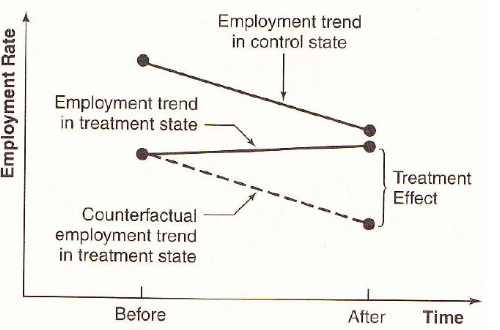
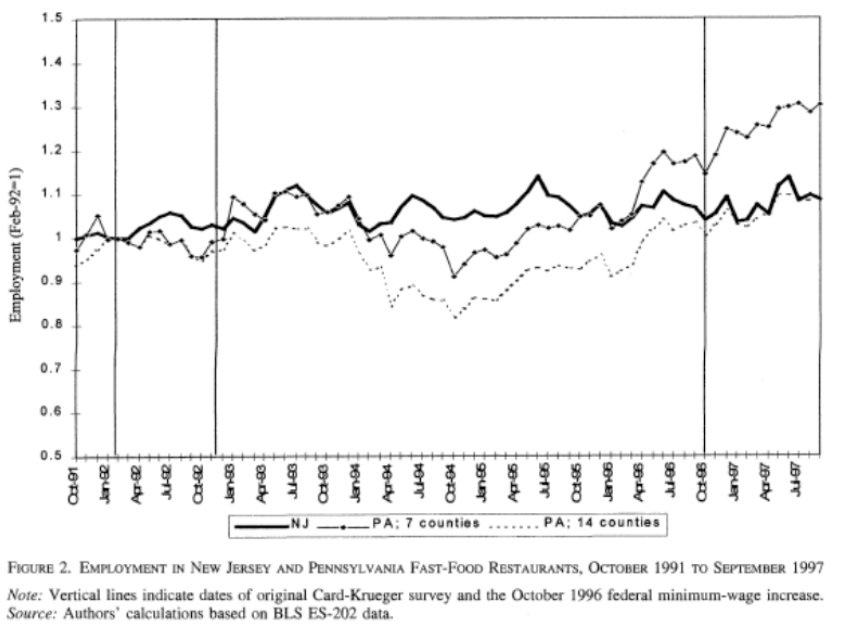
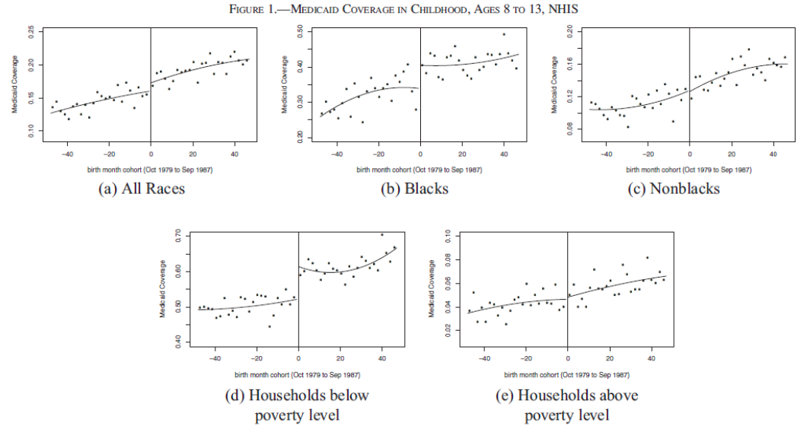
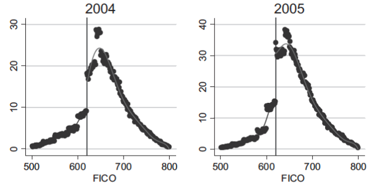
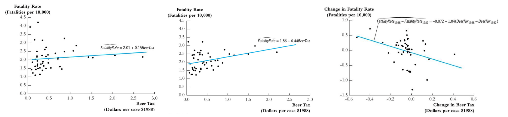

# Linear Models - Advanced Topics

We introduced how to use linear models for advanced analysis, e.g. causal effect.


Some types of data:

- A **cross-section** of data is a sample drawn from a population at a single point in time
- **Repeated cross-sections** are samples drawn from the same **population** at several points in time
- If we have information on the same **individuals** at more than one point in time, we have **panel data**

## Natural Experiments

A natural experiment is an **empirical** study in which individuals (or clusters of individuals) are exposed to the experimental and control conditions that are determined by **nature** or by other factors outside the control of the investigators. The process governing the exposures arguably **resembles** random assignment.

In short, two groups of similar individuals are exposed to different treatments. The assignment is determined by nature, which can be reasonably viewed as randomized.

We often use the “difference-in-differences” estimator to study repeated cross-sections or panel data when we have a natural experiment.

### Difference-in-difference

In DiD, we uses a control group to net out any trends over time.

| | Treatment | Control
| - | - |- |
|Before   |  $A$ | $B$  |
|After   |  $C$ | $D$  |
|Difference | $C-A$  | $D-B$  |

```{margin}
Other statistic of interest or more robust e.g. median, percentiles, log, can also be used.
```

Let $\bar{y}_A, \bar{y}_B, \bar{y}_C, \bar{y}_D$ be the corresponding means of each group. DiD is computed as

$$
DiD = (\bar{y}_C - \bar{y}_A) - (\bar{y}_D- \bar{y}_B)
$$

Then we can conduct a two-sample $t$-test. We can also use regression with two categorial variables (After, Treat) and one interaction term.

$$
Y=\beta_{0}+\beta_{1} \text {Treated} \times \text {After}+\beta_{2} \text {Treated}+\beta_{3} \text {After}+\varepsilon
$$

where

- $\hat{\beta}_0 = \bar{y}_B$
- $\hat{\beta}_2 = \bar{y}_A - \bar{y}_B$
- $\hat{\beta}_3 = \bar{y}_D - \bar{y}_B$
- $\hat{\beta}_1 = (\bar{y}_C - \bar{y}_A) - (\bar{y}_D - \bar{y}_B) = DiD$

and we can test $\hat{\beta}_1 = 0$.

To control other variables, we add them into the model (note about over controlling)

$$
Y=\beta_{0}+\beta_{1} \text {Treated} \times \text {After}+\beta_{2} \text {Treated}+\beta_{3} \text { After}+\sum_k \gamma_k X_k+\varepsilon
$$

:::{figure} lm-ne-illustration


Illustration of DiD model
:::


### Choice of Control Group

It is often hard to choose control group. One criteria is the common trends assumption.

Assumption (Common trends):
: In a before/after study, whatever factors change with time must affect the treatment and control group the **same**.
  - Use both theory and data to assess common trends
    - Theory: logical reasoning
      - e.g. Is this event/program a part of a broader set of programs?
    - Data:
          - plot $y$ for the two groups along time before the treatment, see if they have similar ups and downs.
          - include fixed time effect, and test a year $\times$ group interaction term.
  - If some unobserved factor changes more for treated group than for control, then we have bias.

:::{figure} lm-ne-parallel


Check for parallel trend
:::


A control group must enable you to approximate the counterfactual for the treated group – what would have happened to them if they had not received treatment?

For instance, in the project *Taxes on the Rich* (Feldstein (1995), Goolsbee (2000)). The tax policy impose a decrease in marginal tax rates for high income earners in 1986. Goolsbee examines increase in marginal rates in 1993 for high income earners. Lower (but still high) earners are control.

If common trends assumption met, can get unbiased estimate without balance.

### Internal Validity

Internal validity refers to whether one can validly draw the inference that within the context of the study, to conclude that the differences in the dependent variables were caused by the differences in the relevant explanatory variables.

Some issues are

1. Omitted Variables: events, other than the experimental treatment, occurring between pre-intervention and post- intervention observations that provide alternative explanations for the results.

2. Trends in Outcomes: processes within the units of observation producing changes as a function of the passage of time per se, such as inflation, aging, and wage growth.

3. Misspecified Variances: omission of group error terms. Bertrand (2004) et al.

4. Mismeasurement: changes in definitions or survey methods that may produce changes in the measured variables. NHIS, CPS.

5. Political Economy: endogeneity of policy changes due to governmental responses to variables associated with past or expected future outcomes. Campbell and drunk driving.

6. Simultaneity: endogeneity of explanatory variables due to their joint determination with outcomes. Think price and quantity.

7. Selection: assignment of observations to treatment groups in a manner that leads to correlation between assignment and outcomes in the absence of treatment. Selection can take many forms. Trainees often do well relative to their recent past...

8. Attrition: the differential loss of respondents from treatment and comparison groups.

9. Omitted Interactions: differential trends in treatment and control groups or omitted variables that change in different ways for treatment and control groups. For example, a time trend in a treatment group that is not present in a comparison group. The exclusion of such interactions is a common identifying assumption in the designs of natural experiments. This is the common trends assumption.

## Regression Discontinuity Design

Aka RDD.

### Model

We want to analyze an policy effect to different group of people. For instance,

- Effect of extended unemployment insurance benefits on willingness to work (measured by actual unemployment period), where the benefits are different for different age group, characterized by age cutoffs.
- Effect of medicaid on health (measured by mortality or hospitalization rate), where the medicaid are different for different age group, characterized by birth date cutoffs
- In loan application, a rule of thumb is that applicants with credit score greater than 620 have low delinquency probability and hence more likely to get accepted.

In sum, there is a sharp policy at cutoff point $a^*$, while other characteristics that influence outcome ($y$) are **very similar** around $a^*$. It should be as if we **randomized** and those just above $a^*$ are the treatment group and just below a* are the control group. To analyze the policy effect at this cutoff, the regression discontinuity equation is


$$
Y_{i}=\beta_{0}+\beta_{1} D_{a_i \geq a *}+f(a_i)+\varepsilon_{i}
$$

where

- $i$ is individual index
- $y_{i}$ is an outcome variable of interest (e.g. income, mortality rate) if different groups receive different treatments
- $a_i$ is so called **running variable** (e.g. age, score, time) which determines which treatment the individual receives
- $D_{a_i \ge a^*}$ is an indicator for an individual being above the cutoff $a^*$
- $f(a_i)$ is a function of $a$, often linear or quadratic, and often with different slopes above and below $a^*$
- The observations used to run this regression are those around $a^*$, e.g. there is a bandwidth/window width
- We can run this equation at each cutoff points in the policy

We are interested in $\beta_1$.

:::{figure} lm-rd-health


[Wherry and Meyer 2016]
:::


### Assumption

- The observations are balance around the cutoff $t^*$: they have very similar characteristics. To check this, we can replace $Y$ by each characteristic over the above model, to see if $\beta_1$ is significant.
- Need to check the density around the cutoff to see if there is manipulation, e.g. strategic filing. If there is, exclude these observations that is close to cutoff $t^*$.

  :::{figure} lm-rd-fico
  

  Loan Distribution by FICO: manipulation around 620.
  :::


### Practical Issues

- RD requires a large sample
- Wider window (larger sample) increase precision as well as bias, precision vs. bias tradeoff. The window width can be a hyper parameter to test model robustness.
- Can also try various functions $f(t)$, often with polynomials with different parameters to the left and right of $t^*$
- In some cases the cutoff is "hard" (unemployment benefit), and some times it is soft (credit score). If it is soft we call this fuzzy RD.

## Instrumental Variables

Suppose we are in


Suppose the true model is

$$Y = \beta_0 + \beta_1 X_1 + \beta_2 X_2 + \epsilon_i$$

where $X_2$ is unobservable. If we regress $Y$ over $X_1$, then we get a biased estimate for $\beta_1$.

$$Y = \beta_0 + \beta_1 X_1 + u_i$$

We can get a consistent estimate of $\beta_1$ without controlling for $X_2$ if we can find a valid instrument $Z$ satisfying two conditions:

- **exogeneity condition** (exclusion restriction): it is uncorrelated with $u_i$
- **relevance condition**: it is correlated with $X$

We can view the relations as follows:

$$\begin{aligned}
Z \rightarrow X \quad & \quad u\\
\searrow \ &\ \swarrow \\
Y&
\end{aligned}$$

In short, $Z$ represents the exogenous (not correlated with $u$) variation in $X$. Variation in $X$ caused by $Z$ is not correlated with u. We use only this variation in $X$ to estimate $\hat{\beta}$.

But good instruments are hard to find. Exogeneity condition is often violated.

### IV Estimator

Consider the covariance of instrument $Z$ and response $Y$:


$$\begin{aligned}
\operatorname{Cov}\left( Z,Y \right)
&= \operatorname{Cov}\left( Z, \beta_0 + \beta_1 X + u \right)\\
&= \beta_1 \operatorname{Cov}\left( Z,X \right) + \operatorname{Cov}\left( Z, u \right)\\
&= \beta_1 \operatorname{Cov}\left( Z, X \right)\\
\end{aligned}$$

Hence, $\beta_1 = \frac{\operatorname{Cov}\left( Z,Y \right)}{\operatorname{Cov}\left( Z,X \right)}$. The IV estimator is

$$
\hat{\beta}_1^{\text{IV} } = \frac{\operatorname{\widehat{Cov}}\left( Z,Y \right)}{\operatorname{\widehat{Cov}}\left( Z,X \right)} = \frac{\sum_{i=1}^{n}\left(Z_{i}-\bar{Z}\right)\left(Y_{i}-\bar{Y}\right)}{\sum_{i=1}^{n}\left(Z_{i}-\bar{Z}\right)\left(X_{i}-\bar{X}\right)}
$$

Properties

- consistent, i.e. $\operatorname{plim} \hat{\beta}_1^{\text{IV} } = \beta_1$.
- asymptotic variance: $\frac{\sigma^2 }{n \sigma^2 _x \rho_{x,z}^2}$
- Because the IV estimator uses only a subset of the variation in $X$ to estimate the relationship between $X$ and $Y$, precision will fall (as compared to OLS).
  - If $X$ and $Z$ very weakly related, then small $\rho_{x,z}^2$, precision will be very poor in the IV estimator.
  - But, if $X$ and $Z$ are too closely correlated, $Z$ cannot be a good instrument because it will fail the exclusion restriction - if $X$ and $Z$ are perfectly correlated, then $\operatorname{Cov}\left( Z, u \right)$ cannot be zero unless $\operatorname{Cov}\left( X, u \right)$ is also zero (which means we don’t need an instrument in the first place).

### Two-Stage Least Squares

Aka 2SLS.

To accommodate many $X$'s and $Z$'s, we use two-stage least squares. Suppose the model is

$$
Y_{}=\beta_{0}+\beta_{1} X_{1 }+\ldots+\beta_{k} X_{k }+\beta_{k+1} W_{1 }+\ldots+\beta_{k+r} W_{r }+u_{}
$$

where

- $X_1, \ldots, X_k$ are endogenous (possibly correlated with $u$)
- $W_1, \ldots, W_r$ are exogenous (not correlated with $u$)
- $Z_1, \ldots, Z_m$ are instruments
- $m \ge k$: more instruments than endogenous regressors.

Steps:

1. For each $X_j$, regress $X_j$ on all $Z$ and all $W$, compute predicted values $\hat{X}_j$.
2. Regress $Y$ on all predictions $\hat{X}_j$ and all $W$. The resulting $\hat{\beta}$ are the 2SLS estimates of $\beta$.

Assumptions
- $\mathbb{E}\left( u_i \mid W_1, \ldots, W_r \right)=0$
- Finite kurtosis for all $X,W,Z$ and $Y$
- $\hat{X}$'s and $W$'s are not perfect multicollinear
- Exogeneity: $\operatorname{Cov}\left( Z_j, u \right)=0$ for all $j$
  - not testable
  - fail if $Z$ is related to some other factor that influences $Y$, or $Z$ has a direct effect on $Y$.
- Relevance: $\operatorname{Cov}\left( Z, X \right) \ne 0$
  - testable: $F$-test on instruments in first stage larger than 10.
  - if fail, then inconsistent, bias, no-normal.


Note
- $R^2, F$-test are invalid


### Interpretation

$\beta^{2SLS} = \mathbb{E}\left( \beta_i \right)$ is a local average treatment effect (LATE). If $\beta_i = \beta$ for all $i$, then $\beta^{2SLS} = \beta$.

## Panel Data

Recall the common trends assumption. Can we generalize it? What if there are more than 2 periods and more than 2 groups? We introduce first difference and fixed effect, for more than s.

Panel data, aka. longitudinal data, are data constructed from repeated samples of the same entities/individuals $i$ at different points $t$ in time.

$$
Y_{i t}=\beta_{0}+\beta_{1} X_{1 i t}+\ldots+\beta_{k} X_{k i t}+u_{i t}
$$

where entities $i=1, \ldots, N$ and time $t=1, \ldots T$, if balanced. There can also be unbalanced panel data such that the total number of observations is less than $NT$.

For instance,

- Graduation rate at each school in Chicago over last 10 years
- Poverty rate for each state over several years
- Earnings of workers over time before and after disability


:::{admonition,note} Note

Panel data is different from repeated cross-section data that have multiple observations per sample in multiple time periods.

Whether an analysis uses repeated cross-section or panel data sometimes depends on how raw data are manipulated. Consider a random sample of 100 people from each state, taken every year.
- Different people each year – so it is repeated cross-section if $i$ indexes people
- If the individuals from a state are aggregated into a state average, then since we have the same states year after year it is panel — now $i$ indexes states

:::

Panel data enable us to remove bias from certain types of omitted variables.

- If omitted variables for entity $i$ do not change over time,
- Or if omitted variables for time period $t$ do not differ across entity,

Then panel data gives unbiased estimates.

### First Difference

Suppose we have a panel data set at two time points $t_1$ and $t_2$. Suppose the true model is

$$Y_{it} = \beta_0 + \beta_1 X_{1it} + \beta_2 X_{2it} + u_{it}$$

where $\mathbb{E}(u_{it} \vert X_{1it}, X_{2it})=0$. But we only observe $X_{1}$ and omit $X_2$. Then running a regression model $Y_i \sim X_{1i}$ at each time point leads to a **biased** estimate of $\beta_1$. However, the difference is

$$\Delta Y_{i} = \beta_1 \Delta X_{1i} + \beta_2 \Delta X_{2i} + \Delta u_{i}$$

If $\Delta X_{2i}=0$ for each $i$, i.e., for $X_{2it}$ does not change over time $t$ for entity $i$, then we can run regression $\Delta Y_i \sim \Delta X_{1i}$ (include intercept) and obtain an unbiased estimate of $\beta_1$. The intercept estimate $\tilde{\beta}_0$ can be interpreted as the change of $\beta_0$ over time.

:::{figure} lm-fd-example-beer


Regression using 1982 data, 1988 data, and first difference method [Wooldridge]
:::

For $T > 2$ case, we can run compute $\Delta Y_{it} = Y_{i(t+1)} - Y_{it}$ and $\Delta X_{1it}$, for each $t=1,\ldots, T-1$, and use all these $(T-1)n$ number of $(\Delta Y, \Delta X)$ pairs to run a regression to obtain $\hat{\beta}_1$.


Rationales of FD

- FD regress the change in $Y$ against the change in $X$
- If omitted variables are constant over time (time invariant), then they will be unrelated to changes in $Y$ and $X$ for a given $i$.
- Differencing gets rid of time invariant unobservables, as well as time invariant observables.

Pros
- If OLS on the cross-sectional data is biased by time invariant omitted variables, then FD can solve this problem.

Cons
- Cannot solve bias caused by time varying variables, if they are correlated with $\Delta X$. It's like we omit $\Delta X_{2i} \ne 0$ in $\Delta Y_{i} = \beta_1 \Delta X_{1i} + \beta_2 \Delta X_{2i} + \Delta u_{i}$
- Cannot estimate coefficient for time invariant variables ($\beta_2$ in the above case)
- Lower variation in independent variable sine $\sigma_{\Delta X}^{2} \ll \sigma_{X}^{2}$. Higher standard error of estimate
- May exaggerate measurement error since signal is reduced but noise variance is larger.


### Fixed Effect

#### Entity Fixed Effect

In FD we drop time invariant variable $\beta_2 X_{2it} = \beta_2 X_{2i}$ to estimate $\beta_1$, but in fixed effect model we estimate these $\beta_2 X_{2i}$. Suppose again the true model is

$$Y_{it} = \beta_0 + \beta_1 X_{1it} + \beta_2 X_{2it} + u_{it}$$

If $X_{2it}$ is time invariant, then we can write

$$Y_{it} = (\underbrace{\beta_0 + \beta_2 X_{2i}}_{\alpha_i}) + \beta_1 X_{1it} + u_{it}$$

which suggests that each entity $i$ has a different intercept $\alpha_i$. Hence, the new equation can be estimated by letting each entity $i$ have a unique intercept. This is called fixed effects regression.

$$Y_{i t}=\beta_{1} X_{i t}+\sum_{i=1}^{N} \alpha_{i} d_{i}+u_{i t}$$

where $d_i$ is a dummy variable indicating if an observation is in group $i$. The total number of observations in this regression is $NT$, and number of parameters is $N+1$.

Note that
- If $T=2$ then FD=FE.
- If there is autocorrelation of errors within an entity, use clustered standard error.
- Precision of $a_i$ depends on the number of observations in entity $i$.
- Equivalent to de-mean regression: compute entity means for both $X$ and $Y$, subtract them from $X$ and $Y$, and run regression to obtain $\hat{\beta}_1$.


#### Time Fixed Effect

Some omitted variables very over time but are the same across entities within a time period.

$$Y_{i t}=\beta_{1} X_{i t}+\sum_{t=1}^{T} \alpha^{t} d^{t}+u_{i t}$$

Examples:
- Federal policy may affect all states the same
- Macroeconomic shocks may affect many workers the same
- Technological change may affect all firms the same
- Quarterly seasonal effect
- Fall/summer effect for agricultural data

The total number of observations in this regression is $NT$, and number of parameters is $T+1$.

#### Both

We can include both entity and time fixed effect. This will eliminate both time invariant unobservables within each entity $\alpha_i$, and entity invariant unobservables within each time period $\alpha^t$.

$$Y_{i t}=\beta_{1} X_{i t}+\sum_{i=1}^{N} \alpha_{i} d_{i}+\sum_{t=1}^{T} \alpha^{t} d^{t}+u_{i t}$$

The total number of observations in this regression is $NT$, and number of parameters is $N + T+1$.

Example:
- Drinking culture fixed within states ($a_i$)
- Federal policy changes affect all states the same ($a^t$)

Pros
- Can eliminate bias due to time invariant unobservable factors or entity invariant unobservable factors.

Cons
- Time varying unobservables that are unique to each state (not a common shock) can still cause bias.
- Cannot study the effect of things that do not vary over time or within entity.

## Time Series

Time series data are data that are temporally ordered.

Two variables $Y_t$ and $X_t$ could be related contemporaneously:
- $X_t$ affect $Y_t$, e.g. corn price and bacon price
- dynamic: $Y_{t-1}$ affects $X_t$, and $X_t$ affects $Y_t$, e.g. oil price and fuel demand
- $\hat{Y}_{t+1}$ affects decision at $t$.

Static and dynamic models:
- If no lagged $Y$ and only contemporaneous $X$, model is static
  $$Y_{t}=\beta_{0}+\beta_{1} X_{t-1}+\beta_{2} X_{t-2}+\cdots+u_{t}$$
- Otherwise, if both affect $Y$, we call it dynamic
  $$Y_{t}=\beta_{0}+\beta_{1} Y_{t-1}+\beta_{2} X_{t}+\beta_{3} X_{t-1}+u_{t}$$

Note that the explanatory variables are no longer fixed. For instance, $Y_{t-1}$ contains a random component $u_{t-1}$.


### Autoregression

Consider a simple autoregression model

$$Y_t = \beta_0 + \beta_1 Y_{t-1} + u_t$$


If serial correlation exists: $u_{t}$ and $u_{t-1}$ are correlated, the regressor $Y_{t-1}$ which contains $u_{t-1}$ is now correlated with $u_t$. This leads to biased $\beta_1$. It is also inconsistent. But we can use $y_{t-2}$ as an instrument for $y_{t-1}$ to obtain consistent estimate, if $u_{t-2}$ is not correlated $u_{t}$.

### Spurious Correlation

When time series data have trends over time, they will frequently be strongly spuriously correlated with each other. You can think of the time trend as an omitted variable that causes omitted variables bias.


### More Concepts

- Trends: steadily rising or falling in $t$. To account for this, we can add a term $\beta(t-t_0)$ into the model, there $t_0$ is the start year. We can also use first difference.

- Breaks: relationship between $X$ and $Y$ changes at some period. To account for this, we can add $\beta d_{t \le t^*}$ and $\beta d_{t > t^*}$ where $d$ is a dummy variable.

- Interpretation: Consider a dynamic model

  $$Y_t = \beta_0 + \beta_1 Y_{t-1} + \beta_2 X_t + \beta_3 X_{t-1} + u_t$$

  What is the effect of one unit change in $X_{t-1}$ on $Y_t$? It is not simply $\beta_3$ since $X_{t-1}$ also affects $Y_{t-1}$. The answer should be $\beta_2 \beta_1 + \beta_3$.

- Forecasting error: root mean squared forecast error, where $\hat{Y}_{t+1 \mid t}$ means using data available up to $t$ to predict $Y$ at $t+1$.

  $$R M S F E=\sqrt{E\left[\left(Y_{t+1}-\hat{Y}_{t+1 \mid t}\right)^{2}\right]}$$


## Categorical Data

TBD.

dummy variables $X_{ij}$

when $c = 2$,

interpretation
- $\hat{\beta}_1$: difference in means between the group with $X=1$ and $X=0$.
- $\hat{\beta}_0$: mean of the group with $X=0$.
