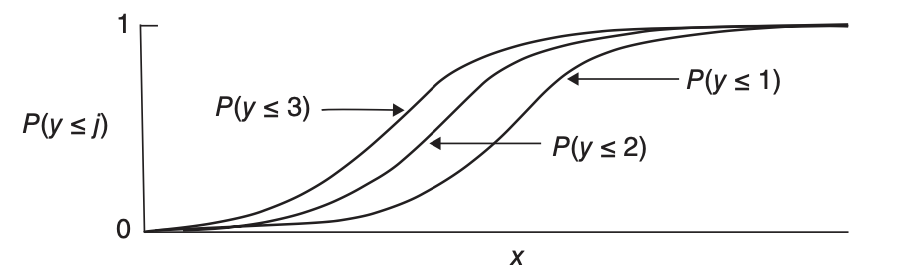

# Ordinal Logistic Regression

Ordinal logistic regression is used to model ordinal response.

## Data Structure

Ordinal data means that the response $y_{ij}$ are ordered, such as "disagree, neutral and agree".

We assume that responses tend to fall in higher (or lower) categories as the value of an explanatory variable increases. By this assumption, the models are more parsimonious (many fewer parameters) than models for nominal responses.

Let $y_{i}$ denote the response outcome category for subject $i$. That is, $y_{i}=j$ means the response category is $j$, where $j=1,\ldots, c$. This requires the categories can be coded into integers, with underlying orders.

From the assumption above, we can model the cumulative probabilities

$$
{P\left(y_{i}\leq j\right)=\pi_{i1}+\cdots+\pi_{ij},\quad j=1,\ldots,c}
$$

## Cumulative Logit Models

### Link Functions

The cumulative logits are logits of these **cumulative** probabilities:

$$
{\begin{aligned}\operatorname{logit}\left[P\left(Y_{i}\leq j\right)\right] & =\log\frac{P\left(Y_{i}\leq j\right)}{1-P\left(Y_{i}\leq j\right)}\\
 & =\log\frac{\pi_{i1}+\cdots+\pi_{ij}}{\pi_{i,j+1}+\cdots+\pi_{ic}},\quad j=1,\ldots,c-1
\end{aligned}
}
$$

We see that $\log\frac{P\left(Y_{i}\leq j\right)}{1-P\left(Y_{i}\leq j\right)}$
can be interpreted as an ordinary logistic model for a binary response
in which success means $Y_{i}\leq j$.

The link function is

$$
{\operatorname{logit}\left[P\left(Y_{i}\leq j\right)\right]=\alpha_{j}+\boldsymbol{x}_{i}^{\top}\boldsymbol{\beta},\quad j=1,\ldots,c-1}
$$

::::{admonition,note} Note

- For identifiability, $\boldsymbol{x}_{i}$ here does not include the intercept term.

- For each category $j$, there is a separate intercept $\alpha_{j}$. Note that at any fixed $\boldsymbol{x}_{i}$, since LHS is increasing in $j$, then $\alpha_{j}$ should be increasing in $j$.

- There is no subscript for $\boldsymbol{\beta}$. This means the effects $\boldsymbol{\beta}$
of the explanatory variables are the same for each cumulative logit. Hence, the total number of parameters is $(c-1 + p)$.

- Consider a special case $p=1,c=4$, then we can plot $P(Y\le j)$ versus $x$. The four curves have exactly the **same** shape and do not cross, which is called parallelism. This is due to the common effects $\boldsymbol{\beta}$. Moreover, we can also see from the graph that $P(Y=1)$ is increasing in $x$ and $P(Y=4)$ is decreasing in $x$, while $P(Y=2)$ and $P(Y=3)$ are not monotonic in $x$.

:::{figure} ordinal-cum-plot

Cumulative logit model with the same effect of $x$ on each of three cumulative probabilities, for an ordinal response variable with $c = 4$ categories [Agresti 2015]
:::

::::

### Latent Variable Approach

We can derive the link function from a latent variable approach. Suppose there is a latent variable

$$
{Y_{i}^{*}=\boldsymbol{x}_{i}^{\top}\boldsymbol{\beta}+\epsilon_{i}}
$$

where $\epsilon_{i}\sim F$, and there are cutoff points

$$
{-\infty=\alpha_{0}\leq\alpha_{1}\leq\ldots\leq\alpha_{c}=\infty}
$$

We observe

$$
{y_{i}=k\quad}\text{ if }{\alpha_{k-1}<y_{i}^{*}\leq\alpha_{k}}
$$

then the probability is

$$
{P\left(Y_{i}\leq k\right)=P\left(Y_{i}^{*}\leq\alpha_{k}\right)=F\left(\alpha_{k}-\boldsymbol{x}_{i}^{\top}\boldsymbol{\beta}\right)}
$$

When we take $F$ as the CDR of standard logistic/Gaussian distribution, we get the cumulative logit/probit models.

If we let ${Y_{i}^{*}=-\boldsymbol{x}_{i}^{\top}\boldsymbol{\beta}+\epsilon_{i}}$
then we can write $P\left(Y_{i}\leq k\right)=F\left(\alpha_{k}+\boldsymbol{x}_{i}^{\top}\boldsymbol{\beta}\right)$.

### Interpretation and Proportional Odds

From the link function we derive that, for subject $i$, if $\boldsymbol{x}_{i}$
changes from $\boldsymbol{v}$ to $\boldsymbol{u}$, then

$$
\begin{aligned}
{{\operatorname{logit}\left[P\left(Y_{i}\leq j|\boldsymbol{x}_{i}=\boldsymbol{u}\right)\right]-\operatorname{logit}\left[P\left(Y_{i}\leq j|\boldsymbol{x}_{i}=\boldsymbol{v}\right)\right]}} & =\log\frac{P\left(Y_{i}\leq j|\boldsymbol{x}_{i}=\boldsymbol{u}\right)/P\left(Y_{i}>j|x_{i}=\boldsymbol{u}\right)}{P\left(Y_{i}\leq j|\boldsymbol{x}_{i}=\boldsymbol{v}\right)/P\left(Y_{i}>j|x_{i}=\boldsymbol{v}\right)}\\
 & =(\boldsymbol{u}-\boldsymbol{v})^{\top}\boldsymbol{\beta}
\end{aligned}$$

The RHS is called a **cumulative odds ratio**, which is proportional to $(\boldsymbol{u}-\boldsymbol{v})$, for all $j$. This property of a common effect $\boldsymbol{\beta}$ for all the cumulative probabilities is referred to as **proportional odds**.

We can interpret the effect of $\beta_{k}$ on the odds since

$$
\frac{P\left(Y_{i}\leq j\right)}{1-P\left(Y_{i}\leq j\right)}=\exp(\alpha_{j}+\boldsymbol{x}_{i}^{\top}\boldsymbol{\beta})
$$

If $x_{ik}$ increases 1 unit, the odds of $Y_{i}<j$ is multiplied by $\exp(\beta_{k})$. We can construct confidence interval for this multiplier.

### Stochastic Ordering

From the equation above we can for two different values $\boldsymbol{u},\boldsymbol{v}$ of $\boldsymbol{x}_{i}$, then either

$$
P\left(Y_{i}\leq j|\boldsymbol{x}_{i}=\boldsymbol{u}\right)\ge P\left(Y_{i}\leq j|\boldsymbol{x}_{i}=\boldsymbol{v}\right),\ \forall\ j
$$

or

$$
P\left(Y_{i}\leq j|\boldsymbol{x}_{i}=\boldsymbol{u}\right)\le P\left(Y_{i}\leq j|\boldsymbol{x}_{i}=\boldsymbol{v}\right),\ \forall\ j
$$

This can also be seen from the plot [above](ordinal-cum-plot).

When the data does not satisfy this inequality, the model fits poorly. For instance, $c=4$ and $(0.3,0.2,0.2,0.3)$ at $\boldsymbol{u}$ and $(0.1,0.4,0.4,0.1)$ at $\boldsymbol{v}$.

This disadvantage comes from the assumption of common effects $\boldsymbol{\beta}$ and increasing $\alpha_{j}$. The advantage is that the effects are simple to summarize and are parsimonious.

One can generalize the model by including separate effects $\boldsymbol{\beta}_{j}$. This implies non-parallelism of curves. In this setting, curves may then cross for some $\boldsymbol{x}$ values, violating the proper order among the cumulative probabilities (Ex. 6.13). As a result, convergence fails in fitting the model by ML.

Which is more appropriate? We can perform "test of the proportional odds assumption" by score test with null hypothesis being common $\boldsymbol{\beta}$ estimated from our ordinary model, i.e. $\boldsymbol{\beta}_{0}=\boldsymbol{\beta}$.
Note the score test only needs $\ell^{\prime}(\boldsymbol{\beta}_{0})$ and $\ell^{\prime\prime}(\boldsymbol{\beta}_{0})$
so we can still use it even if we do not have $\hat{\boldsymbol{\beta}}_{j}$.
When there is strong evidence against the common $\boldsymbol{\beta}$, the simpler
model is still often useful for describing overall effects, with the
fit of the more general model pointing out ways to fine-tune the description
of effects.

## Estimation

### Score Equations

Since ${P\left(Y_{i}\leq j\right) = F\left(\alpha_{j} + \boldsymbol{x}_{i} ^{\top}\boldsymbol{\beta}\right)}$, the likelihood for ungrouped data is

$$
{\prod_{i=1}^{N}\left(\prod_{j=1}^{c}p_{ij}^{y_{ij}}\right)=\prod_{i=1}^{N}\left\{ \prod_{j=1}^{c}\left[P\left(Y_{i}\leq j\right)-P\left(Y_{i}\leq j-1\right)\right]^{y_{ij}}\right\} }
$$

and the log-likelihood is

$$
{\ell(\alpha,\beta)=\sum_{i=1}^{N}\sum_{j=1}^{c}y_{ij}\log\left[F\left(\alpha_{j}+\boldsymbol{x}_{i}^{\top}\boldsymbol{\beta}\right)-F\left(\alpha_{j-1}+\boldsymbol{x}_{i}^{\top}\boldsymbol{\beta}\right)\right]}
$$

Hence, the score equation for $\beta_{k}$ is

$$
{\frac{\partial\ell}{\partial\beta_{k}}=\sum_{i=1}^{N}\sum_{j=1}^{c}y_{ij}x_{ik}\frac{f\left(\alpha_{j}+\boldsymbol{x}_{i}^{\top}\boldsymbol{\beta}\right)-f\left(\alpha_{j-1}+\boldsymbol{x}_{i}^{\top}\boldsymbol{\beta}\right)}{F\left(\alpha_{j}+\boldsymbol{x}_{i}^{\top}\boldsymbol{\beta}\right)-F\left(\alpha_{j-1}+\boldsymbol{x}_{i}^{\top}\boldsymbol{\beta}\right)}=0}
$$

for $\alpha_{j}$ is

$$
{\frac{\partial\ell}{\partial\alpha_{j}}=\sum_{j=1}^{N}\left\{ \frac{y_{ik}f\left(\alpha_{j}+\boldsymbol{x}_{i}^{\top}\boldsymbol{\beta}\right)}{F\left(\alpha_{j}+\boldsymbol{x}_{i}^{\top}\boldsymbol{\beta}\right)-F\left(\alpha_{j-1}+\boldsymbol{x}_{i}^{\top}\boldsymbol{\beta}\right)}-\frac{y_{i,j+1}f\left(\alpha_{k}+\boldsymbol{x}_{i}^{\top}\boldsymbol{\beta}\right)}{F\left(\alpha_{j+1}+\boldsymbol{x}_{i}^{\top}\boldsymbol{\beta}\right)-F\left(\alpha_{j}+\boldsymbol{x}_{i}^{\top}\boldsymbol{\beta}\right)}\right\} =0}
$$

### Computation

The log-likelihood function is concave for many cumulative link models, including the logit and probit. The computation is complicated, but we can still use Fisher-scoring/Newton method to solve it and we can still calculate the asymptotic variances of $\beta_{k}$ and each $\alpha_{j}$.

## Comparison to OLS

Some researchers treat the ordinal responses as continuous and fit OLS. Disadvantages of OLS include

- No clear cutoff points to classify $\hat{y}_{i}$ to categories.
- Cannot provide $P(Y_{i}=j)$
- Ignore that the variability in each category can be different. Some ceiling and flooring issues arise, leading to incorrect inference. See the example in section 6.2.5.
