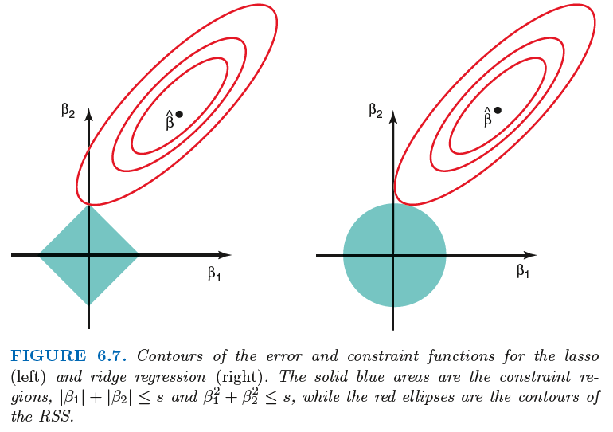

(penalized-regression)=
# Penalized Regression

In penalized regression, we penalize the maginitude of $\boldsymbol{\beta}$.

$$
\min_{\boldsymbol{\beta}}\ \left\| \boldsymbol{y} - \boldsymbol{X} \boldsymbol{\beta}  \right\|_2^2 + \lambda \left\| \boldsymbol{\beta}  \right\| _p
$$

where $\lambda \in [0, \infty]$ controls the penalty term.

Different $p$-norms correspond to different problems and interpretation. In many cases we want to penalize $\boldsymbol{\beta}$, for instance, when
- high multicollinearity exists
- $n < d$, then $\boldsymbol{X} ^{\top} \boldsymbol{X}$ is not invertible
- variable selection, want some $\hat{\beta}_j=0$

## Ridge Regression

Ridge regression uses $L_2$ norm. The objective function is

$$
\min_{\boldsymbol{\beta}}\ \left\| \boldsymbol{y} - \boldsymbol{X} \boldsymbol{\beta}  \right\|_2 + \lambda \left\| \boldsymbol{\beta}  \right\| _2^2
$$

Equivalently, ridge regression can be written as solving

$$
\min _{\beta}\|\boldsymbol{y}-\boldsymbol{X} \boldsymbol{\beta}\|^{2}\quad \text{s.t. } \|\boldsymbol{\beta}\|_{2} \ge s
$$

The optimizer is

$$
\hat{\boldsymbol{\beta}}_{\text{ridge} } = (\boldsymbol{X} ^{\top} \boldsymbol{X} + \lambda \boldsymbol{I} ) ^{-1} \boldsymbol{X} ^{\top} \boldsymbol{y}
$$

Effect of $\lambda$
- When $\lambda = 0$, we obtain $\hat{\boldsymbol{\beta} }_{\text{ridge} } = \hat{\boldsymbol{\beta} }_{\text{OLS} }$
- When $\lambda = \infty$, we obtain $\hat{\boldsymbol{\beta} }_{\text{ridge} } = 0$
- In general, as $\lambda$ increases
  - bias $\left\| \mathbb{E} [\hat{\boldsymbol{\beta} }_{\text{ridge} }] - \boldsymbol{\beta}  \right\|$ increases
  - variance $\operatorname{Var}\left( \hat{\boldsymbol{\beta} }_{\text{ridge} } \right)$  decreases
  - The overall mean squared error $\mathbb{E} [\left\| \hat{\boldsymbol{\beta} }_{\text{ridge} } - \boldsymbol{\beta}  \right\|_2^2 ]$ can be reduced for a range of $\lambda$ compared to $\hat{\boldsymbol{\beta} }_{\text{OLS} }$.

Note that Ridge regression will include all variables by haveing $\hat{\boldsymbol{\beta} _i} = 0$ for all coefiicients. Hence no effect of varibale selection.

Application:
- When $\boldsymbol{X} ^{\top} \boldsymbol{X}$ in not invertible or close to singularity.

  Interpretattion of adding $\lambda \boldsymbol{I}$ to $\boldsymbol{X} ^{\top} \boldsymbol{X}$:
  - want this term large enough to make $(\boldsymbol{X} ^{\top} \boldsymbol{X} + \lambda \boldsymbol{I} ) ^{-1}$ invertible
  - want this term small enough to have a reasonable estimate
- when there exists multicollinearity issue, Ridge regression provides more stable estimation.
- Ridge regression estimation generally shrinks the estimated parameters from the ordinary least squares estimates.

  For example, if we assume orthogonal design $\boldsymbol{X} ^{\top} \boldsymbol{X} = \boldsymbol{I}$, then the ith estimator $\hat{\beta}_{i}^{\text {ridge }}=\frac{1}{\lambda+1}\hat{\beta}_{i}^{\text{LS} }$.

## LASSO Regression

In variable selection problem, it is often desirable to have a small subset of non-zero estimates of $\beta_i$ for the purpose of model interpretation, especially when $p$ is large. Replacing the 2-norm $\left\| \boldsymbol{\beta} \right\|_2$ in Ridge regression model by 1-norm $\left\| \boldsymbol{\beta} \right\|_1$ does a good job in variable selection.

LASSO (Least Absolute Shrinkage and Selection Operator) optimizes

$$
\min _{\beta}\|\boldsymbol{y}-\boldsymbol{X} \boldsymbol{\beta}\|^{2}+\lambda\|\boldsymbol{\beta}\|_{1}
$$

Equivalently, LASSO regression can be written as solving

$$
\min _{\beta}\|\boldsymbol{y}-\boldsymbol{X} \boldsymbol{\beta}\|^{2}\quad \text{s.t. } \|\boldsymbol{\beta}\|_{1} \ge s
$$

A characteristic of LASSO estimator $\hat{\boldsymbol{\beta} }_{\text{Lasso} }$ is its sparsity. The solution would have many zero entry $\hat{\beta}_i$ = 0. This is because the shape of $L_1$ norm in $d$-dimensional space is pointy.

:::{figure} ridge-lasso

Comparison of Ridge and Lasso [Introduction to Statistical Learning]
:::

## Elastic Net

As a combination of Ridge and LASSO regressions, Elastic Net optimizes

$$
\min _{\beta}\|\boldsymbol{y}-\boldsymbol{X} \boldsymbol{\beta}\|^{2}+\lambda_{1}\|\boldsymbol{\beta}\|_{1}+\lambda_{2}\|\boldsymbol{\beta}\|_{2}^{2}
$$

Or in another common notation,

$$
\min _{\beta}\|\boldsymbol{y}-\boldsymbol{X} \boldsymbol{\beta}\|^{2}+\lambda\left((1-\alpha)\|\boldsymbol{\beta}\|_{1}+\alpha\|\boldsymbol{\beta}\|_{2}^{2}\right)
$$

If a few covariates $X_i$ are correlated,
- Ridge tends to keep them similar sized,
- LASSO tends to keep one of them,
- E-Net at certain value tends to either keep them all in, or leave them all out.

Optimization algorithms (e.g., coordinate descent) are used to obtain parameter estimates efficiently.
