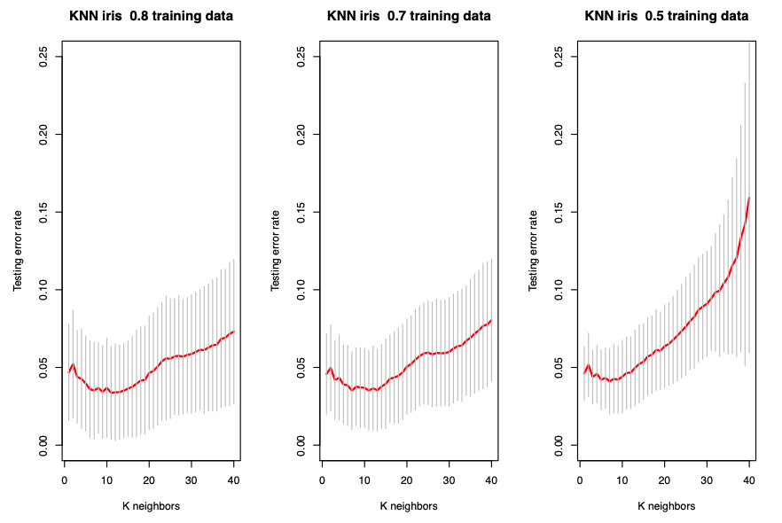

# K-nearest neighbors

$K$-nearest neighbors is a non-parametric method. It simply the application of nearest-neighbor smoothing on a graph.

It can be used for both classification and regression. The nearest-neighbor methods can also be applied to a graph with vertex attributes.

## Classification from Data Matrix

If the input is a data matrix, $K$-nearest neighbors method look at the $K$ points in the training set $\mathcal{D}$ that are nearest to the test input $\boldsymbol{x}_i$, denoted $N_K \left( \boldsymbol{x}_i, \mathcal{D} \right)$. To define 'nearest', it requires a distance measure $d(\boldsymbol{x}_i, \boldsymbol{x}_j)$, such as Euclidean distance.

To predict the class of observation $\boldsymbol{x}$, use

$$\mathbb{P} (y=c\vert \boldsymbol{x}, \mathcal{D}, K) = \frac{1}{K} \sum_{j \in N_K (\boldsymbol{x}, \mathcal{D})} \mathbb{I}\left( y_j =c \right)$$

Validation data is used to decide the hyper-parameter $K$.

## Regression on Graph

If the input is a graph $G=(V, E)$ with vertex attribute $x _v$, then for new vertex $i$ with unknown attribute but known edges, we can predict its attribute value by the average of those of its neighbors,

$$
\hat{\boldsymbol{x} }_i = \frac{\sum_{j \in \mathscr{N}_{i}} \boldsymbol{x} _{j}}{\left|\mathscr{N} _{i}\right|}
$$

Note that there is no hyper-parameter $K$.

## Tuning

To choose optimal $K$, we can use train-test split.

:::{figure} knn-split

Random train-test split for different ratios [Wang 2021]
:::

As $K$ increases from 1, the test error first decreases and then increases. The error bound increases.

## Pros

- Can express complex, non-linear, non-parametric boundaries
- Very fast training
- Simple, yet with good performance in practice
- Reasonably good interpretability

## Cons
- It is an example of **memory-based learning** or **instance-based learning**. It stores all seen points.
- Not among the best classifiers in terms of accuracy
- Standardization is often necessary
- Poor performance in high dimensional settings
- In the graph case, how best to evaluate may not be clear in the case where $\boldsymbol{x} _j$ is not observed for one or more $j \in N_i$.
  - One solution to this dilemma is to redefine it in terms of only those vertices $j \in V_i$ that are both adjacent to $i$ and for which $\boldsymbol{x} _j$ is observed.
  - Alternatively, we might impute values for the unobserved $\boldsymbol{x} _j$, substituting, for instance, the overall average $\frac{1}{\left\vert V_{obs} \right\vert}\sum _{k \in V_{obs}} \boldsymbol{x} _k$
  - Although neither of these approaches is entirely satisfactory, imputation is likely to work better in practice, particularly when the relative number of missing observations is not small
