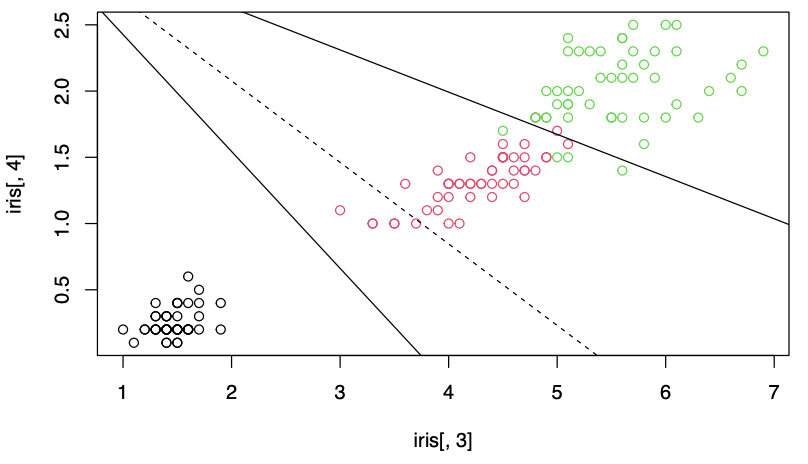
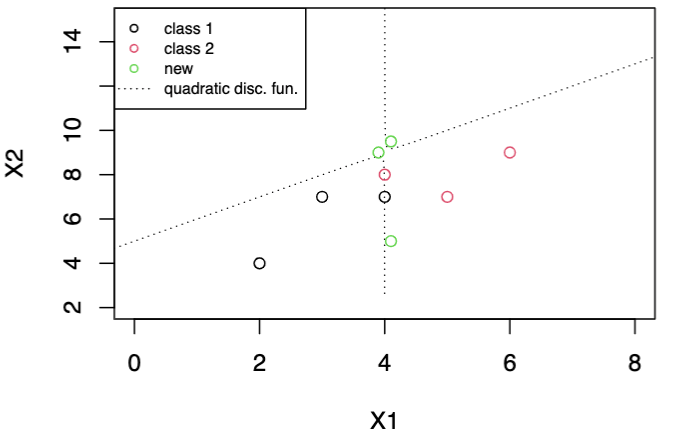

# For Gaussian Data

## Theory

We introduced some theory behind classification for two populations $\pi_1, \pi_2$, as well as generalization to $g$ populations $\pi_j, j=1, 2, \ldots, g$.

### Setup

#### Regions

For a classifier with some classification rule, let
- $\Omega$ be the **sample space** of all possible values of $\boldsymbol{x}$
- $R_1$ be the set (or **region**) of all $\boldsymbol{x}$ values for which we classify objects as $\pi_1$ by this rule
- $R_2 = \Omega \setminus R_1$ be the remaining $\boldsymbol{x}$

#### PDF

In theory, let $f_i(\boldsymbol{x})$ be the **probability density function** for $i$-th population, $i=1,2$. We can then define $\mathbb{P} (i \vert j)$ be the probability of classifying $\boldsymbol{x}$ in $\pi_i$ by the rule, given that in fact $\boldsymbol{x}$ is from $\pi_j$. Then
- $\mathbb{P} (2 \vert 1) = 1 - \mathbb{P} (x \in R_2 \vert \pi_1) = \int _{R_2} f_1 (x)\mathrm{~d} x$
- $\mathbb{P} (1 \vert 1) = 1 - \mathbb{P} (2 \vert 1)$

#### Priors

Suppose the **prior probability** of a random sampled observation belonging to $\pi_i$ is

$$
\mathbb{P} (\pi_i) = \pi _i
$$

with $\sum_{i=1} p_i = 1$. Then we have
- $\mathbb{P}(i \vert i) p_i$ is the probability that a randomly sampled observation **correctly** classified as $\pi_i$
- $\sum_{j\ne i}\mathbb{P}(i \vert j) p_j$ is the probability that a randomly sampled observation **incorrectly** classified as $\pi_i$

#### Cost

Usually, there is **cost** of misclassification. Let $c(i \vert j)$ be the cost of wrongly classifying an object from class $j$ to class $i$. Note that
- $c(i \vert i) = 0$
- the cost may be unequal, e.g. $c(i \vert j) \ne c(j \ne i)$ for $i \ne j$.

### Global Measurements and Learning

Based on the quantity above, we can then define some global measurement of classification. Then we can choose $R_1, R_2$ to minimize them.

#### Expected Cost of Misclassification

The **expected cost of misclassification** (ECM) is defined as

$$\begin{aligned}
\text{ECM}
&=\mathbb{E} \left(\text{cost of misclassifying the object into $\pi_{2} \vert$ an object is from } \pi_{1}\right) p_{1} \\
&+\mathbb{E}  \left(\text{cost of misclassifying the object into $\pi_{1} \vert$ an object is from }  \pi_{2}\right) p_{2} \\
&=c(2 \vert 1) \mathbb{P} (2 \vert 1) p_{1}+c(1 \vert 2) \mathbb{P}  (1 \vert 2) p_{2}\\
\end{aligned}$$

To find an optimal classifier, the region $R_1, R_2$ can be optimized to minimize the ECM. It can be shown that the optimal $R_1$, $R_2$ is

$$
\begin{array}{l}
R_{1}^{\text{ECM} }=\left\{x: \frac{f_{1}(x)}{f_{2}(x)} \geq \frac{c(1 \vert 2)}{c(2 \vert 1)} \cdot \frac{p_{2}}{p_{1}}\right\} \quad\left(\begin{array}{c}
\text { density } \\
\text { ratio }
\end{array}\right) \geq\left(\begin{array}{c}
\text { cost } \\
\text { ratio }
\end{array}\right)\left(\begin{array}{l}
\text { prior } \\
\text { ratio }
\end{array}\right) \\
R_{2}^{\text{ECM} }=\left\{x: \frac{f_{1}(x)}{f_{2}(x)}<\frac{c(1 \vert 2)}{c(2 \vert 1)} \cdot \frac{p_{2}}{p_{1}}\right\} \quad\left(\begin{array}{c}
\text { density } \\
\text { ratio }
\end{array}\right)<\left(\begin{array}{c}
\text { cost } \\
\text { ratio }
\end{array}\right)\left(\begin{array}{l}
\text { prior } \\
\text { ratio }
\end{array}\right)
\end{array}
$$

:::{admonition,dropdown,seealso} *Proof*

Substituting the definition of $\mathbb{P} (i\vert j)$ we have

$$
\begin{aligned}
\text{ECM}  &=p_{1} c(2 \vert 1) \int_{\Omega \backslash R_{1}} f_{1}(x) d x+p_{2} c(1 \vert 2) \int_{R_{1}} f_{2}(x) d x \\
&=p_{1} c(2 \vert 1) \int_{\Omega} f_{1}(x) d x-p_{1} c(2 \vert 1) \int_{R_{1}} f_{1}(x) d x+p_{2} c(1 \vert 2) \int_{R_{1}} f_{2}(x) d x \\
&=p_{1} c(2 \vert 1)+\int_{R_{1}}\left[p_{2} c(1 \vert 2) f_{2}(x)-p_{1} c(2 \vert 1) f_{1}(x)\right] d x
\end{aligned}
$$

The first term $p_1 c(2 \vert 1) \ge 0$ is a constant. To minimize ECM is to minimize the second term. Hence, $R_1$ only covers the region of $x$ where $p_{2} c(1 \vert 2) f_{2}(x)-p_{1} c(2 \vert 1) f_{1}(x) < 0$. That is,

$$
R_1 = \left\{ x: \frac{f_{1}(x)}{f_{2}(x)} \geq \frac{c(1 \vert 2)}{c(2 \vert 1)} \cdot \frac{p_{2}}{p_{1}}\right\}
$$

:::

For multiple classes,

- the expected cost of misclassifying an item $x$ from $\pi_i$ is

  $$\text{ECM}(i) = \sum_{j=1}^g c(j \vert i) \mathbb{P} (j \vert i)$$

  with $c(i \vert i) = 0$.

- the expected cost over all items is

  $$\text{ECM} = \sum_{j=1}^g p_i \text{ECM}(i)$$

The classification regions $R_k, k = 1, 2, \ldots, g$ that minimize the overall expected cost of misclassification ECM are defined by allocating observation $x$ to population $\pi_k$ for which **the misclassification cost is minimized**.

$$
R_{k}=\left\{x: \sum_{i=1, i \neq k}^{g} p_{i} f_{i}(x) c(k \vert i) \leq \sum_{i=1, i \neq \ell}^{g} p_{i} f_{i}(x) c(\ell \vert i), \quad \ell=1, \cdots, g \right\}
$$

If costs are even then this becomes

$$
R_{k}=\left\{x: p_{k} f_{k}(x) \geq p_{i} f_{i}(x), \forall\ i \ne k\right\}
$$

#### Total Probability of Misclassification

Another global measurement is **total probability of misclassification** (TPM), defined as

$$
\text{TPM} =p_{1} \int_{R_{2}} f_{1}(x) d x+p_{2} \int_{R_{1}} f_{2}(x) d x
$$

Minimizing TPM is the **same** as minimizing ECM when misclassification costs $c(j \vert i), j \ne i$ are the same for all classes. The regions are simplified to

$$
\begin{array}{l}
R_{1} ^{\text{TPM} }=\left\{x: \frac{f_{1}(x)}{f_{2}(x)} \geq \frac{p_{2}}{p_{1}}\right\} \quad\left(\begin{array}{c}
\text { density } \\
\text { ratio }
\end{array}\right) \geq\left(\begin{array}{l}
\text { prior } \\
\text { ratio }
\end{array}\right) \\
R_{2}^{\text{TPM} }=\left\{x: \frac{f_{1}(x)}{f_{2}(x)}<\frac{p_{2}}{p_{1}}\right\} \quad\left(\begin{array}{c}
\text { density } \\
\text { ratio }
\end{array}\right)<\left(\begin{array}{l}
\text { prior } \\
\text { ratio }
\end{array}\right)
\end{array}
$$

#### Bayesian Approach

Bayesian approach allocate a new observation $x_0$ to the class with largest posterior probability $\mathbb{P} (\pi_i \vert x_0)$. By Bayes' Rule, the posterior probability is

$$
\begin{aligned}
\mathbb{P}(\pi_{1} \vert x_{0}) &=\frac{\mathbb{P}(\text {we observe } x_{0}, \text { and } x_{0} \text { is from } \pi_{1})}{\mathbb{P}(\text {we observe } x_{0})} \\
&=\frac{\mathbb{P}(\text {we observe } x_{0} \vert \pi_{1}) \mathbb{P}(\pi_{1})}{\mathbb{P}(\text {we observe } x_{0} \vert \pi_{1}) \mathbb{P}(\pi_{1})+\mathbb{P}(\text {we observe } x_{0} \vert \pi_{2}) \mathbb{P}(\pi_{2})} \\
&=\frac{f_{1}(x_{0})p_{1} }{f_{1}(x_{0})p_{1}+ f_{2}(x_{0})p_2}
\end{aligned}
$$

Hence, the Bayesian classifier assign $x_0$ to $\pi_1$ if $\mathbb{P}\left(\pi_{1} \vert x_{0}\right) \ge \mathbb{P}\left(\pi_{2} \vert x_{0}\right)$, which is

$$
R_{1}^{\text{Bay} }=\left\{x: \frac{f_{1}(x)}{f_{2}(x)} \geq \frac{p_{2}}{p_{1}}\right\}
$$

We conclude that
- In terms of classification regions, maximizing posterior probability is equivalent to minimizing the Total Probability of Misclassification TPM.
- However the values of the posterior probability $\mathbb{P}\left(\pi_{1} \vert x_{0}\right)$ provide more information than the yes-or-no class boundaries, especially in the not so clear-cut cases.

For multi-classes, the posterior probability that $x_0$ is from $\pi_k$ is

$$
\mathbb{P} \left(\pi_{i} \mid x_{0}\right)=\frac{p_{i} f_{i}\left(x_{0}\right)}{\sum_{j=1}^{g} p_{j} f_{j}\left(x_{0}\right)}=\frac{p_{i} f_{i}\left(x_{0}\right)}{p_{1} f_{1}\left(x_{0}\right)+\cdots+p_{g} f_{g}\left(x_{0}\right)}
$$

In applications, the quantities $p_i$ and $f_i$ are often not known given data. Estimation procedures have to be developed to apply these criteria. For instance,
- $p_i$ can be estimated by class proportions in training data.
- $f_i$ can be estimated under assumption of Gaussians with equal covariance.

### Errors

- **Optimum error rate**, aka minimum total probability of misclassification

  $$\begin{aligned}
  \text{OER}
  &= \min_{R_1, R_2} \text{TPM}  \\
  &= \min_{R_1, R_2} p_{1} \int_{R_{2}} f_{1}(\boldsymbol{x}) d x+p_{2} \int_{R_{1}} f_{2}(x) d x
  \end{aligned}$$

  Under equal cost, we have

  $$\text{OER} = \min_{R_1, R_2} \text{TPM} = \min_{R_1, R_2} \text{ECM}$$

- **Actual error rate**

  $$
  \text{AER} =p_{1} \int_{\hat{R}_{2}} f_{1}(\boldsymbol{x}) d x+p_{2} \int_{\hat{R}_{1}} f_{2}(x) d x
  $$

  - $\hat{R}$ are regions learned from data by some rule.
  - $f(x)$ are still unknown, hence AER cannot be calculated

- **Apparent error rate**, aka training error rate, which is the fraction of
observations in the training sample that are misclassified.

  $$
  \text{APER} = \frac{\# \left\{ \text{misclassified}  \right\}}{N}   = 1 - \text{accuracy}
  $$

  We can train a classifier in training set, and compute APER in test set. It can then be used as an approximation for $\mathbb{E} [AER]$.

## Equal Covariance

(da-equal-two)=
### Two-classes

Let the populations $\pi_i, i=1,2$ be multivariate Gaussian with density $\mathcal{N} _p (\boldsymbol{\mu} _i, \boldsymbol{\Sigma})$. The classification rule that minimizes ECM is to allocate $\color{teal}{\boldsymbol{x}_{0}}$ to $\pi_1$ if

$$
\left(\boldsymbol{\mu}_{1}-\boldsymbol{\mu}_{2}\right)^{\top} \boldsymbol{\Sigma} ^{-1} {\color{teal}{\boldsymbol{x}_{0}}} -\frac{1}{2}\left(\boldsymbol{\mu}_{1}-\boldsymbol{\mu}_{2}\right)^{\top} \boldsymbol{\Sigma} ^{-1}\left(\boldsymbol{\mu}_{1}+\boldsymbol{\mu}_{2}\right) \geq \ln \left(\frac{c(1 \vert 2)}{c(2 \vert 1)} \cdot \frac{p_{2}}{p_{1}}\right)
$$

:::{admonition,dropdown,seealso} *Proof*

Since

$$\begin{aligned}
\log\frac{f_{1}(\boldsymbol{x})}{f_{2}(\boldsymbol{x})}
&=-\frac{1}{2}\left[\left(\boldsymbol{x}-\boldsymbol{\mu}_{1}\right)^{\top} \boldsymbol{\Sigma}^{-1}\left(\boldsymbol{x}-\boldsymbol{\mu}_{1}\right)-\left(\boldsymbol{x}-\boldsymbol{\mu}_{2}\right)^{\top} \boldsymbol{\Sigma}^{-1}\left(\boldsymbol{x}-\boldsymbol{\mu}_{2}\right)\right] \\
&=\left(\boldsymbol{\mu}_{1}-\boldsymbol{\mu}_{2}\right)^{\top} \boldsymbol{\Sigma}^{-1} \boldsymbol{x}-\frac{1}{2}\left(\boldsymbol{\mu}_{1}-\boldsymbol{\mu}_{2}\right)^{\top} \boldsymbol{\Sigma}^{-1}\left(\boldsymbol{\mu}_{1}+\boldsymbol{\mu}_{2}\right)
\end{aligned}$$

The inequality

$$
\ln \frac{f_{1}\left(\boldsymbol{x} _{0}\right)}{f_{2}\left(\boldsymbol{x} _{0}\right)} \geq \ln \left( \frac{c(1 \vert 2)}{c(2 \vert 1)} \cdot \frac{p_{2}}{p_{1}} \right)
$$

becomes

$$
\left(\boldsymbol{\mu}_{1}-\boldsymbol{\mu}_{2}\right)^{\top} \boldsymbol{\Sigma}^{-1} {\color{teal}{\boldsymbol{x}_{0}}}-\left(\boldsymbol{\mu}_{1}-\boldsymbol{\mu}_{2}\right)^{\top} \boldsymbol{\Sigma} ^{-1} \frac{1}{2}\left(\boldsymbol{\mu}_{1}+\boldsymbol{\mu}_{2}\right) \geq \ln \left(\frac{c(1 \vert 2)}{c(2 \vert 1)} \cdot \frac{p_{2}}{p_{1}}\right)
$$

:::

In practice, sample estimates are used in the place of the the unknown population $\boldsymbol{\mu} _i, \boldsymbol{\Sigma}$. The sample classification rule is

$$
\left(\bar{\boldsymbol{x} }_{1}-\bar{\boldsymbol{x} }_{2}\right)^{\top} \boldsymbol{S} _{\text{pool} }^{-1} {\color{teal}{\boldsymbol{x}_{0}}}-\frac{1}{2}\left(\bar{\boldsymbol{x} }_{1}-\bar{\boldsymbol{x} }_{2}\right)^{\top} \boldsymbol{S} _{\text{pool} }^{-1}\left(\bar{\boldsymbol{x} }_{1}+\bar{\boldsymbol{x} }_{2}\right) \geq \ln \left(\frac{c(1 \vert 2)}{c(2 \vert 1)} \cdot \frac{p_{2}}{p_{1}}\right)
$$

Note that the above classification rule of minimum ECM for two multivariate normal populations of equal covariance structure is a **linear function** of the new observation $\boldsymbol{x} _0$. The coefficients of the linear functions are determined by the training sample data.

### Optimum Error Rate

Under equal cost and equal prior, we can compute optimum error rate.

The classification rule is simplified to

$$
\left(\boldsymbol{\boldsymbol{\mu}}_{1}-\boldsymbol{\boldsymbol{\mu}}_{2}\right)^{\top} \boldsymbol{\boldsymbol{\Sigma}}^{-1} \boldsymbol{\boldsymbol{x}}_{0}\ge \frac{1}{2}\left(\boldsymbol{\boldsymbol{\mu}}_{1}-\boldsymbol{\boldsymbol{\mu}}_{2}\right)^{\top} \boldsymbol{\boldsymbol{\Sigma}} ^{-1} \left(\boldsymbol{\boldsymbol{\mu}}_{1}+\boldsymbol{\boldsymbol{\mu}}_{2}\right)
$$

For $\boldsymbol{x} _0 \sim f_2$, we can define

$$y_{0}=\left(\boldsymbol{\mu}_{1}-\boldsymbol{\mu}_{2}\right)^{\top}\boldsymbol{\Sigma}^{-1} \boldsymbol{x}_{0} \sim N\left(\left(\boldsymbol{\mu}_{1}-\boldsymbol{\mu}_{2}\right)^{\top}\boldsymbol{\Sigma}^{-1} \boldsymbol{\mu}_{2},\left(\boldsymbol{\mu}_{1}-\boldsymbol{\mu}_{2}\right)^{\top}\boldsymbol{\Sigma}^{-1}\left(\boldsymbol{\mu}_{1}-\boldsymbol{\mu}_{2}\right)\right)$$

Hence,

$$
\begin{aligned}
\int_{R_{1}} f_{2}(\boldsymbol{x}) \mathrm{~d} \boldsymbol{x}
&=\mathbb{P} (1 \vert 2)=\mathbb{P} \left(\boldsymbol{x} \text { is incorrectly classified as } \pi_{1}\right) \\
&=\mathbb{P}\left(y_{0}>\frac{1}{2}\left(\boldsymbol{\mu}_{1}-\boldsymbol{\mu}_{2}\right)^{\top} \boldsymbol{\Sigma}^{-1} \left(\boldsymbol{\mu}_{1}+\boldsymbol{\mu}_{2}\right)\right) \\
&=\mathbb{P}\left(\frac{y_{0}-\mathbb{E}\left(y_{0}\right)}{\sqrt{\operatorname{Var}\left(y_{0}\right)}}>\frac{\frac{1}{2}\left(\boldsymbol{\mu}_{1}-\boldsymbol{\mu}_{2}\right)^{\top} \boldsymbol{\Sigma}^{-1} \left(\boldsymbol{\mu}_{1}+\boldsymbol{\mu}_{2}\right)-\left(\boldsymbol{\mu}_{1}-\boldsymbol{\mu}_{2}\right)^{\top} \boldsymbol{\Sigma}^{-1} \boldsymbol{\mu}_{2}}{\sqrt{\left(\boldsymbol{\mu}_{1}-\boldsymbol{\mu}_{2}\right)^{\top} \boldsymbol{\Sigma}^{-1}\left(\boldsymbol{\mu}_{1}-\boldsymbol{\mu}_{2}\right)}}\right) \\
&=\mathbb{P}\left(Z>\frac{1}{2} \sqrt{\left(\boldsymbol{\mu}_{1}-\boldsymbol{\mu}_{2}\right)^{\top} \boldsymbol{\Sigma}^{-1}\left(\boldsymbol{\mu}_{1}-\boldsymbol{\mu}_{2}\right)}\right) \\
&=\mathbb{P}\left(Z \leq-\frac{1}{2} \sqrt{\left(\boldsymbol{\mu}_{1}-\boldsymbol{\mu}_{2}\right)^{\top} \boldsymbol{\Sigma}^{-1}\left(\boldsymbol{\mu}_{1}-\boldsymbol{\mu}_{2}\right)}\right)\\
&=\Phi\left(-\frac{\Delta}{2}\right)
\end{aligned}
$$

where $\Delta = \sqrt{\left(\boldsymbol{\mu}_{1}-\boldsymbol{\mu}_{2}\right)^{\top} \boldsymbol{\Sigma}^{-1}\left(\boldsymbol{\mu}_{1}-\boldsymbol{\mu}_{2}\right)}$ is the standardized distance of the two population means.

Similarly we have $\int_{R_{2}} f_{1}(\boldsymbol{x}) \mathrm{~d} \boldsymbol{x}=\Phi\left(-\frac{\Delta}{2}\right)$. Hence, OER is

$$
\text{OER} =\min (\text{TPM} )=\frac{1}{2} \Phi\left(-\frac{\Delta}{2}\right)+\frac{1}{2} \Phi\left(-\frac{\Delta}{2}\right)=\Phi\left(-\frac{\Delta}{2}\right)=1-\Phi\left(\frac{\Delta}{2}\right)
$$

where $\Delta$ can be estimated from sample by $\hat{\Delta}^2 = \left(\bar{\boldsymbol{x}}_{1}-\bar{\boldsymbol{x}}_{2}\right)^{\top} S_{\text{pool} }^{-1}\left(\bar{\boldsymbol{x}}_{1}-\bar{\boldsymbol{x}}_{2}\right)$.

In practice, the population densities are unknown, the above estimate also has
errors that can be hard to evaluate.

(da-equal-multi)=
### Multi-classes

Apply the multi-classes classification rule under equal cost that minimizes ECM

$$
R_{k}=\left\{\boldsymbol{x}: p_{k} f_{k}(\boldsymbol{x}) \geq p_{i} f_{i}(\boldsymbol{x}), \forall\ i \ne k\right\}
$$

to the normal density:

$$\begin{aligned}
\ln(p_i f_i (\boldsymbol{\boldsymbol{x}}))
&= \ln \left(p_{i}\right)-\frac{p}{2} \ln (2 \pi)-\frac{1}{2} \ln \left|\boldsymbol{\Sigma}\right|-\frac{1}{2}\left(\boldsymbol{x}-\boldsymbol{\mu}_{i}\right)^{\top} \boldsymbol{\Sigma}^{-1}\left(\boldsymbol{x}-\boldsymbol{\mu}_{i}\right)\\
&= d_i(\boldsymbol{x})  -\frac{p}{2} \ln (2 \pi) -\frac{1}{2} \ln \left|\boldsymbol{\Sigma}\right| -\frac{1}{2} \boldsymbol{x} ^\top \boldsymbol{\Sigma} ^{-1} \boldsymbol{x}
\end{aligned}$$

where $d_i(\boldsymbol{x})$ is the **linear discrimination score**

$$
d_{i}(\boldsymbol{x})= \ln \left(p_{i}\right)+ \boldsymbol{\mu}_i ^\top \boldsymbol{\Sigma} ^{-1} \boldsymbol{x} - \frac{1}{2} \boldsymbol{\mu}_i ^\top  \boldsymbol{\Sigma} ^{-1} \boldsymbol{\mu}_i, \quad i=1, \cdots, g
$$

The classification region becomes

$$\begin{aligned}
R_{k}
&=\left\{\boldsymbol{x}: d_{k}(\boldsymbol{x}) \geq d_{i}(\boldsymbol{x}), \text { for all } i \neq k\right\} \\
&=\left\{\boldsymbol{x}: d_{k}(\boldsymbol{x})=\max \left\{d_{1}(\boldsymbol{x}), \cdots, d_{g}(\boldsymbol{x})\right\}\right\}
\end{aligned}$$

In sample classification rule, $d_k(\boldsymbol{\boldsymbol{x}})$ is estimated from sample

$$
\hat{d}_{k}(\boldsymbol{x})=\bar{\boldsymbol{x}}_{k}^{\top} \boldsymbol{S} _{\text {pool }}^{-1} \boldsymbol{x}-\frac{1}{2} \bar{\boldsymbol{x}}_{k}^{\top} \boldsymbol{S} _{\text {pool }}^{-1} \bar{\boldsymbol{x}}_{k}+\ln \left(p_{k}\right)
$$

where

$$
\boldsymbol{S}_{\text {pool }}=\frac{1}{n-g}\left[\left(n_{1}-1\right) \boldsymbol{S}_{1}+\cdots+\left(n_{g}-1\right) \boldsymbol{S}_{g}\right], \quad n=n_{1}+\cdots+n_{g}
$$

### Boundaries

The boundaries of classification regions can be obtained by equating pairwise discriminants and finding the intersection points. For instance, the boundary of $R_1$ and $R_2$ consists of $\boldsymbol{x}$ satisfying $d_1(\boldsymbol{x} ) = d_2 (\boldsymbol{x} )$.

If there are $g$ populations, there are $\binom{g}{2}$ hyperplanes forming the boundaries. Each can be found by equating two discriminant functions $d_i(\boldsymbol{x} ) = d_j (\boldsymbol{x} )$. The discriminant function $d_i(\boldsymbol{x})$ can be estimated by sample discriminants $\hat{d}_k(\boldsymbol{x})$, thus form the borders of the sample classification regions.

:::{figure} lda-boundary

Classification boundary (one is redundant) [Wang 2021]
:::

The dashed line in the plotted area is redundant: the classification of any point by the line would be re-evaluated by the other two partition lines. But the dashed line would not be redundant in slightly expanded areas outside the plot.

## Unequal Covariance

### Two-classes

When two subpopulations do not have a common covariance matrix, $\boldsymbol{\Sigma} _1 \ne \boldsymbol{\Sigma} _2$, their population density ratio has the form

$$
\begin{aligned}
\ln \frac{f_{1}(\boldsymbol{x})}{f_{2}(\boldsymbol{x})}=& \frac{1}{2} \ln \frac{\left|\boldsymbol{\Sigma}_{2}\right|}{\left|\boldsymbol{\Sigma}_{1}\right|}-\frac{1}{2}\left[\boldsymbol{x}^{\top}\left(\boldsymbol{\Sigma}_{1}^{-1}-\boldsymbol{\Sigma}_{2}^{-1}\right) \boldsymbol{x}\right.\\
&\left.-\boldsymbol{x}^{\top} \boldsymbol{\Sigma}_{1}^{-1} \boldsymbol{\mu}_{1}+\boldsymbol{x}^{\top} \boldsymbol{\Sigma}_{2}^{-1} \boldsymbol{\mu}_{2}-\boldsymbol{\mu}_{1}^{\top} \boldsymbol{\Sigma}_{1}^{-1} \boldsymbol{x}+\boldsymbol{\mu}_{2}^{\top} \boldsymbol{\Sigma}_{2}^{-1}\right) \\
&\left.+\boldsymbol{\mu}_{1}^{\top} \boldsymbol{\Sigma}_{1}^{-1} \boldsymbol{\mu}_{1}-\boldsymbol{\mu}_{2}^{\top} \boldsymbol{\Sigma}_{2}^{-1} \boldsymbol{\mu}_{2}\right]
\end{aligned}
$$

The minimum ECM classification regions becomes

$$
R_{1}:-\frac{1}{2} {\color{teal}{\boldsymbol{x}}}^{\top}\left(\boldsymbol{\Sigma}_{1}^{-1}-\boldsymbol{\Sigma}_{2}^{-1}\right) {\color{teal}{\boldsymbol{x}}}+\left(\boldsymbol{\mu}_{1}^{\top} \boldsymbol{\Sigma}_{1}^{-1}-\boldsymbol{\mu}_{2}^{\top} \boldsymbol{\Sigma}_{2}^{-1}\right) {\color{teal}{\boldsymbol{x}}}-k \geq \ln \left(\frac{c(1 \vert 2)}{c(2 \vert 1)} \cdot \frac{p_{2}}{p_{1}}\right)
$$

where $k=\frac{1}{2}\left(\boldsymbol{\boldsymbol{\mu}}_{1}^{\top} \boldsymbol{\Sigma}_{1}^{-1} \boldsymbol{\boldsymbol{\mu}}_{1}-\boldsymbol{\boldsymbol{\mu}}_{2}^{\top} \boldsymbol{\Sigma}_{2}^{-1} \boldsymbol{\boldsymbol{\mu}}_{2}\right)+\frac{1}{2} \ln \frac{\left|\boldsymbol{\Sigma}_{1}\right|}{\left|\boldsymbol{\Sigma}_{2}\right|}$.

Now the terms involving $\boldsymbol{x}$ are **quadratic** in $\boldsymbol{x}$. Hence the function is called quadratic discriminant function. In particular, if $\boldsymbol{\Sigma} _1 = \boldsymbol{\Sigma} _2$, then the quadratic term is zero, the remaining terms reduce to the linear classification function in the equal variance case.

The sample classification rule for ${\color{teal}{\boldsymbol{x}_{0}}}$ to $\pi_1$ is

$$
-\frac{1}{2} {\color{teal}{\boldsymbol{x}_{0}}}^{\top}\left(\boldsymbol{S}_{1}^{-1}-\boldsymbol{S}_{2}^{-1}\right) {\color{teal}{\boldsymbol{x}_{0}}}+\left(\bar{\boldsymbol{x}}_{1}^{\top} \boldsymbol{S}_{1}^{-1}-\bar{\boldsymbol{x}}_{2}^{\top} \boldsymbol{S}_{2}^{-1}\right) {\color{teal}{\boldsymbol{x}_{0}}}-\hat{k} \geq \ln \left(\frac{c(1 \vert 2)}{c(2 \vert 1)} \cdot \frac{p_{2}}{p_{1}}\right)
$$

where $\hat{k}=\frac{1}{2}\left(\bar{\boldsymbol{x}}_{1}^{\top} \boldsymbol{S}_{1}^{-1} \bar{\boldsymbol{x}}_{1}-\bar{\boldsymbol{x}}_{2}^{\top} \boldsymbol{S}_{2}^{-1} \bar{\boldsymbol{x}}_{2}\right)+\frac{1}{2} \ln \frac{\left|\boldsymbol{S}_{1}\right|}{\left|\boldsymbol{S}_{2}\right|}$.

Since the function involves is **quadratic** in $\boldsymbol{x}$, the regions partitions the space to three pieces in general. One region, say, $R_2$, could be in the middle of two $R_1$ sections, or vice versa, e.g. hyperbola in 2-d case. This sometimes does not make sense.

:::{figure} normal-disc-quad

A qudratic classification rule seperates the space into cross-over regions.
:::

### Multi-classes

Apply the multi-classes classification rule under equal cost that minimizes ECM

$$
R_{k}=\left\{\boldsymbol{x}: p_{k} f_{k}(\boldsymbol{x}) \geq p_{i} f_{i}(\boldsymbol{x}), \forall\ i \ne k\right\}
$$

to the normal density:

$$\begin{aligned}
\ln(p_i f_i (\boldsymbol{\boldsymbol{x}}))
&= \ln \left(p_{i}\right)-\frac{p}{2} \ln (2 \pi)-\frac{1}{2} \ln \left|\boldsymbol{\Sigma}_i\right|-\frac{1}{2}\left(\boldsymbol{x}-\boldsymbol{\mu}_{i}\right)^{\top} \boldsymbol{\Sigma}_i^{-1}\left(\boldsymbol{x}-\boldsymbol{\mu}_{i}\right)\\
&= d_i^Q(\boldsymbol{x}) -\frac{p}{2} \ln (2 \pi)
\end{aligned}$$

where $d_i^Q(\boldsymbol{x})$ is the **quadratic discrimination score**

$$
d_{i}^{Q}(\boldsymbol{x})=\ln \left(p_{i}\right)-\frac{1}{2} \ln \left|\boldsymbol{\Sigma}_{i}\right|-\frac{1}{2}\left(\boldsymbol{x}-\boldsymbol{\mu}_{i}\right)^{\top} \boldsymbol{\Sigma}_{i}^{-1}\left(\boldsymbol{x}-\boldsymbol{\mu}_{i}\right), \quad i=1, \cdots, g
$$

To avoid ties, we usually require $(\boldsymbol{\mu} _i, \boldsymbol{\Sigma} _i) \ne (\boldsymbol{\mu} _j, \boldsymbol{\Sigma} _j)$ for all $i \ne j$.

The classification region becomes

$$\begin{aligned}
R_{k}
&=\left\{\boldsymbol{x}: d_{k}^{Q}(\boldsymbol{x}) \geq d_{i}^{Q}(\boldsymbol{x}), \text { for all } i \neq k\right\} \\
&=\left\{\boldsymbol{x}: d_{k}^{Q}(\boldsymbol{x})=\max \left\{d_{1}^{Q}(\boldsymbol{x}), \cdots, d_{g}^{Q}(\boldsymbol{x})\right\}\right\}
\end{aligned}$$

In sample classification rule, $d_i^Q(\boldsymbol{x})$ is estimated.
