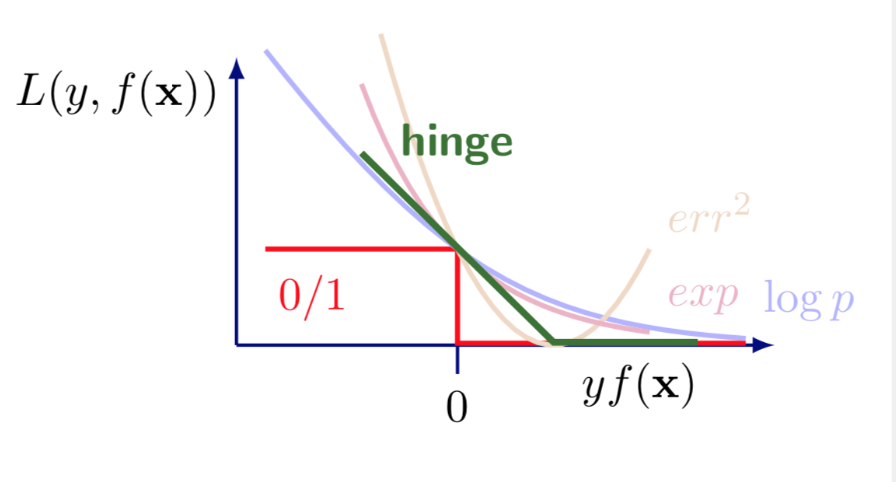

# Support Vector Machine

We first introduce the basic linear separable case (aka. hard margin), and introduce the linear non-separable case later (aka. soft margin).

## Prerequisite

### Distance from a Point to a Hyperplane

Suppose there is a hyperplane in $p$-dimensional space characterized by

$$
w_{1} x_{1}+w_{2} x_{2}+\cdots+w_{p} x_{p} + b = 0
$$

or in vector form,

$$
\boldsymbol{w} ^\top  \boldsymbol{x}  + b = 0
$$

then the distance from a point $X$ with coordinates $\boldsymbol{x} = (x_1, x_2, \ldots, x_p)$ to this hyperplane is

$$
\frac{1}{\left\Vert \boldsymbol{w}  \right\Vert } \left\vert \boldsymbol{w} ^\top  \boldsymbol{x}  + b  \right\vert
$$

note that the distance is always positive.

:::{admonition,dropdown,seealso} *Derivation*

For any two points $Y,Z$ with coordinates $\boldsymbol{y}, \boldsymbol{z}$ on the hyperplane we have

$$\begin{align}
\boldsymbol{w} ^\top \boldsymbol{y} + b &= 0 \\
\boldsymbol{w} ^\top \boldsymbol{z} + b &= 0
\end{align}$$

Hence,

$$
\boldsymbol{w} ^\top (\boldsymbol{y} - \boldsymbol{z})= 0
$$

which implies that the vector $\boldsymbol{w}$ is orthogonal to the hyperplane.

The distance from an arbitrary point $X$ to the hyperplane can be formulated as

$$
d = \left\vert \left( \frac{\boldsymbol{w}}{\left\Vert \boldsymbol{w}  \right\Vert } \right)  ^\top (\boldsymbol{x} - \boldsymbol{y}) \right\vert
$$

where $\frac{\boldsymbol{w}}{\left\Vert \boldsymbol{w}  \right\Vert }$ is a unit vector orthogonal to the hyperplane and $\boldsymbol{x} - \boldsymbol{y}$ is a vector pointing from point $Y$ (on the hyperplane) to point $X$. The absolute value of this cross product is the length of the projection of vector $\boldsymbol{x} - \boldsymbol{y}$ onto the direction of $\boldsymbol{w}$, i.e., $d$.

Substituting $\boldsymbol{w} ^\top \boldsymbol{y} + b = 0$ gives

$$
d = \frac{1}{\left\Vert \boldsymbol{w}  \right\Vert}\left\vert \boldsymbol{w} ^\top \boldsymbol{x} + \boldsymbol{b} \right\vert
$$

:::

Note that the points on the same side of the hyperplane have the same sign of $\boldsymbol{w} ^\top  \boldsymbol{x}_i  + b$. If we label the points with positive values of $\boldsymbol{w} ^\top  \boldsymbol{x}_i  + b$ by $y_i = 1$ and those with negative values by $y_i = -1$, then the distance can be written as

$$
\frac{1}{\left\Vert \boldsymbol{w}  \right\Vert } y_i (\boldsymbol{w} ^\top  \boldsymbol{x}  + b )
$$

## Objective

Support vector machine is used for binary classification tasks.

:::{figure,myclass} Use a hyperplane to separate two types of points

caption
:::

Definition (Margin)
: The margin is defined as the shortest distance from a point to the hyperplane.

$$
\min _{i} \frac{1}{|\boldsymbol{w}|} y_{i}\left(\boldsymbol{w}^{\top} \boldsymbol{x}_{i}+b\right)
$$

The objective of SVM is to find a hyperplane $\boldsymbol{w}^{\top} \boldsymbol{x}_{i}+b = 0$ that separates two types of points and maximizes the margin.

$$
\max _{\boldsymbol{w}, b}\left\{\min _i \frac{1}{\|\boldsymbol{w}\|} y_{i}\left(\boldsymbol{w}^{\top} \boldsymbol{x}_{i}+b\right)\right\}
$$

i.e.,

$$
\max _{\boldsymbol{w}, b} \frac{1}{\|\boldsymbol{w}\|} \left\{\min _i  y_{i}\left(\boldsymbol{w}^{\top} \boldsymbol{x}_{i}+b\right)\right\}
$$

To classify a point with coordinates $\boldsymbol{x}$, we use the solution $\boldsymbol{w}^*$ and $b^*$.

- If $\boldsymbol{w}^{* \top} \boldsymbol{x} + b^* > 0$ then $\hat{y}_i = 1$
- If $\boldsymbol{w}^{* \top} \boldsymbol{x} + b^* < 0$ then $\hat{y}_i = -1$

## Learning

We convert the optimization problem step by step such that it becomes easier to solve.

Note that distance is invariant to scaling of $\boldsymbol{w}$ and $b$ (or note that $\boldsymbol{w} ^\top \boldsymbol{x} +b = 0$ and $(k\boldsymbol{w}) ^\top \boldsymbol{x} + (kb) = 0$ characterize the same hyperplane), thus we can assume

$$
\min _{i} y_{i}\left(\boldsymbol{w}^{\top} \boldsymbol{x}_i + b\right)=1
$$

Then the maximization-minimization problem becomes a constrained maximization problem

$$\begin{align}
\underset{\boldsymbol{w}, b}{\max }&\quad \frac{1}{\|\boldsymbol{w}\|}\\
\text {s.t.}&\quad \min_{i} y_{i}\left(\boldsymbol{w}^{\top} \boldsymbol{x}_i+b\right)=1\\
\end{align}$$

Or equivalently,

$$\begin{align}
\underset{\boldsymbol{w}, b}{\min }&\quad \frac{1}{2} \boldsymbol{w} ^\top \boldsymbol{w}    \\
\text {s.t.}&\quad y_{i}\left(\boldsymbol{w}^{\top} \boldsymbol{x}_i+b\right)\ge1\\
\end{align}$$

To get rid of the constraints on $\boldsymbol{w}$ and $b$, we use Lagrangian multiplier method. Let

$$
L(\boldsymbol{w} ,b,\lambda) = \frac{1}{2} \boldsymbol{w} ^\top \boldsymbol{w}  + \sum_i ^n \lambda_i (1-y_i(\boldsymbol{w} ^\top \boldsymbol{x}_i + b))
$$

where $\lambda_i \ge 0$.

Then the problem becomes

$$\begin{align}
\underset{\boldsymbol{w}, b}{\min } \, \max _{\boldsymbol{\lambda}} &\quad L(\boldsymbol{w} ,b, \boldsymbol{\lambda}) \\
\text {s.t.}&\quad \lambda_i \ge 0\\
\end{align}$$

Since $\min_{\boldsymbol{w} ,b} L$ is better to solve than $\max_{\boldsymbol{\lambda} } L$, we want exchange the min-max order. This step is valid since it is a quadratic minimization with $n$ linear constraints, which leads to strong duality. As a result, its dual problem is

$$\begin{align}
\max _{\boldsymbol{\lambda}} \, \underset{\boldsymbol{w}, b}{\min }  &\quad L(\boldsymbol{w} ,b, \boldsymbol{\lambda}) \\
\text {s.t.}&\quad \lambda_i \ge 0\\
\end{align}$$

which is has the same solutions $\boldsymbol{w}^*, b^*$ with the primal problem.

We first solve the minimization problem. Taking derivatives of $L$ w.r.t. $\boldsymbol{w} ,b$ and equating them to zero gives

$$\begin{align}
&& \frac{\partial}{\partial \boldsymbol{w}} L\left(\boldsymbol{w}, b, \boldsymbol{\lambda}\right) &= \boldsymbol{w}-\sum_{i=1}^{n} \lambda_{i} y_{i} \boldsymbol{x}_{i}\overset{\text{set}}{=} 0 \\
&\Rightarrow & \boldsymbol{w} &= \sum_{i=1}^{n} \lambda_{i} y_{i} \boldsymbol{x}_{i}  \\
&& \frac{\partial}{\partial b} L\left(\boldsymbol{w}, b, \boldsymbol{\lambda}\right)
& =-\sum_{i=1}^{n} \lambda_{i} y_{i} \overset{\text{set}}{=} 0  \\
&\Rightarrow &  \sum_{i=1}^{n} \lambda_{i} y_{i} & = 0 \\
\end{align}$$

Substituting the result back to the dual problem,

$$\begin{align}
\max _{\boldsymbol{\lambda}} \,  &\quad \sum_{i=1}^{n} \lambda_{i}-\frac{1}{2} \sum_{i=1}^{n} \sum_{j=1}^{n}\lambda_{i} \lambda_{j} y_{i} y_{j} \boldsymbol{x}_{i} \boldsymbol{x}_{j} \\
\text {s.t.}&\quad \sum_{i=1}^{n} \lambda_{i} y_{i}=0, \lambda_{i} \geq 0\\
\end{align}$$

Solving this quadratic program with linear constraints yields $\boldsymbol{\lambda} ^*$.

Besides, due to strong duality, KKT conditions hold, such that

$$
\exists\left(x_{k}, y_{n}\right):\, 1-y_{k}\left(\boldsymbol{w} ^{*\top} \boldsymbol{x}_{k}+b\right)=0
$$

which gives

$$
b^* = y_k - \boldsymbol{w} ^{* \top} \boldsymbol{x} _k
$$

Therefore,

$$
\boldsymbol{w} ^{*}=\sum_{i=0}^{n} \lambda_{i} y_{i} \boldsymbol{x}_{i} \quad b^{*}=y_{k}-\sum_{i=0}^{n} \lambda_{i} y_{i} \boldsymbol{x}_{i}^{\top} \boldsymbol{x}_{k}
$$

## Properties

The weights is a linear combination of data vectors

$$
\boldsymbol{w} ^{*}=\sum_{i=0}^{n} \lambda_{i} y_{i} \boldsymbol{x}_{i}
$$

where $\lambda_i \ne 0$ for the points that lies on the margin, i.e. only the data on the margin defines $\boldsymbol{w}^*$.

Moreover,

- If $\boldsymbol{w}^{* \top} \boldsymbol{x} + b^* = \pm 1$ then the point lie on the hyperplane $\pm$ margin. The vector $\boldsymbol{x}$ is called a **support vector**.
- If $\boldsymbol{w}^{* \top} \boldsymbol{x} + b^* < 1$ then the point lie inside the two margins.
- If $\boldsymbol{w}^{* \top} \boldsymbol{x} + b^* > 1$ then the point lie outside the two margins.

## Extension

### Multiclass

One-versus-rest: construct $K$ separate SVMs. Using
$k^*=\arg \max _{k} (\boldsymbol{w}_k ^\top \boldsymbol{x} + b_k)$

One-versus-one: construct $\frac{K(K-1)}{2}$ SVMs on all pairs. Each SVM classifies a point to either $k_1$ or $k_2$. For prediction, select $k$ with the highest votes.

“True” multi-class SVMs (Crammer and Singer, 2001)

### Soft Margin

Recall the objective function for the hard margin case

$$
\begin{equation}
\begin{array}{ll}
\min _{\boldsymbol{w}, b} & \frac{1}{2} \boldsymbol{w}^{\top} \boldsymbol{w} \\
\text { s.t. } & y_{i}\left(\boldsymbol{w}^{\top} \boldsymbol{x}_{i}+b\right) \geq 1
\end{array}
\end{equation}
$$

What if we cannot find a hyperplane that separate the two types of points? That is, the constraint

$$
y_{i}\left(\boldsymbol{w}^{\top} \boldsymbol{x}_{i}+b\right) \geq 1
$$

does not hold for all $i$. Some observation will violate this constraint.

In such case, we can add a loss term to measure the extent of violation, and include this loss into the objective function. This kind of margin is called **soft margin**.

The new objective function becomes

$$
\min _{\boldsymbol{w}, b}  \frac{1}{2} \boldsymbol{w}^{\top} \boldsymbol{w} + C\sum_i^n R(\boldsymbol{w} ,b, \boldsymbol{x}_i ,y_i)
$$

where
- $R$ is some loss function.
- $C$ is a parameter to control the weight on the loss term. When $C\rightarrow \infty$, the formulation approaches separable case.

For instance, $R$ can be an indicator function, with value $1$ if the constraint is violated, i.e.

$$
\begin{equation}
R(\boldsymbol{w} ,b, \boldsymbol{x}_i ,y_i) =\left\{\begin{array}{ll}
1, & \text { if } y_{i}\left(\boldsymbol{w}^{\top} \boldsymbol{x}_{i}+b\right) < 1 \\
0, & \text { otherwise }
\end{array}\right.
\end{equation}
$$

A more reasonable loss is to measure the actual deviation from the constrain, i.e., $1 - y_{i}\left(\boldsymbol{w}^{\top} \boldsymbol{x}_{i}+b\right)$, for those who violates the constraint, i.e.  $y_{i}\left(\boldsymbol{w}^{\top} \boldsymbol{x}_{i}+b\right) < 1$. Overall, the loss function is

$$
R(\boldsymbol{w} ,b, \boldsymbol{x}_i ,y_i) = \max \left\{ 0, 1 - y_{i}\left(\boldsymbol{w}^{\top} \boldsymbol{x}_{i}+b\right)  \right\}
$$

which is called **Hinge loss**.

:::{figure,myclass} hinge-loss

Comparison of loss functions
:::

Let $\xi_{i}=\max \left\{0,1-y_{i}\left(\boldsymbol{w}^{\top} x_{i}+w_{0}\right)\right\}$, then the objective is

$$
\min _{\boldsymbol{w}, b}  \frac{1}{2} \boldsymbol{w}^{\top} \boldsymbol{w} + C\sum_i^n \xi_i
$$

From optimization point of view $\xi_i$ is called a slack variable.

Applying similar conversion to the basic case above, we get

$$\begin{align}
\underset{\boldsymbol{w}, b}{\min }&\quad \sum_{i=1}^{n} \alpha_{i}-\frac{1}{2} \sum_{i, j=1}^{n} \alpha_{i} \alpha_{j} y_{i} y_{j} \boldsymbol{x}_{i} \boldsymbol{x}_{j}    \\
\text {s.t.}&\quad \sum_{i=1}^{n} \alpha_{i} y_{i}=0\\
& \quad 0 \leq \alpha_{i} \leq C
\end{align}$$

This can be solved by gradient descent.

### Kernel SVMs

If the points are non-seperable, we consider transform them into a higher-dimensional space by a feature transformation $\boldsymbol{\boldsymbol{\phi}}(\boldsymbol{x})$, and find a hyperplane there to separate the points (hopefully).

#### Transformed Unconstrained Original

For the original problem, after transformation into $\boldsymbol{\phi}(\boldsymbol{x})$ it becomes

$$
\mathcal{L}\left(\boldsymbol{w}, w_{0}\right)=\frac{1}{2}\|\boldsymbol{w}\|^{2}+C \sum_{i=1}^{n} \max \left\{0,1-y_{i}\left(\boldsymbol{w}^{\top} \boldsymbol{\phi}(\boldsymbol{x})+w_{0}\right)\right\}
$$

By the [Representer Theorem](ml-representer-theorem) and some refinement, the optimal solution has the form

$$
\boldsymbol{w}^{*}=\sum_{i=1}^{n} \alpha_{i} y_{i} \boldsymbol{\phi}\left(\boldsymbol{x}_{i}\right)
$$

Substituting it back to the objective function gives

$$
\|\boldsymbol{w}\|^{2}=\left(\sum_{i=1}^{n} \alpha_{i} y_{i} \boldsymbol{\phi}\left(\boldsymbol{x}_{i}\right)\right)^{\top}\left(\sum_{i=j}^{n} \alpha_{j} y_{j} \boldsymbol{\phi}\left(\boldsymbol{x}_{j}\right)\right)=\sum_{i, j} \alpha_{i} \alpha_{j} y_{i} y_{j} k\left(\boldsymbol{x}_{i}, \boldsymbol{x}_{j}\right)
$$

and

$$
\boldsymbol{w}^{\top} \boldsymbol{\phi}(\boldsymbol{x})=\left(\sum_{i=1}^{n} \alpha_{i} y_{i} \boldsymbol{\phi}\left(\boldsymbol{x}_{i}\right)\right)^{\top} \boldsymbol{\phi}(\boldsymbol{x})=\sum_{i} \alpha_{i} y_{i} k\left(\boldsymbol{x}_{i}, \boldsymbol{x}\right)
$$

So we turn $\mathcal{L}\left(\boldsymbol{w}, w_{0}\right)$ to $\mathcal{L}\left(\boldsymbol{\alpha} , w_{0}\right)$ and we can then solve it by SGD.

#### Transformed Dual

The primal problem becomes

$$
\begin{aligned}
\underset{\boldsymbol{w}, w_{0}}{\min }&\  \frac{1}{2}\|\boldsymbol{w}\|^{2} \\
\text { s.t.}&\  y_{i}\left(\boldsymbol{w}^{\top} \boldsymbol{\phi}( \boldsymbol{x}_{i})  + w_{0}\right) \geq 1-\xi_{i}, \xi_{i} \geq 0, \forall i \\
&\ \boldsymbol{w}, \boldsymbol{\phi}(\boldsymbol{x}_{i})  \in \mathbb{R}^{d}
\end{aligned}
$$

and the dual problem becomes

$$
\begin{aligned}
\underset{\boldsymbol{\alpha}}{\max } & \ \left\{\sum_{i=1}^{n} \alpha_{i}-\frac{1}{2} \sum_{i=1}^{n} \sum_{j=1}^{n} \alpha_{i} \alpha_{j} y_{i} y_{j} \boldsymbol{\phi}\left(\boldsymbol{x}_{i}\right)^{\top} \boldsymbol{\phi}\left(\boldsymbol{x}_{j}\right)\right\} \\
\text { s.t.}&\ \sum_{i=1}^{n} \alpha_{i} y_{i}=0,0 \leq \alpha_{i} \leq C, \forall i
\end{aligned}
$$

We find there is a dot product in the objective function, so we can consider using a PSD kernel $k(\boldsymbol{x} , \boldsymbol{y} )=\boldsymbol{\phi}(\boldsymbol{x} )^{\top} \boldsymbol{\phi}(\boldsymbol{y} )$. The problem becomes

$$
\begin{aligned}
\underset{\boldsymbol{\alpha}}{ \max }&\ \left\{\sum_{i=1}^{n} \alpha_{i}-\frac{1}{2} \sum_{i=1}^{n} \sum_{j=1}^{n} \alpha_{i} \alpha_{j} y_{i} y_{j} k\left(\boldsymbol{x}_{i}, \boldsymbol{x}_{j}\right)\right\} \\
\text { s.t.} &\ \sum_{i=1}^{n} \alpha_{i} y_{i}=0,0 \leq \alpha_{i} \leq C, \forall i
\end{aligned}
$$

and we solve the QP problem for $\boldsymbol{\alpha}$.
