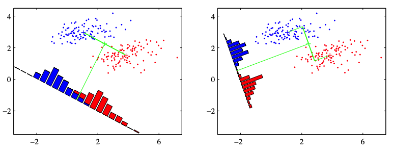

# Linear Discriminant Analysis

We introduce Fisher's Linear Discriminant Function.

## Objective

We have two groups of data in $\mathbb{R} ^p$
- $\left\{ \boldsymbol{x} _{1i} \right\}, i = 1, 2, \ldots, n_1$
- $\left\{ \boldsymbol{x} _{2i} \right\}, i = 1, 2, \ldots, n_2$

We want to project them to a one dimensional line in $\mathbb{R}$, such that the projection by this line yields good separation of the two classes.

Let the projection be $\boldsymbol{a} ^{\top} \boldsymbol{x}$ and let the projected data be
- $\left\{ y _{1i} = \boldsymbol{a} ^{\top} \boldsymbol{x} _{1i} \right\}$
- $\left\{ y_{2i} = \boldsymbol{a} ^{\top} \boldsymbol{x} _{2i} \right\}$

The goodness of separation is measured by th ratio of between-class difference and
within-class variance.

$$
\max _ {\boldsymbol{a} \in \mathbb{R} ^p} \frac{(\bar{y}_1- \bar{y}_2)^2}{s_y^2}
$$

where $s_y^2$ is the pooled variance, if we assume equal covariance structure in the two groups.

$$
s_{y}^{2}=\frac{\sum_{i=1}^{n_{1}}\left(y_{1 i}-\bar{y}_{1}\right)^{2}+\sum_{i=1}^{n_{2}}\left(y_{2 i}-\bar{y}_{2}\right)^{2}}{n_{1}+n_{2}-2}=\boldsymbol{a} ^{\top} \boldsymbol{S}_{x} \boldsymbol{a}=\boldsymbol{a}^{\top} \boldsymbol{S}_{\text {pool }} \boldsymbol{a}
$$

:::{figure} lda-fisher

Illustration of projection of data to a linear direction [C. Bishop, 2006]
:::

## Assumptions

- equal covariance matrix $\boldsymbol{\Sigma} _1 = \boldsymbol{\Sigma} _2 = \boldsymbol{\Sigma}$
- full rank $\operatorname{rank}\left( \boldsymbol{\Sigma}  \right) = p$
- without normality assumption that the population are from multivariate normal.

## Learning

Note that the objective function

$$
\frac{(\bar{y}_1- \bar{y}_2)^2}{s_y^2} = \frac{[\boldsymbol{a} ^{\top} (\bar{\boldsymbol{x} }_1-\bar{\boldsymbol{x} }_2)]^2}{\boldsymbol{a}^{\top} \boldsymbol{S}_{\text {pool }} \boldsymbol{a}}
$$

has the form of generalized [Rayleigh quotient](rayleigh-quotient). Hence the solution is given by

$$
\boldsymbol{a} ^*= \boldsymbol{S} _{\text{pool} } ^{-1} (\bar{\boldsymbol{x} }_1-\bar{\boldsymbol{x} }_2)
$$

with maximum

$$
(\bar{\boldsymbol{x} }_1-\bar{\boldsymbol{x} }_2) \boldsymbol{S} _{\text{pool} } ^{-1} (\bar{\boldsymbol{x} }_1-\bar{\boldsymbol{x} }_2) =: D^2
$$

The maximum $D^2$ can be viewed as the square of the Mahalanobis distance between the population means of the original data.

## Prediction

For a new data point $\boldsymbol{x} _0$, we compute $y_0 = \boldsymbol{a} ^{* \top } \boldsymbol{x} _0$, and use the midpoint of the transformed means $m = \frac{1}{2}(\bar{y}_1 + \bar{y}_2)$ as the partition point, assign it to closer class.

Suppose $\bar{y}_1 \ge \bar{y}_2$

- If $y_0 > m$, then assign $\boldsymbol{x} _0$ to class 1
- otherwise, class 2.

In other words, we assign $\boldsymbol{x} _0$ to class $j^* = \min_{j=1, 2} \left\vert y_0 - \bar{y}_j \right\vert$.

## R.t. Two-sample Means

The quantity $D^2$ is [used](multi-two-sample) in Hotelling's $T^2$ to test if the two means are equal. The test can be used here to check if the separation of the two population is significant enough to apply classification. Under the assumption of normal distribution of equal variance for the two populations, the test statistic is

$$
\frac{n_{1}+n_{2}-p-1}{\left(n_{1}+n_{2}-2\right) p} \cdot \frac{n_{1} n_{2}}{n_{1}+n_{2}} D^{2} \sim F_{p, n_{1}+n_{2}-p-1} \quad \text { under } \quad H_{0}: \boldsymbol{\mu}_{1}=\boldsymbol{\mu}_{2}
$$

There is not much point to conduct classification if the difference of the class means is not significant in the first place. On the other hand, significant difference of the class means is not sufficient to guarantee a good classification.

## Extension

We can extend two classes to multi-classes, and extend projection to one line to projection to some dimensions, i.e. as a dimensionality reduction method.

The assumptions remain the same

- equal covariance matrix $\boldsymbol{\Sigma} _1 = \ldots = \boldsymbol{\Sigma} _g = \boldsymbol{\Sigma}$
- full rank $\operatorname{rank}\left( \boldsymbol{\Sigma}  \right) = p$
- without normality assumption that the population are from multivariate normal.

### Learning

We first consider projection to one line case. The objective is

$$
\frac{\boldsymbol{a} ^{\top}\{\text { between group variance matrix }\} \boldsymbol{a} }{\boldsymbol{a} ^{\top}\{\text { within group variance matrix }\} \boldsymbol{a} }=\frac{\boldsymbol{a} ^{\top} \boldsymbol{B} \boldsymbol{a} }{\boldsymbol{a} ^{\top} \boldsymbol{W}  \boldsymbol{a} }
$$

where
- between-group variance matrix (different from $\boldsymbol{B}$ in [MANOVA](manova))

  $$\boldsymbol{B}=\sum_{i=1}^{g}\left(\bar{\boldsymbol{x}}_{i}-\bar{\boldsymbol{x}}\right)\left(\bar{\boldsymbol{x}}_{i}-\bar{\boldsymbol{x}}\right)^{\top}$$

- mean-of-means, aka overall average, in contrast to grand average

  $$\bar{\boldsymbol{x}} = \frac{1}{g} \sum_{i=1}^g  \bar{\boldsymbol{x}}_i$$

- within-group variance matrix (same $\boldsymbol{W}$ in MANOVA)

  $$\boldsymbol{W}=\sum_{i=1}^{g}\left(n_{i}-1\right) \boldsymbol{S}_{i}=\sum_{i=1}^{g} \sum_{j=1}^{n_{i}}\left(\boldsymbol{x}_{i j}-\bar{\boldsymbol{x}}_{i}\right)\left(\boldsymbol{x}_{i j}-\bar{\boldsymbol{x}}_{i}\right)^{\top}$$

This is again a Rayleigh quotient. The solution $\boldsymbol{a} ^*$ and maximum is given by the largest eigen pair of matrix $\boldsymbol{W} ^{-1} \boldsymbol{B}$.

### Interpretation

After obtain one projection direction $\boldsymbol{a} _1 ^*$, we can continue for next, i.e. second largest eigenvectors. There vector $\boldsymbol{a} _j ^*$ are called **discriminant coordinates**, or **canonical variates**, come from an alternative derivation via CCA on predictor variable matrix and response variable matrix.

They give consecutive directions that maximized the normalized variance between classes, they are not discriminant function themselves.  Analogous to the principal components in PCA, hopefully the first few sample discriminants show better separation of the groups, and can be used to classify new observations.

Note that there are at most $r$ non-zero eigen values of $\boldsymbol{W} ^{-1} \boldsymbol{B}$ where

$$
r=\operatorname{rank}\left(\boldsymbol{W}^{-1} \boldsymbol{B}\right) \leq \min (g-1, p)
$$

Therefore the above method can produce up to $r$ linear discriminants.

Some facts of $\boldsymbol{S} _{\text{pool} }$
- $\boldsymbol{S} _{\text{pool} } = \frac{1}{n-g} \boldsymbol{W}$
- $\boldsymbol{a} _{i} ^{* \top}  \boldsymbol{S} _{\text{pool} } \boldsymbol{a} ^*_{j}=\left\{\begin{array}{ll}
1 & \text { if } i=j \leq r \\
0 & \text { otherwise }
\end{array}\right.$

### Prediction

In case of $r$ discriminants, we allocate $\boldsymbol{x} _0$ class $k$ if

$$
\sum_{i=1}^{r}\left|\boldsymbol{a} _{i}^{\top}\left(\boldsymbol{x} _{0}-\bar{\boldsymbol{x} }_{k}\right)\right|^{2} \leq \sum_{i=1}^{r}\left|\boldsymbol{a} _{i}^{\top}\left(\boldsymbol{x} _{0}-\bar{\boldsymbol{x} }_{j}\right)\right|^{2}, \quad \text { for any } j=1, \cdots, g
$$
