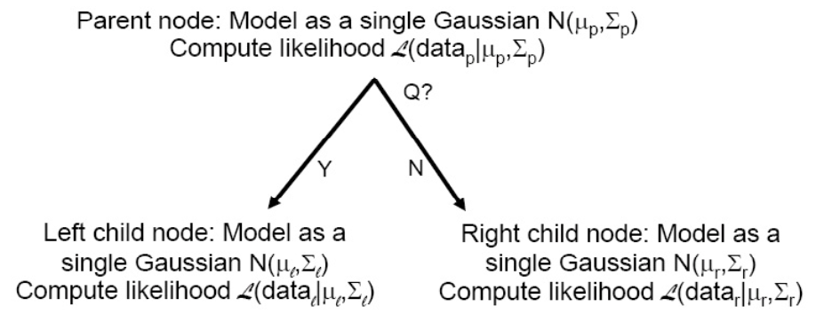

(decision-tree)=
# Decision Tree

Decision trees are a top-down approach for classification.

- Start with all data in a single node (the root)
- Find the **best** “question” for partitioning the data at a given node into two sub-nodes, according to some criteria
- Repeat for each newly generated nodes
- Stop when there is insufficient data at each node, or when the best question isn’t helpful enough

:::{figure} dt-example-1


A simple example of decision tree [Livescue 2021]
:::

We need to specify

- Choice of questions for the splits
- Criterion for measuring the “best” question at each node
- Stopping criterion

## Learning

### Algorithm

Suppose we have a fixed, discrete set of questions. Let $Q_{j\ell}$ denote the $\ell$-th pre-determined question for feature $j$.

Starting at the root, try splitting each node into two sub-nodes,

```{margin} Questions and computation
Questions about the a feature $X_1$ can be like $X_1 > 17, X_1^2 < 10$. It can also involves multiple features, e.g. $X3 =X_{25}$

The questions should be pre-determined, taking the computation power into consideration.
```

- For each feature $X_j$, evaluate questions $Q_{j1}, Q_{j2} \ldots$; let $X^*, Q^*$ denote the best feature and question respectively

- If $Q^*$ isn’t sufficiently helpful in improving some partition metric, call the current node a leaf
- Otherwise, split the current node into two sub-nodes according
to the answer to question $Q^*$

Stop when all nodes are either too small to split or have been marked as leaves (there is no “good enough” question anymore). Each leaf node represents a class.

### Partition Metrics

To evaluate question quality, we need some partition metrics.


#### Maximum Purity

Suppose

- $\Omega$ is the proposed clustering,
- $C$ is the ground-truth clustering
- $w_k$ is a proposed cluster with label $k$
- $c_j$ is a ground-truth cluster with ground truth label $j$

Then the purity of the proposed clustering $\Omega$ and the ground-truth $C$ is defined as

$$\operatorname{purity}(\Omega, C)=\frac{1}{n} \sum_{k} \max _{j}\left|\omega_{k} \cap c_{j}\right|$$

That is, for each proposed cluster $w_k$, we find a true cluster $c_j$ that has the maximum-cardinality intersection with $w_k$. We can view $w_k$ has a "predicted" label $k\leftarrow j$. (??)

Properties
: - in $(0,1)$
  - biased toward finer clusterings (purity $=1$ if each example is in its own cluster), so this measure makes sense for comparing clusterings with a given **fixed** number of clusters


#### Maximum Normalized Mutual Information

Define

- $p(k, j) = \frac{\left|\omega_{k} \cap c_{j}\right|}{N}$ as the probability that a randomly chosen example belongs to proposed cluster $w_k$ **and** ground-truth cluster $c_j$.
- $p_\Omega (k) = \frac{\left\vert w_k \right\vert}{N}$ as the probability that a randomly chosen example belongs to proposed cluster $w_k$
- $p_C(j)= \frac{\left\vert c_j \right\vert}{N}$ likewise

The mutual information of induced from the joint distribution $p(k,j)$ is

$$
\mathrm{I}(\Omega, C)=\sum_{k} \sum_{j} p(k, j) \log \frac{p(k, j)}{p_{\Omega}(k) p_{C}(j)}
$$

and we can define entropies $H(\Omega)$ and $H(C)$.

Finally, the normalized mutual information is

$$
\operatorname{NMI}(\Omega, C)=\frac{I(\Omega ; C)}{[H(\Omega)+H(C)] / 2}
$$

Properties
- Ranges from 0 and 1
- Mutual information alone would also favor over-clustering
- Entropies in the denominator act as penalty for over-clustering


---

For unlabelled data, we can use maximum likelihood and minimum entropy.


#### Maximum Likelihood

The best question at a node is the maximum likelihood one, i.e. the one that maximizes the likelihood of the two newly formed (left and right) groups of data points

$$
\mathcal{L}\left(\text { data }_{\ell} \mid \operatorname{model}_{\ell}\right) \times \mathcal{L}\left(\text { data }_{r} \mid \text { model }_{r}\right)
$$

Often, the models for the left and right nodes are each a single Gaussian

$$
Q^{*}=\operatorname{argmax}_{Q} p\left(\operatorname{data}_{\ell} \mid \boldsymbol{\mu} _{\ell}, \boldsymbol{\Sigma} _{\ell}\right) \times p\left(\operatorname{data}_{r} \mid \boldsymbol{\mu} _{r}, \boldsymbol{\Sigma}_{r}\right)
$$

Note that the best question should **always** improve likelihood somewhat.

:::{figure} dt-evaluate-q


Evaluating question quality by maximum likelihood
:::


#### Minimum Entropy

Another common criterion is to minimize node entropy (uncertainty measured in bits).

Recall that if $X$ is a discrete random variable taking one of $n$ values with probabilities $p_{1}, \ldots, p_{n}$ , respectively, then the entropy of


$$
\begin{aligned}
H(X) &=-\sum_{i=1}^{n} p_{i} \log _{2} p_{i} \\
\Rightarrow H(X) & \geq 0 \\
H(X) &=0 \Leftrightarrow p_{j}=1 \text { for some } j, p_{i}=0,\ \forall i \neq j
\end{aligned}
$$


### Stoping Criteria

When should we stop partitioning? Or how to determine the size/depth of the tree?

#### Simple Heuristics Based

- Leaves too small: data at node has fewer than some threshold samples

- Best question does not improve likelihood significantly (e.g. 10%)

- Out of time/memory for more nodes

#### Cross-validation

- Measure likelihood with different tree sizes on a **held-out** (development) data set, choose the tree size that maximizes likelihood

- Measure downstream performance on held-out data set, on some task of interest
