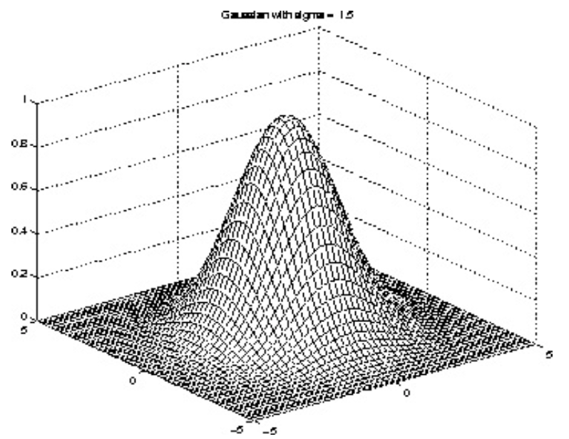
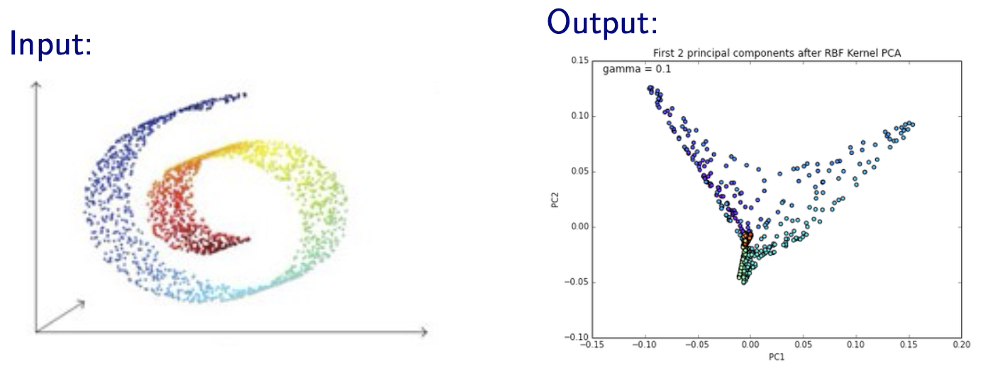

# PCA Variants

We introduce three variants of PCA: probabilistic PCA, kernel PCA, and sparse PCA.

## Probabilistic PCA

*Independently proposed by [Tipping & Bishop 1997, 1999] and [Roweis 1998]*

Probabilistic PCA adds a probabilistic component (interpretation) to the PCA model. It provides

- a way of approximating a Gaussian using fewer parameters (e.g. common noise variance).
- a way of sampling from the data distribution as a probabilistic model (thus aka sensible PCA).


### Objective

In a PPCA model, we first draw low dimensional $\boldsymbol{z} \in \mathbb{R}^{k}$,

$$
p(\boldsymbol{z}) =\mathcal{N}( \boldsymbol{0}, \boldsymbol{I})
$$

and draw $\boldsymbol{x} \in \mathbb{R}^{d}, k \leq d$ by

$$
p(\boldsymbol{x} \mid \boldsymbol{z}) =\mathcal{N}\left( \boldsymbol{W} \boldsymbol{z}+\boldsymbol{\mu} , \sigma^{2} \boldsymbol{I}\right)
$$

where $\boldsymbol{W} \in \mathbb{R} ^{d \times k}$

Or equivalently,

$$
\begin{equation}
\boldsymbol{x}=\boldsymbol{W} \boldsymbol{z}+\boldsymbol{\mu} + \boldsymbol{\epsilon} , \text { where } \boldsymbol{\epsilon}  \sim \mathcal{N}\left(0, \sigma^{2} \boldsymbol{I}\right)
\end{equation}
$$

If $\sigma = 0$ then we get standard PCA.

By the property of multivariate Gaussian, we have


$$
p(\boldsymbol{x})=\mathcal{N}\left(\boldsymbol{\mu} , \boldsymbol{W} \boldsymbol{W}^{\top} +\sigma^{2} \boldsymbol{I}\right)
$$

The goal is to estimate the parameter $\boldsymbol{W} , \boldsymbol{\mu} , \sigma$ that maximize the log likelihood $\sum_{i=1}^{n} \log p\left(\boldsymbol{x}_{i} \mid \boldsymbol{W} , \boldsymbol{\mu} , \sigma\right)$.


### Learning (MLE)

```{margin} MLE not unique
Before seeking the ML solution, notice that the solution is not unique: if $\boldsymbol{R}$ is an orthogonal matrix, then $\widetilde{\boldsymbol{W}} = \boldsymbol{W} \boldsymbol{\boldsymbol{R}}$ is indistinguishable from $\boldsymbol{W}$

$$
\widetilde{\boldsymbol{W}} \widetilde{\boldsymbol{W}} ^{\top}=\boldsymbol{W} (\boldsymbol{R} \boldsymbol{R} ^{\top}) \boldsymbol{W} ^{\top}  =\boldsymbol{W} \boldsymbol{W} ^{\top}
$$

So we will find a solution $W _{ML}$ up to a rotation $\boldsymbol{R}$.
```

Let $\boldsymbol{C}  = \boldsymbol{W} \boldsymbol{W} ^\top + \sigma^2 \boldsymbol{I}_d$. The log likelihood function is

$$
\begin{equation}
\sum_{i=1}^{n} \log p\left(\boldsymbol{x}_{i} ; \boldsymbol{W}, \mu, \sigma^{2}\right) =
-\frac{n d}{2} \log (2 \pi)-\frac{n}{2} \log |\boldsymbol{C}|-\frac{1}{2} \sum_{i=1}^{n}\left(\boldsymbol{x}_{i}-\boldsymbol{\mu} \right) ^{\top}  \boldsymbol{C}^{-1}\left(\boldsymbol{x}_{i}-\boldsymbol{\mu} \right)
\end{equation}
$$

Setting the derivative w.r.t. $\boldsymbol{\mu}$ to $\boldsymbol{0} $ we have

$$\boldsymbol{\mu} _{ML} = \bar{\boldsymbol{x}}$$

i.e. the sample mean. The solution for $\boldsymbol{W}$ and $\sigma^2$ is more complicated, but closed form.

$$
\begin{equation}
\begin{aligned}
\boldsymbol{W}_{M L} &=\boldsymbol{U}_{d \times k}\left(\boldsymbol{\Lambda} _{k}-\sigma^{2} \boldsymbol{I}_k\right)^{1 / 2} \boldsymbol{R}_k \\
\sigma_{M L}^{2} &=\frac{1}{d-k} \sum_{j=k+1}^{d} \lambda_{j}
\end{aligned}
\end{equation}
$$

```{margin} EM also works
It is also possible to find the PPCA solution iteratively, visa the EM algorithm. This is useful if doing the eigenvalue decomposition is too computationally demanding.
```

where
- $\boldsymbol{U} _{d \times k}$ is the first $k$ eigenvectors of the sample covariance matrix $\boldsymbol{S}$
- $\boldsymbol{\Lambda}_k$ is the diagonal matrix of eigenvalues
- $\boldsymbol{R}_k$ is an arbitrary orthogonal matrix

### Properties

- For $\boldsymbol{R}_k = \boldsymbol{I}_k$ , the solution for $\boldsymbol{W}$ is just a scaled version (by the diagonal matrix $\boldsymbol{\Lambda} _k - \sigma^2 \boldsymbol{I} _k$) of that of standard PCA $U_{d\times k}$.
- $\sigma^2_{ML}$ is the average variance of the discarded dimensions in $\mathcal{X}$. We view the remaining dimensions as accounting for noise. Their average variance defines the common variance of the noise. The covariance is viewed as

    $$
    \boldsymbol{\Sigma}=\boldsymbol{U}\left[\begin{array}{cccccccc}
    \lambda_{1} & \ldots & 0 & \ldots & \ldots & \ldots \\
    & \ddots & 0 & \ldots & \ldots & \ldots \\
    0 & \ldots & \lambda_{k} & \ldots & \ldots & \ldots \\
    0 & \ldots & 0 & \sigma^{2} & 0 & \ldots \\
    & & & & \ddots & \\
    0 & \ldots & \ldots & \ldots & 0 & \sigma^{2}
    \end{array}\right] \boldsymbol{U} ^\top
    $$

- If $k = d$, i.e., no dimension reduction, then the MLE for the covariance matrix $\boldsymbol{C}$ of $\boldsymbol{x}$ is equal to $\boldsymbol{S}$, which is just the standard ML solution for a Gaussian distribution.

$$
\boldsymbol{C}_{ML} = \boldsymbol{W} _{ML} \boldsymbol{W} _{ML} ^\top + \sigma^2 \boldsymbol{I}  = \boldsymbol{U} (\boldsymbol{\Lambda} - \sigma^2 I) \boldsymbol{U} ^\top  + \sigma^2 \boldsymbol{I}   = \boldsymbol{U} \boldsymbol{\Lambda} \boldsymbol{U} ^\top  = \boldsymbol{S}.
$$

### Representation

The conditional distribution of $\boldsymbol{z}$ given $\boldsymbol{x}$ is

$$
p(\boldsymbol{z} \mid \boldsymbol{x})=\mathcal{N}\left(\boldsymbol{M}^{-1} \boldsymbol{W} ^{\top} (\boldsymbol{x}- \boldsymbol{\mu} ), \sigma^{2} \boldsymbol{M}^{-1}\right)
$$

where $\boldsymbol{M} = \boldsymbol{W} ^\top \boldsymbol{W}  + \sigma^2 \boldsymbol{I}_k$.

A reduced-dimensionality representation of $\boldsymbol{x}$ is given by the estimated conditional mean

$$
\widehat{\operatorname{E}}\left( \boldsymbol{z} \mid \boldsymbol{x}   \right) = \boldsymbol{M}  ^{-1} _{ML} \boldsymbol{W} ^\top _{ML}(\boldsymbol{x} - \bar{\boldsymbol{x}})
$$

where $\boldsymbol{M} _{ML} = \boldsymbol{W} _{ML} ^\top \boldsymbol{W} _{ML}  + \sigma^2 _{ML} \boldsymbol{I}_k$.

- As $\sigma^2 _{ML} \rightarrow 0$, the posterior mean approaches the standard PCA projection $\boldsymbol{ z } =  \boldsymbol{U}  ^\top (\boldsymbol{x}  - \bar{\boldsymbol{x} })$
- As $\sigma^2 _{ML}> 0$, the posterior mean "shrinks" the solution in magnitude from standard PCA. Since we are less certain about the representation when the noise is large.

(kernel-pca)=
## Kernel PCA

Kernel PCA is a nonlinear extension of PCA where dot products are replaced with generalized dot products in feature space computed by a kernel function.

### Kernelization

Linear PCA only consider linear subspaces

$$
\boldsymbol{z} = \boldsymbol{W} \boldsymbol{x}
$$

To improve this, we can apply feature transformation $\boldsymbol{\phi}: \mathbb{R} ^d \rightarrow \mathbb{R} ^p$ to include non-linear features, such as $\boldsymbol{\phi} ([x_1, x_2])= [x_1, x_1^2, x_1 x_2]$.

Then the data matrix changes from $\boldsymbol{X}_{n \times d}$ to $\boldsymbol{\Phi}_{n \times p}$. Then we run standard PCA on the new data covariance matrix $\frac{1}{n} \boldsymbol{\Phi} ^\top  \boldsymbol{\Phi}$.

```{margin}
For kernelized problems, the original problem formulation (primal) is in the original feature space $\mathbb{R} ^d$, and the kernelized problem formulation (dual) is in the transformed space $\mathbb{R} ^p$.
```

Note that handcrafting feature transformation $\boldsymbol{\phi}$ is [equivalent](kernels-logic) to choosing a kernel function $k(\boldsymbol{x}_1, \boldsymbol{x} _2) = \boldsymbol{\phi}(\boldsymbol{x} _1) ^\top \boldsymbol{\phi}(\boldsymbol{x} _2)$. And there are many advantages choosing kernels instead of handcrafting $\boldsymbol{\phi}$. After choosing $k(\cdot, \cdot)$, We can compute the new $n \times n$ inner product matrix by $\boldsymbol{K} = \boldsymbol{\Phi} \boldsymbol{\Phi} ^\top$, aka **kernel matrix**. And the $k$-dimensional embeddings for a data vector $\boldsymbol{x}$ is given by

$$
\boldsymbol{z} = \boldsymbol{A} ^\top \left[\begin{array}{c}
k(\boldsymbol{x} _1, \boldsymbol{x}) \\
k(\boldsymbol{x} _2, \boldsymbol{x}) \\
\vdots \\
k(\boldsymbol{x} _n, \boldsymbol{x}) \\
\end{array}\right]
$$

where $\boldsymbol{A}_{n \times k}$ contains the first $k$ eigenvectors of the kernel matrix $\boldsymbol{K}$. That is, the projected data matrix is $\boldsymbol{Z}_{n \times k} = \boldsymbol{K} \boldsymbol{A}$.

:::{admonition,dropdown,seealso} *Derivation*

Let $\boldsymbol{C} = \frac{1}{n} \boldsymbol{\Phi} ^\top \boldsymbol{\Phi}$ be the new covariance matrix. To run standard PCA, we solve the eigenproblem

$$
\boldsymbol{C} \boldsymbol{w} = \lambda \boldsymbol{w}
$$

Now we show that $\boldsymbol{w} \in \mathbb{R} ^d$ can be written as a linear combination of the transformed data vectors $\boldsymbol{\phi} (\boldsymbol{x} _1), \ldots, \boldsymbol{\phi} _1(\boldsymbol{x}_n)$, i.e.,

$$\boldsymbol{w} = \sum_{i=1}^n \alpha_i \boldsymbol{\phi} (\boldsymbol{x}_i ) = \boldsymbol{\Phi} ^\top \boldsymbol{\alpha}$$

To show this, substituting $\boldsymbol{C} = \boldsymbol{\Phi} ^\top \boldsymbol{\Phi} = \frac{1}{n} \sum_{i=1}^n \boldsymbol{\phi} (\boldsymbol{x}_i ) \boldsymbol{\phi} (\boldsymbol{x}_i )^\top$ to the above equality, we have


$$\begin{aligned}
\frac{1}{n} \sum_{i=1}^n \boldsymbol{\phi} (\boldsymbol{x}_i ) \boldsymbol{\phi} (\boldsymbol{x}_i )^\top \boldsymbol{w} &= \lambda \boldsymbol{w}  \\
\frac{1}{n\lambda } \sum_{i=1}^n \boldsymbol{\phi} (\boldsymbol{x}_i ) \underbrace{\boldsymbol{\phi} (\boldsymbol{x}_i )^\top \boldsymbol{w}}_{\alpha_i} &= \boldsymbol{w}  \\
\end{aligned}$$

Then, to find the $j$-th eigenvector $\boldsymbol{w}_j$, it remains to find $\boldsymbol{\alpha}_j$. Substituting the linear combination back to the eigenproblem gives


$$\begin{aligned}
\left( \frac{1}{n} \boldsymbol{\Phi} ^\top \boldsymbol{\Phi} \right)\left(  \boldsymbol{\Phi} ^\top \boldsymbol{\alpha} _j \right) &= \lambda_j \boldsymbol{\Phi} ^\top \boldsymbol{\alpha} _j \\
\boldsymbol{\Phi} ^\top \boldsymbol{\Phi}  \boldsymbol{\Phi} ^\top \boldsymbol{\alpha} _j  &= n\lambda_j \boldsymbol{\Phi} ^\top \boldsymbol{\alpha} _j \\
(\boldsymbol{\Phi} \boldsymbol{\Phi} ^\top ) ^{-1} \boldsymbol{\Phi} \boldsymbol{\Phi} ^\top \boldsymbol{\Phi}  \boldsymbol{\Phi} ^\top \boldsymbol{\alpha} _j  &= n\lambda_j (\boldsymbol{\Phi} \boldsymbol{\Phi} ^\top ) ^{-1} \boldsymbol{\Phi} \boldsymbol{\Phi} ^\top \boldsymbol{\alpha} _j \quad \text{left multiply } (\boldsymbol{\Phi} \boldsymbol{\Phi} ^\top ) ^{-1} \boldsymbol{\Phi} \\
\boldsymbol{K} \boldsymbol{\alpha} _j &= n \lambda_j \boldsymbol{\alpha} _j\\
\end{aligned}$$

Therefore, $\boldsymbol{\alpha} _j$ is the eigenvector of the kernel matrix $\boldsymbol{K}$.

To find the embeddings, recall that $\boldsymbol{w} = \boldsymbol{\Phi} ^\top \boldsymbol{\alpha}$, hence to embed a data vector $\boldsymbol{x}$,

$$\begin{aligned}
\boldsymbol{z}
&= \boldsymbol{W} ^\top \boldsymbol{\phi} (x)  \\
&= \boldsymbol{A} ^\top \boldsymbol{\Phi}  \boldsymbol{\phi} (x) \\
&= \boldsymbol{A} ^\top \left[\begin{array}{c}
k(\boldsymbol{x} _1, \boldsymbol{x}) \\
k(\boldsymbol{x} _2, \boldsymbol{x}) \\
\vdots \\
k(\boldsymbol{x} _n, \boldsymbol{x}) \\
\end{array}\right]\\
\end{aligned}$$

In fact, we don't need the exact form of $\boldsymbol{\phi}$ at all.

:::


:::{admonition,note} Mean normalization of $\boldsymbol{K}$

We've implicitly assumed zero-mean in the new feature space $\mathbb{R} ^p$, but it is usually not. Hence, we should modify $\boldsymbol{K}$ by

$$
\boldsymbol{K} ^c = \boldsymbol{C} \boldsymbol{K} \boldsymbol{C}
$$

where $\boldsymbol{C}  = \left(\boldsymbol{I}-\frac{1}{n} \boldsymbol{1} \boldsymbol{1}^{\top}\right)$ is the centering matrix. Then we solve for the eigenvectors of $\boldsymbol{K} ^c$

:::


### Learning

From the analysis above, the steps to train a kernel PCA are

1. Choose a kernel function $k(\cdot, \cdot)$.
2. Compute the centered kernel matrix $\boldsymbol{K} ^c = (\boldsymbol{I} - \boldsymbol{u} \boldsymbol{u} ^\top )\boldsymbol{K}(\boldsymbol{I} - \boldsymbol{u} \boldsymbol{u} ^\top)$
3. Find the first $k$ eigenvectors of $\boldsymbol{K} ^c$, stored as $\boldsymbol{A}$.

Then


- to project a new data vector $\boldsymbol{x}$,

    $$\begin{aligned}
    \boldsymbol{z}
    &= \boldsymbol{A} ^\top \left[\begin{array}{c}
    k(\boldsymbol{x} _1, \boldsymbol{x}) \\
    k(\boldsymbol{x} _2, \boldsymbol{x}) \\
    \vdots \\
    k(\boldsymbol{x} _n, \boldsymbol{x}) \\
    \end{array}\right]\\
    \end{aligned}$$


- to project the training data,

    $$\boldsymbol{Z} ^\top  = \boldsymbol{A} ^\top \boldsymbol{K} \text{ or } \boldsymbol{Z} = \boldsymbol{K} \boldsymbol{A} $$

- to project a new data matrix $\boldsymbol{Y} _{m \times d}$,

    $$
    \boldsymbol{Z} _y ^\top = \boldsymbol{A} ^\top \left[\begin{array}{ccc}
    k(\boldsymbol{x} _1, \boldsymbol{y_1}) & \ldots  &k(\boldsymbol{x} _1, \boldsymbol{y_m}) \\
    k(\boldsymbol{x} _2, \boldsymbol{y_1}) & \ldots  &k(\boldsymbol{x} _2, \boldsymbol{y_m}) \\
    \vdots &&\vdots \\
    k(\boldsymbol{x} _n, \boldsymbol{y_1}) & \ldots  &k(\boldsymbol{x} _n, \boldsymbol{y_m}) \\
    \end{array}\right]\\
    $$


### Choice of Kernel

As [discussed](kernels-logic), in practice, we don't engineer $\boldsymbol{\phi}(\cdot)$, but directly think about $k(\cdot, \cdot)$.

- One common choice of kernel is radial basis function (RBF), aka Gaussian kernel

    $$
    k\left(\boldsymbol{x}_{1}, \boldsymbol{x}_{2}\right)=e^{\frac{\left\| \boldsymbol{x}_{1}-\boldsymbol{x}_{2} \right\|  ^{2}}{2 \sigma^{2}}}
    $$

    where the standard deviation (radius) $\sigma$ is a tuning parameter. Note that RBF corresponds to an implicit feature space $\mathbb{R} ^p$ of infinite dimensionality $p\rightarrow \infty$.

:::{figure} kernels-RBF



Gaussian kernels
:::


- Polynomial kernel

    $$
    k\left(\boldsymbol{x}_{1}, \boldsymbol{x}_{2}\right)=\left(1+\boldsymbol{x}_{1}^{\top} \boldsymbol{x}_{2}\right)^{p}
    $$

    where the polynomial degree $p$ is a tuning parameter. $p=2$ is common.

### Pros and Cos

**Pros**

- Kernel PCA can do out-of-sample projection, PCA cannot

- Kernel PCA works well when

  - the data is non-linear and fit the chosen kernel.

      :::{figure} kernel-pca-ep1
      

      Kernel PCA with a RBF kernel on points [Livescu 2021].

      :::

  - there is much noise in the data

      :::{figure}
      

      Kernel PCA on images [Livescu 2021].

      :::

**Cons**

- Kernel PCA works bad when the data lies a special manifold

    :::{figure}
    

    Kernel PCA with RBF kernel on a Swiss roll manifold [Livescu 2021]

    :::

- Computationally expensive to compute the $n \times n$ pairwise kernel values in $\boldsymbol{K}$ when $n$ is large. Remedies include

  - use subset of the entire data set

  - use kernel approximation techniques

    - approximate $\boldsymbol{K} \approx \boldsymbol{F}^\top \boldsymbol{F}$ where $\boldsymbol{F} \in \mathbb{R} ^{m \times n}, k \ll m \ll n$. The value of $m$ should be as large as you can handle.

    - for RBF kernels, there is one remarkable good approximation (due to Fourier transform properties) called random Fourier features (Rahimi & Recht 2008), which replaces each data point $\boldsymbol{x}_i$ with

      $$
      \left[\cos \left(\boldsymbol{w}_{1}^{\top} \boldsymbol{x}_{i}+b_{1}\right) \ldots \cos \left(\boldsymbol{w}_{m}^{\top} \boldsymbol{x}_{i}+b_{m}\right)\right]^{\top}=\boldsymbol{f} _{i}
      $$

      where

      $$
      \begin{aligned}
      b_{1}, \ldots, b_{m} & \sim \operatorname{Unif}[0,2 \pi] \\
      \boldsymbol{w}_{1}, \ldots, \boldsymbol{w}_{m} & \sim \mathcal{N}\left(0, \frac{2}{\sigma^{2}} \boldsymbol{I}_d \right)
      \end{aligned}
      $$

  - just don't use kernel methods if computation is an issue

### Relation to

#### Standard PCA

Clearly, kernel PCA with linear kernel $k(\boldsymbol{x} , \boldsymbol{y} ) = \boldsymbol{x} ^\top \boldsymbol{y}$ is equivalent to a standard PCA. That is, they give the same projection.

:::{admonition,dropdown,seealso} *Derivation*

From the analysis above we know that the kernel PCA with linear kernel gives projection of $\boldsymbol{x}$ as

$$\boldsymbol{z} = \boldsymbol{A} ^\top \boldsymbol{X} \boldsymbol{x}$$

where $\boldsymbol{A}_{n \times k}$ is the matrix that stores $\alpha_{ij}$. Then it remains to prove that $\boldsymbol{A} ^\top \boldsymbol{X} = \boldsymbol{U} ^\top$ where $\boldsymbol{U}$ is the projection matrix in conventional PCA: $\boldsymbol{z} = \boldsymbol{U} ^\top \boldsymbol{x}$.
where $\boldsymbol{A}_{n \times k}$ is the matrix that stores $\alpha_{ij}$.

Note that in kernel PCA, $\boldsymbol{\alpha}_j$ are the eigenvectors of the kernel matrix $\boldsymbol{K}$ since

$$
\boldsymbol{K}  \boldsymbol{\alpha} _j = n \lambda_j \boldsymbol{\alpha} _j
$$

If we use linear kernel, then $\boldsymbol{K} = \boldsymbol{X} \boldsymbol{X} ^\top$ and the above relation becomes

$$
\boldsymbol{X} \boldsymbol{X} ^\top  \boldsymbol{\alpha} _j = n \lambda_j \boldsymbol{\alpha} _j
$$

Hence, the matrix $\boldsymbol{A}$ contains the first $k$ eigenvectors of the Gram matrix $\boldsymbol{X} \boldsymbol{X} ^\top$.

Now we consider conventional PCA. The projection in $\mathbb{R} ^k$ is given by

$$
\boldsymbol{z}  = \boldsymbol{U} ^\top \boldsymbol{x}
$$

where $\boldsymbol{U} _{n \times k}$ contains the first $k$ eigenvectors of the matrix $\boldsymbol{X} ^\top \boldsymbol{X}$.

Let the singular value decomposition of $\boldsymbol{X}$ be

$$
\boldsymbol{X} = \boldsymbol{A} \boldsymbol{\Sigma} \boldsymbol{U} ^\top
$$

- The EAD of $\boldsymbol{X} ^\top \boldsymbol{X}$ is

    $$\boldsymbol{X} ^\top \boldsymbol{X} = \boldsymbol{U} \boldsymbol{\Sigma} ^\top \boldsymbol{\Sigma} \boldsymbol{U} = \boldsymbol{U} \boldsymbol{D} \boldsymbol{U}$$

    where the diagonal entries in $\boldsymbol{D}$ are the squared singular values $\sigma^2 _j$ for $j=1,\ldots, d$.


- The EAD for the Gram matrix $\boldsymbol{G}$

    $$
    \boldsymbol{G}_{n \times n}=\boldsymbol{X} \boldsymbol{X}^{\top}=\boldsymbol{A} \boldsymbol{\Sigma} \boldsymbol{\Sigma}^{\top} \boldsymbol{A}^{\top}=\boldsymbol{A} \boldsymbol{\Lambda} \boldsymbol{A}^{\top}=\boldsymbol{A}_{[: d]} \boldsymbol{D} \boldsymbol{A}_{[: d]}^{\top}
    $$

    where

    $$
    \boldsymbol{\Lambda}_{n \times n}=\left[\begin{array}{cc}
    \boldsymbol{D}_{d \times d} & \mathbf{0} \\
    \mathbf{0} & \mathbf{0}_{(n-d) \times(n-d)}
    \end{array}\right]
    $$

Let $\boldsymbol{a} _j$ be an eigenvector of $\boldsymbol{G}$ with eigenvalue $\sigma^2 _j$. Pre-multiplying $\boldsymbol{G} \boldsymbol{a}_j = \sigma^2 _j \boldsymbol{a} _j$ by $\boldsymbol{X} ^\top$ yields

$$\begin{aligned}
\boldsymbol{X} ^\top (\boldsymbol{X} \boldsymbol{X} ^\top) \boldsymbol{a} _j &= \boldsymbol{X} ^\top (\sigma^2 _j  \boldsymbol{a} _j) \\
\Rightarrow \qquad  \boldsymbol{X} ^\top \boldsymbol{X}  (\boldsymbol{X} ^\top \boldsymbol{a} _j) &= \sigma^2 _j (\boldsymbol{X} ^\top \boldsymbol{a} _j)
\end{aligned}$$

Hence, we found that $\boldsymbol{X} ^\top \boldsymbol{a} _j$ is an eigenvector of $\boldsymbol{X} ^\top \boldsymbol{X}$ with eigenvalue $\sigma^2 _j$, denoted $\boldsymbol{u} _j$,

$$
\boldsymbol{u} _j = \boldsymbol{X} ^\top \boldsymbol{a} _j
$$

That is, there is a one-one correspondence between the first $d$ eigenvectors of $\boldsymbol{G}$ and those of $\boldsymbol{X} ^\top \boldsymbol{X}$. More specifically, we have,

$$
\boldsymbol{U} _{[:d]} = \boldsymbol{X} ^\top \boldsymbol{A} _{[:d]}
$$


which completes the proof.

$\square$

:::


#### Graph-based Spectral Methods

Both are motivates as extensions of MDS and involves a $n \times n$ matrix.

We can view kernel in kernel PCA as the edge weights in [graph-based spectral methods](23-graph-based-spectral-methods). But the main difference is that in kernel PCA we compute the kernel value of **every pair** of data points (computationally demanding), but in graph-based spectral methods we only compute weights between points that are neighbors, charactrized by an integer $k$ or distance $\epsilon$.

#### Neural Networks

Kernel PCA can be viewed as a [neural network](../37-neural-networks/00-neural-networks) of one single layer with certain constraints.

Let
- $k(\boldsymbol{x}, \boldsymbol{w} )$ be a kernel node parameterized by $\boldsymbol{w}$ and output the kernel value.
- $w_{ij}$ be the weight of the edge from the $i$-th input node to the $j$-th hidden node
- $v_{ij}$ be the weight of the edge from the $i$-th hidden node to the $j$-th output node

Recall our objective is to find $\boldsymbol{\alpha}_1, \boldsymbol{\alpha} _2, \ldots$ such that the $j$-th entry in the embedding is

$$
z_j=\boldsymbol{\alpha}_j^{\top}\left[\begin{array}{c}
k\left(\boldsymbol{x}_{1}, \boldsymbol{x}\right) \\
k\left(\boldsymbol{x}_{2}, \boldsymbol{x}\right) \\
\vdots \\
k\left(\boldsymbol{x}_{n}, \boldsymbol{x}\right)
\end{array}\right]
$$

So the neural network can be designed as

- Input layer:
  - $d$ nodes, which represent $\boldsymbol{x} \in \mathbb{R} ^d$

- Kernel layer:
  - $n$ kernel nodes, where the $j$-th node represents $k(\boldsymbol{x}, \boldsymbol{x}_i)$
  - Fixed weights where $w_{ij}=1$
  - The activation function is simply the identity function

- Hidden layer
  - $k$ nodes, which represent $\boldsymbol{z} \in \mathbb{R} ^k$
  - Weights $v_{ij} = \alpha_{ij}$
  - The activation function is simply the identity function

- Output layer
  - $n$ nodes, which represents reconstruction of kernel layer (similar to [PCA as autoencoders](pca-autoencoder))
  - Weights $\alpha_{ji}$
  - The activation function is simply the identity function
  - Loss: reconstruction loss

In short, we transform the input from $n\times d$ data matrix $\boldsymbol{X}$ to $n\times n$ kernel matrix $\boldsymbol{K}$, and run PCA. In this way, the learned weights $\boldsymbol{A}$ are the eigenvectors of $\boldsymbol{K} ^{\top} \boldsymbol{K}$ (analogous to $\boldsymbol{X} ^{\top} \boldsymbol{X}$ in PCA), which are the same as $\boldsymbol{K}$, i.e. what we want for.

## Sparse PCA

Recall that $Z$ is a linear combination of the variables $X_j$. The original optimization problem is

$$
\max\ \boldsymbol{a} ^{\top} \boldsymbol{S} \boldsymbol{a} \quad \text{s.t. } \|\boldsymbol{a} \|_2=1
$$

If we want to impose the number of non-zero coefficient $a_i$, we can add constraint $\left\| \boldsymbol{a}  \right\| _0 \le k$.

### Eigen-space Approach

The problem can be formulated as

$$
\max\ \boldsymbol{\beta} ^{\top} \boldsymbol{S} \boldsymbol{\beta} \quad \text{s.t. } \|\boldsymbol{\beta}\|_2=1, \left\| \boldsymbol{\beta}  \right\| _0 \le k
$$

Often $k \ll p$ is desired when $p$ is large.

However, unlike the original principal components $\boldsymbol{a} _i$’s, the $\boldsymbol{\beta} _i$’s are not necessarily orthogonal or uncorrelated to each other without imposing further conditions. In addition, solving this optimization problem turns out to be a very computationally demanding process.

### Penalized Regression Approach

One of the alternative approaches for sparse PCA is to devise PCA in a regression setting, then utilize the [shrinkage method](penalized-regression) in linear regression.

Consider the $i$-th principal direction $\boldsymbol{v}_i$ and the corresponding score $\boldsymbol{z}_i = \boldsymbol{X} \boldsymbol{v}_i$. Now we want a sparse principal direction $\boldsymbol{\beta}$, but keep the new score $\boldsymbol{X} \boldsymbol{\beta}$ as close to $\boldsymbol{z}_i$ as possible. The problem can be formulated as a penalized regression

$$
\min_{\boldsymbol{\beta}}\ \left\| \boldsymbol{z}_i - \boldsymbol{X} \boldsymbol{\beta} \right\|^2 + \lambda \left\| \boldsymbol{\beta} \right\|
$$

If we use Ridge regression, then it can be shown that the sparse optimizer $\boldsymbol{\beta}_{\text{ridge} }$ is parallel to the principal direction $\boldsymbol{v}_i$:

$$
\frac{\hat{\boldsymbol{\beta}} _{\text{ridge} }}{\left\| \hat{\boldsymbol{\beta}} _{\text{ridge} } \right\| } = \boldsymbol{v}_i
$$

:::{admonition,dropdown,seealso} *Derivation*

Consider SVD $\boldsymbol{X} = \boldsymbol{U} \boldsymbol{D} \boldsymbol{V} ^{\top}$, then $\boldsymbol{X} ^{\top} \boldsymbol{X}  = \boldsymbol{V} \boldsymbol{D} ^2 \boldsymbol{V} ^{\top}$,

$$
\begin{aligned}
\hat{\boldsymbol{\beta}}_{\text {ridge }} &=\left(\boldsymbol{V} \boldsymbol{D} ^{2} \boldsymbol{V} ^{\prime}+\lambda \boldsymbol{I} \right)^{-1} \boldsymbol{X} ^{\prime} \boldsymbol{z}_i \\
&=\left[\boldsymbol{V} \left(\boldsymbol{D} ^{2}+\lambda \boldsymbol{I}\right) \boldsymbol{V}^{\prime}\right]^{-1} \boldsymbol{X} ^{\top} \boldsymbol{X} \boldsymbol{v}_i \\
&=\boldsymbol{V}^{\prime-1}\left(\boldsymbol{D}^{2}+\lambda \boldsymbol{I}\right)^{-1} \boldsymbol{V}^{-1} \boldsymbol{V} \boldsymbol{D}^{2} \boldsymbol{V}^{\prime} \boldsymbol{v}_i \\
&=\boldsymbol{V}\left(\boldsymbol{D}^{2}+\lambda \boldsymbol{I}\right)^{-1} \boldsymbol{D}^{2} \boldsymbol{e}_{i} \\
&=\boldsymbol{V} \frac{d_{i i}^{2}}{d_{i i}^{2}+\lambda} \boldsymbol{e}_{i} \\
&=\frac{d_{i i}^{2}}{d_{i i}^{2}+\lambda} \boldsymbol{\boldsymbol{v}}_{i}
\end{aligned}
$$

:::

We can continue to add $L_1$ norm. The problem becomes

$$
\min_{\boldsymbol{\beta}}\ \left\| \boldsymbol{z}_i - \boldsymbol{X} \boldsymbol{\beta} \right\|^2 + \lambda_1 \left\| \boldsymbol{\beta} \right\|_1 + \lambda_2 \left\| \boldsymbol{\beta} \right\|_2 ^2
$$

A larger $\lambda_1$ will give fewer non-zero component of $\hat{\boldsymbol{\beta}}$. The estimated coefficients would be an approximation of the principal direction $\boldsymbol{v} _i$

$$
\frac{\hat{\boldsymbol{\beta} }}{\left\| \hat{\boldsymbol{\beta} } \right\| } \approx \boldsymbol{v} _i
$$

where only a few components in $\hat{\boldsymbol{\beta}}$ is non-zero.
.


.


.


.


.


.


.


.
