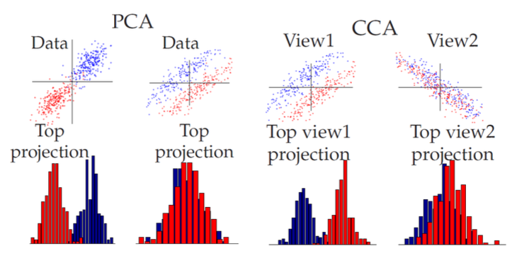

# Canonical Correlation Analysis

Can we quantify the associations between two sets of variables?

- Do last year’s labor data relate or explain this year’s labor situation?
- Are the math science performance**s** of students related to their reading performance**s**?
- Are there associations between government policie**s** and economic
variable**s**?
- For decathlon athletes, is the track event performance**s** correlated with the performance in field event**s**?

## Objective

Hotelling (1936) extended the idea of multiple correlation to the problem of measuring linear association between two **groups** of variables, say $\boldsymbol{x}$ and $\boldsymbol{y}$. Thus we consider the simple correlation coefficient between every pair of **linear combinations** of elements of $\boldsymbol{x}$ and of $\boldsymbol{y}$ and choose the maximum.

$$
\max _{\boldsymbol{v}, \boldsymbol{w} } \, \operatorname{Corr}\left(\boldsymbol{v}^{\top} \boldsymbol{x} , \boldsymbol{w}^{\top} \boldsymbol{y} \right)
$$

This maximum, $\rho_1$, is called the first canonical correlation and the corresponding pair of linear combinations, say $(U_1, V_1)$, is called the first pair of canonical variables.

Since each group has more than one variable, one single correlation coefficient may miss significant linear association in other dimensions. So we consider the subclass of **all** pairs of linear combinations of elements of $\boldsymbol{x}$ and $\boldsymbol{y}$ whose members are **uncorrelated** with $(U_1, V_1）$. The maximum simple correlation coefficient, $\rho _2$, of such pairs is called the second canonical correlation and the pair, say $(U_2, V_2)$, achieving this maximum is called the second pair of canonical variables.

Continuing this way we shall get the $k$ canonical correlations and the corresponding pairs of canonical variables, where $k=\min(d_x, d_y)$ is the smallest dimension of $\boldsymbol{x}$ and $\boldsymbol{y}$.

Alternative formulations include

- minimizing the difference between two projected spaces, i.e. we want to predict projected $\boldsymbol{y}$ by projected $\boldsymbol{x}$.

    $$
    \begin{equation}
    \begin{array}{ll}
    \min & \left\| \boldsymbol{X} \boldsymbol{V} - \boldsymbol{Y}\boldsymbol{W} \right\|_{F}^{2} \\
    \text {s.t.} & \boldsymbol{V} ^\top \boldsymbol{\Sigma} _{xx} \boldsymbol{V} = \boldsymbol{W} ^\top \boldsymbol{\Sigma} _{y y} \boldsymbol{W} = \boldsymbol{I}_k  \\
    & \boldsymbol{V} \in \mathbb{R} ^{d_x \times k} \quad \boldsymbol{W} \in \mathbb{R} ^{d_y \times k} \\
    \end{array}
    \end{equation}
    $$

- maximizing the trace

    $$
    \begin{equation}
    \begin{array}{ll}
    \max & \operatorname{tr} \left( \boldsymbol{V} ^\top \boldsymbol{\Sigma} _{x y} \boldsymbol{W}  \right) \\
    \text {s.t.} & \boldsymbol{V} ^\top \boldsymbol{\Sigma} _{x x} \boldsymbol{V} = \boldsymbol{W} ^\top \boldsymbol{\Sigma} _{y y} \boldsymbol{W} = \boldsymbol{I}_k \\
    & \boldsymbol{V} \in \mathbb{R} ^{d_x \times k} \quad \boldsymbol{W} \in \mathbb{R} ^{d_y \times k} \\
    \end{array}
    \end{equation}
    $$

## Learning

Partition the covariance matrix of full rank in accordance with two groups of variables,

$$
\begin{equation}
\operatorname{Var}\left(\begin{array}{l}
\boldsymbol{x}  \\
\boldsymbol{y}
\end{array}\right)=\left(\begin{array}{ll}
\boldsymbol{\Sigma}_{xx} & \boldsymbol{\Sigma}_{xy} \\
\boldsymbol{\Sigma}_{yx} & \boldsymbol{\Sigma}_{yy}
\end{array}\right)
\end{equation}
$$

### Sequential Optimization

The first canonical correlation, $\rho _1$, equals the maximum correlation between all pairs of linear combinations of $\boldsymbol{x}$ and $\boldsymbol{y}$ with unit variance. That is,

$$\begin{align}
\max _{\boldsymbol{v}, \boldsymbol{w} } \operatorname{Corr}\left(\boldsymbol{v}^{\top} \boldsymbol{x} , \boldsymbol{w}^{\top} \boldsymbol{y} \right)
= \max &  _{\boldsymbol{v}, \boldsymbol{w}}  \frac{\boldsymbol{v}^{\top} \boldsymbol{\Sigma}_{xy} \boldsymbol{w}}{\sqrt{\boldsymbol{v}^{\top} \boldsymbol{\Sigma}_{xx} \boldsymbol{v} \boldsymbol{w}^{\top} \boldsymbol{\Sigma}_{yy} \boldsymbol{w}}} \\
\text{s.t.}  &  \ \quad \boldsymbol{v} ^\top \boldsymbol{\Sigma} _{xx} \boldsymbol{v} =1 \\
  &  \ \quad \boldsymbol{w} ^\top \boldsymbol{\Sigma} _{yy} \boldsymbol{w} =1 \\
\end{align}$$

If the maximum is achieved at $\boldsymbol{v} _1$ and $\boldsymbol{w} _1$, then the first pair of canonical variables are defined as

$$
U_{1}=\boldsymbol{v}_{1}^{\top} \boldsymbol{x} , \quad V_{1}=\boldsymbol{w}_{1}^{\top} \boldsymbol{y}
$$

Successively, for $i = 2, \ldots, k$, the $i$-th canonical correlation $\rho_i$ is defined as

$$\begin{align}
\rho_{i}
 =\max _{\boldsymbol{v}, \boldsymbol{w}} & \quad \operatorname{Corr}\left(\boldsymbol{v}^{\top} \boldsymbol{x} , \boldsymbol{w}^{\top} \boldsymbol{y} \right) \\
 \text{s.t.} &  \quad (\boldsymbol{v} ^\top \boldsymbol{x} , \boldsymbol{w} ^\top \boldsymbol{y} ) \text{ uncorrelated with } (U_1, V_1), \ldots, (U_{i-1}, V_{i-1}) \\
\end{align}$$

If the maximum is achieved at $\boldsymbol{v} _i$ and $\boldsymbol{w} _i$, then the first pair of canonical variables are defined as

$$
U_{i}=\boldsymbol{v}_{i}^{\top} \boldsymbol{x}_{i}, \quad V_{i}=\boldsymbol{w}_{i}^{\top} \boldsymbol{y}
$$

The uncorrelated constraint, for example, when solving for the second pair $(U_2, V_2)$, are

$$
\operatorname{Cov}\left(U_{1}, U_{2}\right)=0, \quad \operatorname{Cov}\left(V_{1}, V_{2}\right)=0, \quad \operatorname{Cov}\left(U_{1}, V_{2}\right)=0, \quad \operatorname{Cov}\left(U_{2}, V_{1}\right)=0
$$

### Spectral Decomposition

Rather than obtaining pairs of canonical variables and canonical correlation sequentially, it can be shown that the canonical correlations $\rho$'s and hence pairs of canonical variables $(U,V)$’s can be obtained simultaneously by solving for
the eigenvalues $\rho^2$'s and eigenvectors $\boldsymbol{v}$’s from

$$
\boldsymbol{\Sigma}_{xx}^{-1} \boldsymbol{\Sigma}_{xy} \boldsymbol{\Sigma}_{yy}^{-1} \boldsymbol{\Sigma}_{yx} \boldsymbol{v} = \rho^2 \boldsymbol{v}
$$

A difficulty of this problem is that the matrix $\boldsymbol{\Sigma}_{xx}^{-1} \boldsymbol{\Sigma}_{xy} \boldsymbol{\Sigma}_{yy}^{-1} \boldsymbol{\Sigma}_{yx}$ is not symmetric. Consequently, the symmetric eigenproblem

$$
\boldsymbol{\Sigma}_{xx}^{-1/2} \boldsymbol{\Sigma}_{xy} \boldsymbol{\Sigma}_{yy}^{-1} \boldsymbol{\Sigma}_{yx} \boldsymbol{\Sigma}_{xx}^{-1/2} \boldsymbol{u} = \rho^2 \boldsymbol{u}
$$

is considered instead for the computational efficiency. Note that the two matrices possess the **same** eigenvalues and their eigenvectors are linearly related by $\boldsymbol{v} = \boldsymbol{\Sigma}_{{xx}}^{-1/2} \boldsymbol{u}$.

Then we can find $\boldsymbol{w} \propto \boldsymbol{\Sigma}_{y y}^{-1} \boldsymbol{\Sigma}_{y x} \boldsymbol{v}$ subject to the constraints.

Note that the maximal embedding dimension is $\max(k) = \min(d_x, d_y)$.

:::{admonition,dropdown,seealso} *Derivation*

We consider the following maximization problem:

$$\begin{align}
\max _{\boldsymbol{v}, \boldsymbol{w} } \operatorname{Corr}\left(\boldsymbol{v}^{\top} \boldsymbol{x} , \boldsymbol{w}^{\top} \boldsymbol{y} \right)
= \max &  _{\boldsymbol{v}, \boldsymbol{w}}  \frac{\boldsymbol{v}^{\top} \boldsymbol{\Sigma}_{xy} \boldsymbol{w}}{\sqrt{\boldsymbol{v}^{\top} \boldsymbol{\Sigma}_{xx} \boldsymbol{v} \boldsymbol{w}^{\top} \boldsymbol{\Sigma}_{yy} \boldsymbol{w}}} \\
\text{s.t.}  &  \ \quad \boldsymbol{v} ^\top \boldsymbol{\Sigma} _{xx} \boldsymbol{v} =1 \\
  &  \ \quad \boldsymbol{w} ^\top \boldsymbol{\Sigma} _{yy} \boldsymbol{w} =1 \\
\end{align}$$

The Lagrangian is

$$
\begin{equation}
\mathcal{L}(\boldsymbol{v}, \boldsymbol{w}, \lambda, \theta)=\boldsymbol{v}^{\top} \boldsymbol{\Sigma}_{xy} \boldsymbol{w}-\frac{\lambda_x}{2} \left(\boldsymbol{v}^{\top} \boldsymbol{\Sigma}_{xx} \boldsymbol{v}-1\right)-\frac{\lambda_y}{2} \left(\boldsymbol{w}^{\top} \boldsymbol{\Sigma}_{yy} \boldsymbol{w}-1\right)
\end{equation}
$$

The first order conditions are

$$
\begin{aligned}
\frac{\partial f}{\partial \boldsymbol{v}} &=\boldsymbol{\Sigma}_{xy} \boldsymbol{w}-\lambda_{x} \boldsymbol{\Sigma}_{xx} \boldsymbol{v}=\boldsymbol{0} \qquad (1)\\
\frac{\partial f}{\partial \boldsymbol{w}} &=\boldsymbol{\Sigma}_{yx} \boldsymbol{v}-\lambda_{y} \boldsymbol{\Sigma}_{yy} \boldsymbol{w}=\boldsymbol{0} \qquad (2)
\end{aligned}
$$

Premultiply $(1)$ by $\boldsymbol{v} ^\top$ and $(2)$ by $\boldsymbol{w} ^\top$, we have

$$
\begin{aligned}
\boldsymbol{v}^{\top} \boldsymbol{\Sigma}_{xy} \boldsymbol{w} &=\lambda_{x} \\
\boldsymbol{w}^{\top} \boldsymbol{\Sigma}_{yx} \boldsymbol{v} &= \lambda_{y} \\
\end{aligned}
$$

which implies that $\lambda_x = \lambda_y$. Let $\lambda_x = \lambda_y = \lambda$. Suppose $\boldsymbol{\Sigma} _{yy}$ is invertible, then $(2)$ gives

$$
\boldsymbol{w}=\frac{\boldsymbol{\Sigma}_{yy}^{-1} \boldsymbol{\Sigma}_{yx} \boldsymbol{v}}{\lambda} \qquad (3)
$$

Substituting this into $(1)$ gives

$$
\frac{\boldsymbol{\Sigma}_{xy} \boldsymbol{\Sigma}_{yy}^{-1} \boldsymbol{\Sigma}_{yx} \boldsymbol{v}}{\lambda}-\lambda \boldsymbol{\Sigma}_{xx}\boldsymbol{v}=0
$$

i.e.,

$$
\boldsymbol{\Sigma}_{xy} \boldsymbol{\Sigma}_{yy}^{-1} \boldsymbol{\Sigma}_{yx} \boldsymbol{v}=\lambda^{2} \boldsymbol{\Sigma}_{{xx}} \boldsymbol{v}
$$

Suppose $\boldsymbol{\Sigma} _{xx}$ is invertible, then it becomes an eigenproblem

$$
\boldsymbol{\Sigma}_{{xx}} ^{-1} \boldsymbol{\Sigma}_{xy} \boldsymbol{\Sigma}_{yy}^{-1} \boldsymbol{\Sigma}_{yx} \boldsymbol{v}=\lambda^{2}  \boldsymbol{v}
$$

Once the solution for $\boldsymbol{v}$  is obtained, the solution for $\boldsymbol{w}$  can be obtained by $(3)$

$$
\begin{equation}
\boldsymbol{w} \propto \boldsymbol{\Sigma}_{yy}^{-1} \boldsymbol{\Sigma}_{yx} \boldsymbol{v}
\end{equation}
$$

with the normalized condition

$$
\begin{equation}
\boldsymbol{w}^{\top} \boldsymbol{\Sigma}_{yy} \boldsymbol{w}=1
\end{equation}
$$

To convert the eigenproblem to be symmetric for computational efficiency, we can write $\boldsymbol{\Sigma} _{xx} = (\boldsymbol{\Sigma} _{xx} ^{1/2}) (\boldsymbol{\Sigma} _{xx} ^{1/2})$ and let $\boldsymbol{u} = \boldsymbol{\Sigma} _{xx} ^{1/2} \boldsymbol{v}$ or $\boldsymbol{\Sigma} _{xx} ^{-1/2} \boldsymbol{u} = \boldsymbol{v}$. Substituting this into

$$
\boldsymbol{\Sigma}_{xy} \boldsymbol{\Sigma}_{yy}^{-1} \boldsymbol{\Sigma}_{yx} \boldsymbol{v}=\lambda^{2} \boldsymbol{\Sigma}_{{xx}} \boldsymbol{v}
$$

gives

$$\begin{aligned}
\boldsymbol{\Sigma}_{xy} \boldsymbol{\Sigma}_{yy}^{-1} \boldsymbol{\Sigma}_{yx} \boldsymbol{\Sigma}_{{xx}}^{-1/2} \boldsymbol{u} &=\lambda^{2} \boldsymbol{\Sigma}_{{xx}}^{1/2} \boldsymbol{u}  \\
\boldsymbol{\Sigma}_{{xx}}^{-1/2}\boldsymbol{\Sigma}_{xy} \boldsymbol{\Sigma}_{yy}^{-1} \boldsymbol{\Sigma}_{yx} \boldsymbol{\Sigma}_{{xx}}^{-1/2} \boldsymbol{u} &=\lambda^{2} \boldsymbol{u}  \\
\end{aligned}$$

Then the eigenproblem becomes symmetric and easier to solve. We can find $\boldsymbol{u}$ and then find $\boldsymbol{v} = \boldsymbol{\Sigma} _{xx} ^{-1/2} \boldsymbol{u}$, and then find $\boldsymbol{w} \propto \boldsymbol{\Sigma}_{y y}^{-1} \boldsymbol{\Sigma}_{y x} \boldsymbol{v}$.

:::

## Properties

- Invariance property: Canonical correlations $\rho_i$'s between $\boldsymbol{x}$ and $\boldsymbol{y}$ are the same as those between $\boldsymbol{A} _1 \boldsymbol{x}  + \boldsymbol{c}_1$ and $\boldsymbol{A} _2 \boldsymbol{y}  + \boldsymbol{c} _2$, where both $\boldsymbol{A} _1$ and $\boldsymbol{A} _2$ are non-singular square matrices and their computation can be based on either the partitioned covariance matrix or the partitioned correlation matrix. However, the canonical coefficients contained in $\boldsymbol{v} _k$ and $\boldsymbol{w} _k$ are **not** invariant under the same transform, nor their estimates.

## Model Selection

Given a sample of data matrix $\boldsymbol{X}$ and $\boldsymbol{Y}$, let $\boldsymbol{S} _{xx}, \boldsymbol{S} _{12}, \boldsymbol{S} _{yy}$ and $\boldsymbol{S} _{yx}$ be the corresponding sub-matrices of the sample covariance matrix $\boldsymbol{S}$. For $i = 1, 2, \ldots, k$, let $r_i ^2, \boldsymbol{a} _i$ and $\boldsymbol{b} _i$ be respectively the sample estimators of $\rho_i^2, \boldsymbol{v} _i$ and $\boldsymbol{w} _i$, all based on

$$\boldsymbol{S}_{xx}^{-1 / 2} \boldsymbol{S}_{12} \boldsymbol{S}_{yy}^{-1} \boldsymbol{S}_{yx} \boldsymbol{S}_{xx}^{-1 / 2}$$

in parallel to $\boldsymbol{\Sigma}_{xx}^{-1/2} \boldsymbol{\Sigma}_{xy} \boldsymbol{\Sigma}_{yy}^{-1} \boldsymbol{\Sigma}_{yx} \boldsymbol{\Sigma}_{xx}^{-1/2}$. Then the $i$-th pair of sample canonical variables $\widehat{U}_i, \widehat{V}_i$ is

$$
\begin{equation}
\left\{\begin{array}{l}
\widehat{U}_{i}=\boldsymbol{a} _{i}^{\top} \boldsymbol{x}  \\
\widehat{V}_{i}=\boldsymbol{b}_{i}^{\top} \boldsymbol{y} , \text { where } \boldsymbol{b}_{i}=\boldsymbol{S}_{yy}^{-1} \boldsymbol{S}_{yx} \boldsymbol{a}_{i}
\end{array}\right.
\end{equation}
$$

How to choose $k$?

### Hypothesis Testing

Since these are not the population quantities and we don’t know whether some $\rho_i$ are zero, or equivalently how many pairs of the canonical variables based on the sample to be retained. This can be answered by testing a sequence of null hypotheses of the form

$$
H_{0}(k): \rho_{k+1}=\cdots=\rho_{k}=0, k=0,1, \cdots, k
$$

until we accept one of them. Note that the first hypothesis of retaining no pair,

$$
H_{0}(k=0): \rho_{1}=\cdots=\rho_{k}=0
$$

is equivalent to independence between $\boldsymbol{x} 1$ and $\boldsymbol{y}$, or $H_0: \boldsymbol{\Sigma} _{12} = 0$. \boldsymbol{I}f it is rejected, test

$$H_{0}(k=1): \rho_{2}=\cdots=\rho_{k}=0$$

i.e., retain only the first pair; if rejected, test

$$
H_{0}(k=2): \rho_{3}=\cdots=\rho_{k}=0
$$

i.e., retain only the first two pairs, etc., until we obtain $k$ such that

$$
H_{0}(k): \rho_{k+1}=\cdots=\rho_{k}=0
$$

is accepted. Then we shall retain only the first $k$ pairs of canonical variables to describe the linear association between $\boldsymbol{x}$ and $\boldsymbol{y}$.

## Interpretation

The meanings of the canonical variables are to be interpreted either
- in terms of the relative weighting of the coefficients associated with the original variables, or
- by comparison of the correlations of a canonical variable with original variables.

It is an art to provide a good name to a canonical variable that represents the interpretation and often requires subject-matter knowledge in the field.

## Pros and Cons

### Discriminative Power

Unlike PCA, CCA has discriminative power in some cases. \boldsymbol{I}n the comparison below, in the first scatter-plot, the principal direction is the discriminative direction, while in the second plot it is not. The 3rd (same as the 2nd) and the 4th plots corresponds to $\boldsymbol{x} \in \mathbb{R} ^2$ and $\boldsymbol{y} \in \mathbb{R} ^2$. The two colors means two kinds of data points in the $n\times 4$ data set, but the color labels are shown to CCA. The CCA solutions to $\boldsymbol{x}$ (3rd plot) is the direction $(-1,1)$ and to $\boldsymbol{y}$ (4th plot) is the direction $(-1,-1)$. Because they are the highest correlation pair of directions.

:::{figure,myclass} cca-has-disc-power

CCA has discriminative power [Livescu 2021]
:::

### Overfitting

CCA tends to overfit, i.e. find spurious correlations in the training data. Solutions:

- regularize CCA
- do an initial dimensionality reduction via PCA to filter the tiny signals that are correlated.

## Extension: Regularized CCA

To regularize CCA, we can add small constant $r$ (noise) to the covariance matrices of $\boldsymbol{x}$ and $\boldsymbol{y}$.

$$
\begin{equation}
\boldsymbol{v}_{1}, \boldsymbol{w}_{1}=\underset{\boldsymbol{v}, \boldsymbol{w}}{\operatorname{argmax}} \frac{\boldsymbol{v} ^\top  \boldsymbol{\Sigma}_{x y} \boldsymbol{w}}{\sqrt{\boldsymbol{v} ^\top \left(\boldsymbol{\Sigma}_{x x}+r_{x} \boldsymbol{I}\right) \boldsymbol{v} \boldsymbol{w} ^\top \left(\boldsymbol{\Sigma}_{y y}+r_{y} \boldsymbol{I}\right) \boldsymbol{w}}}
\end{equation}
$$

Then we solve for the eigenvalues's and eigenvectors’s of the new matrix

$$
\begin{equation}
\left(\boldsymbol{\Sigma}_{x x}+r_{x} \boldsymbol{I}\right)^{-1} \boldsymbol{\Sigma}_{x y}\left(\boldsymbol{\Sigma}_{y y}+r_{y} \boldsymbol{I}\right)^{-1} \boldsymbol{\Sigma}_{y x}
\end{equation}
$$
