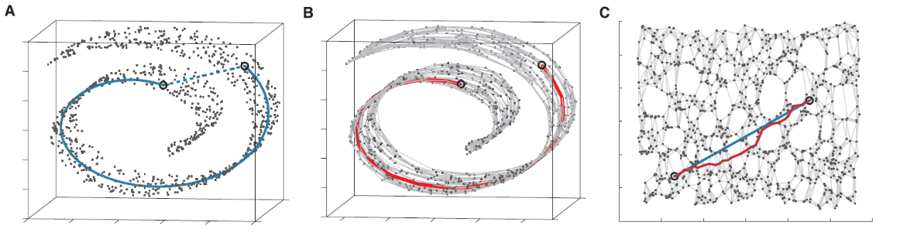
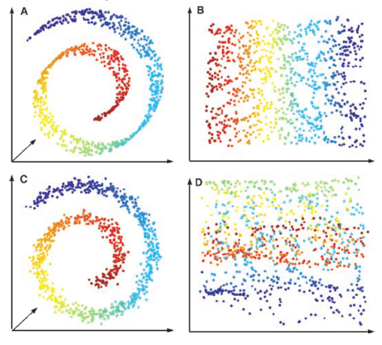
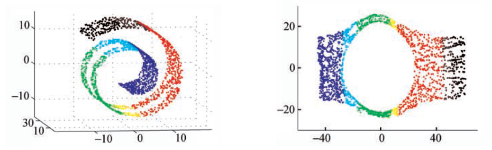
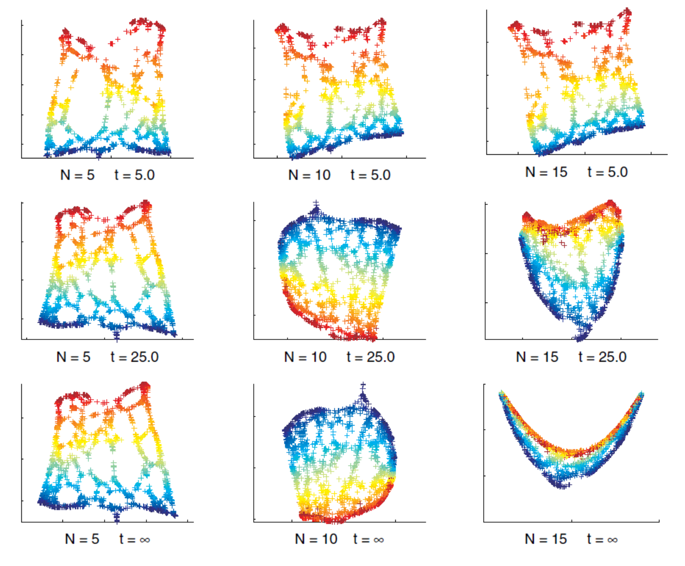

# Graph-based Spectral Methods

PCA, CCA, MDS are linear dimensionality reduction methods. The lower-dimensional linear projection preserves distances between **all** points.

If our data lies on a nonlinear manifold (a topological space locally resembling Euclidean space), then we need non-linear dimensionality reduction methods. Many of them are extended from MDS, that extends to a variety of distance/similarity measures. They only preserve **local** distance/neighborhood information along nonlinear manifold

In general, there are three steps:

1. Define some similarity/distance measure between data points $d(\boldsymbol{x}_i ,\boldsymbol{x}_j)$.
2. Induce a graph from the $n \times d$ data set $\boldsymbol{X}$
   - nodes are the data points
   - add edge $e(i,j)$ if the distance $d(\boldsymbol{x}_i,\boldsymbol{x}_j)$ satisfy certain criteria, e.g.  $d<\varepsilon$, $k$-NN, or mutual $k$-NN.
3. Perform spectral methods on some graph matrices, such as adjacency matrix, weights matrix, Laplacian matrix, etc, to obtain the embedding $\boldsymbol{Z} _{n \times d}$ that preserve some property in the original space.

Examples: Isomap, maximum variance unfolding, locally linear embedding, Laplacian eigenmaps.

## Isomap

[Tenenbaum et al. 2000]

For a manifold in a high-dimensional space, it may NOT be reasonable to use Euclidean distance to measure the pairwise dissimilarity of points. Geodesic distance along the manifold may be more appropriate.

Isomap is a direct extension of MDS where Euclidean distances are replaced with *estimated geodesic distances* along the manifold, i.e. it tries to "unfold" a manifold and preserve the pairwise geodesic distances.

### Learning

Isomap algorithm:

1. Construct a graph where node $i$ corresponds to input example $\boldsymbol{x}_i$, and nodes $i$ and $j$ are connected by an edge if $\boldsymbol{x}_i, \boldsymbol{x}_j$ are nearest neighbors (by some definition) with edge weight being the Euclidean distance $d_{ij} = \left\| \boldsymbol{x}_i -\boldsymbol{x}_j  \right\|$.

1. For each $i,j$ in the graph, compute pairwise distance $\Delta_{i j}$ along the shortest path in the graph (e.g., using Dijkstra’s shortest path algorithm) as the estimated geodesic distance.

1. Perform MDS for some dimensionality $k$, taking the estimated geodesic distances $\Delta_{i j}$ as input in place of Euclidean distances.

The output is the $k$-dimensional projections of all of the data points $\boldsymbol{z}_i$ such that the Euclidean distances in the projected space approximate the geodesic distances on the manifold.

$$
\left\|\boldsymbol{z}_{i}-\boldsymbol{z}_{j}\right\|^{2} \approx \Delta_{i j}^{2}
$$

:::{figure} isomap-geodesic-distance

Isomap with $d=3,k=2$. The blue line is the real geodesic distance and the red line is estimated.  [Livescu 2021]
:::

### Pros Cons

**Pros**

- As the data set size increases, isomap is guaranteed to converge to the correct manifold that the data was drawn from, under certain conditions (e.g. no holes)

**Cons**

- Can be sensitive to the **neighborhood size** used in graph construction, or equivalently to the noise in the data.

    :::{figure} isomap-noise
    

    Isomap fails when there are noises [Livescu 2021]
    :::

- Can't handle **holes** in the manifold. Geodesic distance computation can break. This is because the two points (even with the same color/label) sit in opposite to the hole have large geodesic distance on the manifold, which leads to large Euclidean distance in the projected space.

    :::{figure} gb-isomap-holes
    

    Isomap fails when there are holes [Livescu 2021]
    :::

## Laplacian Eigenmaps

[[Belkin & Niyogi 2003](https://web.cse.ohio-state.edu/~belkin.8/papers/LEM_NC_03.pdf)]

Unlike isomap where the edge weights are local Euclidean distances, Laplacian eigenmaps define edge weights in another way.

### Learning

1. Construct an graph $G = (V, E)$ from data $\boldsymbol{X}$. Add edge $(i, j)$ if $\boldsymbol{x}_i$ and $\boldsymbol{x}_j$ are close, in the sense that
   - $\left\| \boldsymbol{x}_i  - \boldsymbol{x}_j  \right\| < \epsilon$, or
   - $n$-nearest-neighbors

1. Define edge weights as

    $$
    w_{i j}=\left\{\begin{array}{ll}
    \exp \left(-\left\|\boldsymbol{x}_{i}-\boldsymbol{x}_{j}\right\|^{2} / t\right), & (i, j) \in E \\
    0 & \text { otherwise }
    \end{array}\right.
    $$

    where $t$ is a hyperparameter like temperature. As $t = \infty$, $w_{ij} = a_{ij}$.

1. Define a diagonal matrix $\boldsymbol{D}$ with $d_{ii} = \sum_j w_{ij}$. This can be seen as the density around the node $i$. The graph Laplacian is $\boldsymbol{L} = \boldsymbol{D} - \boldsymbol{W}$. The $k$-dimensional representation $\boldsymbol{Z}$ is given by the $k$ bottom eigenvectors (excluding the smallest one, which is $\boldsymbol{1}$) for the generalized eigenvector problem

    $$
    \boldsymbol{L} \boldsymbol{v} = \lambda \boldsymbol{D} \boldsymbol{v}
    $$

    If $G$ is not connected, run this step for each connected component in $G$.

:::{admonition,dropdown,seealso} *Derivation*

We want to preserve locality: if two data points $\boldsymbol{x}_i , \boldsymbol{x}_j$ are close, then their embeddings $\boldsymbol{z}_i , \boldsymbol{z}_j$ are also close. To ensure this, the loss function is formulated as

$$
\sum_{i,j=1}^n w_{ij} \left\| \boldsymbol{z}_i - \boldsymbol{z}_j  \right\|  ^2
$$

where $w_{ij}$ measures the closeness of $i$ and $j$ in $\boldsymbol{X}$. If $w_{ij}$ is large, then $\left\| \boldsymbol{z}_i - \boldsymbol{z}_j  \right\|$ is forced to be small.

It can be shown that $\frac{1}{2}$ of this summation equals $\operatorname{tr}\left( \boldsymbol{Z} ^{\top} \boldsymbol{L} \boldsymbol{Z} \right)$. Hence our objective is

$$\begin{aligned}
\min && \operatorname{tr}\left( \boldsymbol{Z} ^{\top} \boldsymbol{L} \boldsymbol{Z} \right) & &&\\
\mathrm{s.t.}
&& \boldsymbol{Z} ^{\top} \boldsymbol{D} \boldsymbol{Z} &= \boldsymbol{I} \\ && \boldsymbol{Z} ^{\top} \boldsymbol{D} \boldsymbol{1} &= \boldsymbol{0} \\
\end{aligned}$$

The constraint prevents collapse onto a subspace of dimension less than $m-1$. The solution is given by the bottom $k$ eigenvectors (excluding $\boldsymbol{1}$) of the generalized eigenvalue problem

$$
\boldsymbol{L} \boldsymbol{v} = \lambda \boldsymbol{D} \boldsymbol{v}
$$

To see why the two (??) constraints come from, we can first see a $k=1$ example, i.e. projection to a line. Suppose the projections are $z_1, \ldots, z_n$, the problem is

$$
\min _{\boldsymbol{z}} \boldsymbol{z} ^{\top} \boldsymbol{L} \boldsymbol{z}
$$

Note that there are two issues
- arbitrary scaling: if $\boldsymbol{z}^*$ is an optimal solution, then a new solution $c\boldsymbol{z}^*$ where $0<c<1$ gives a smaller function value, contradiction.
- translational invariance: if $\boldsymbol{z} ^*$ is an optimal solution, then a new solution $\boldsymbol{z} ^* + c\boldsymbol{1}$ gives the same function value.

To solve these two issues, we add two constraints $\boldsymbol{z} ^{\top} \boldsymbol{D} \boldsymbol{z} = 1$ and $\boldsymbol{z} ^{\top} \boldsymbol{D} \boldsymbol{1} = 0$ respectively. The second constraint also removes a trivial solution, to be introduced soon. The problem is then

$$\begin{aligned}
\min && \boldsymbol{z} ^{\top} \boldsymbol{L} \boldsymbol{z}  & &&\\
\mathrm{s.t.}
&& \boldsymbol{z} ^{\top} \boldsymbol{D} \boldsymbol{z} &= 1 &&  \\
&& \boldsymbol{z} ^{\top} \boldsymbol{D} \boldsymbol{1} &= 0 && \\
\end{aligned}$$

the solution is given by the 2nd smallest eigenvector of the generalized eigenproblem

$$
\boldsymbol{L} \boldsymbol{v} = \lambda \boldsymbol{D} \boldsymbol{v}
$$

Note that $\boldsymbol{v} = c\boldsymbol{1}$ is an eigenvector of $\boldsymbol{L}$ but the constraint $\boldsymbol{z} ^{\top} \boldsymbol{D} \boldsymbol{1} =0$ removes that.

To generalize to $k\ge 0$, we have the constraints shown above.

:::

:::{admonition,note} Note
Due to some properties of different Laplacians matrices, the solution can also be found as the $k$ bottom eigenvectors (excluding the smallest one) to the eignproblem $\boldsymbol{L} ^\mathrm{rw} \boldsymbol{v}  = \lambda \boldsymbol{v}$ or $\boldsymbol{L} ^\mathrm{sym} \boldsymbol{v}  = \lambda \boldsymbol{v}$. For details see [graph Laplacians](graph-laplacian).
:::

:::{figure} gb-laplacian-eigenmap-Nt

Laplacian eigenmap with varing $N$-nearest-neighbors and temperature $t$ [Livescu 2021]

:::

Other formulation: find centered and unit-covariance projections $\boldsymbol{z}_i$ that solve the total projected pairwise distances weighted by $w_{ij}$ and scaled by $d_{ii}d_{jj}$

$$\begin{aligned}
\min &\ \sum_{i j} \frac{w_{i j}|| \boldsymbol{z}_{i}-\boldsymbol{z}_{j}||^{2}}{\sqrt{d_{i i} d_{j j}}} \\
\text{s.t.} &\ \boldsymbol{Z} \text{ is centered and has unit covariance} \\
\end{aligned}$$

The solution $\boldsymbol{Z}$ is given by the $k$ bottom eigenvectors (excluding the smallest one) of the symmetrized normalized Laplacian defined as

$$
\boldsymbol{L}^{sym} = \boldsymbol{I}  - \boldsymbol{D} ^{-\frac{1}{2}} \boldsymbol{W}  \boldsymbol{D} ^{-\frac{1}{2}}
$$

## Locally Linear Embedding

Locally linear embedding learns a mapping in which each point can be expressed as a **linear function** of its nearest neighbors.

## Maximum Variance Unfolding

Maximum variance unfolding tries to maximize the variance of the data (like PCA) while respecting neighborhood relationships.
