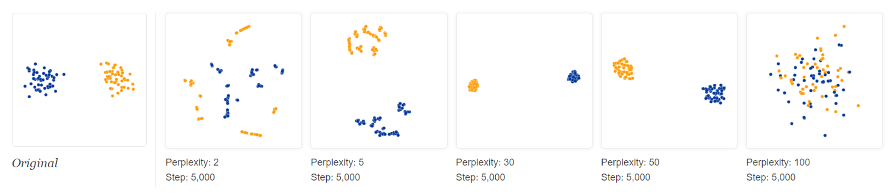

# SNE

t-Distributed Stochastic Neighborhood Embedding.

"tisney".

*van der Maaten & Hinton 2008.*

## Objective

For visualization of static data set, i.e. $k=3$ or $k=3$. Don't need an out-of-sample extension.

Most nonlinear methods try to maintain global similarity measures (inner product or distance) in the original space $\mathcal{X}$ and the low-dimensional projections $\mathcal{Y}$. It's actually impossible to actually maintin distances/similarities when we squash to only 2-3 dimensions.

In contrast, instead try to maintain **neighborhood properties**: If $\boldsymbol{x}_i ,\boldsymbol{x}_j$ are likely to be neighbors in the original space, then their mappings in the low-dim space $\boldsymbol{y}_i , \boldsymbol{y}_j$ should also be neighbors.

Define the probability that point xi would pick $\boldsymbol{x}_j$ as its neighbor as

$$
p_{j \mid i}=\left\{\begin{array}{ll}
\frac{e^{\left(-|| \mathbf{x}_{i}-\mathbf{x}_{j} \|^{2}\right) / 2 \sigma_{i}^{2}}}{\sum_{k \neq i} e^{\left(-|| \mathbf{x}_{i}-\mathbf{x}_{k} \|^{2}\right) / 2 \sigma_{i}^{2}}} & \text { if } i \neq j \\
0 & \text { if } i=j
\end{array}\right.
$$

where $\sigma_i$ is a data point-specific variance of Gaussian centered at $\boldsymbol{x}_i$, to be introduced later.

In the low-dimensional space

$$
q_{j \mid i}=\left\{\begin{array}{ll}
\frac{e^{\left(-|| \mathbf{y}_{i}-\mathbf{y}_{j} \|^{2}\right)}}{\sum_{k \neq i} e^{\left(-|| \mathbf{y}_{i}-\mathbf{y}_{k}||^{2}\right)}} & \text { if } i \neq j \\
0 & \text { if } i=j
\end{array}\right.
$$

variance fixed in low-dim space—changing it just rescales mapping.

t-SNE wants these two distributions to be as similar as possible. How to measure the similarity of two distributions?

Let $P_i$ (or $Q_i$) represent conditional distribution over all other data points given $\boldsymbol{x}_i$ (of $\boldsymbol{y}_i$ ). Objective to minimize is a **sum** over data-point specific KL divergences:

$$
\sum_{i} \mathrm{KL}\left(P_{i}|| Q_{i}\right)=\sum_{i} \sum_{j} p_{j \mid i} \log \frac{p_{j \mid i}}{q_{j \mid i}}
$$

Large cost for using widely separated $\boldsymbol{y}_i, \boldsymbol{y}_j$ (small $q_{j\mid i}$) to represent nearby $\boldsymbol{x}_i , \boldsymbol{x}_j$ (large $p_{j\mid i}$).

Objective is non-convex, optimized with gradient descent (somewhat involved).

## Learning

Randomly initialize a $n \times k$ low-dim data matrix $\boldsymbol{Y}$ and do gradient descent to minimize the KL divergence.

## Interpretation

Recall KL divergence:

$$
\begin{aligned}
\mathrm{KL}(P \| Q) &=\sum_{j} p_{j} \log \frac{p_{j}}{q_{j}} \\
&=H(P, Q)-H(P)
\end{aligned}
$$

- H(P) = entropy of P in bits
- H(P,Q) = cross entropy between P and Q in bits.

Interpretations of KL divergence:

- The number of extra bits, on average, needed to encode samples from P using a code optimized for Q, where “optimized” means less likely values get longer code words.

- Amount of information gained when going from prior Q to posterior P (viewing the low-dimensional data as coming from a prior).

- Amount of information loss when approximating P with Q.

## SNE vs t-SNE.

SNE is difficult to optimize, and suffers from the “crowding problem”.

t-SNE makes two clever engineering improvements:

- Uses a **symmetrized** version of the SNE cost with simpler gradients that are faster to compute
- Uses a heavier-tailed Student-t distribution instead of Gaussian in the low-dimensional space

# t-SNE

## Objective

Uses joint instead of conditional distributions of data pairs: minimizes

$$
\mathrm{KL}(P \| Q)=\sum_{i} \sum_{j} p_{i j} \log \frac{p_{i j}}{q_{i j}}
$$

where $p_{ii} = q_{ii} = 0$

In low-dim space

$$
q_{i j}=\frac{e^{\left(-\left\|\mathbf{y}_{i}-\mathbf{y}_{j}\right\|^{2}\right)}}{\sum_{k \neq l} e^{\left(-\left\|\mathbf{y}_{k}-\mathbf{y}_{l}\right\|^{2}\right)}}
$$

In high-dim space, it would seem natural to define

$$
p_{i j}=\frac{e^{\left(-\left\|\mathbf{x}_{i}-\mathbf{x}_{j}\right\|^{2}\right) / 2 \sigma^{2}}}{\sum_{k \neq l} e^{\left(-\left\|\mathbf{x}_{k}-\mathbf{x}_{l}\right\|^{2}\right) / 2 \sigma^{2}}}
$$

But this doesn’t allow data point-specific $\sigma_i$. Instead, symmetrized SNE uses.

$$
p_{i j}=\frac{p_{j \mid i}+p_{i \mid j}}{2 n}
$$

where $n$ is the number of data points. ??2.21

Because the Gaussian distribution dies off very fast with distance from the mean, SNE only accurately represents very nearby points. Moderately distant points can’t be **differentiated** from each other. Many points end up “crushed” into the center of the map

t-SNE solution: use a heavy-tailed distribution in the low-dim space

- $p_{ij}$ is as in symmetrized SNE.
- In low-dim space, use t-distribution, with one-degree of freedom.

    $$
    q_{i j}=\frac{\left(1+\left\|\mathbf{y}_{i}-\mathbf{y}_{j}\right\|^{2}\right)^{-1}}{\sum_{k \neq l}\left(1+\left\|\mathbf{y}_{k}-\mathbf{y}_{l}\right\|^{2}\right)^{-1}}
    $$

[Images]

## Pros and Cons

Pros

- Works especially well for clustered data, or data with multiple
“sub-manifolds”.

Cons

- Perplexity hyperparameter is important.
- Careful how you interpret it: Don’t trust visualizations with lots of tiny clusters, or just one big blob.
- Tends to fail for Swiss roll-type toy data. t-SNE tries to find cluster structure, there is no cluster nature in the data.

[img23]

Note: t-SNE is non-parametric and has no natural out-of-sample extension; a parametric extension exists (parametric t-SNE).

## Model Selection

How to set the hyperparameters $\sigma_i$?

Data point-specific variances allow SNE/t-SNE to model varying
densities in different parts of the high-dim space
But wait, that’s as many hyperparameters as data points!
SNE/t-SNE sets σi based on a single user-provided hyperparameter, perplexity

Definition (Perplexity)
: The perplexity of the distribution Pi is

  $$
  \begin{aligned}
  \operatorname{Perp}\left(P_{i}\right) &=2^{H\left(P_{i}\right)} \\
  H\left(P_{i}\right) &=-\sum_{j} p_{j \mid i} \log _{2} p_{j \mid i}
  \end{aligned}
  $$

Entropy is the average number of bits needed to encode the random variable. Perplexity is the “effective number of values” in the support of the domain of the random variable.

Consider a uniform distribution P over N values:

$$
\begin{aligned}
\operatorname{Perp}(P) &=2^{-\sum_{i} p_{i} \log _{2} p_{i}} \\
&=2^{-\sum_{i} \frac{1}{N} \log _{2}\left(\frac{1}{N}\right)} \\
&=2^{\sum_{i} \frac{1}{N} \log _{2} N} \\
&=2^{\log _{2} N}=N
\end{aligned}
$$

Consider a distribution P where one value has probability 1:

$$
\begin{aligned}
\operatorname{Perp}(P) &=2^{-\sum_{i} p_{i} \log _{2} p_{i}} \\
&=2^{-1 \log _{2} 1}=2^{0}=1
\end{aligned}
$$

Varying perplexity:

:::{figure} tSNE-varying-perp

t-SNE: varying perplexity (http://distill.pub/2016/misread-tsne/)
:::

- Low perplexity, t-SNE tries to find more clusters of small size.
- High perplexity, t-SNE tries to find less clusters of large size.

So we should set perplexity as the average degree of each point.

What if the degree distribution is wide, i.e. imbalance? t-SNE may fail, some large-size cluster may break up to small ones.
