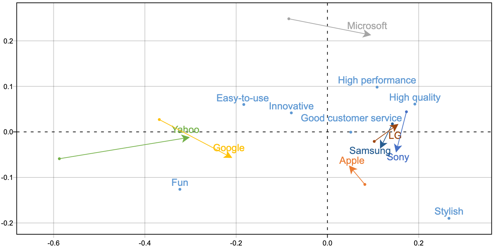

# Correspondence Analysis

Correspondence Analysis may have been evolved from methods used in multidimensional scaling. However Correspondence Analysis deals with a different type of data: count data in a two-way contingency table.

Specifically, CA is a method for graphically displaying both the rows and columns of a **two-way contingency table**. The CA graphical procedure aims to present associations between the row variable and the column variable.

$$
\begin{array}{c|cccccc}
& \text { col-var level }1  & \text { col-level }2  & \cdots & \text { col-level }j  & \cdots & \text { col-level }J  \\
\hline \text { row-var level }1 & n_{11} & n_{12} & \cdots & n_{1 j} & \cdots & n_{1 J} \\
\text { row-var level }2  & n_{21} & n_{22} & \cdots & n_{2 k} & \cdots & n_{2 J} \\
\vdots & \vdots & \vdots & \vdots & \vdots & \vdots & \vdots \\
\text { row-var level }i  & n_{i 1} & n_{i 2} & \cdots & n_{i j} & \cdots & n_{i j} \\
\vdots & \vdots & \vdots & \vdots & \vdots & \vdots & \vdots \\
\text { row-var level }I  & n_{I 1} & n_{I 2} & \cdots & n_{I j} & \cdots & n_{I J}
\end{array}
$$

- Two categorical variables are of $I$ and $J$ categories respectively,
- The variables are represented as row and column variables.
- $n_{ij}$ is the count of item belong to category $i$ of the row variable and
category $j$ of the column variable.

Reference: [Greenacre slides](http://statmath.wu.ac.at/courses/CAandRelMeth/CARME1.pdf)

## Model

Given the $I \times J$ contingency table $\boldsymbol{X}$, define
- Cell percentage matrix $\boldsymbol{P} = \boldsymbol{X} /n = n_{ij}/n$
- Row margin $\boldsymbol{r} = \boldsymbol{P} \boldsymbol{1}$ and column margin $\boldsymbol{c}= \boldsymbol{P} ^{\top} \boldsymbol{1}$, i.e. $r_i = n_{i\cdot}/n, c_j = n_{\cdot j}/n$.
- Two diagonal matrices: $I\times I$ matrix $\boldsymbol{D} _r = \operatorname{diag}(\boldsymbol{r})$, and $J \times J$ matrix $\boldsymbol{D} _c = \operatorname{diag}(\boldsymbol{c})$.
- Expected cell percentage $\boldsymbol{E} = \boldsymbol{r} \boldsymbol{c} ^{\top}$
- Residual matrix $\boldsymbol{P} - \boldsymbol{E}$
- standardized (Pearson) residual matrix

  $$\boldsymbol{R} = \boldsymbol{D} _r ^{-1/2} (\boldsymbol{P} - \boldsymbol{E} ) \boldsymbol{D} _c ^{-1/2} = \left[ \frac{p_{ij} - r_i c_j}{\sqrt{r_i c_j}}  \right]$$

  Large values $R_{ij}$ indicates associations between the row $i$ and column $j$.

- Total inertia

  $$\sum_{i=1}^{I} \sum_{j=1}^{J} \frac{\left(p_{i j}-r_{i} c_{j}\right)^{2}}{r_{i} c_{j}} = \operatorname{tr}\left( \boldsymbol{R} \boldsymbol{R} ^{\top} \right) = \operatorname{sum}(\boldsymbol{R} * \boldsymbol{R})$$

  which is related to chi-squared statistic: total inertia = $\chi ^2 /n$.

We apply (condensed) SVD to $\boldsymbol{R}$. Let $k = \min (I, J)$, then

$$
\boldsymbol{R}_{I \times J} = \boldsymbol{U}_{I \times k} \boldsymbol{\Sigma}_{k \times k} \boldsymbol{V}_{J \times k} ^{\top}
$$

Then the columns in $\boldsymbol{D} _r ^{-1/2} \boldsymbol{U}$ give the coordinates of row variables, and the columns in $\boldsymbol{D} _c ^{-1/2} \boldsymbol{V}$ give the coordinates of column variables. There coordinates are called **standard** coordinates. There are principal coordinates, which scale the standard coordinates by singular values: $\boldsymbol{D} _r ^{-1/2} \boldsymbol{U} \boldsymbol{\Sigma}$ and $\boldsymbol{D} _c ^{-1/2} \boldsymbol{V} \boldsymbol{\Sigma}$.

The maximal possible value of $k$ is the rank of $\boldsymbol{R}$, i.e. number of non-zero singular values.

## Interpretation

If we pick the first 2-d coordinates for row variables, and those for column variables, then we can plot them together.

To interpret the plot, rather than looking at the closeness of the points, we look at the vectors from the connecting the origin to these points.
- If the vector to some row variable is longer, then this row variable is discriminated from the rest row variables. Similar for columns.
- If two vectors to a row and a column variable has a smaller angle, then there exists some association between them. But the strength of the association depends on the length of the vector.
- In sum, if a row variable and a column variable are away from origin and has a small angle between them, then there exist strong association between them.

If the contingency table vary along time, then we can also plot and see how the points move in the plot, i.e. how association changes.

:::{figure} ca-case

Correspondence analysis plot [[Tim Bock](https://www.displayr.com/interpret-correspondence-analysis-plots-probably-isnt-way-think/)].
:::

See these two articles for interpretation and case studies [1](https://www.displayr.com/how-correspondence-analysis-works/), [2](https://www.displayr.com/interpret-correspondence-analysis-plots-probably-isnt-way-think/).

## R.t. Weighted Least Squares

Essentially SVD is solving a low-rank approximation problem to $\boldsymbol{R}$

$$
\min\ \left\| \boldsymbol{R} - \hat{\boldsymbol{R}}  \right\| _F ^2 \qquad \text{s.t. } \operatorname{rank}\left( \boldsymbol{R} \right) = k
$$

where $\boldsymbol{R} = \boldsymbol{D} _r ^{-1/2} (\boldsymbol{P} - \boldsymbol{r} \boldsymbol{c} ^{\top}    ) \boldsymbol{D} _c ^{-1/2}$. Let $\hat{\boldsymbol{R}} = \boldsymbol{D} _r ^{-1/2} (\hat{\boldsymbol{P}} - \boldsymbol{r} \boldsymbol{c} ^{\top}    ) \boldsymbol{D} _c ^{-1/2}$, then we have

$$\begin{aligned}
\left\| \boldsymbol{R} - \hat{\boldsymbol{R}}  \right\| _F ^2
&= \left\| \boldsymbol{D} _r ^{-1/2} (\boldsymbol{P} - \hat{\boldsymbol{P}) } \boldsymbol{D} _c ^{-1/2}    \right\| _F^2 \\
&= \sum_{i=1}^{I} \sum_{j=1}^{J} \frac{\left(p_{i j}-\hat{p}_{i j}\right)^{2}}{r_{i} c_{j}}
\end{aligned}$$

which is a weighted lease squares problem.
