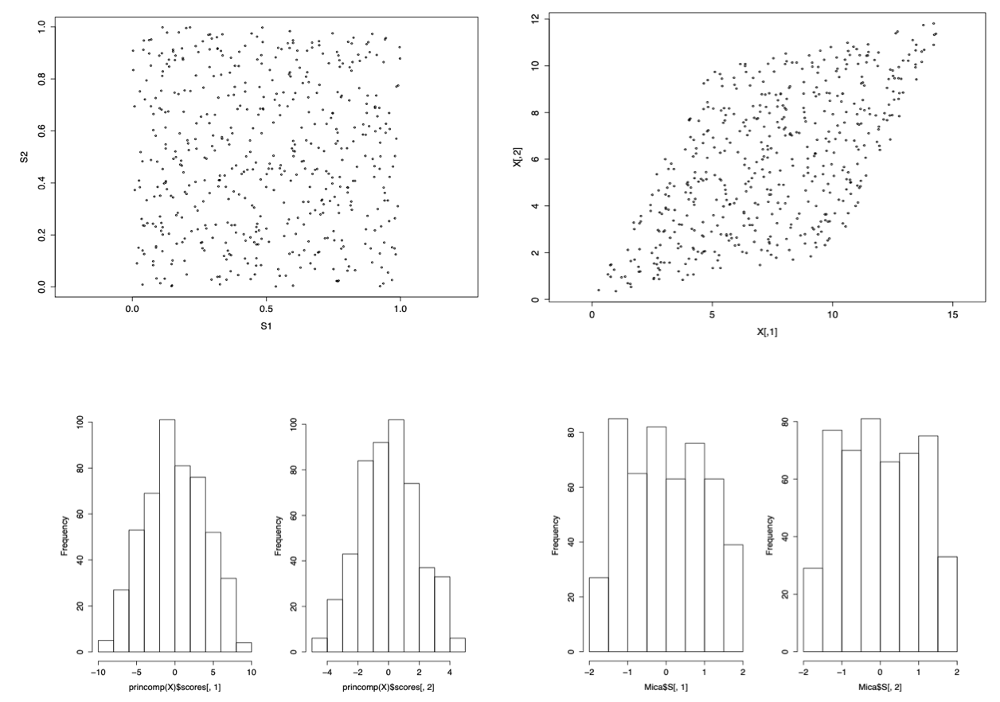
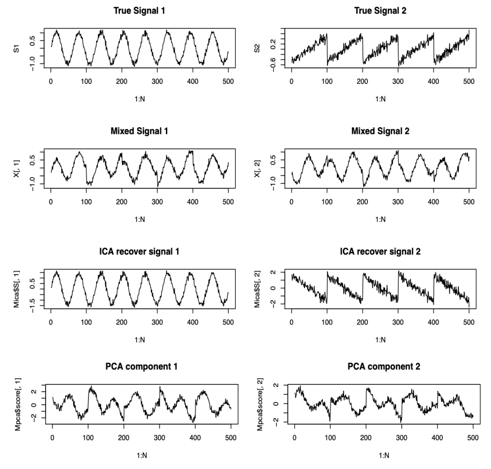

(independent-component-analysis)=
# Independent Component Analysis

Sometimes measurements are taken as a mixture of several sources, e.g. voice recording from a group of people talking at the same time. The source signal may not have Gaussian distribution.

Given this kind of observed data, ICA aims to identify and separate **independent, latent, non-Gausssian** component.

ICA is also called Blind Signal Separation in the signal procession context. Technically, Independent Component Analysis can be viewed as one of the many variations of Principal Component Analysis.

In this section we introduce noiseless, equal-dimension ICA.

## Assumptions

- The observed multivariate data are considered as a **linear** combinations of the latent components $S_i$

  $$
  \boldsymbol{x} = \boldsymbol{A} _{p \times p} \boldsymbol{s}
  $$

- The components $S_i$’s are assumed non-Gaussian.

  In fact, at most one Gaussian component is allowed in ICA. Otherwise, the components are **not** identifiable. If all components are known to be or close to Gaussian distributions, then ICA is not appropriate. In the approximately normal case, PCA or its variations should be in the place of ICA.

- The components $S_i$’s are independent.

- The mixing matrix $\boldsymbol{A}$ is assumed invertible. So unmixing matrix $\boldsymbol{A} ^{-1}$ exists.

## Identifiability

Like the [factor model](factor-analysis), ICA models lack of identifiability.

- The covariance of $\boldsymbol{s}$ can not be uniquely determined.
  - Solutions: Impose $\operatorname{Cov}\left( \boldsymbol{s}  \right) = \boldsymbol{I} _p$, like in factor model.

- The signs of the components $S_i$’s can not be determined, due to the reasoning below (setting $\boldsymbol{P} = \operatorname{diag}(\pm 1, \pm 1, \ldots)$).
  - Sometimes it is okay, when the application picks the desired signs.
  - Sometimes the sign issue is problematic.

- The order of $S_i$ can not be determined.

  For any permutation matrix $\boldsymbol{P}$ (recall that permutation matriices are orthogonal matrices $\boldsymbol{P} ^{-1} = \boldsymbol{P} ^{\top}$), given a pair of solution $(\boldsymbol{A} ,\boldsymbol{s})$ we can always find another pair of solution $(\boldsymbol{A} ^*, \boldsymbol{s} ^*)$ since

  $$
  \boldsymbol{x} = \boldsymbol{A} \boldsymbol{s} = (\boldsymbol{A} \boldsymbol{P} ^{-1}  )(\boldsymbol{P}\boldsymbol{s}  ) = \boldsymbol{A} ^* \boldsymbol{s}^*
  $$

  and

  $$
  \operatorname{Cov}\left( \boldsymbol{s} ^* \right) = \operatorname{Cov}\left( \boldsymbol{P} \boldsymbol{s}   \right) = \boldsymbol{P} ^{\top} \operatorname{Cov}\left( \boldsymbol{s}  \right) \boldsymbol{P} = \boldsymbol{P} ^{\top} \boldsymbol{I} _p \boldsymbol{P} = \boldsymbol{I} _p
  $$

Therefore the order of the component sources are not recovered

## Objective

### Non-Gaussian-ness

By the linear assumption and invertibility assumption, we have

$$
\boldsymbol{s}=\left[\begin{array}{c}
S_{1} \\
\vdots \\
S_{i} \\
\vdots \\
S_{p}
\end{array}\right]=\boldsymbol{A}^{-1} \boldsymbol{x}=\left[\begin{array}{c}
\boldsymbol{w}_{1}^{\prime} \boldsymbol{x} \\
\vdots \\
\boldsymbol{w}_{i}^{\prime} \boldsymbol{x} \\
\vdots \\
\boldsymbol{w}_{p} \boldsymbol{x}
\end{array}\right]
$$

By the non-Gaussian assumption of $S_i$'s, we want to find $\boldsymbol{w} _i$'s so that $\boldsymbol{w} _i ^{\top} \boldsymbol{x}$ is as far away from normal distribution as possible.

Measurements of non-Gaussian-ness include
- Kurtosis
- [Negative entropy](differential-entropy): $J(S) = H(S) - H(Z)$

### Maximum Independence

Recall that [mutual information](mutual-information) between two random variables $X$ and $Y$ is defined as

$$\operatorname{I}(X,Y) =\operatorname{H}(X)+\operatorname{H}(Y)-\operatorname{H}\left(X, Y \right)$$

which measure the dependence among $X$ and $Y$. We can extend this notion to multivariate case $\boldsymbol{x} = (X_1, \ldots, X_n)$ and define

$$
\operatorname{I} (\boldsymbol{x}) = \sum_{i=1}^n \operatorname{H} (X_i) - \operatorname{H}(X_1, \ldots, X_n)
$$

which measures the dependence of among the components in $\boldsymbol{x}$. The smaller $I(\boldsymbol{x})$, the more independent the components of $\boldsymbol{x}$. Seeking maximum independence among components $S_1, \ldots, S_n$ comes down to seeking orthogonal linear transformation $\boldsymbol{A}$ that minimizes $\operatorname{I} (\boldsymbol{x}) = \operatorname{I} (\boldsymbol{A}\boldsymbol{s})$.

## Relation to

### Factor Analysis

Compared to [factor analysis](factor-analysis):

- ICA looks for independent components.

  Typically factor analysis assumes $\boldsymbol{f}_i$'s are pairwise uncorrelated, which is not as strong as independence.

- ICA cares about the estimation of the components.

  In FA, often the primary interest is to estimate the factor loadings $\ell_{ij}$. The estimation of the latent variables $\boldsymbol{f}$ is only of secondary interest

### Principal Component Analysis

PCA assumes (works well when) the data is Gaussian. If not, then ICA may work better.

:::{figure} ica-vs-pca-uniform

Uniform signals $S_1, S_2$ (top left), with linear transformation $\boldsymbol{x} = \boldsymbol{A} \boldsymbol{s}$ (top right). The recoveries by PCA seem bell-shape (bottom left), while the recoveries by ICA are more uniform (bottom right) [Wang 2021]

:::

Another example:

:::{figure} ica-vs-pca-ts

Two non-Gaussian signals $S_1, S_2$ (1st line), with linear transformation (2nd line). The recoveries by ICA are very good (3rd line, note the inversed sign of $S_2$) while the recoveries by PCA are not satisfactory (bottom) [Wang 2021]

:::
