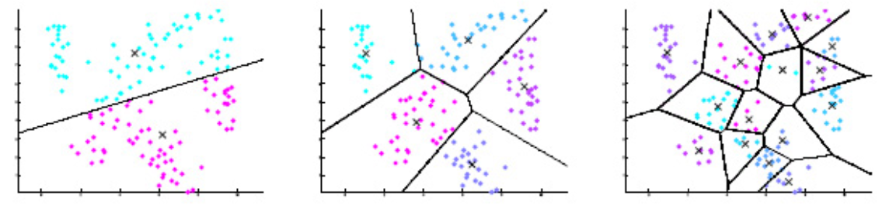
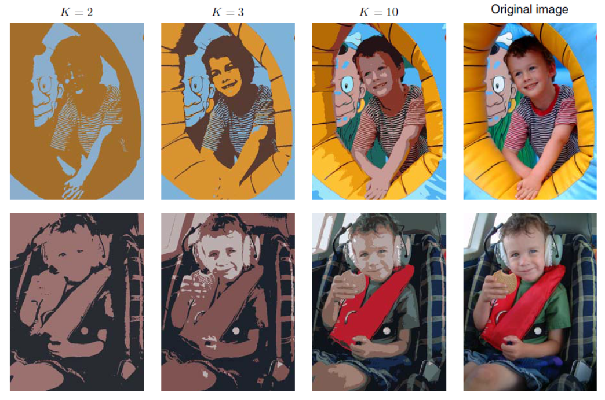

# Clustering

Many data sets naturally consist of multiple natural subsets, e.g. multiple digits, object classes in images, topics, phonemes in speech, ...

Clustering aims to identifying these subsets and assigning data points to the correct one

Warning: Almost no theoretical guarantees of the algorithms.

## Vector Quantization

```{margin}
Quantization = discretization = compression
```
VQ is a clustering-based discrete representation learning method.

The feature vectors in many data sets are often a vector of real values per data sample, but for some applications, compact representation may be important. For instance, compression, coding, etc. Quantization code the real-valued $\boldsymbol{x}$ to codeword, and represent the vector $\boldsymbol{x}$ by the closest codeword. Of course, quantization incurs some loss of information.

The simplest VQ approach is $k$-means clustering.

:::{figure} clustering-vq


VQ codebooks for 2 dimensional vectors [Livescue 2021]
:::

:::{figure} k-means-img-compression


$k$-means for image compression [Livescue 2021]
:::
