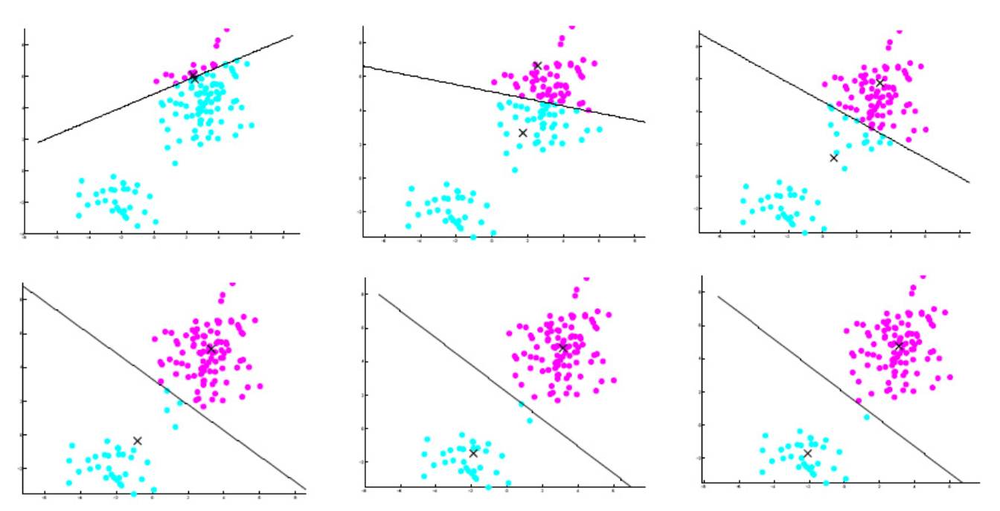
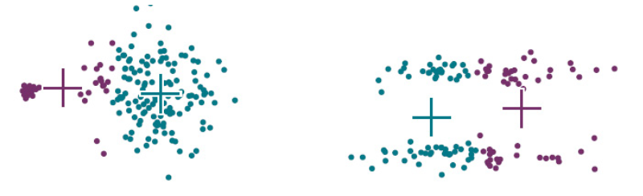

# K-means clustering

K-means clustering is a iterative algorithm for clustering.

---
**K-means clustering**

---

- Initialize $k$ menas $\mu_1, \ldots, \mu_k$ to random locations.

- While True

  - Assign each example $\boldsymbol{x} _i$ to the closest mean

      $$
      y_{i}=\operatorname{argmin}_{c}\left\|\mathbf{x}_{i}-\mu_{c}\right\|
      $$

  - re-estimate each mean based on examples assigned to it

      $$
      \mu_{c}=\frac{1}{N_{c}} \sum_{y_{i}=c} \mathbf{x}_{i}
      $$

      where $N_{c}= \left\vert \left\{\mathbf{x}_{i}: y_{i}=c\right\} \right\vert$

  - repeat until there are no changes in assignment

---

:::{figure} k-means-example

Iterations in $k$-means example [Livescue 2021]
:::

## Objective

We can define an objective for $k$-means. It minimizes the total distortion

$$
D=\sum_{c=1}^{k} \sum_{\mathbf{x} \in \text { cluster } c}\left\|\mathbf{x}-\mu_{c}\right\|^{2}
$$

It often converges to a local minimum, rather than global minimum. The results are affected by initialization.

## Pros Cons

Pros

- Work well for clusters with spherical shape and similar size

Cons

- Affected by random initialization.
  - heuristic remedy: try several initializations, keep the result with lowest total distortion $D$

- Work bad for clusters with non-ideal attributes

:::{figure} k-means-bad

$k$-means fail for clusters with non-ideal shapes [Livescue 2021]
:::
