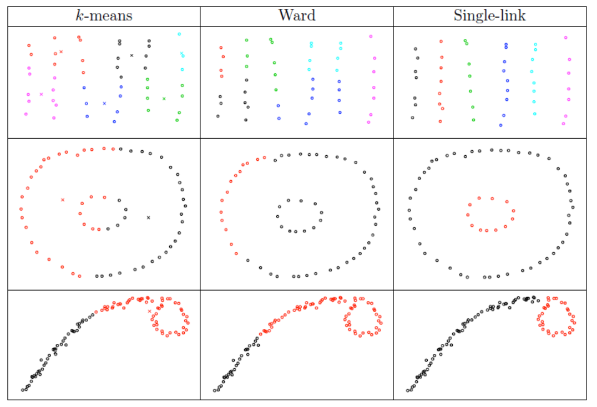
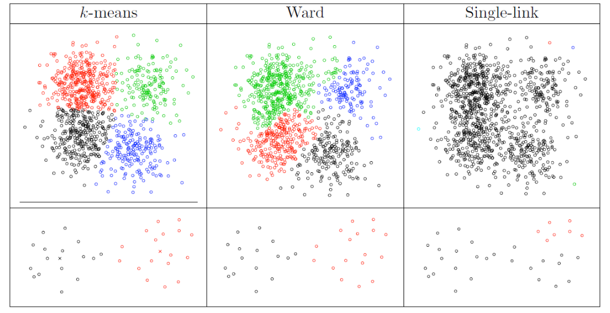
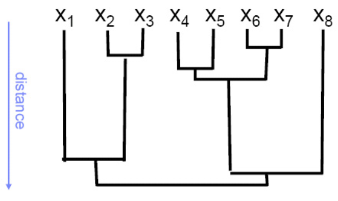
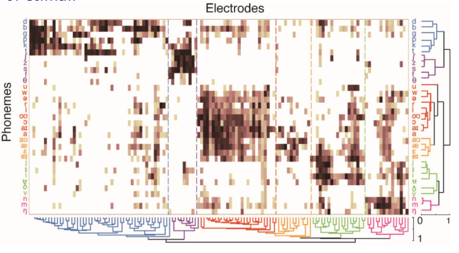

# Agglomerative Methods

Unlike $k$-means which specify $k$ at start, agglomerative methods view each data point as a cluster, and then iteratively merge two **closest** clusters according to some distance measure, until some convergence criterion.

## Distance Measure

### Euclidean

Let $A$ and $B$ be two clusters and let $a, b$ be individual data points. Usually, $\operatorname{dist}(a, b)$ is the Euclidean distance, while $\operatorname{dist}(A, B)$ varies in definitions.

- **Single-linkage** uses the minimum distance

    $$\operatorname{dist}(A, B)=\min _{a \in A, b \in B} \operatorname{dist}(a, b)$$

    Single-linkage tends to yield **long**, “stringy” clusters.

- **Complete-linkage** uses the maximal distance

    $$\operatorname{dist}(A, B)=\max _{a \in A, b \in B} \operatorname{dist}(a, b)$$

    Complete-linkage tends to yield **compact**, “round” clusters.

- **Average-linkage** uses the average distance

    $$\operatorname{dist}(A, B)=\operatorname{mean}  _{a \in A, b \in B} \operatorname{dist}(a, b)$$

- **Wald's methods** uses the increment in total within-group difference if we merge them

    $$
    \begin{aligned}
    \operatorname{dist}(A, B) &=\sum_{i \in A \cup B}\left\|\boldsymbol{x}_{i}-\boldsymbol{\mu}_{A \cup B}\right\|^{2}-\sum_{i \in A}\left\|\boldsymbol{x}_{i}-\boldsymbol{\mu}_{A}\right\|^{2}-\sum_{i \in B}\left\|\boldsymbol{x}_{i}-\boldsymbol{\mu}_{B}\right\|^2 \\
    &=\frac{|A||B|}{|A|+|B|}|| \boldsymbol{\mu}_{A}-\boldsymbol{\mu}_{B}||^{2}
    \end{aligned}
    $$


    :::{admonition,note} Wald's method vs $k$-means

    - At each merge step, Ward’s method minimizes the same sum-of-squares criterion as $k$-means, but constrained by choices in previous iterations, so the total sum-of-squares for a given $k$ is normally larger for Ward’s method than for $k$-means.

    - A common trick: Use Ward’s method to pick $k$, then run $k$-means starting from the Ward cluster

    :::

In the examples below, $k$-means tends to produce clusters with spherical shapes, and we can see how single-linkage is good or bad.

:::{figure} clustering-comparison-1


Comparison of clustering algorithms [Livescue 2021]
:::

:::{figure} clustering-comparison-2


Comparison of clustering algorithms [Livescue 2021]
:::

### Graph-based

For graphs, or induced graphs from data matrix, there are more methods to define $\operatorname{dist}(a, b)$ for vertices $a$ and $b$.

- Neighborhood dissimilarity

  $$
  \operatorname{dist}(a, b) = \frac{\left\vert N(a) \Delta N(b) \right\vert}{d_{(N_v)} + d_{(N_v - 1)}}
  $$

  where
  - $N(a), N(b)$ are the neighbors of $a$ and $b$ respectively.
  - $\Delta$ indicates the symmetric difference of two sets. For instance, $S_1 \Delta S_2 = (S_1 - S_2) \cup (S_2 - S_1)$.
  - $d_{(i)}$ is the $i$-th smallest element in the degree sequence. The denominator is used to normalize the distance to $[0, 1]$, where 0 and 1 indicate perfect similarity and dissimilarity respectively.

- Adjacency matrix euclidean distance

  $$
  \operatorname{dist}(a, b) = \sqrt{\sum_{k \ne a, b} (A_{ak} - A_{bk})^2}
  $$

  which measures the Euclidean distance between rows $a$ and $b$ in the adjacency matrix.

Besides the distance measures between vertices, Newman [SAND 294, 297] seeks to greedily optimize the so-called **modularity** of a partition. Let
- $\mathcal{C} = \left\{ C_1, \ldots, C_K \right\}$ be a given candidate partition.
- $f_{ij}(\mathcal{C}) = \frac{E(C_i, C_j)}{E(G)}$ be the fraction of edges in $G$ that connect vertices in $C_i$ with vertices in $C_j$
- $\boldsymbol{F}$ be a $K \times K$ matrix storing the $f_{ij}$ values

The modularity of $\mathcal{C}$ is defined as

$$
\bmod (\mathcal{C})=\sum_{k=1}^{K}\left[f_{k k}(\mathscr{C})- \mathbb{E}\left( f_{k k} \right)\right]^{2}
$$

where $\mathbb{E}\left( f_{k k} \right)$ is the expected value of $f_{kk}$ under some random graph model. For instance, if we use a model where a graph is constructed to have the same degree distribution as $G$, but with edges placed at random, then $\mathbb{E}\left( f_{k k} \right) = f_{k+} \cdot f_{+k}$ where $f_{k+}$ and $f_{+k}$ are the $k$-th row and column sums of $\boldsymbol{F}$.

Large values of $\bmod (\mathcal{C})$ suggest that $\mathcal{C}$ captures nontrivial structure.

Optimization of the modularity function is NP-complete problem. A greedy agglomerative algorithm is therefore commonly used for heuristic optimization, which runs in $\mathcal{O} (N_v ^2 \log N_v)$ time generally, using sophisticated data structures, but nearly linear time on sparse networks with hierarchical structure, making it appealing for use in the context of certain large networks.


## Convergence Criterion

```{margin}
This is one advantage of hierarchical clustering over “flat” clustering like $k$-means
```

A good representation of clustering process is dendrogram. The $x$-axis represents items, and the $y$-axis is distance. It provides visual guidance to a good choice for the number of clusters

Stop merging when the merge cost (distance between merged clusters) would be much larger than in previous iterations (for some precise definition of “much larger”), or use $\bmod (\mathcal{C})$ to choose an optimal partition.

:::{figure} clustering-dendrogram


Representing clustering with dendrograms
:::

For instance, given a matrix of phonemes and electrodes, we are interested in discovering cohesive neural regions/firing patterns and relating them to clusters of stimuli.

:::{figure} clustering-neural-regions


Cohesive neural regions/firing patterns [Bouchard et al. 2013]
:::
