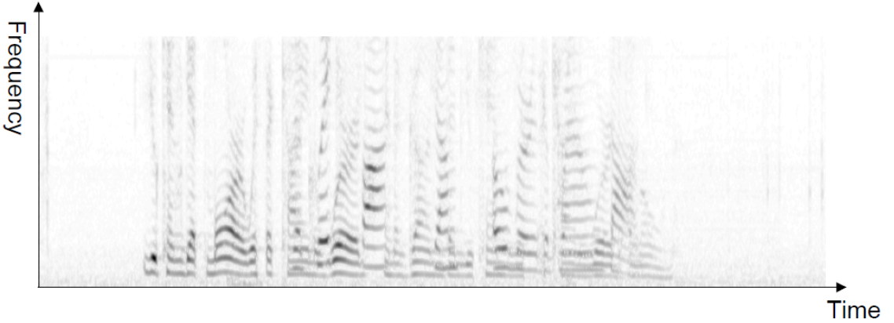

# Spectral Clustering

Spectral clustering methods use a similarity graph (as in graph-based dimensionality reduction) to represents the data points, then use spectral (eigenvector-based) methods to divide the graph into connected sub-graphs.

Similar to graph-based representation learning, there are three steps for spectral clustering. Given a data set.

1. Define a similarity measure
2. Construct a similarity graph, and obtain
   - Adjacency matrix
   - Laplacian matrix
   - ...
4. Run graph cut algorithm on graph matrices with some objectives.


:::{figure} spectral-clustering-ep-1


Divide the graph into sub-graphs [D. Sontag]
:::


## Setup

### Similarity Graphs

Formally, we have data points $\boldsymbol{x}_{1}, \ldots, \boldsymbol{x}_{n}$, Consider some similarities $s_{i j}$. We create a graph $G=(V,E)$, one node $v_i$ for each data point $\boldsymbol{x}_i$ , and edge weights $w_{ij}$ based on $s_{ij}$ (may be a function of $s_{ij}$).

Common types of similarity graphs constructed from data sets

- **Fully connected**: weighted by similarity $w_{ij}$

- **$\varepsilon$-neighborhood graph**: unweighted, include edges with distance/dissimilarity $< \varepsilon$

- **$k$-NN**: include edges where $v_i$ is a $k$-NN of $v_j$ **or** vice versa

- **Mutual $k$-NN**: include edges where $v_i$ is a $k$-NN of $v_j$ **and** vice versa. It works well for sub-graphs with different densities.

:::{figure} spectral-clustering-types


Comparison of three types of graphs [von Luxburg]
:::

### Graph Matrices

#### Adjacency Matrix

Adjacency matrix contains binary entries of connection relation between any two nodes. Sometimes we can extend it to be the matrix of edge weights (similarities).

- **Degree** (considering weights) $d_{i}=\sum_{j} w_{i j} = \operatorname{RowSum}_i (A)$
- **Volume** of a set of nodes $\operatorname{vol}(S)=\sum_{i \in S} d_{i}$.

#### Graph Laplacian

The (unnormalized) graph Laplacian is defined as

$$\boldsymbol{L} = \boldsymbol{D} - \boldsymbol{W}$$

where

- $\boldsymbol{W}$ is the similarity matrix
- $\boldsymbol{D}$ is the diagonal degree matrix $d_{ii} = \sum_j w_{ij}$

There are many properties of $\boldsymbol{L}$. Suppose $G$ is an undirected graph with non-negative weights. Then $0$ is an eigenvalue of $\boldsymbol{L}$ and the multiplicity $k$ of the $0$ eigenvalue is the number of connected components in the graph.

- So if the clusters are disconnected, it is easy to tell how many clusters.

- If not, we still use the first $k$ eigenvectors, but it’s less obvious why. Some theoretical foundations include

  - Graph cuts view
  - Random walks
  - Perturbation theory


## Objectives


Definition (Cut)
: A cut is a partition of the graph into **two** sub-graphs $A$ and $B$. The value of a cut is defined as the sum of total edge weights between the two subgraphs

$$\operatorname{Cut}(A, B)=W(A, B)=\sum_{i \in A, j \in B} w_{i j}$$

To partition the graph into $k$ subgraphs, we would like to minimize the sum of cut values between **each** subgraph $A_i$ and the rest of the graph:

$$
\underset{A_{1}, \ldots, A_{k}}{\operatorname{argmin}} \frac{1}{2} \sum_{i=1}^{k} W\left(A_{i}, \bar{A}_{i}\right)
$$

:::{figure} spectral-clustering-cuts


A graph cut with $W(A,B)=0.3$[Hamad & Biela]
:::

The algorithm with the above objective function is called **MinCut**, which favors **isolated** nodes.

Other methods with modified/normalized objectives are:

- Ratio cuts $(\operatorname{RatioCut} )$ normalizes by cardinality: $\frac{1}{2} \sum_{i=1}^{k} \frac{W\left(A_{i}, \bar{A}_{i}\right)}{\left|A_{i}\right|}$

- Normalized cuts $(\operatorname{Ncut})$ normalizes by volume $\frac{1}{2} \sum_{i=1}^{k} \frac{W\left(A_{i}, \bar{A}_{i}\right)}{\operatorname{vol}\left(A_{i}\right)}$.

## Learning

We introduce how to solve normalized cuts. As discussed above, the solution is related to the first $k$ eigenvectors of the Laplacian matrix.


### 2 Clusters

To solve normalized cut for 2 clusters, define a indicator vector $\boldsymbol{c} \in\{-1,1\}^{n}$, where $c_i = 1$ means data point $i$ is in cluster/subgraph $A$; otherwise cluster $B$.

We can show that the $\operatorname{Ncut}$ problem to find $\boldsymbol{c}$ is equivalent to the optimization problem

$$
\begin{aligned}
\min _{\boldsymbol{c}} \operatorname{Ncut} (\boldsymbol{c})
=\min _{\boldsymbol{c}} &\ \frac{\boldsymbol{c}^{\top}(\boldsymbol{D} -\boldsymbol{W} ) \boldsymbol{c}}{\boldsymbol{c}^{\top} \boldsymbol{D}  \boldsymbol{c}} \\
 \text { s.t. } &\ \boldsymbol{c}^{\top} \boldsymbol{D}  \boldsymbol{1}  =0
\end{aligned}
$$

```{margin} Why binary?
Why binary?
```

The constraint means $\boldsymbol{c}$ takes discrete values in $\left\{ -1, 1 \right\}$.


However, solving for discrete combinatorial values is hard. The optimization problem is relaxed to solve for a continuous $\boldsymbol{c}$ vector instead:


$$
\begin{array}{cl}
\min _{\boldsymbol{c}} & \boldsymbol{c}^{\top}(\boldsymbol{D} - \boldsymbol{W} ) \boldsymbol{c} \\
\text { s.t. } & \boldsymbol{c}^{\top} \boldsymbol{D}  \boldsymbol{c}= \boldsymbol{1} \\
\Longrightarrow & (\boldsymbol{D} - \boldsymbol{W} ) \boldsymbol{c}=\lambda \boldsymbol{D}  \boldsymbol{c}
\end{array}
$$

The first eigenvector is all ones (all data in a single cluster). We take the 2nd eigenvector as the real-valued solution. As shown below, the solved eigenvector (right picture) has values around $-0.2$ and $0.2$, which can be the labels for two clusters.

:::{figure} spectral-clustering-egvector


$\operatorname{Ncut}$ for a data set of $40$ points.
:::


### More Clusters

- Option 1: Recursively apply the 2-cluster algorithm
- Option 2: Treat the first $k$ eigenvectors as a reduced-dimensionality representation of the data, and cluster the eigenvectors. The task will be easier if the values in the eigenvectors are close to discrete, like the above case.

```{margin} Relation to Representation Learning

Spectral clustering is like representation learning, but push the representation to be discrete. We can then apply some simple clustering examples, like $k$-means.

```


## Applications

### Comparison to $k$-means

:::{figure} spectral-clustering-vs-k-means


$k$-means vs spectral clustering on double rings data set [Ng, Jordan, & Weiss]
:::

### Image Segmentation

For an image, we can view each pixel $i$ as a graph vertex, and the similarity depends on pixel content (color intensity) $f_i$ and pixel location $x_i$:

$$
w_{i j}= \left\{\begin{array}{ll}
\exp \left\{ -\left(\frac{1}{2 \pi \sigma^{2}}\|f_i-f_j\|^{2}+\frac{1}{2 \pi \tau^{2}}\|x_i- x_j\|^{2}\right) \right\}, & \text { if } \left\vert x_i-x_j \right\vert< \varepsilon \\
0, & \text { otherwise }
\end{array}\right.
$$

:::{figure} spectral-clustering-img-seg


Spectral clustering for image segmentation [Shi & Malik]
:::

:::{figure} spectral-clustering-img-seg-2


Spectral clustering for image segmentation [Arbel ́aez et al.]
:::

### Speech Separation

Speech separation (into speakers): Similar to image segmentation, where a “pixel” is a cell of a spectrogram. Darkness corresponds to amount of frequency at that time.

:::{figure} spectral-clustering-speech-sep


Spectral clustering for speech separation [Bach & Jordan]
:::
