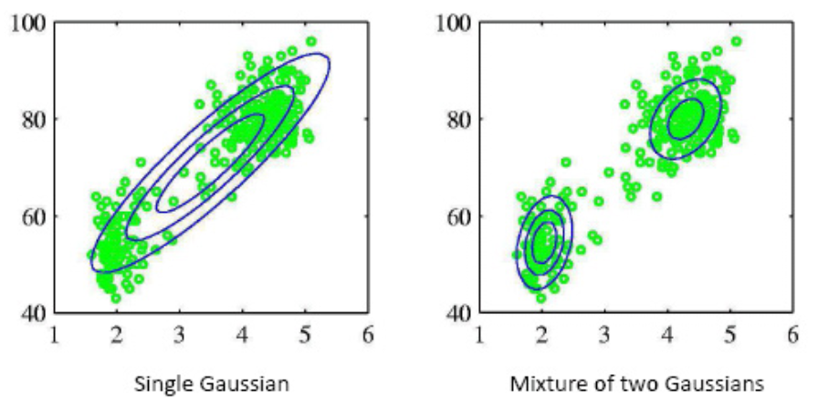
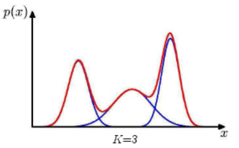
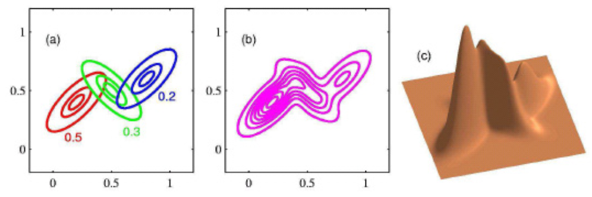
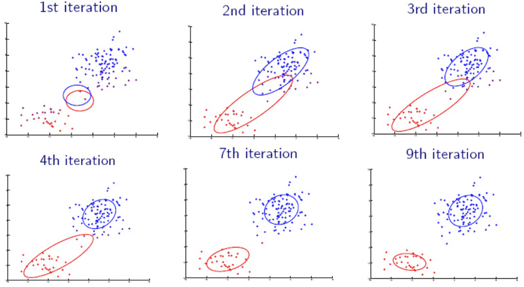

# Gaussian Mixtures

**Gaussian mixtures** are mixture models that represent the density of the data as a mixture of component densities.

:::{figure} gaumix-2d2k-comparison


Comparison of fitting with a single Gaussian and a mixture of two Gaussians.
:::


## Objective

We assume there are $K$ latent Gaussian components.

$$
p(\boldsymbol{x})=\sum_{k=1}^{K} \pi_{k} \underbrace{\mathcal{n}\left(\boldsymbol{x} \mid \boldsymbol{\mu}_{k}, \boldsymbol{\Sigma}_{k}\right)}_{\text {component }}
$$

where $\pi_k$ are mixing coefficients,

$$
\forall k: \pi_{k} \geqslant 0 \quad \sum_{k=1}^{K} \pi_{k}=1
$$

For instance, when $K=3$, and $\boldsymbol{x} \in \mathbb{R}$, then the mixture is like

:::{figure} gaumix-1d3k


A mixture of three univariate Gaussians
:::

For bivariate cases,

:::{figure} gaumix-2d3k


A mixture of three bivariate Gaussians
:::

Essentially any distribution can be approximated arbitrarily well by a large enough Gaussian mixture. But, maximum-likelihood estimation of parameters is not trivial.

## Estimation

Given a data set and $K$, the log probability is

$$
\ln p(\boldsymbol{X} \mid \boldsymbol{\pi} , \boldsymbol{\mu}, \boldsymbol{\Sigma}  )=\sum_{i=1}^{n} \ln \sum_{k=1}^{K} \pi_{k} \mathcal{n}\left(\boldsymbol{x}_{i} \mid \boldsymbol{\mu} _k, \boldsymbol{\Sigma} _k\right)
$$

When $K=1$, this becomes a single multivariate Gaussian problem which has a closed-form solution. But when $K\ge 2$, there is no closed-form solution $\boldsymbol{\pi}, \boldsymbol{\mu} _1, \boldsymbol{\mu} _2, \ldots, \boldsymbol{\mu} _k, \boldsymbol{\Sigma} _1, \boldsymbol{\Sigma} _2, \ldots \boldsymbol{\Sigma} _K$.

```{margin} What if $K$ is large?
Note that $K$ is large, then there will be overfitting problem. If $K=N$, then the likelihood is $\infty$.
```


### Introduce $z_{ik}$

For each observation $i$, we introduce a set of binary indicator variables $\boldsymbol{z}_i = z_{i 1}, \ldots, z_{i K}$ where $z_{ik}=1$ if $\boldsymbol{x}_i$ came from Gaussian component $k$ and $z_{ik}=0$ otherwise.


- If we know $\boldsymbol{z}_i$, then we can obtain the ML estimates of the Gaussian components just like in the single-Gaussian case:

    $$
    \begin{aligned}
    \hat{\boldsymbol{\mu}}_{k} &=\frac{1}{n_{k}} \sum_{i=1}^{n} z_{i k} \boldsymbol{x}_i  \\
    \widehat{\boldsymbol{\Sigma} }_{k} &=\frac{1}{n_{k}} \sum_{i=1}^{n} z_{i k}\left(\boldsymbol{x}_i -\hat{\boldsymbol{\mu}}_{k}\right)\left(\boldsymbol{x}_i -\hat{\boldsymbol{\mu}}_{k}\right)^{\top} \\
    \hat{\pi}_{k} &=\frac{n_{k}}{n}
    \end{aligned}
    $$


- If we known the parameters, then the posterior probability of the indicator variables is

    $$
    \gamma_{i k}=P\left(z_{i k}=1 \mid \boldsymbol{x}_{i}, {\boldsymbol{\mu}} , {\boldsymbol{\Sigma}} \right)=\frac{{\pi}_{k} p\left(\boldsymbol{x}_{i} \mid {\boldsymbol{\mu}} _{k}, {\boldsymbol{\Sigma}} _{k}\right)}{\sum_{l=1}^{K} {\pi}_{\ell} p\left(\boldsymbol{x}_{i} \mid {\boldsymbol{\mu}} _{\ell}, {\boldsymbol{\Sigma}} _{\ell}\right)}
    $$

    where $\gamma_{ik}$ is called the **responsibility** of the $k$-th component for $\boldsymbol{x}_i$. Note that $\sum_{k=1}^{K} \gamma_{i k}=1$

    Then we "pretend" that the $\gamma_{ik}$ are the indicator variables themselves, and compute $n_{k}=\sum_{i=1}^{n} \gamma_{i k}$ (may not be integer). We can then **re-estimate** the ML estiamtes by substituting $z_{ik}$ by $\gamma_{ik}$.

    $$
    \begin{aligned}
    \hat{\boldsymbol{\mu}}_{k} &=\frac{1}{\sum_{i=1}^{n} \gamma_{i k}} \sum_{i=1}^{n} \gamma_{i k} \boldsymbol{x}_{i} \\
    \hat{\boldsymbol{\Sigma}}_{k} &=\frac{1}{\sum_{i=1}^{n} \gamma_{i k}} \sum_{i=1}^{n} \gamma_{i k}\left(\boldsymbol{x}_{i}-\hat{\boldsymbol{\mu}}_{k}\right)\left(\boldsymbol{x}_{i}-\hat{\boldsymbol{\mu}}_{k}\right)^{\top} \\
    \hat{\pi}_{k} &=\frac{\sum_{i=1}^{n} \gamma_{i k}}{n}
    \end{aligned}
    $$

In reality, we know neither the parameters nor the indicators


### EM algorithm


By introducing $z_{ik}$, we would like to maximize the **complete data** likelihood

$$
p(\boldsymbol{X}, \boldsymbol{Z} \mid \boldsymbol{\pi}, \boldsymbol{\mu} , \boldsymbol{\Sigma} ) \propto \prod_{i=1}^{n} \prod_{k=1}^{K}\left(\boldsymbol{\pi}_{k} \mathcal{n}\left(\boldsymbol{x}_{i} \mid \boldsymbol{\mu}_{k}, \boldsymbol{\Sigma}_{k}\right)\right)^{z_{i k}}
$$

or its log

$$
\ln p(\boldsymbol{X}, \boldsymbol{Z} \mid \boldsymbol{\pi}, \boldsymbol{\mu} , \boldsymbol{\Sigma} )=\text { const }+\sum_{i=1}^{n} \sum_{k=1}^{K} z_{i k}\left(\ln \boldsymbol{\pi}_{k}+\ln \mathcal{n}\left(\boldsymbol{x}_{i} \mid \boldsymbol{\mu}_{k}, \boldsymbol{\Sigma}_{k}\right)\right)
$$

It can be shown that we are actually maximising its expectation w.r.t. $\boldsymbol{z}$


$$
\operatorname{E}_{z_{ik} \mid \boldsymbol{X}, \boldsymbol{\pi}, \boldsymbol{\mu} ,\boldsymbol{\Sigma}  } \left[  \ln p(\boldsymbol{X}, \boldsymbol{Z} \mid \boldsymbol{\pi}, \boldsymbol{\mu} , \boldsymbol{\Sigma} )  \right]
$$

Motivated from the above analysis, we can come up with the expectation-maximization algorithm.

Here comes the expectation-maximization (EM) algorithm

- Initialization: Guess $\boldsymbol{\pi}, \boldsymbol{\mu} , \boldsymbol{\Sigma}$

- Iterate:
  - E-step: Compute $\gamma_{ik}$ using current estimates of $\boldsymbol{\pi}, \boldsymbol{\mu} , \boldsymbol{\Sigma}$
  - M-step: Estimate new parameters $\boldsymbol{\pi}, \boldsymbol{\mu} , \boldsymbol{\Sigma}$, by maximizing the expected likelihood, given the current $\gamma_{ik}$

- Until log likelihood converges

:::{figure} gaumix-em-iterations


Iterations of EM algorithms [Livescue 2021]
:::


.
