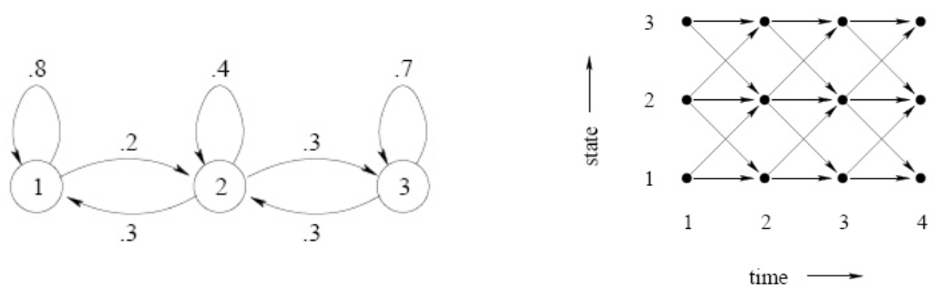
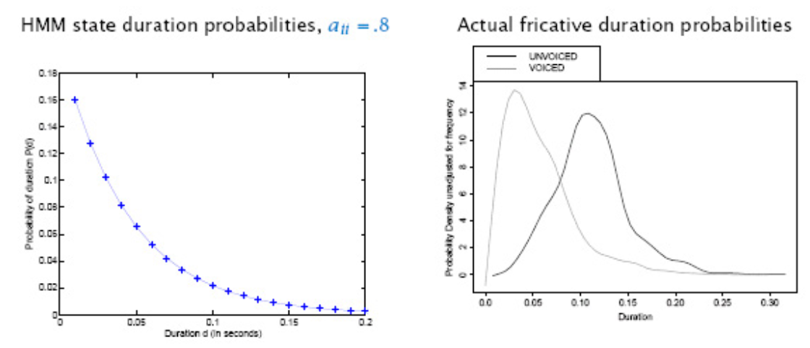
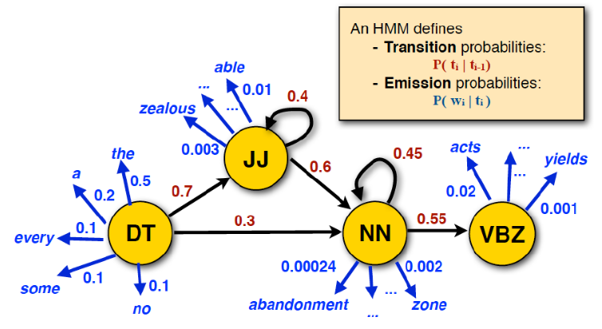

# Hidden Markov Models

A hidden Markov model has a two sequences: state $S_t$ and observation $O_t$. The hidden, unobservable states $S_t$ follow a Markov chain with transition probability $P(S_t \vert S_{t-1})$ and the observation follows a conditional distribution $P(X_t \vert S_t=s_t)$ parameterized by $s_t$.

$$\begin{aligned}
& S_1 &&\longrightarrow && S_2  &&\longrightarrow &&\ldots&& \longrightarrow && S_t  \\
&\downarrow&& &&\downarrow&& &&&& &&\downarrow \\
& X_1 &&&& X_2&& && \ldots && &&X_t \\
\end{aligned}$$

Given a sequence of observations $x_1, \ldots, x_t$, we want to solve

- What is the probability of this sequence $x_1, \ldots, x_t$? (the **scoring** problem)
- What is your best guess of the sequence of hidden states $s_1, \ldots, s_t$? (the **decoding** problem)
- Given a large number of observations, how could you learn a
model of the conditional distribution $P(X_t\vert S_t)$? (the **training** problem)

## Problems

Notations:

- $\boldsymbol{P}$: $n\times n$ state transition probability matrix, where $p_{ij} = P(S_{t+1} = j\vert S_t = i)$
- $\boldsymbol{\pi}  = (\pi_1, \ldots, \pi_n)$: initial state distribution, where $\pi_s = P(S_1 = s)$
- $e _s(x)$: emission distribution in state $i$. $e_{i}(x) = P(X_{t} = x\vert S_t = s)$. Note that $x$ can be a vector. For simplicity, we use unbold symbol.

The entire model parameters is $\boldsymbol{\theta} = \left\{ \boldsymbol{P} , \boldsymbol{e} ,\pi \right\}$

Given an observed sequence $\boldsymbol{x_T} = (x_1, x_2, \ldots, x_T)$, the problems are

- Scoring problem: Suppose we know $\boldsymbol{\theta}$, then how to compute the probability of this sequence of observation $P(\boldsymbol{x}_T \vert \boldsymbol{\theta} )$? This can be solved by forward or backward algorithm

- Decoding: What is the most probable underlying state sequence $\boldsymbol{s} = (s_1, \ldots, s_T)$? This can be solved by Viterbi algorithm

- Training (learning): How to estimate the parameters $\boldsymbol{\theta} = \left\{ \boldsymbol{P} , \boldsymbol{e} ,\pi \right\}$? Baum-Welch algorithm (EM applied to HMMs)

To better understand the algorithms above, we introduce two diagrams of state transition. The left graph encodes the transition matrix $\boldsymbol{P}$, and the right trellis shows state transition along time.

:::{figure} markov-transition

Markov transition illustration
:::

### Scoring

Given $\boldsymbol{x}$, to compute $p(\boldsymbol{x} \vert \boldsymbol{\theta} )$, on may attempt to enumerate all possible transitions $\boldsymbol{s}$

$$\begin{aligned}
p(\boldsymbol{x} \vert \boldsymbol{\theta})
&= \sum _ \boldsymbol{s} p( \boldsymbol{x} ,\boldsymbol{s} \vert \boldsymbol{\theta} ) \\
&= \sum _ \boldsymbol{s} p( \boldsymbol{x} \vert \boldsymbol{s} , \boldsymbol{\theta} )p(\boldsymbol{s} \vert  \boldsymbol{\theta} ) \\
&= \sum _ \boldsymbol{s} \left[ e_{s_1}(x_1)e_{s_2}(x_2)\ldots e_{s_T}(x_T) \right] \left[ \pi_{s_1} p_{s_1 s_2} \ldots p_{s_{T-1} s_T} \right]\\
\end{aligned}$$

Clearly, the computation is intractable, since the number of possible state sequences $\boldsymbol{s}$ is $n^T$.

#### Forward Algorithm

Forward algorithm is a dynamic programming algorithm to compute $p(\boldsymbol{x} \vert \boldsymbol{\theta})$.

Define a forward probability, for time $1\le t \le T$, state $1\le s \le n$,

$$
f_t(s) = \operatorname{P}  \left\{ \boldsymbol{x} _{[:t]} = (x_1, \ldots , x_t), S_t = s \vert \boldsymbol{\theta} \right\}
$$

which is the probability of emitting sequence $x_1, \ldots, x_t$ and eventually reaching the state $s$ at time $t$.

We now figure out the iterative relation. At time $t-1$, the sequence is $(x_1, \ldots , x_t)$, and reaches at some state $k$. To arrive $s$ at time $t$, the transition probability is $p_{ks}$. To emit $x_t$, the emission probability is $e_s(x_t)$. Hence, the total probability is $p_{ks} e_s(x_t)$. There are $n$ number of possible states $k$ at time $t-1$. Therefore, the iteration relation is

$$
f_t(s) = \sum_{k=1}^n f_{t-1}(k) p_{ks} e_s(x_t)
$$

Finally, to compute $p(\boldsymbol{x} \vert \boldsymbol{\theta} )$, we look at time $T$, and sum over all states,

$$
p(\boldsymbol{x} \vert \boldsymbol{\theta}) = \sum_ {s=1}^n f_T(s)
$$

In matrix form,

$$\begin{aligned}
\boldsymbol{f}_{t+1} &=  (\boldsymbol{P} ^\top \boldsymbol{f}_t) * \boldsymbol{e}(x_t) \\
p(\boldsymbol{x} \vert \boldsymbol{\theta} )&= \boldsymbol{1} _n ^\top \boldsymbol{f}_T \\
\end{aligned}$$

where $\boldsymbol{f}_t = [f_t(1), \ldots, f_t(n)]^\top , \boldsymbol{e} (x_t) = [e_1(x_t), \ldots, e_n(x_t)] ^\top$ and $*$ stands for element-wise dot product.

---

**Forward Algorithm**

---

Construct a DP table of size $n\times T$ to store $f_t(s)$. Fill the entries column by column from left to right.

- For $t=1$,
  - for $s = 1, \ldots, n$, compute $f_1(s) = \pi_s e_s (x_1)$

- For $t = 2,\ldots, T$,
  - for $s = 1, \ldots, n$, compute $f_t(s) = \sum_{k=1}^n f_{t-1}(k) p_{ks} e_s(x_t)$

- Return $p(\boldsymbol{x} \vert \boldsymbol{\theta}) = \sum_ {s=1}^n f_T(s)$

---

There are $n\times T$ entries, and each entry takes $O(n)$ to compute. So the total complexity is $O(n^2 T)$, much smaller than the brute force's $O(n^T)$.

#### Backward Algorithm

Backward algorithm is a dynamic programming algorithm to compute $p(\boldsymbol{x} \vert \boldsymbol{\theta})$.

Define a backward probability, for time $1\le t \le T-1$, state $1\le s \le n$,

$$
b_t(s) = \operatorname{P}  \left\{ \boldsymbol{x} _{[t+1:]} = (x_{t+1}, \ldots , x_T), S_t = s \vert \boldsymbol{\theta} \right\}
$$

which is the probability of emitting future sequence $x_{t+1}, \ldots, x_T$ and from current state $s$ at time $t$.

We now figure out the iterative relation. At time $t+1$, it reaches some state $k$, and emits $x_{t+1}$. To arrive $k$ at time $t+1$, the transition probability is $p_{sk}$. To emit $x_t$, the emission probability is $e_k(x_{t+1})$. Hence, the total probability is $p_{ks} e_k(x_{t+1})$. There are $n$ number of possible states $k$ at time $t+1$. Therefore, the iteration relation is

$$
b_t(s) = \sum_{k=1}^n p_{sk} e_k(x_{t+1}) b_{t+1}(k)
$$

Finally, to compute $p(\boldsymbol{x} \vert \boldsymbol{\theta} )$, we look at time $1$. The probability of starting from state $s$ is $\pi_s$, and the probability of emitting the first observation $x_1$ is $e_s(x_1)$. Then the probability of emitting the remaining observations $x_2, \ldots, x_T$ given we start from state $s$ is $b_1(s)$. Finally, we sum over all possible starting states $s$.

$$
p(\boldsymbol{x} \vert \boldsymbol{\theta}) = \sum_ {s=1}^n \pi_s e_{s}(x_1) b_1(s)
$$

In matrix form,

$$\begin{aligned}
\boldsymbol{b}_{t} &=  \boldsymbol{P} ( \boldsymbol{e}(x_t) * \boldsymbol{b}_{t+1}) \\
p(\boldsymbol{x} \vert \boldsymbol{\theta} )&=
\boldsymbol{\pi} ^\top  (\boldsymbol{e} (x_1) * \boldsymbol{b} _1) \\
\end{aligned}$$

where $\boldsymbol{b}_t = [b_t(1), \ldots, b_t(n)]^\top , \boldsymbol{e} (x_t) = [e_1(x_t), \ldots, e_n(x_t)] ^\top$ and $*$ stands for element-wise dot product.

---
**Backward Algorithm**

---

Construct a DP table of size $n \times (T-1)$ to store $b_t(s)$. Fill the entries column by column **from right to left**.

- For $t=T$,
  - for $s = 1, \ldots, n$, initialize $b_t(s) = 1$

- For $t = T-1, T-2, \ldots, 1$,
  - for $s = 1, \ldots, n$, compute $b_t(s) = \sum_{k=1}^n p_{sk} e_k(x_{t+1}) b_{t+1}(k)$

- Return $p(\boldsymbol{x} \vert \boldsymbol{\theta}) = \sum_ {s=1}^n \pi_s e_{s}(x_1) b_1(s)$

---

As in forward algorithm, the complexity is $O(n^2 T)$.

:::{admonition,note} Forward and Backward algorithms

- Either algorithm alone can be used to compute $p(\boldsymbol{x} \vert \boldsymbol{\theta})$, but both $f$ and $b$ will be necessary for solving the training problem.

- The name "forward" and "backward" refer to the order of filling the entries in the DP table. In forward algorithm, we fill the entries by increasing order of $t$, so we call it "forward". In backward algorithm, we fill the entries by decreasing order of $t$, so we call it "backward".

:::

### Decoding

Recall the problem: given an observation sequence $\boldsymbol{x}$, what is the most probable underlying state sequence $\boldsymbol{s} = (s_1, \ldots, s_T)$?

One attempt is to choose the individually most probable state by

$$s^*_t = \arg\max_s P(S_t = s \vert \boldsymbol{x} , \boldsymbol{\theta} )$$

where $P(S_t = s \vert \boldsymbol{x} , \boldsymbol{\theta} ) = \frac{f_t(s)b_t(s)}{p(\boldsymbol{x} \vert \boldsymbol{\theta} )}$, and return $\boldsymbol{s} ^* = (s^*_1, \ldots, s^*_T)$. This “individually most likely” criterion maximizes the expected number of correct states. But clearly it does not consider the dependence among sequence from time to time, and may give a sequence that is totally impossible.

We should consider the sequence jointly. The correct criterion should be

$$
\boldsymbol{s} ^* = \underset{\boldsymbol{s} }{\operatorname{argmax}}\, p(\boldsymbol{s} \vert \boldsymbol{x} , \boldsymbol{\theta} )
$$

Viterbi Algorithm can solve this problem.

#### Viterbi Algorithm

Define probability $v_t(s)$ as the probability of the most probable state path for the observation sequence $(x_1, x_2, \ldots, x_t)$ ending in state $s$ at time $t$.

$$
v_t(s) = \max _{s_1, \ldots, s_{t-1}} \operatorname{P} \left\{ \boldsymbol{x} _{[:t]} =  (x_1, x_2, \ldots, x_t), S_t = s \vert \boldsymbol{\theta} \right\}
$$

We now figure out the iterative relation. This is like a coin-collection problem in dynamic programming. At time $t$, we look back to check $v_{t-1}(k)$, which is the probability of the most probable path at time $t-1$. Then we consider the transition $p_{ks}$. Finally, to emit $x_t$, we need the emission probability $e_s(x_t)$. In sum, we find to find the maximum

$$
v_t(s) = e_s(x_t) \max _{1 \le k \le n } v_{t-1}(k) p_{ks}
$$

It's analogous to the reasoning in forward probability, but we take sum their and take maximum here.

---
**Viterbi Algorithm**

---

Construct a DP table of size $n\times T$ to store $v_t(s)$. Fill the entries column by column from left to right.

- For $t=1$,
  - for $s = 1, \ldots, n$, compute $v_1(s) = \pi_s e_s(x_1)$ (which is $f_1(s)$)

- For $t = 2,\ldots, T$,
  - for $s = 1, \ldots, n$, compute $v_t(s) = e_s(x_t) \max _{1 \le k \le n } v_{t-1}(k) p_{ks}$

---

As in forward algorithm, complexity is $n^2 T$.

### Training

Given an observation sequence $\boldsymbol{x} _t$, we to find parameters $\boldsymbol{\theta} = \left\{ \boldsymbol{P}, \boldsymbol{e} , \boldsymbol{\pi}   \right\}$ that maximize the probability of the observations

$$
\boldsymbol{\theta} ^* = \underset{\boldsymbol{\theta} }{\operatorname{argmax}} \, p(\boldsymbol{x} \vert \boldsymbol{\theta} )
$$

#### Counting

If the state sequence is given, then maximum likelihood for $p_{ij}$ and $e_s(x)$ is easy by counting.

$$\begin{aligned}
c(i,j) &= \text{number of $(i\rightarrow j)$ transitions}  & p(i,j) &= \frac{c(i,j)}{\sum _k c(i,k)}\\
n_s(x) &= \text{number of $x$ emitted from state $s$}  & e_s(x) &= \frac{n_s(x)}{\sum _y n_s(y)}\\
\end{aligned}$$

Note that state $i$ may not appear in any of the training sequences, resulting into undefined estimation equations (divide by zero). To solve this, we add pseudocounts to $c(i,j)$ and $n_s(x)$, which reflect our prior biases about the probability values, which is in fact corresponding to the setting of a Dirichlet prior distribution.

$$\begin{aligned}
\tilde{c}(i,j) &= c(i,j) + r(i,j)  \\
\tilde{n}_s(x) &= n_s(x)  + r_s(x)
\end{aligned}$$

#### Baum-Welch algorithm

Usually the states are not given, so we provide initial guess, and iteratively update $\boldsymbol{\theta}$. Similar like Gaussian Mixture, we use an EM algorithm, and Baum-Welch algorithm does so.

Consider a transition probability $p_t (i,j)$ **defined** at time $t$. It can be found as

$$
p_t(i,j):= \operatorname{P} \left\{ S_t = i, S_{t+1}=j \vert \boldsymbol{x} _t, \boldsymbol{\theta} \right\} = \frac{f_t(i) \cdot p_{ij}  \cdot e_j (x_{t+1}) \cdot b_{t+1}(j)}{p(\boldsymbol{x} _t \vert \boldsymbol{\theta} )}
$$

Define a $p_t(i)$ as the probability in state $i$ at time $t$. It can be found as

$$
p_t(i) := \operatorname{P} \left\{ S_t = i \vert \boldsymbol{x} _t, \boldsymbol{\theta}  \right\}  = \frac{f_t(s)b_t(s)}{p(\boldsymbol{x} \vert \boldsymbol{\theta} )} = \sum _{j=1}^n p_t(i,j)
$$

Given **multiple** sequences of length $T: \boldsymbol{x} _T = (x_1, \ldots, x_T)$, if we know $\boldsymbol{\theta}$, then we can compute $p_t(i,j)$ and $p_t(i)$. Hence we can compute the following expectations.

- the expected count of appearance of state $i$, denoted as $c(i)$, is

  $$\operatorname{E} \left[ c(i) \right] = \sum _{t=1} ^T \mathbb{I} \left\{ S_t = i \right\} = \sum _{t=1} ^T p_t(i)$$

- the expected count of transitions from $i$ to $j$ is

  $$\operatorname{E} \left[ c(i,j) \right] = \sum _{t=1} ^T \mathbb{I} \left\{ S_t = i, S_t = j \right\} = \sum _{t=1} ^T p_t(i,j)$$

- the expected number of emission of $x$ from state $i$

  $$\operatorname{E} \left[ n_i (x) \right] = \sum _{t=1} ^T \mathbb{I} \left\{ S_t = i, X_t = x \right\} = \sum _{t=1} ^T p_t(i) \ \mathbb{I} \left\{ X_t = x \right\} $$

Then we can use these expectations to re-estimate the parameters.

$$\begin{aligned}
\hat{p}_{ij}&= \frac{\operatorname{E} \left[ c(i) \right] }{ \operatorname{E} \left[ c(i,j) \right] } \\
\hat{e}_i(x)&= \frac{\operatorname{E} \left[ n_i(x) \right] }{\operatorname{E} \left[ c(i) \right]} \\
\hat{\pi}_i&= p_1(i)\\
\end{aligned}$$

So we obtain new estimate $\hat{\boldsymbol{\theta} }$.

It can be shown that $p(\boldsymbol{x} _t \vert \hat{\boldsymbol{\theta} }) \ge p(\boldsymbol{x} _t \vert \boldsymbol{\theta} )$, i.e. the likelihood is increased after re-estimation. Therefore, we can iterate the re-estimation formulas until some convergence threshold is reached. This algorithm is guaranteed to find a local maximum of the likelihood, but not a global one

## Properties

An HMM is a model of the joint distribution of observation sequence $\boldsymbol{x} _T$ and state sequence $\boldsymbol{s}_T$.

$$\begin{aligned}
p(\boldsymbol{x} _T, \boldsymbol{s} _T)
&= p(s_1) p(x_1 \vert s_1) \prod _{t=2}^T p(s_t \vert s_{t-1}) p(x_t \vert s_t) \\
&= \pi_{s_1} e_{s_1}(x_1) \prod _{t=2}^T p_{s_{t-1} s_t} e_{s_t}(x_t) \\
\end{aligned}$$

We can deduce many properties of HMM. We should note whether the data we want to model with satisfy these properties.

### Independence

Given the state at time $t$,

- the observation at time $t$ is independent of the states and other observations at other time

  $$x_t \perp \left\{ \boldsymbol{x} _{-t}, \boldsymbol{s} _{-t} \right\} \mid s_t$$

- the future is independent of the past.

  $$\left\{ \boldsymbol{x} _{[:t-1]}, \boldsymbol{s} _{[:t-1]} \right\} \perp \left\{ \boldsymbol{x} _{[t+1:]}, \boldsymbol{s} _{t+1:} \right\}  \mid s_t$$

Question: do natural languages satisfy these properties?

### State Duration Distribution

The probability of staying in state $i$ for $d$ consecutive time steps and leave is $p_{ii}^{d-1} \times (1-p_{ii})$, which is a geometric distribution with monotonically decreasing density. In contrast, in real-life data, durations of “states” we want to to model often look nothing like that – example of phoneme durations.

:::{figure} hmm-state-duration

State Duration Modeling
:::

Possible solutions:

- Replace transition probabilities with explicit duration distributions [Ostendorf ’96]
  - Most general approach
  - Breaks dynamic programming algorithms

- Replace single state with multiple tied states with identical observation distribution, and some desired transition structure
  - Simplest option: Set a minimum duration
  - Can simulate other duration distributions with alternative
transition structures

## Applications

HMM can be applied to anything that has "state" and "sequence" attributes.

**Automatic speech recognition**

- One HMM per word or phoneme
- Time index corresponds to a 10ms “frame”
- Observation is a vector of spectral (frequency) measurements
- Can think of HMM state as corresponding to a state of the speaker’s vocal tract

**Unsupervised speech unit (Word/Phoneme) Discovery**

- Learn an HMM to model a collection of unlabelled speech
- Group together frequently occurring sequences of states to define units

**Activity recognition in video or biometrics**

- States corresponds to pose
- As in speech recognition, the “activity” can be labeled or unlabeled

**Speech Tagging**

:::{figure} hmm-speech-tagging

HMM in part-of-speech tagging [Julia Hockenmeyer]
:::
