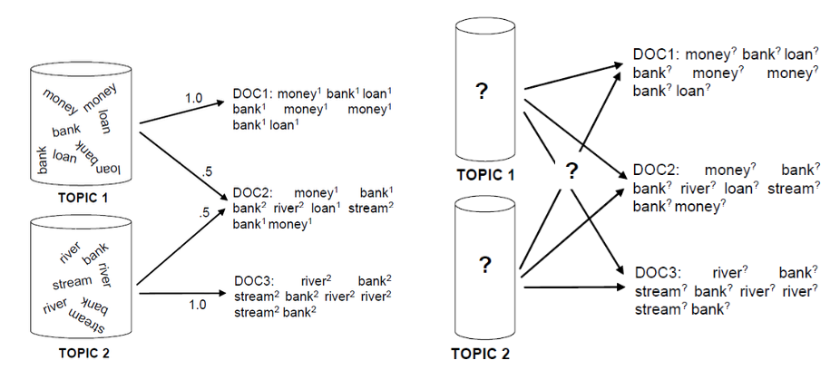
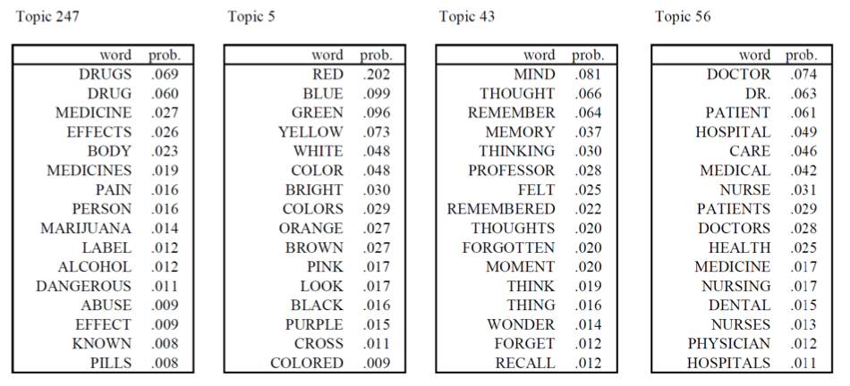

# Topic Models

Topic models are generative “mixture” models for documents.

The data we have in hand are $D$ documents. Each document $d$ has $n_d$ words. Topic model assumes that there is a topic $t_d$ for each document, which is latent, unobservable.

## Generative Process

Now we generate the $D$ documents.

**Assumptions**

For a document $d$,

- Its topics $t_d$ is unknown. Suppose there are $k_t$ kinds of possible topics, then $t_d$ can be drawn from a multinomial distribution parameterized by $\boldsymbol{\alpha} \in \mathbb{R} ^{k_t}$.

    $$t_d \sim \operatorname{Multinomial}(\boldsymbol{\alpha}) $$

- The words $w_1, \ldots, w_{n_d}$ are i.i.d. drawn from multinomial distribution of $k_w$ kinds of words, parameterized by $\boldsymbol{\beta} \in \mathbb{R} ^{k_w}$. The words distribution can be determined by the document topic $t_d$, i.e. $\boldsymbol{\beta} _{t_d}$, hence

    $$w \sim \operatorname{Multinomial}(\boldsymbol{\beta}_{t_d})$$

- We can impose prior distributions on $\boldsymbol{\beta}$ and $\boldsymbol{\alpha}$, which are Dirichlet distributions, parameterized by $\boldsymbol{\eta}$ and $\boldsymbol{\theta}$ respectively.

    $$\begin{aligned}
    \boldsymbol{\beta} &\sim \operatorname{Dirichlet}(\boldsymbol{\eta} ) \\ \boldsymbol{\alpha} &\sim \operatorname{Dirichlet}(\boldsymbol{\theta} )
    \end{aligned}$$

Hence, to generate $D$ documents, each with $\sum_{d=1}^D n_d$ number of random words, the steps are

- For each document $d=1, \ldots, D$
  - Draw a topic vector $\boldsymbol{\alpha} \sim \operatorname{Dirichlet}(\boldsymbol{\theta})$
  - Draw $k_t$ vectors $\boldsymbol{\beta}, \ldots, \boldsymbol{\beta}_{k_t} \sim \operatorname{Dirichlet}(\boldsymbol{\eta})$
  - Generate words: for $1, \ldots, n_d$
    - Draw a topic $t\sim \operatorname{Multinomial}(\boldsymbol{\alpha} )$
    - Draw a word $w\sim \operatorname{Multinomial}(\boldsymbol{\beta}_{t})$

:::{figure} topic-illustration

Topic model (generation vs estimation)
:::

## Estimation

In a document of words $w_1, \ldots, w_{n_d}$, we want to estimate the underlying word distribution $\boldsymbol{\beta} = \left[ \beta_1, \ldots, \beta_{k_w} \right]$. A simple approach is to use maximum likelihood

$$\widehat{\boldsymbol{\beta}}=\underset{\boldsymbol{\beta}}{\operatorname{argmax}} p\left(w_{1}, \ldots, w_{n_d} ; \boldsymbol{\beta}\right)$$

For some word labeled $m$, this is

$$
\widehat{\beta}_m = \frac{\#\left(w_{i}= m\right)}{N}
$$

Other variables include $t$'s, $\boldsymbol{\alpha}$'s, which can be estimated by  Expectation Maximization (EM) algorithm and sampling-based methods (MCMC and Gibbs sampling)

The learned results are like

:::{figure} topic-beta-by-t

Learned words distribution parameters $\boldsymbol{\beta} _t$ by topics [Steyvers & Griffiths, 2007]

:::

## Hidden Topic Markov Models

Recall that in topic models, we do not consider the dependency of topics between a sequence of words.

Hidden topic Markov model improve this. It view the topic behind a word as a hidden state. Let $\epsilon$ be the probability of ending sentence and drawing a new topic. Clearly, as $\epsilon$ increases, we switch topic mode frequently, and the number of topics should increases.

:::{figure} htmm-epsilon

How $\epsilon$ affect number of topics in a sentence.
:::

HTMM can decrease perplexity too.

:::{figure} htmm-perplexity

HTMM decreases perplexity as number of topics increases
:::

Example
: Consider two paragraphs. If we use topic mixture model (smoother LDA), the topics seems random. For the word "support", all appearances are all from the same topic.

  :::{figure} topic-model-results
  

  Topic mixture model (smoothed LDA) results, colors are topic labels [Livescu 2021]
  :::

: Using HTMM, the results are much better. It distinguish "support" from support vector and support in research.

  :::{figure} htmm-results
  

  HTMM results, colors are topic labels [Livescu 2021]
  :::
