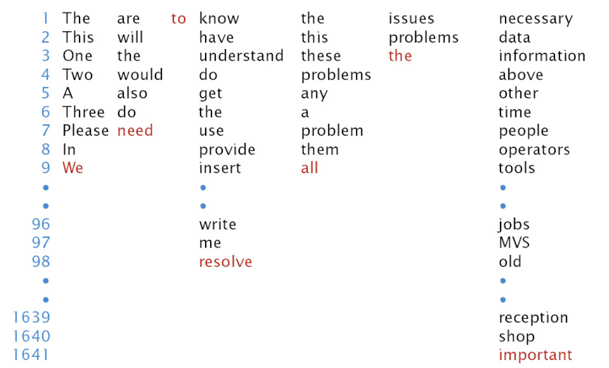
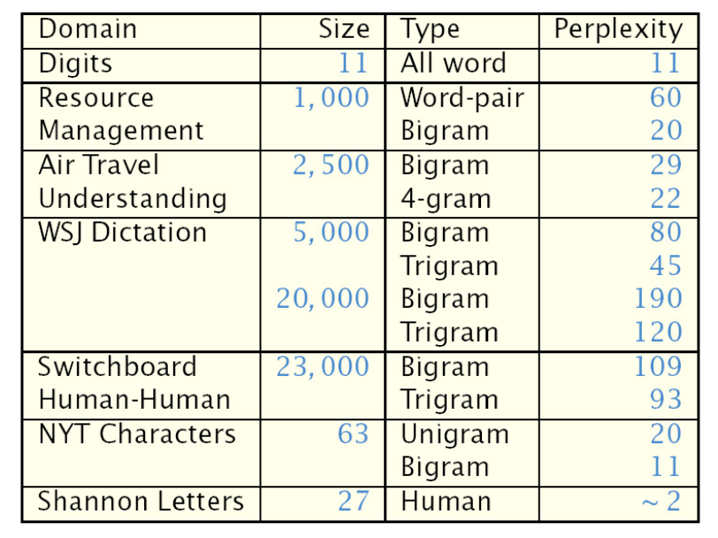

# Language Models

Language models aim to model the joint distribution over words $p(\boldsymbol{w})$, where $\boldsymbol{w}$ is a word sequence $\boldsymbol{w} = \left\{ w_1, \ldots, w_k \right\}$.

$$\begin{aligned}
p( \text{"And nothing but the truth"} )&=.0023  \\
p( \text{"And nuts sing on the roof"} ) &\approx 0 \\
p(\text{"I t is easy to recognize speech"}  ) &=.0001  \\
p( \text{"It is easy to wreck a nice beach"}  ) &=.00000001
\end{aligned}$$

## Objective

### Factorization

Recall that factorization helps to reduce the number of parameters. By the chain rule, we have

$$
p(\boldsymbol{w})=\prod_{i=1}^{K} p\left(w_{i} \mid w_{1}, \ldots, w_{i-1}\right)=\prod_{i=1}^{K} p(w_i \vert \boldsymbol{h} _i)
$$

where $\boldsymbol{h} _{i}=\left\{w_{1}, \ldots, w_{i-1}\right\}$ is the **history** for word $w_i$.

Note:

- First & last words typically assumed to be a sentence boundary marker/token, $w_1 = w_k = \texttt{<>}$.

- Too many possible histories, so we want to reduce to equivalence classes $\phi(\boldsymbol{h} _i)$, such that $p(w_i|h_i) ≈ p(w_i|\phi(\boldsymbol{h} _i))$

- Good equivalence classes maximize the information about the current
word given the class $\psi(\boldsymbol{h} _i)$.

### $n$-gram Models

In $n$-gram language models,  the history equivalence class is the previous $n-1$ words $\phi\left(\boldsymbol{h}_{i}\right)=\left\{w_{i-1}, \ldots, w_{i-(n-1)}\right\}$.

For example
- bigram LM $p(w_i|w_{i−1})$
- trigram LM $p(w_i|w_{i−1},w_{i−2})$

2-4 grams are most common in practical applications.

Consider the following sentence: $\boldsymbol{w} =$ "The quick brown fox jumped over
the lazy dog."

$$
\begin{aligned}
p\left(w_{1}, \ldots, w_{n}\right) =\
& p(\text {the} \mid<>) \\
& p(\text {quick} \mid \text {the},<>) \\
& p(\text {brown} \mid \text {quick, the})\\
& \cdots\\
& p(\text {dog} \mid \text {lazy, the}) \\
& p(<>\mid \text {dog, lazy})
\end{aligned}
$$

## Estimation

Maximum-likelihood estimate of n-gram probabilities given some training set of text:


$$
\hat{p}(\text { quick } \mid<>, \text { the })=\frac{\text { count }(<>, \text { the, quick })}{\operatorname{count}(<>, \text { the })}
$$

Using ML, the model is good to predict functional words (e.g. "the", "to"), not content word (nouns, verbs, adjectives). below example shows where the correct word is in the decreasing probability list.

:::{figure} lang-pred-list


Trigram Prediction [Jelink 1997]
:::

## Evaluation

- Qualitatively (How good do random sentences generated from the LM look?)

- Evaluate via the task loss/performance measure

Other quantitative intrinsic measure include cross-entropy and perplexity.

### Cross-entropy

The (empirical) cross-entropy of a model distribution $\hat{p}(x)$ with respect to some data $\boldsymbol{w}=\left\{x_{1}, \ldots, x_{n}\right\}$ is

$$
H_{\hat{p}}(\boldsymbol{x})=-\frac{1}{n} \log _{2} \hat{p}(\boldsymbol{x})
$$

```{margin}
Intuition: This is the number of bits per word needed to encode this data set using the model.
```

For an $n$-gram LM, to evaluate $\hat{p}(\cdot)$ on a test set $\boldsymbol{w}=\left\{w_{1}, \ldots, w_{n}\right\}$.

$$
\begin{aligned}
H_{\hat{p}}(\boldsymbol{w}) &=-\frac{1}{n} \log _{2} \hat{p}(\boldsymbol{w}) \\
&=-\frac{1}{n} \log _{2} \prod_{i=1}^{n} \hat{p}\left(w_{i} \mid \phi\left(\boldsymbol{h}_{i}\right)\right) \\
&=-\frac{1}{n} \sum_{i=1}^{n} \log _{2} \hat{p}\left(w_{i} \mid \phi\left(\boldsymbol{h}_{i}\right)\right)
\end{aligned}
$$


### Perplexity

Recall the perplexity of a distribution $P(X)$ is $2^{H_{p}(X)}$.

Here, we consider the empirical perplexity of a model of a distribution w.r.t. a data set


$$
P P_{\hat{p}}(\boldsymbol{w})=2^{H_{\hat{p}}(\boldsymbol{w})}
$$

**Interpretation**: Perplexity is the average number of words possible after a given history (the average branching factor of the LM).

Usually, as $n$ increases in $n$-gram models, perplexity goes down, as we are more certain in the conditional distribution $p(w_i\vert \phi(\boldsymbol{h_i} ))$

:::{figure} lang-perplexity


Perplexity on different domains
:::

## Improvement

### Sparse Data Problem

A vocabulary of size $V$ has $V^n$ possible $n$-grams $w_i \vert w_{i-(n-1)}, \ldots, w_{i-1}$. Most of $n$-grams are rare. In a training set, it's unlikely that we will see all of them. As a result, maximum-likelihood just assign 0 probability.

To alleviate this, we use **smoothing**: A set of techniques for re-distributing probability mass from frequently seen to unseen/rare events.

- Increase probability of unseen/rare $n$-grams

- therefore, decrease probability of frequently seen $n$-grams

**Experimental findings**: Church and Gale (1992) split a 44 million word data set into two halves. For a bigram that occurs, e.g., 5 times in the first half, how many times does it occur in the second half?

- Maximum-likelihood prediction: 5
- Actual: ∼ 4.2 < 5

This is because both halves are samples, not identical. There must be some bigrams in 2nd half that are unseen in 1st half, which take up some counts, such that $5$ is diluted.

There are several improvements to solve this problem.

### Laplace (add-one) Smoothing

Simplest idea: Add count of 1 to each event (seen or unseen)

- Unigram

  - Unsmoothed: $p(w_i) = \frac{C(w_i)}{N}$, where $N$ is the total number of training word tokens and $C(\dot)$ is the count.

  - Smoothed: $p(w_i) = \frac{C(w_i)+1}{N+V}$, where $V$ is the vocabulary size

- Bigram

  - Unsmoothed: $p\left(w_{i} \mid w_{i-1}\right)=\frac{C\left(w_{i-1} w_{i}\right)}{C\left(w_{i-1}\right)}$

  - Smoothed: $p\left(w_{i} \mid w_{i-1}\right)=\frac{C\left(w_{i-1} w_{i}\right)+1}{C\left(w_{i-1}\right)+V}$

A simple extension is “delta smoothing”: Add some value $\delta$ instead of $1$

### Back-off n-grams

Idea: reduce $n$, so the total number of probabilities to be estimated, which is $V^n$, decreases.

- Use maximum likelihood estimate if we have enough examples; otherwise, back off to a lower-order model:

  $$
  p_{b o}\left(w_{i} \mid w_{i-1}\right) \left\{\begin{array}{ll}
  p_{\boldsymbol{ML}}\left(w_{i} \mid w_{i-1}\right), & \text { if } C\left(w_{i-1} w_{i}\right) \geq C_{\min } \\
  \alpha_{w_{i-1}} p\left(w_{i}\right), & \text { otherwise }
  \end{array}\right.
  $$

  where $\alpha_{w_{i-1}}$ is chosen such that the probability sum to 1

- Or, interpolate between higher-order and lower-order $n$-gram probabilities

  $$
  p_{b o}\left(w_{i} \mid w_{i-1}\right) = \lambda p_{\boldsymbol{ML}}\left(w_{i} \mid w_{i-1}\right)+ (1-\lambda) p\left(w_{i}\right)
  $$
