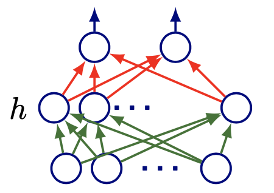
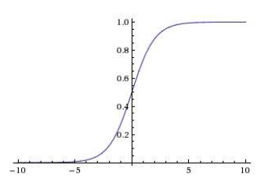
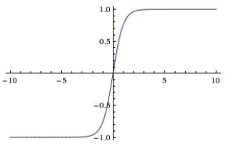
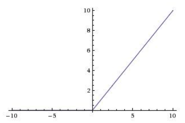
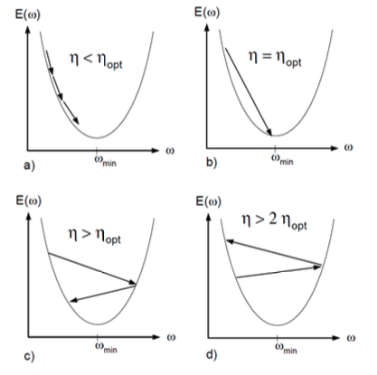
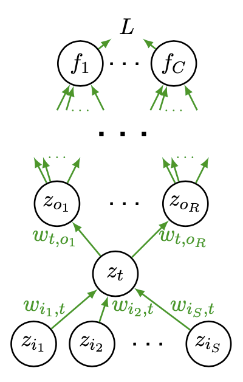

# Neural Networks

In this section we introduce neural networks and its application for regression, classification, dimensionality-reduction, generation, etc.


## Structure

### Versus Machine Learning: Linear vs Hierarchical

Most machine learning relies almost entirely on *linear* predictors, where predictors can be *non-linear* features $\boldsymbol{\phi} : \mathcal{X} \rightarrow \mathbb{R}^{d}$ of the data.

$$
f_{y}(\boldsymbol{x} ; \boldsymbol{w}, b)=\boldsymbol{w}_{y} \cdot \boldsymbol{\phi} (\boldsymbol{x})+b_{y}
$$

Most machine learning are **shallow learning**: hand-crafted, non-hierarchical $\boldsymbol{\phi}$.

Basic example:
- polynomial regression: $\phi_{j}(x)=x^{j}, j=0, \ldots, d$
- Kernel SVM: employing kernel $k$ corresponds to (some) feature space such that $k\left(\boldsymbol{x}_{i}, \boldsymbol{x}_{j}\right)=\phi\left(\boldsymbol{x}_{i}\right) \cdot \phi\left(\boldsymbol{x}_{j}\right)$. SVM is just a linear classifier in that space.

```{margin}
The hierarchy structure is the reason why it is called "deep".
```

In contrast, in **deep** learning, a predictor that uses a **hierarchy** of features of the input, typically (but not always) learned end-to-end jointly with the predictor.

$$
f_{y}(\boldsymbol{x})=F_{L}\left(F_{L-1}\left(F_{L-2}\left(\cdots F_{1}(\boldsymbol{x}) \cdots\right)\right)\right)
$$

### A 2-layer Neural Network

The simplest case is a 2-layer neural network, which can be represented by

$$
f_{y}(\boldsymbol{x})=\sum_{j=1}^{m} w_{j, y}^{(2)} h\left(\sum_{i=1}^{d} w_{i, j}^{(1)} x_{i}+b_{j}^{(1)}\right)+b_{y}^{(2)}
$$

In matrix form,

$$
\boldsymbol{f}(\boldsymbol{x})=\boldsymbol{W}_{2} \cdot \boldsymbol{h} \left(\boldsymbol{W}_{1} \cdot \boldsymbol{x}+\boldsymbol{b}_{1}\right)+\boldsymbol{b}_{2}
$$

where $h$ is a non-linear activation function, and is applied elementwise; $\boldsymbol{x} \in \mathbb{R}^{d}, \boldsymbol{W}_{1} \in \mathbb{R}^{m \times d}, \boldsymbol{W}_{2} \in \mathbb{R}^{C \times m}, \boldsymbol{b}_{2} \in \mathbb{R}^{C}, \boldsymbol{b}_{1} \in \mathbb{R}^{m}$.

:::{figure} nn-two-layer


A 2-layer feedforward neural network
:::

### Softmax Layer

There are many other layers, e.g., the softmax layer, convolutional layer, residual connection etc. Here we introduce the softmax layer which is used for classification.

```{margin}
Usually the last several layers in a neural network for classification are in this form. The vector $\boldsymbol{x}$ can be the output vector from some previous layer in that neural network.
```

A softmax classifier computes probability of each class $c$ for an given input, and pass it to the loss node to compute loss. Suppose $\boldsymbol{x}$ is an input, then

$$
\begin{aligned}
\boldsymbol{f}(\boldsymbol{x}) &=\boldsymbol{W}_{2} \cdot \boldsymbol{h} \left(\boldsymbol{W}_{1} \cdot \boldsymbol{x}+\boldsymbol{b}_{1}\right)+\boldsymbol{b}_{2} \\
\hat{p}(y=c \mid \boldsymbol{x}) &=\exp \left(f_{c}(\boldsymbol{x})\right) / \sum_{j} \exp \left(f_{j}(\boldsymbol{x})\right)
\end{aligned}
$$

Then we use the estimated probability of the true label $y$ computed by the current model, denoted $\hat{p}(y \mid \boldsymbol{x})$, to obtain the negative log-loss:

$$
L(\boldsymbol{x}, y)=-\log \hat{p}(y \mid \boldsymbol{x})=-f_{y}(\boldsymbol{x})+\log \sum_c \exp \left(f_{c}(\boldsymbol{x})\right)
$$


### Activation Functions

There are several kinds of activation functions we can choose to build a neural network. Their advantages and weakness are discussed in [trainability](03-trainability) section.

#### Sigmoid and tanh

The sigmoid function is

$$
h(a)=\frac{1}{1+\exp (a)}
$$

:::{figure} nn-sigmoid-plot


Plot of sigmoid function
:::

The tanh function is

$$
h(a)=\tanh (a)
$$

:::{figure} nn-tanh-plot


Plot of tanh function
:::

The two functions are

- Good: squash activations to a fixed range

- Bad: gradient is nearly zero far away from midpoint $0$,

    $$
    \frac{\partial L}{\partial a}=\frac{\partial L}{\partial h(a)} \frac{d h}{d a} \approx 0
    $$

    so they can make learning sensitive to initialization, and very, very slow.

#### RELU

ReLU solves the problems of saturating gradient by making the non-linearity non-saturating, at least in part of the range. It greatly speeds up convergence compared to sigmoid (order of magnitude), and used as the “default” nonlinearity in recent work.

$$
h(a)=\max (0, a)
$$

:::{figure} nn-relu-plot


Plot of ReLU function
:::


### Advantage of Deep Architecture

Theorem (Neural networks approximation, Cybenko 1989)
: 2-layer net with linear output (sigmoid hidden units) can approximate any continuous function over compact domain to arbitrary accuracy (given enough hidden units).

In general, $>2$ layers can represent a given function more compactly.


Example (Advantage of deep architecture)
: Compute the parity of $n$-bit numbers, with AND, OR, NOT, XOR gates. Trivial shallow architecture: express parity as DNF or CNF. They are shallow functions, and need exponential number of gates. On the other hand, use deep architecture just use a tree of XOR gates.


## Learning


For the discussion below, we are assuming feedforward, fully-connected networks. There are other options: convolutional networks, recurrent networks, transformers


### Gradient Descent

The general form of gradient descent is

- Iteration counter $t=0$

- Initialize parameters $\Theta^{(t)}$  (to zero or a small random vector)

- for $t = 0, 1, \ldots$

  - run forward propagation with $\Theta^{(t-1)}$ to compute the loss

    $$
    \mathcal{L}\left(\boldsymbol{X} , \boldsymbol{y}; \Theta^{(t-1)}\right)
    $$

  - compute gradient via chain rule

    $$
    \boldsymbol{g}^{(t)}(\boldsymbol{X}, \boldsymbol{y})=\nabla_{\Theta} \mathcal{L}\left(\boldsymbol{X} , \boldsymbol{y}; \Theta^{(t-1)}\right)
    $$

  - update the model parameters

    $$
    \Theta^{(t)}=\Theta^{(t-1)}-\eta \boldsymbol{g}^{(t)}
    $$

  - check for stopping criteria (convergence of loss / gradient, model performance, etc)

The learning rate $\eta$ controls the step size. The effect of different learning rates are shown in the below picture. There are many algorithm that optimizes the training process by modifying $\eta$ and $\boldsymbol{g} ^{(t)}$, e.g., AdaGrad, RMSProp, Adam. For more details on gradient descent, see [here](01-stochastic-gradient-descent).

:::{figure} nn-lr-comparison


Comparison of different learning rate [Lecun et al 1996]
:::


### Backward propagation

How the gradient $\boldsymbol{g}$ is computed in each iteration?

Definition (Backward propagation)
: Aka backpropagation, refers to efficient computation of gradients with respect to all parameters via chain rule of differentiation.

Example (Computation of Backpropagation)
: In the neural network below, the node $z_t$ receives values from input nodes $z_{i_s}$ where $j=1, \ldots, S$ and feed its value to outpue nodes $z_{o_r}$ where $r=1, \ldots, R$.

  :::{figure} nn-backpropagation
  

  Backpropagation [Shi 2021]
  :::

  Then computation in node $z_t$ is

  $$
  \begin{aligned}
  a_{t} &= \left( \sum_{s = 1, \ldots, S} w_{i_s, t} z_{i_s} \right) + b_{t}\\
  z_{t} &=h\left(a_{t}\right)
  \end{aligned}
  $$

  Then by the chain rule, the loss gradient w.r.t. $w_{i_s, t}$ is computed as

  $$
  \frac{\partial L}{\partial w_{i_s, t}}=\frac{\partial L}{\partial a_{t}} \frac{\partial a_{t}}{\partial w_{i_s, t}}
  $$

  where $\frac{\partial L}{\partial a_{t}}$ can be computed recursively by

  $$
  \frac{\partial L}{\partial a_{t}}=\sum_{r=1}^{R} \frac{\partial L}{\partial a_{o_{r}}} w_{t, o_{r}} h^{\prime}\left(a_{t}\right)
  $$


:::{admonition,dropdown,note} How gradients are computed in a computer procedure

Usually a node object has two attributes: value and gradient. They are stored in `node.value` and `node.grad` respectively.

For instance, if we have three nodes $x,y,z$ with relation

$$\begin{aligned}
y &= x^2 \\
z &= 3y + 4x\\
\end{aligned}$$

and computational graph

$$
x \quad \longrightarrow \quad z
$$

$$
\searrow \qquad \nearrow
$$

$$
y
$$

Given $z\texttt{.grad}$, then a backpropagation procedure computes the gradient of $y$ and $x$ by

$$\begin{aligned}
\text{initialize}\quad y\texttt{.grad} &= 0 \\
y\texttt{.grad} &= 0 \\
\text{update}\quad y\texttt{.grad} &\mathrel{+}= 3 \times z\texttt{.grad} \\
x\texttt{.grad} &\mathrel{+}= 4 \times z\texttt{.grad}\\
x\texttt{.grad} &\mathrel{+}= y\texttt{.grad} \times 2 \times x\texttt{.value}\\
\end{aligned}$$

:::


## Einstein Notation

In many neural networks models, we will use Einstein notation, since it

- Improves tensor equations for tensors with many indices

- Explicitly writing all indices of tensors where repeated indices in a product of tensors are implicitly summed.

- Not being correspondence with framework notation. Most frameworks hide indices.

**Examples**

- Slicing:

  – $\boldsymbol{M}[i,j]$ : one element

  – $\boldsymbol{M}[i,J]$: the $i$-th row of $\boldsymbol{M}$

  – $\boldsymbol{M}[I,j]$: the $j$-th column of $\boldsymbol{M}$

  – $\boldsymbol{M}[I,J]$: the full matrix $\boldsymbol{M}$

- Product of tensors:

    Repeated capital letters denote summation over those letters

    - For $\boldsymbol{y}=\boldsymbol{W}\boldsymbol{x}$

        $$
        \begin{aligned}
        \boldsymbol{y}[i]
        &=\sum_{j}\boldsymbol{W}[i,j]\boldsymbol{x}[j]\\
        & =\boldsymbol{W}[i,J]\boldsymbol{x}[J]
        \end{aligned}
        $$

    - For $\boldsymbol{y}=\boldsymbol{x}^{\top}\boldsymbol{W}$,

        $$
        \begin{aligned}
        \boldsymbol{y}[j]
        &=\sum_{i}\boldsymbol{W}[i,j]\boldsymbol{x}[i]\\
        &=\boldsymbol{W}[I,j]\boldsymbol{x}[I]
        \end{aligned}
        $$

## Unsupervised Deep Representation Learning

Neural networks can be used to extract representation from unlabeled data. There are four categories of methods.

- Use neural network as a form of out-of-sample extension with one of the losses we have discussed.

  - Parametric $t$-SNE [van der Maaten 2009]
  - Deep canonical correlation analysis [Andrew et al. 2013]

- Autoencoders

- Probabilistic generative models that double as learned representations (e.g. Probablistic PCA)

  - Restricted Boltzmann machines, deep belief networks (important in the development of deep learning but too old, complex, and lose favor)
  - Variational autoencoders
  - Future prediction models (including language models)

- Self-supervised representation learning
