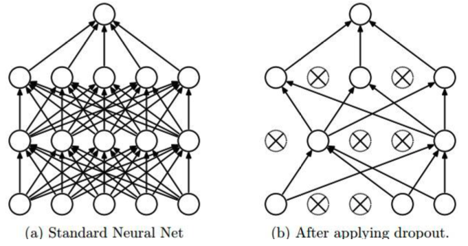

# Neural Networks

In this section we introduce neural networks and its application for regression, classification, dimensionality-reduction, generation, etc.

## General Form

### Versus Machine Learning: Linear vs Hierarchical

Most machine learning relies almost entirely on linear predictors, where predictors can be non-linear features of the data.

Feature transform $\boldsymbol{\phi} : \mathcal{X} \rightarrow \mathbb{R}^{d}$

$$
f_{y}(\boldsymbol{x} ; \boldsymbol{w}, b)=\boldsymbol{w}_{y} \cdot \boldsymbol{\phi} (\boldsymbol{x})+b_{y}
$$

Shallow learning: hand-crafted, non-hierarchical $\boldsymbol{\phi}$.

Basic example:
- polynomial regression: $\phi_{j}(x)=x^{j}, j=0, \ldots, d$
- Kernel SVM: employing kernel $k$ corresponds to (some) feature space such that $k\left(\boldsymbol{x}_{i}, \boldsymbol{x}_{j}\right)=\phi\left(\boldsymbol{x}_{i}\right) \cdot \phi\left(\boldsymbol{x}_{j}\right)$. SVM is just a linear classifier in that space.

```{margin}
The hierarchy structure is the reason why it is called "deep".
```

In **deep** learning, a predictor that uses a **hierarchy** of features of the input, typically (but not always) learned end-to-end jointly with the predictor.

$$
f_{y}(\boldsymbol{x})=F_{L}\left(F_{L-1}\left(F_{L-2}\left(\cdots F_{1}(\boldsymbol{x}) \cdots\right)\right)\right)
$$

Example (A 2-layer neural network)
: A 2-layer neural network can be represented by

  $$
  f_{y}(\boldsymbol{x})=\sum_{j=1}^{m} w_{j, y}^{(2)} h\left(\sum_{i=1}^{d} w_{i, j}^{(1)} x_{i}+b_{j}^{(1)}\right)+b_{y}^{(2)}
  $$

  In matrix form,

  $$
  \boldsymbol{f}(\boldsymbol{x})=\boldsymbol{W}_{2} \cdot \boldsymbol{h} \left(\boldsymbol{W}_{1} \cdot \boldsymbol{x}+\boldsymbol{b}_{1}\right)+\boldsymbol{b}_{2}
  $$

  where $h$ is applied elementwise; $\boldsymbol{x} \in \mathbb{R}^{d}, \boldsymbol{W}_{1} \in \mathbb{R}^{m \times d}, \boldsymbol{W}_{2} \in \mathbb{R}^{C \times m}, \boldsymbol{b}_{2} \in \mathbb{R}^{C}, \boldsymbol{b}_{1} \in \mathbb{R}^{m}$.

  :::{figure} nn-two-layer
  

  A 2-layer feedforward neural network
  :::


Example (Softmax classifier)
: A softmax classifier computes probability of each class $c$.

  $$
  \begin{aligned}
  \boldsymbol{f}(\boldsymbol{x}) &=\boldsymbol{W}_{2} \cdot h\left(\boldsymbol{W}_{1} \cdot \boldsymbol{x}+\boldsymbol{b}_{1}\right)+\boldsymbol{b}_{2} \\
  \hat{p}(y=c \mid \boldsymbol{x}) &=\exp \left(f_{c}(\boldsymbol{x})\right) / \sum_{j} \exp \left(f_{j}(\boldsymbol{x})\right)
  \end{aligned}
  $$

  The log loss (cross entropy) is computed $\hat{y}$ verses true label $y$:

  $$
  L(\boldsymbol{x}, y)=-\log \hat{p}(y \mid \boldsymbol{x})=-f_{y}(\boldsymbol{x})+\log \sum \exp \left(f_{c}(\boldsymbol{x})\right)
  $$


### Advantage of Deep Architecture

Theorem (Neural networks approximation, Cybenko 1989)
: 2-layer net with linear output (sigmoid hidden units) can approximate any continuous function over compact domain to arbitrary accuracy (given enough hidden units).

In general, $>2$ layers can represent a given function more compactly.


Example (Advantage of deep architecture)
: Compute the parity of $n$-bit numbers, with AND, OR, NOT, XOR gates. Trivial shallow architecture: express parity as DNF or CNF. They are shallow functions, and need exponential number of gates. On the other hand, use deep architecture just use a tree of XOR gates.


## Learning

Typically deep neural networks are trained by (stochastic) gradient descent with backward propagation.

For the discussion below, we are assuming feedforward, fully-connected networks. There are other options: convolutional networks, recurrent networks, transformers

### Gradient Descent

The general form of gradient descent is

- Iteration counter $t=0$

- Initialize parameters $\Theta^{(t)}$  (to zero or a small random vector)

- for $t = 0, 1, \ldots$

  - run forward propagation and compute gradient

    $$
    \boldsymbol{g}^{(t)}(\boldsymbol{X}, \boldsymbol{y})=\nabla_{\Theta} \mathcal{L}\left(\boldsymbol{X} , \boldsymbol{y}; \Theta^{(t-1)}\right)
    $$

  - update the model parameters

    $$
    \Theta^{(t)}=\Theta^{(t-1)}-\eta \boldsymbol{g}^{(t)}
    $$

  - check for stopping criteria (convergence of loss / gradient, model performance, etc)

The learning rate $\eta$ controls the step size, usually varied by $t$ according to some “schedule” during training (e.g. optimizers like AdaGrad, RMSProp, Adam).

:::{figure} nn-lr-comparison


Comparison of different learning rate [Lecun et al 1996]
:::


#### Basic Gradient Descent

Definition (Epoch)
: An epoch is a single pass through the training set.

```{margin} Total loss vs sum of losses
In some cases the total loss is not a sum of per-example losses
```

A single “iteration” $t$ can be an epoch, which means we loop over examples (or in parallel) to compute the gradient $\boldsymbol{g}^{(t)}\left(\boldsymbol{x}_{i}, y_{i}\right)$ for each observation $i$ and use the average gradient to approximate the true gradient

$$
\boldsymbol{g}^{(t)}(X, Y)=\frac{1}{n} \sum_{i} \boldsymbol{g}^{(t)}\left(\boldsymbol{x}_{i}, y_{i}\right)
$$

Then we make a single update at the end of the epoch.

Assuming $n$ is large, $\boldsymbol{g}^{(t)}(X, Y)$ is a good estimate for gradient, but it costs $O(n)$ to compute.

#### Stochastic Gradient Descent

Computing gradient on all $n$ examples is expensive and may be wasteful: many data points provide similar information.

Instead, SGD present examples one observation at a time, and pretend that the gradient on the entire set is the same as gradient on one example. It estimates gradient of the loss on a single example in an iteration $t$.

$$
\frac{1}{n} \sum_{i=1}^{n} \nabla_{\Theta} L\left(y_{i}, \boldsymbol{x}_{i} ; \Theta\right) \approx \nabla_{\Theta} L\left(y_{t}, \boldsymbol{x}_{t} ; \Theta\right)
$$

#### Mini-batch Gradient Descent

Mini-batch gradient descent use a batch $B$ of observations to compute the gradient in an iteration. For some $B \subset{1,2,\ldots, n},|B| \ll n$,

$$
\frac{1}{n} \sum_{i=1}^{n} \nabla_{\Theta} L\left(y_{i}, \boldsymbol{x}_{i} ; \Theta\right) \approx \frac{1}{|B|} \sum_{t \in B} \nabla_{\Theta} L\left(y_{t}, \boldsymbol{x}_{t} ; \Theta\right)
$$

In theory, if computation power is not an issue, we should set $\left\vert B \right\vert$ as large as possible. But there are some advantages of small $\left\vert B \right\vert$. Using small $\left\vert B \right\vert$ works like adding noise to the gradient, which brings regularization effect and make the trained model more robust.

In each epoch, we shuffle data, partition into batches, and iterate over batches.

### Backward propagation

Definition (Backward propagation)
: Aka backpropagation, refers to efficient computation of gradients with respect to all parameters via chain rule of differentiation.


### Activation Functions

#### Sigmoid and tanh

The sigmoid function is

$$
h(a)=\frac{1}{1+\exp (a)}
$$

:::{figure} nn-sigmoid-plot


Plot of sigmoid function
:::

The tanh function is

$$
h(a)=\tanh (a)
$$

:::{figure} nn-tanh-plot


Plot of tanh function
:::

The two functions are

- Good: squash activations to a fixed range

- Bad: gradient is nearly zero far away from midpoint $0$,

    $$
    \frac{\partial L}{\partial a}=\frac{\partial L}{\partial h(a)} \frac{d h}{d a} \approx 0
    $$

    so they can make learning sensitive to initialization, and very, very slow.

#### RELU

ReLU solves the problems of saturating gradient by making the non-linearity non-saturating, at least in part of the range. It greatly speeds up convergence compared to sigmoid (order of magnitude), and used as the “default” nonlinearity in recent work.

$$
h(a)=\max (0, a)
$$

:::{figure} nn-relu-plot


Plot of ReLU function
:::


### Regularization

There are various ways to avoid overfitting.

#### Weight Decay

In neural networks, $L_2$ regularization is often called weight decay. It is easy to incorporate weight decay into the gradient calculation of the loss

$$
\nabla_{\boldsymbol{w}} \lambda\|\boldsymbol{w}\|^{2}=2 \lambda \boldsymbol{w}
$$

It brings one more hyperparameter $\lambda$ to tune. Depending on the data set/task, it can be more/less useful.

#### Dropout

A part of overfitting in neural networks is that different nodes may capture the same pattern, called unit co-adaptation. We then prevent it by disrupting co-firing patterns.

Dropout [Srivastava et al]
: During each training iteration, randomly “remove” some nodes, then run forward and backward propagation to update the gradient of the remaining nodes. In prediction, use all nodes.


:::{figure} nn-dropout


Dropout [Goodfellow et al.]
:::

With each particular dropout set, we have a different network. An interpretation is, we are training an ensemble of networks with shared parameters, which is a good way to avoid overfitting.

:::{figure} nn-dropout-ensemble


Dropout as ensemble [Goodfellow et al.]
:::


## Unsupervised Deep Representation Learning

Neural networks can be used to extract representation from unlabeled data. There are four categories of methods.

- Use neural network as a form of out-of-sample extension with one of the losses we have discussed.

  - Parametric $t$-SNE [van der Maaten 2009]
  - Deep canonical correlation analysis [Andrew et al. 2013]

- Autoencoders

- Probabilistic generative models that double as learned representations (e.g. Probablistic PCA)

  - Restricted Boltzmann machines, deep belief networks (important in the development of deep learning but too old, complex, and lose favor)
  - Variational autoencoders
  - Future prediction models (including language models)

- Self-supervised representation learning
