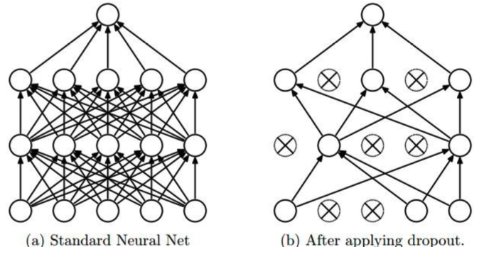
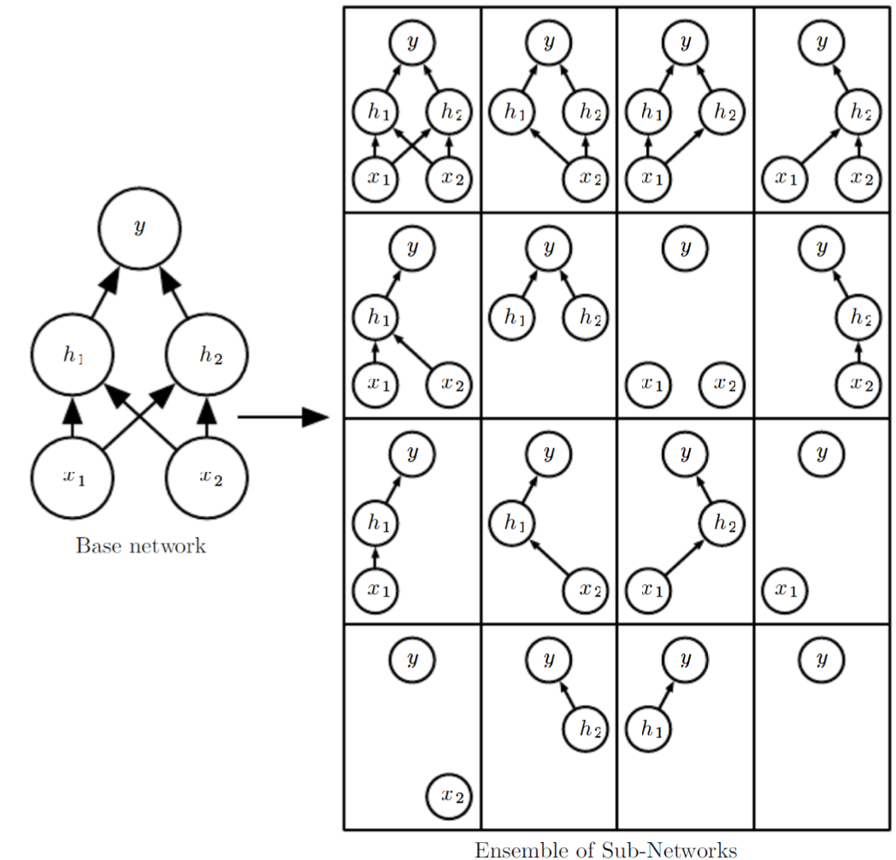

# Regularization

There are various ways to avoid overfitting of neural networks.

## Weight Decay

In neural networks, $L_2$ regularization is often called weight decay. It is easy to incorporate weight decay into the gradient calculation of the loss

$$
\nabla_{\boldsymbol{w}} \lambda\|\boldsymbol{w}\|^{2}=2 \lambda \boldsymbol{w}
$$

It brings one more hyperparameter $\lambda$ to tune. Depending on the data set/task, it can be more/less useful.

## Dropout

A part of overfitting in neural networks is that different nodes may capture the same pattern, called unit co-adaptation. We then prevent it by disrupting co-firing patterns.

Dropout [Srivastava et al]
: During each training iteration, randomly “remove” some nodes, then run forward and backward propagation to update the gradient of the remaining nodes. In prediction, use all nodes.

:::{figure} nn-dropout

Dropout [Goodfellow et al.]
:::

With each particular dropout set, we have a different network. An interpretation is, we are training an ensemble of networks with shared parameters, which is a good way to avoid overfitting.

:::{figure} nn-dropout-ensemble

Dropout as ensemble [Goodfellow et al.]
:::
