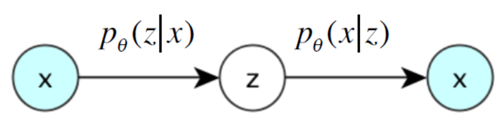
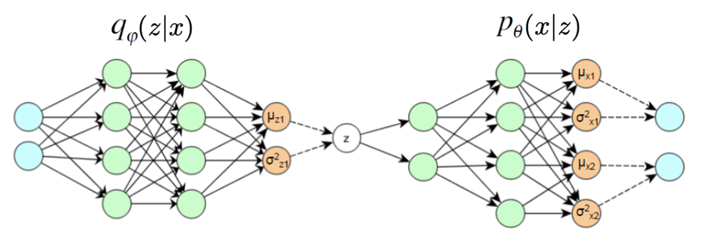
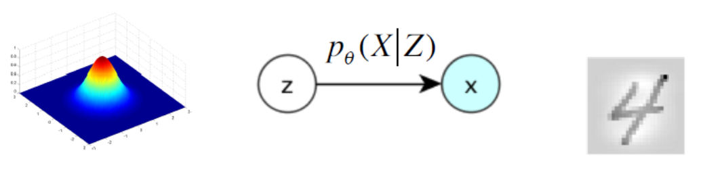
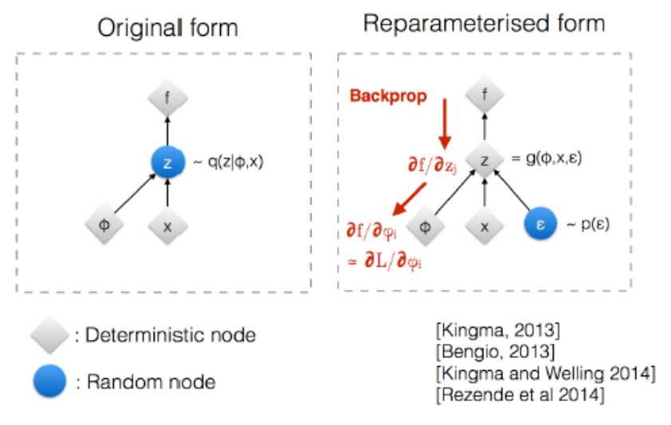
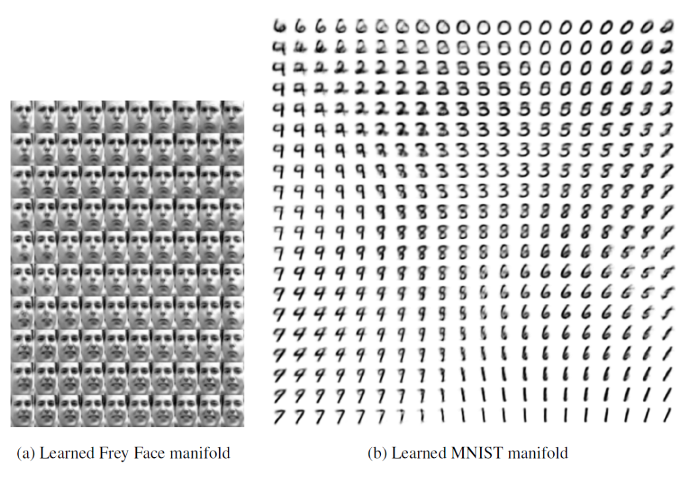

# Variational Autoencoders

More or less simultaneously proposed by Kingma & Welling (2013) and Rezende et al. (2014)

VAE is a type of generative model for a vector of random variables $\boldsymbol{x}$ assumed to be generated from a set of latent variables $\boldsymbol{z}$. Assuming both $\boldsymbol{x} \in \mathbb{R}^d$ and $\boldsymbol{z} \in \mathbb{R}^k$ are continuous, the unconditional distribution of $\boldsymbol{x}$ can be written as

$$
p(\boldsymbol{x})=\int_{\boldsymbol{z}} p(\boldsymbol{x} \vert \boldsymbol{z}) p(\boldsymbol{z}) \mathrm{~d} \boldsymbol{z}
$$

Initially used for generation, VAE has also been successful for representation learning. It is popular, fast, and relatively easy to train.

VAE have similar structure with AE. But we add probabilistic assumptions of the VAE representation and optimize the VAE objective via variational optimization.

## Objective

Ideally, the encoder and decoder should learn the two conditional distributions (from the joint distribution of $(x,z)$) parameterized by $\theta$.

:::{figure} vae-ideal-step


Ideal case of VAE [Durr 2016]
:::

But $p(\boldsymbol{z} \vert \boldsymbol{x} )$ can be very costly to estimate. As a result, we approximate it with another neural function $q(\boldsymbol{z} \vert \boldsymbol{x} )$, which is the decoder.

Assume w.l.o.g. that latent variable $\boldsymbol{z}$ is 1-dimensional, $\boldsymbol{x}$ is 2-dimensional. The VAE structure can be shown as

:::{figure} vae-networks


VAE structure (dash lines mean sampling) [Durr 2016]
:::

- $q(\boldsymbol{x}  \vert \boldsymbol{z} )$ is the distribution learned by the encoder part.
- $p(\boldsymbol{x} \vert \boldsymbol{z})$ is the distribution learned by the decoder part.

```{margin}
We often assume $q(\boldsymbol{z})$ is spherical Gaussian. The node for the variance is actually $\log \sigma^2$ so that it is in $\mathbb{R}$.
```

- The orange nodes in the middle and at the right are the parameters in the distribution $q(\boldsymbol{z})$ and $p(\boldsymbol{x})$ respectively.


After the model is trained, we have

- a learned representation described by $q(\boldsymbol{z})$. To output a single value, we can use the mean, or mode.

- a generator $p(\boldsymbol{x} \vert \boldsymbol{z} )$. To generate $\boldsymbol{x}$ (e.g. an image) given $\boldsymbol{z}$, we can use the decoder network.

:::{figure}


Use VAE to generate a handwritten digit [Durr 2016]
:::

There is a theoretical foundation of generation.

Theorem (Validation of VAE)
: Any $d$-dimensional distribution can be generated by taking $d$ normally distributed variables and mapping them through some appropriate (possibly very complicated) function.

Of course, the function can be a neural network.


## Training

### Variational Optimization

Directly Maximizing the likelihood can be challenging. Instead, we maximize the lower bound of the likelihood.

By some formula from conditional probability and [information theory](../30-ml-basics/03-information-theory), we have


$$
\begin{aligned}
L &=\log p(x) \\
\text { multiply by 1, }\quad  &=\sum_{z} q(z \vert x) \log p(x) \\
&=\sum_{z} q(z \vert x) \log \left(\frac{p(z, x)}{p(z \vert x)}\right) \\
\text { multiply by 1, } \quad&=\sum_{z} q(z \vert x) \log \left(\frac{p(z, x)}{q(z \vert x)} \frac{q(z \vert x)}{p(z \vert x)}\right) \\
&=\sum_{z} q(z \vert x) \log \left(\frac{p(z, x)}{q(z \vert x)}\right)+\sum_{z} q(z \vert x) \log \left(\frac{q(z \vert x)}{p(z \vert x)}\right) \\
&=L^{v} + KL \left[ q(z \vert x), p(z \vert x) \right] \\
& \geq L^{v}
\end{aligned}
$$

If we can well approximate $p(z \vert x)$ by $q(z \vert x)$, then the KL divergence is small, and we can maximizing $L$ by maximizing $L^v$.

```{margin}
The lower abound $L^v$ is also known as evidence lower bound, or ELBO.
```
The lower bound $L^v$ can be further arranged to

$$
\begin{aligned}
L^{v} &=\sum_{z} q(z \vert x) \log \left(\frac{p(z, x)}{q(z \vert x)}\right) \\
&=\sum_{z} q(z \vert x) \log \left(\frac{p(x \vert z) p(z)}{q(z \vert x)}\right) \\
&=\sum_{z} q(z \vert x) \log \left(\frac{p(z)}{q(z \vert x)}\right)+\sum_{z} q(z \vert x) \log p(x \vert z)\\
&=-KL \left[ q(z \vert x), p(z) \right]+E_{z \sim q(z \vert x)}\left[ \log p(x \vert z) \right] \\
\text { for } x_{i} \ldots &=-KL \left[ q\left(z \vert x_{i}\right), p(z) \right]+E_{z \sim q\left(z \vert x_{i}\right)}\left[ \log p\left(x_{i} \vert z\right) \right]
\end{aligned}
$$

We then maximizing the last line.

- The first term is the negative KL divergence between the posterior and the prior (often Gaussian). We want to minimize the distance. It can be viewed as a regularizer.

    When $p(z) = N (0, 1)$ and $q(z|x)$ is also Gaussian, this KL divergence has a closed form

    $$
    -KL \left[ q\left(z \vert x_{i}\right), p(z) \right]=\frac{1}{2} \sum_{j=1}^{J} 1+\log \left(\sigma_{z_{i, j}}^{2}\right)-\mu_{z_{i, j}}^{2}-\sigma_{z_{i, j}}^{2}
    $$

- The second term can be seen as a reconstruction loss, which equals $\log(1)$ if $\boldsymbol{x}_i$ is perfectly reconstructed from $\boldsymbol{z}$. In training, the expectation is estimated by sampling $B$ samples $z_{j,l}$ from the encoder network $q(z\vert x_i)$ and compute the average of $\log p\left(x_{i} \mid z_{i, l}\right)$

    $$
    E_{q(z \vert x)}\left[ \log p(x \vert z) \right] = \frac{1}{B} \sum_{l=1}^{B}\log p\left(x_{i} \vert z_{i, l}\right)
    $$

    If $p(x \vert z)$ is Gaussian and $B=1$ (often used), then it is just a least squares loss

    $$
    \log p\left(x_{i} \vert z_{i}\right)=\sum_{j=1}^{d} \frac{1}{2} \log \sigma_{x_{j}}^{2}+\frac{\left(x_{i, j}-\mu_{x_{j}}\right)^{2}}{2 \sigma_{x_{j}}^{2}}
    $$

**Overall objective of VAE**: We want the representation $\boldsymbol{x}$ be as accurate as possible, and use it to reconstruct $\boldsymbol{x}$ as accurate possible


:::{admonition,note} VAE vs denoising AE

- Denoising AE:

    $$
    \boldsymbol{x} + \boldsymbol{\varepsilon}  \overset{\text{encoder}}{\longrightarrow} \boldsymbol{z} \overset{\text{decoder}}{\longrightarrow} \boldsymbol{x} ^\prime
    $$

    with reconstruction loss $\left\| \boldsymbol{x} - \boldsymbol{x} ^\prime  \right\|^2$.

- VAE:

    $$
    \boldsymbol{x} \overset{\text{encoder}}{\longrightarrow} \boldsymbol{z} + \boldsymbol{\varepsilon}  \overset{\text{decoder}}{\longrightarrow} \boldsymbol{x} ^\prime
    $$

    with reconstruction loss $\left\| \boldsymbol{x} - \boldsymbol{x} ^\prime  \right\|^2$ **and** a KL divergence regularizer between prior $p(\boldsymbol{z})$ and posterior $q(\boldsymbol{z} \vert \boldsymbol{x})$.

:::

### Reparameterization Trick

Note that at the end of the encoder part, we have the neurons that corresponds to the parameters in $q(\boldsymbol{z})$, then we sample $\boldsymbol{z}$. Then $z$ is random in the back. The question is, how to do backpropagation through this random node?

A trick is to reparameterize $\boldsymbol{z}$ by

$$
\boldsymbol{z} = \boldsymbol{\mu} _ \boldsymbol{z} + \sigma_z \boldsymbol{\varepsilon}
$$

where $\boldsymbol{\varepsilon} \sim N(\boldsymbol{0}, \boldsymbol{I})$ can be viewed as noise.

Then random node becomes $\boldsymbol{\varepsilon}$, and we won't need to compute its gradient during backpropagation.

:::{figure} vae-reparm-trick.png


Reparametrization trick of VAE [Kingma 2015]
:::

```{margin} How about non-Gaussian distributions?

Essentially any distribution can be approximated arbitrarily well by a large enough Gaussian mixture. So we can simply let $\boldsymbol{z} ~ \mathcal{N}$ and the subsequent layers can help to approximate any distributions.

```

## Interpretation

### By Phase Diagrams

After obtaining $q(\boldsymbol{z})$, we can create a phase diagram with varying values in each dimension $z_1, z_2, \ldots, z_k$, and then pass them to decoder to generate $\boldsymbol{x}$, then we can see that how these $\boldsymbol{z}$'s differ according to varying values of $z_1, z_2, \ldots, z_k$, and the difference along dimension $j$ can be interpreted as the learned representation by $z_j$.

In the following example (a), $k=2$, the horizontal dimension is head tile, and the vertical dimension is degree of smiling vs frowning.

:::{figure} vae-phase


VAE phase diagram for interpretation
:::

### Potential Representations

Interpretable dimensions of continuous variation can be

- Images: facial expression, digit writing style, ...

- Music: pitch, timbre, ...

- Speech audio: speaker characteristics, emotion, ...

- Text: shades of meaning, sentiment, ..


Interpretable dimensions of discrete variation dimensions can be

- Images: digit identity, face identity, object type, ...

- Music: instrument identity, discrete pitch, ...
- Speech audio: phoneme, word, language, ...
- Text: part of speech, phrase (constituent) type, topic, ...

Or, the representation just learn signal and get rid of noise.

## Extension: VQ-VAE
