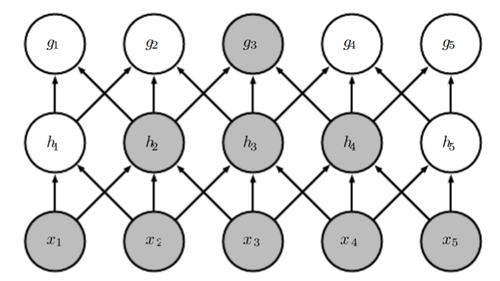
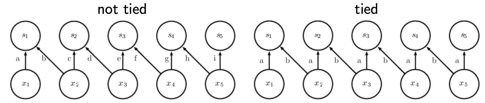
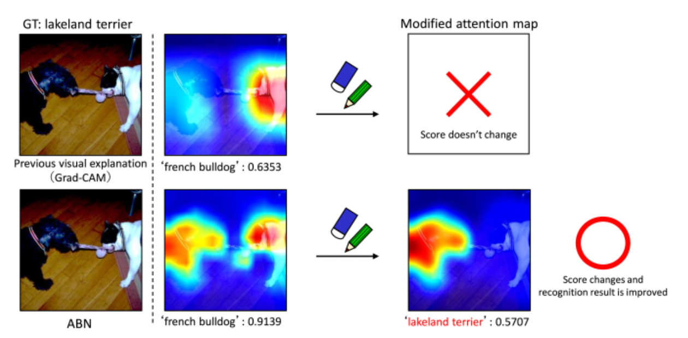

# Convolutional Neural Networks

Motivation

- Sparse weight patterns. No need fully connected. Save memory and improves efficiency.
- Each unit in upper layer is affected only by a subset of units in lower layer – its receptive field. Conversely: each unit in lower layer only influences a subset of units in upper layer. receptive field size w.r.t. the input in locally connected networks grows with layers, even if in each layer it is fixed

:::{figure} cnn-receptive-field-growth

caption
:::

- We can further reduce network complexity by tying weights for all receptive fields in a layer

:::{figure} cnn-parameter-sharing

caption
:::

## Kernels

Exercise: What happen if kernel size = 1, or = length?

## Pooling

### Max Pooling

Invariance to translation, rotation, scale. https://blog.csdn.net/fanre/article/details/93721879?utm_medium=distribute.pc_relevant.none-task-blog-BlogCommendFromMachineLearnPai2-1.control&depth_1-utm_source=distribute.pc_relevant.none-task-blog-BlogCommendFromMachineLearnPai2-1.control

### Attention Pooling

Motivation: When we see an image, we usually pay attention to some specific parts.

Let $\boldsymbol{w} \in \mathbb{R} ^d$ be the weights to be used in attention computation. it can be set or trained.

The input tensor is $\boldsymbol{X}$ with dimension $H\times W \times d$.

We compute

$$\begin{aligned}
\boldsymbol{a} &= \boldsymbol{X} \boldsymbol{w}\\
\hat{\boldsymbol{a} }&= \text{softmax}(\boldsymbol{a}) \\
\text{or}  \quad \hat{a}_i&= \frac{\exp \left(a_{i}\right)}{\sum_{j} \exp \left(a_{j}\right)}\\
\end{aligned}$$

Here $\hat{\boldsymbol{a}}$ is the attention. And sometimes we use $\boldsymbol{X} ^\top \hat{\boldsymbol{a} }$ as attention pooling.

:::{figure} cnn-attention-pooling

Attention Pooling [Mitsuhara et al. 2019]
:::
