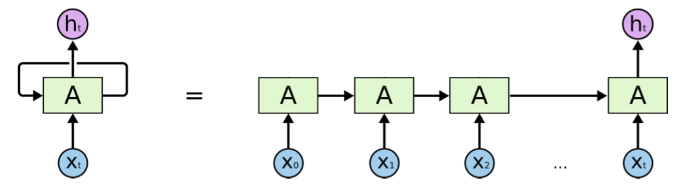
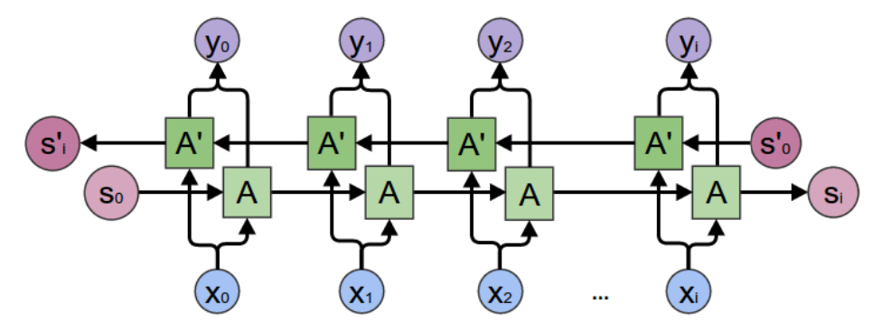
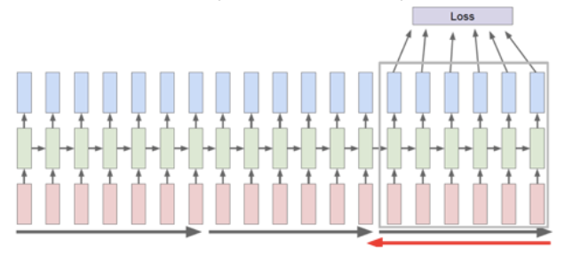
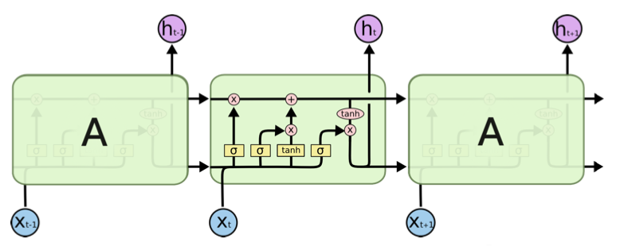
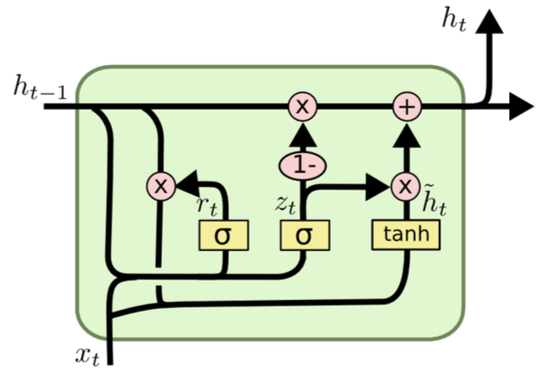
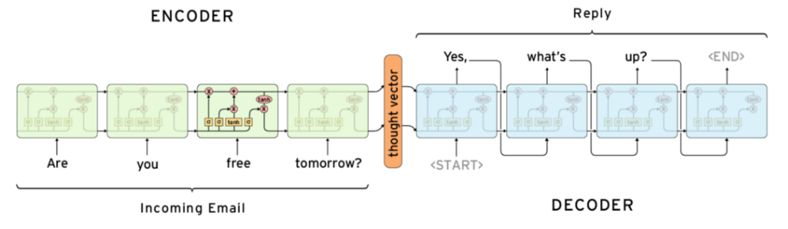

# Sequential Models

In this section we introduce neural networks for sequential data, like text or speech. First we introduce RNN in detail, and then briefly introduce other models.

## Recurrent Neural Networks

### I/O

The main idea is parameter sharing through time.

- Input:
  - a sequence of vectors $\boldsymbol{X}_i = (\boldsymbol{x} _1, \ldots, \boldsymbol{x} _t), \boldsymbol{x}_j \in \mathbb{R} ^d$, while $t$ is NOT fixed for each observation $i$.
  - For instance $\boldsymbol{X}$ is a sentence of $t$ words, $\boldsymbol{x} _j$ are the word embeddings, or tokens.
- Parameters
  - $\boldsymbol{W}_x ^{d \times d}$ weight matrix for new element $\boldsymbol{x} _t$
  - $\boldsymbol{W}_h \in \mathbb{R} ^{d \times d}$ weight matrix for extraction $\boldsymbol{h}$
  - $\boldsymbol{b} \in \mathbb{R} ^d$ bias vector
  - $\boldsymbol{h} _0 \in \mathbb{R} ^d$ initial hidden state, e.g. $\texttt{<START>}$ token in language modeling.

- Output
  - $\boldsymbol{h} _t \in \mathbb{R} ^d$, where $t$ is the length of input $\boldsymbol{X}$.


### Forward Propagation

Different tasks have different RNN structure. Here we start from a simple task of sequence classification. For instance, given a sentence, we want to classify its sentiment as "positive/negative".

The forward propagation is

- For $j=1, \ldots, t$:
  - update initial state $\boldsymbol{h} _i = \operatorname{tanh}\left(\boldsymbol{W} _h \boldsymbol{h} _{j-1} + \boldsymbol{W} _x \boldsymbol{x} _j +  \boldsymbol{b}\right)$

Pictorially, RNN can be illustrated in either recurrent format (left) or unfold/unrolled format (right). In the unfold format, we call each iteration unit $A$ a **block**. Note that each block shares the same parameters $(\boldsymbol{W} _h, \boldsymbol{W} _x, \boldsymbol{b} )$.

:::{figure} rnn-structure-revised


Illustration of RNN structure [Chris Olah, revised]
:::


Note that

- The same weight matrices $\boldsymbol{W}_x$ and $\boldsymbol{W} _h$ are used in every iteration, i.e. parameter sharing. One can write $\boldsymbol{W} = [\boldsymbol{W} _h\quad \boldsymbol{W} _x] \in \mathbb{R} ^{d \times 2d}$ and hence $\boldsymbol{h} _j = \boldsymbol{W} \left[\begin{array}{c}
\boldsymbol{h} _{j-1}  \\
\boldsymbol{x} _j
\end{array}\right] = \boldsymbol{W} [\boldsymbol{h} _{j-1}; \boldsymbol{x} _j ]$ where $[\boldsymbol{a} ; \boldsymbol{b} ] \in \mathbb{R} ^{(n+m)\times 1}$ stands for vertical stack of two column vectors $\boldsymbol{a} \in \mathbb{R} ^n$ and $\boldsymbol{b} \in \mathbb{R} ^m$, as used in MATLAB. From now on to be concise, we will adapt this symbol.

- There is no "layer" concept in RNN, but one can understand RNN as a $t$-layer neural network with the same parameter $\boldsymbol{W}$ and $\boldsymbol{b}$ across each layer, and the $j$-th layer takes the activated output $\boldsymbol{h} _{j-1}$ from last layer **and** a new input $\boldsymbol{x} _j$ as its inputs. Note that the number of layers, $t$, is not fixed.

- The vector $\boldsymbol{h}_j$ can be interpreted as the extracted information from $\boldsymbol{x} _1$ to $\boldsymbol{x} _j$. It is then passed to the next iteration.


So what is the loss? The final output $\boldsymbol{h} _t$ can be feed into downstream models for regression, classification, etc. For a data point $i$, the loss function is then $\ell(\boldsymbol{h} _t^{(i)}, y_i)$, where $y_i$ is the label.

For instance, if we want to do classification task of the sequence $\boldsymbol{X} _i$ to $c$ classes, then we pass $\boldsymbol{h} _t \in \mathbb{R} ^d$ to a multiplayer perceptron as below, where $\boldsymbol{W} _{MLP} \in \mathbb{R} ^{c \times d}, \boldsymbol{b} \in \mathbb{R} ^c$.

  $$
  \begin{aligned}
  \boldsymbol{h}_{t} &=\operatorname{RNN}\left(\boldsymbol{x}_{1}, \ldots, \boldsymbol{x}_{t}\right) \\
  \operatorname{score}\left(y \mid \boldsymbol{h}_{t}\right) &=\boldsymbol{W}_{\mathrm{MLP}} \boldsymbol{h}_{t}+\boldsymbol{b}_{\mathrm{MLP}} \\
  P\left(y \mid \boldsymbol{h}_{t}\right) &=\frac{\exp \left(\operatorname{score}\left(y \mid \boldsymbol{h}_{t}\right)\right)}{\sum_{j} \exp \left(\operatorname{score}\left(j \mid \boldsymbol{h}_{t}\right)\right)} \\
  \mathcal{L}\left(\boldsymbol{X} _i, \hat{y}\right) &=-\log P\left(\hat{y} \mid \boldsymbol{h}_{t}\right)
  \end{aligned}
  $$

Recall in for language modeling, the task is to model $P\left(w_{i} \mid w_{1}, \ldots, w_{i-1}\right)$. We can view $\boldsymbol{h} _{i-1} = \operatorname{info} (w_{1}, \ldots, w_{i-1})$, with gold label $w_i$.


### Backward Propagation

Consider the case without activation function,

$$
\boldsymbol{h} _t = \boldsymbol{W} [\boldsymbol{h} _{t-1}; \boldsymbol{x} _t]
$$

Note the output is $\boldsymbol{h} _t$. Suppose the loss is $\mathcal{L}(\boldsymbol{h}_t, y )$.

To compute the gradient of $\boldsymbol{W}$, we use the cumulative method: look back from the computational graph.

For $j$ in $t-1$ to $1$:

$$
\begin{aligned}
\frac{\partial \mathcal{L}}{\partial \boldsymbol{W}_{j}} &=\frac{\partial \mathcal{L}}{\partial \boldsymbol{h}_{j}} \frac{\partial \boldsymbol{h}_{j}}{\partial \boldsymbol{W}_{j}} \\
&=\frac{\partial \mathcal{L}}{\partial \boldsymbol{h}_{j}}\left[\boldsymbol{h}_{j-1}; \boldsymbol{x}_{j}\right]^{\top} \\
\boldsymbol{W}\texttt{.grad}&\mathrel{+}=\frac{\partial \mathcal{L}}{\partial \boldsymbol{W}_{j}} \\
\frac{\partial \mathcal{L}}{\partial \boldsymbol{h}_{j-1}} &=\frac{\partial \mathcal{L}}{\partial \boldsymbol{h}_{j}} \frac{\partial \boldsymbol{h}_{j}}{\partial \boldsymbol{h}_{j-1}} \\
&=\left(\frac{\partial \mathcal{L}}{\partial \boldsymbol{h}_{j}} \boldsymbol{W}^{\top}\right)[: d]
\end{aligned}
$$


Note that above equations implies that we need to store $\boldsymbol{h} _j$ at every intermediate steps. This leads to a memory problem, see [Truncated BPTT](rnn-truncated-bptt) for solution.


### Exploding Gradient

From the toy case above, we see that there the accumulative gradient leads to

$$
\boldsymbol{W}\texttt{.grad} = \sum _{j=t-1} ^1\frac{\partial \mathcal{L}}{\partial \boldsymbol{h}_{j}}\left[\boldsymbol{h}_{j-1}; \boldsymbol{x}_{j}\right]^{\top}
$$

which can explode. In practice, people use gradient clip: if $\left\| \boldsymbol{W}\texttt{.grad} \right\|   > \delta$, then set

$$
\boldsymbol{W}\texttt{.grad} = \frac{\delta \boldsymbol{W}\texttt{.grad}}{\left\| \boldsymbol{W}\texttt{.grad} \right\|  }
$$

to ensure the gradient norm is at most $\delta$.


### Other Structure

As said, we only introduce RNN for sequence classification. There are many other RNN structures to other tasks.

:::{figure} rnn-tasks


Different RNN structures to different tasks [[figure link](https://subscription.packtpub.com/book/big_data_and_business_intelligence/9781789536089/5/ch05lvl1sec86/summarizing-different-types-of-sequence-processing-tasks)]
:::

More [reference](https://calvinfeng.gitbook.io/machine-learning-notebook/supervised-learning/recurrent-neural-network/recurrent_neural_networks).


## Bidirectional RNNs

In RNN, when we see a word $\boldsymbol{x} _t$, we look up $\boldsymbol{h} _{t-1}$ which contains information from the past words. But in natural language, in a sentence, to understand a word, we may need a word in the future (e.g. postpositive adjective). Hence, can we extract information from $\boldsymbol{x} _t$ and understand $\boldsymbol{x} _{t-1}, \boldsymbol{x} _{t-2}, \ldots$ and so on?

Given an input sequence $\boldsymbol{X}_i = (\boldsymbol{x} _1, \ldots, \boldsymbol{x} _t)$, we can build two RNNs,

- one produces $\boldsymbol{h} ^{\text{fwd} }$ from input $(\boldsymbol{x} _1, \ldots, \boldsymbol{x} _t)$ with parameters $(\boldsymbol{W} ^{\text{fwd} }, \boldsymbol{b} ^{\text{fwd} })$
- the other produces $\boldsymbol{h} ^{\text{bwd} }$ from input $(\boldsymbol{x} _t, \ldots, \boldsymbol{x} _1)$ with parameters $(\boldsymbol{W} ^{\text{bwd} }, \boldsymbol{b} ^{\text{bwd} })$

Note that the two RNNs are completely independent. The output feature for downstream task is $[\boldsymbol{h} ^{\text{fwd} }_t;\boldsymbol{h} ^{\text{bwd} }_1]$

:::{figure} rnn-bidirectional


Bidirectional RNN [Chris Olah]
:::

## Multi-layer RNN

In RNNs, the hidden states of each block $\boldsymbol{h} _j$ can be used as input vector "$\boldsymbol{x} _j$" to another RNN. Following this idea, we can build multi-layer RNN.

:::{figure} rnn-multi-layer


Multi-layer RNNs [[figure link](https://www.kaggle.com/andradaolteanu/pytorch-rnns-and-lstms-explained-acc-0-99)]
:::

Note that the computation time for $1$-layer RNN is $O(t)$, and for $L$-layer RNN is $O(L+t)$, not $O(L\times t)$. Think about forward propagation, when processing the $j$-th block in the first layer, we can simultaneously process the $(j-1)$-th block in the 2nd layer, and $(j-2)$-th block in the 3rd layer, etc.. That is, the blocks along a diagonal can be computed simultaneously. Hence, the computation progress from bottom left to top right of the $L \times t$ grid, and the maximum length of a diagonal is $O(L+t)$


(rnn-truncated-bptt)=
## Truncated BPTT

In RNNs, we must store every $\boldsymbol{h} _j$ in order to compute the gradient in the backward propagation. If $t$ is large, then there is no enough memory. To solve this, we do Truncated Backpropagation Through Time. The main idea is that we run forward propagation and backward propagation w.r.t. each segment, instead of w.r.t. a whole sequence.

We chop a sequence into chunks of vectors. In a segment covering time $j+1, \ldots, k$, suppose the last vector is $\boldsymbol{x} _{k}$, and the hidden vector from last segment is $h_{j}$, we do
- Run forward propagation using $\boldsymbol{h} _j$ and $(\boldsymbol{x} _{j+1}, \ldots, \boldsymbol{x} _k)$ to compute $\boldsymbol{h} _k$, also stores $(\boldsymbol{h} _{j+1}, \ldots, \boldsymbol{h} _{k-1})$.
- Use $\boldsymbol{h} _k$ to compute loss
- Run backpropagation from $k$ to $j+1$, where we will use $(\boldsymbol{h} _{j+1}, \ldots, \boldsymbol{h} _{k-1})$. After the gradient of $\boldsymbol{W}, \boldsymbol{b}$ is updated, we can **drop** $(\boldsymbol{h} _{j+1}, \ldots, \boldsymbol{h} _{k-1})$.
- Feed $\boldsymbol{h} _k$ to the next segment.

```{margin} Analogy
If you are familiar with biology, these segments are analogous to [Okazaki fragments](https://en.wikipedia.org/wiki/Okazaki_fragments) in DNA replication!
```

:::{figure} rnn-truncated-bptt-fig


RNN with Truncated BPTT [Varma and Das, 2018]
:::


## Long Short-term Memory

LSTM (Hochreiter and Schmidhuber, 1997) is an effective variation of RNN. It has more operations in each iteration.

```{margin} Why don't use $\operatorname{ReLU}$?
Probably since $\operatorname{ReLU}$ hasn't been proposed by 1997.
```

$$
\begin{array}{ll}
\boldsymbol{f}_{t}=\sigma\left(\boldsymbol{W}_{f}\left[\boldsymbol{h}_{t-1}; \boldsymbol{x}_{t}\right]+\boldsymbol{b}_{f}\right) & \boldsymbol{c}_{t}=\boldsymbol{f}_{t} * \boldsymbol{c}_{t-1}+\boldsymbol{i}_{t} * \tilde{\boldsymbol{c}}_{t} \\
\boldsymbol{i}_{t}=\sigma\left(\boldsymbol{W}_{i}\left[\boldsymbol{h}_{t-1}; \boldsymbol{x}_{t}\right]+\boldsymbol{b}_{i}\right) & \boldsymbol{o}_{t}=\sigma\left(\boldsymbol{W}_{o}\left[\boldsymbol{h}_{t-1}; \boldsymbol{x}_{t}\right]+\boldsymbol{b}_{o}\right) \\
\tilde{\boldsymbol{c}}_{t}=\tanh \left(\boldsymbol{W}_{c}\left[\boldsymbol{h}_{t-1}; \boldsymbol{x}_{t}\right]+\boldsymbol{b}_{c}\right) & \boldsymbol{h}_{t}=\boldsymbol{o}_{t} * \tanh \left(\boldsymbol{c}_{t}\right)
\end{array}
$$

where $*$ stands for element-wise product.

Pictorially, it can be shown below. Each green rectangle (block) stands for an iteration to process $\boldsymbol{x} _j$.

:::{figure} lstm-structure


Illustration of LSTM structure [Chris Olah]
:::

Compared to RNN, LSTM

- Stores the information in a **cell** vector $\boldsymbol{c}_t$, which corresponds to the hidden state $\boldsymbol{h} _t$ in RNN but is improved. It first computes a temporary cell $\tilde{\boldsymbol{c} }_t$ by the same formula in RNN $\tilde{\boldsymbol{c} }_t = \operatorname{tanh} (\boldsymbol{W}_c [\boldsymbol{h}_{t-1}; \boldsymbol{x} _t] + \boldsymbol{b}_c )$, where the parameters $(\boldsymbol{W} _c, \boldsymbol{b} _c)$ are specific to this computation for $\tilde{\boldsymbol{c} }_t$.

- Then, it replaces the $\operatorname{tanh}$ function by $\sigma$, and the computed vectors by $\sigma (\boldsymbol{W} [\boldsymbol{h}_{t-1}; \boldsymbol{x} _t] + \boldsymbol{b} )$
  - with parameters $(\boldsymbol{W} _i, \boldsymbol{b} _i)$, it is called **input** gate $\boldsymbol{i}$
  - with parameters $(\boldsymbol{W} _f, \boldsymbol{b} _f)$ it is called called **forget** gate $\boldsymbol{f}$.

- The cell vector $\boldsymbol{c} _t$ is a combination of the previous cell vector $\boldsymbol{c} _{t-1}$ and the new extracted information $\tilde{\boldsymbol{c} }_t$, with weights $\boldsymbol{f}$ and $\boldsymbol{i}$. Essentially, it forget some previous info, and input some new info.

  $$ \boldsymbol{c}_{t}=\boldsymbol{f}_{t} * \boldsymbol{c}_{t-1}+\boldsymbol{i}_{t} * \tilde{\boldsymbol{c}}_{t}$$

- Finally, it updates and output $\boldsymbol{h} _{t}$ by

  $$\boldsymbol{h}_{t}=\boldsymbol{o}_{t} * \tanh(\boldsymbol{c}_{t})$$

  where $\boldsymbol{o} _t = \operatorname{tanh} (\boldsymbol{W}_o [\boldsymbol{h}_{t-1}; \boldsymbol{x} _t] + \boldsymbol{b}_o )$

  Note that each entry in $\boldsymbol{o} _t$ stays in $(0,1)$ and each entry in $\tanh(\boldsymbol{c}_{t})$ is in $(-1,1)$, the value of each entry in $\boldsymbol{h}$ is therefore $(-1,1)$.

The name "Long Short-term" does not mean long-term and short-term memory, but means LSTM tries to make the memory in RNN, which is short, **longer**. But actually, LSTM (language models) still only maintain the information from very recent history, i.e., less than 20 tokens, well [Khandelwal et al. 2019]. The next improvement is adding attention mechanism on top of hidden states [Lin et al. 2017]. More recent models are transformers.


## Gated Recurrent Units

GRU is another variation of RNN.

One can understand GRU as a variation from LSTM that combines forget gate $\boldsymbol{f}$ with input gate $\boldsymbol{i}$, and remove output gate $\boldsymbol{o}$.


$$
\begin{aligned}
\boldsymbol{z}_{t} &=\sigma\left(\boldsymbol{W}_{z}\left[\boldsymbol{h}_{t-1}, \boldsymbol{x}_{t}\right]+\boldsymbol{b}_{z}\right) \\
\boldsymbol{r}_{t} &=\sigma\left(\boldsymbol{W}_{r}\left[\boldsymbol{h}_{t-1}, \boldsymbol{x}_{t}\right]+\boldsymbol{b}_{r}\right) \\
\tilde{\boldsymbol{h}}_{t} &=\tanh \left(\boldsymbol{W}\left[\boldsymbol{r} * \boldsymbol{h}_{t-1}, \boldsymbol{x}_{t}\right]+\boldsymbol{b}\right) \\
\boldsymbol{h}_{t} &=\left(1-\boldsymbol{z}_{t}\right) * \boldsymbol{h}_{t-1}+\boldsymbol{z}_{t} * \tilde{\boldsymbol{h}}_{t}
\end{aligned}
$$

Note the $\boldsymbol{r}$ vector which is used for element-wise dot product with $\boldsymbol{h} _{t-1}$ in computing $\tilde{\boldsymbol{h} }_t$.


:::{figure} gru-structure


Illustration of GRU structure [Chris Olah]
:::

## Sequence to Sequence

Consider a sequence to sequence task, e.g. translation, email auto-response. Given an input sentence $\boldsymbol{s} = (s_1, \ldots, s_t)$, we want an output $(w_1, \ldots, w_k)$, where $k$ is not known. To model the next word $w_i$, we use

$$P\left(w_{i} \mid s_{1}, \ldots, s_{t}, w_{1}, \ldots, w_{i-1}\right)$$

To solve this, we can use one sequential NN block as encoder, and the other sequential NN as decoder. The steps are

- Compute $\boldsymbol{h} _t = \operatorname{Encoder} (s_1, \ldots, s_t)$, which is called the **thought vector**
- While $w_{i-1} \ne \texttt{<END>}$
  - generate $w_i = \operatorname{Decoder} (\boldsymbol{h} _t, w_1, \ldots, w_{i-1})$

:::{figure} seq2seq-structure


Sequence to sequence model illustration [Sachin Abeywardana]
:::

To use the gold sentence in training, in the decoder, we use every gold word as input to each block of decoder, instead of using the generated word from last block, which may be nonsensical. This is called **teacher-forcing**.


.
