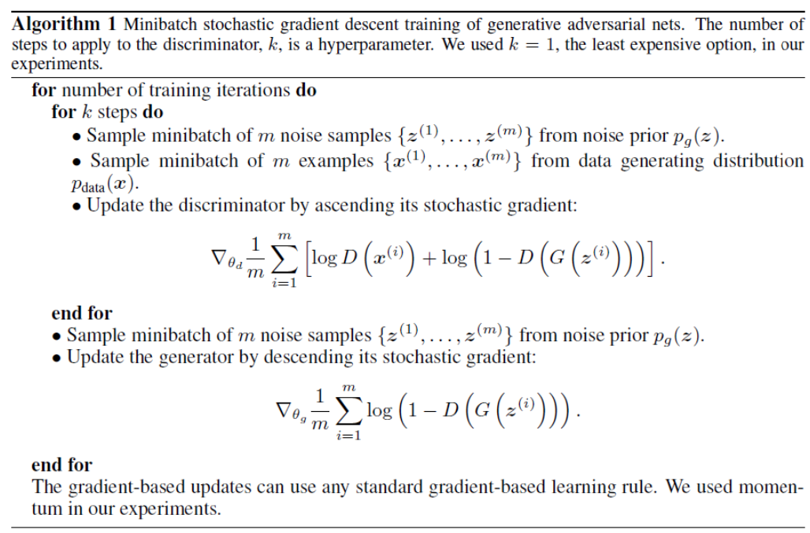
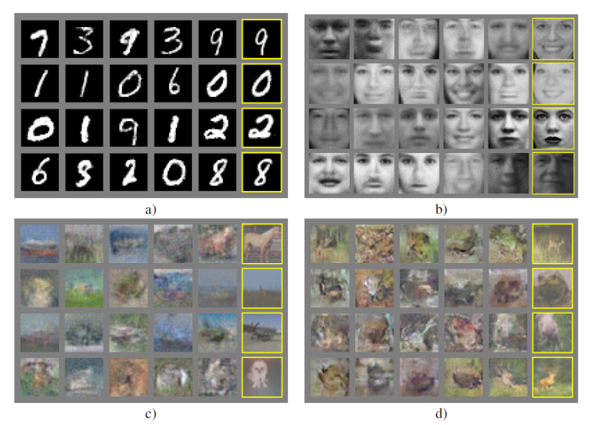
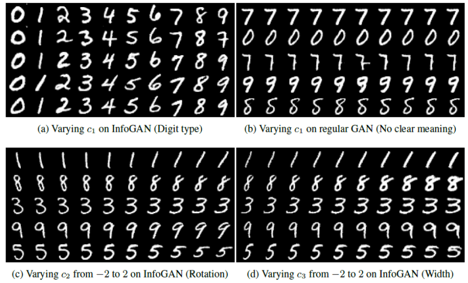

# Generative Adversarial Networks

In GAN, there are two functions: generator $G$ and discriminator $D$, coded as neural networks.

## Objective

Main idea: Generator and discriminator functions are playing an adversarial game

- Draw a latent “noise” vector $\boldsymbol{z}$ from some simple distribution $p_g(\boldsymbol{z})$

- Generator $G$ generates examples of target objects $\boldsymbol{x} _g = G(\boldsymbol{z})$ from a distribution $p_g(\boldsymbol{x} |\boldsymbol{z} )$,

- Discriminator $D$ outputs a probability $D(\boldsymbol{x} ) ∈ [0, 1]$ that an example $\boldsymbol{x}$ is “real” (as opposed to “fake” = generated by the model)

- Generator’s goal is to fool the discriminator, i.e. generate fake $\boldsymbol{x}$ such that $D(\boldsymbol{x} _g)$ is high.

Objectives for a given true training example $\boldsymbol{x}$

- Discriminator want to maximize: $\log D(\boldsymbol{x})$
- Generator want to maximize: $\log(1 − D(\boldsymbol{x} _g))$ where $\boldsymbol{x} _g = G(\boldsymbol{z} )$ and $\boldsymbol{z}$ is generated from $p_g(\boldsymbol{z})$

Put together, the overall optimization problem is a minimax game

$$
\min _{G} \max _{D} \left\{ E_{\boldsymbol{x}  \sim p_{d}(\boldsymbol{x} )}[\log D(\boldsymbol{x} )]+E_{\boldsymbol{\boldsymbol{z} }  \sim p_{\text{g} }(\boldsymbol{z} )}[\log (1-D(G(\boldsymbol{z} )))] \right\}
$$

This min-max loss cannot be optimized just by backpropagation. Instead, alternate between updating $D$ and updating $G$, as shown below.

:::{figure} GAN-algo

GAN optimization algorithm [Goodfellow+ 2014]
:::

Note

- The minimax optimization problem has a global optimum when $p_g = p_d$.

- Algorithm optimizes the objective given sufficient capacity in $G$ and $D$ and that the optimization is “successful” at each update.

- In practice, $G$ and $D$ are limited to some (large) function class defined by neural networks. Global optimum may not be achieved.

- In practice, we do not get to see the true data distribution but only an empirical distribution from the training set, so can’t guarantee that we improve the true objective.

There are some practical challenges to getting GANs to work

- Consider the very beginning of training: $G$ is very poor, $D$ does very well, no gradient is generated through the $D$ network, so we get stuck.

- Consider what happens if $G$ only generates examples that look like the **mode** of $p_d(x)$: These are the most “natural” examples $\Rightarrow$ D has trouble discriminating these $\Rightarrow$ $G$ is happy and stops to learn $\Rightarrow$ $G$ learns a distribution that is too **peaked** around a mode, instead of $p_d$. This is known as the "mode collapse" problem.

:::{figure} gan-example

Generation of examples from GAN [Goodfellow+ 2014]. Images in Yellow boxes are real.
:::

## Improvements

### Reconstruction Loss

- Combine the GAN loss with a more traditional reconstruction loss, to avoid getting stuck due to lack of discriminator gradient

### InfoGAN:

[Chen et al. 2016]

InfoGAN add to the model a vector of additional latent variables $\boldsymbol{c}$ that are meant to be “interpretable”. It learns an inference model $q(\boldsymbol{c} |\boldsymbol{x} )$ as in VAE.
$q(\boldsymbol{c} |\boldsymbol{x} )$ shares most of its structure with $D$, resulting in very few additional parameters

Important byproduct: Produces a learned representation $\boldsymbol{c}$, like in VAE. We can check the learned representation of each dimension.

:::{figure} gan-infogan-examples

InfoGAN examples on digits [Chen+ 2016]
:::

:::{figure} gan-infogan-examples-2

InfoGAN examples on faces [Chen+ 2016]
:::

## Compared to VAE

“Vanilla” GANs

- tend to produce **sharper** outputs than “vanilla” VAEs

- are much **harder** to train

- do not produce an explicit model of the data distribution $p_d$

More recent work

- Dramatically improved generation via either GAN-based or VAE-based models

- Newer models combine ideas from GANs and VAEs,
  - use different ways of measuring distance between distributions (e.g., Wasserstein GANs),
  - combine discrete and continuous representations (e.g., vector quantized VAEs)
